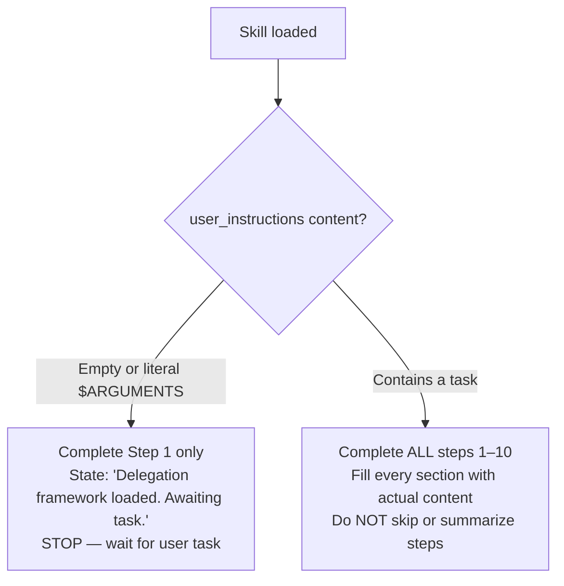
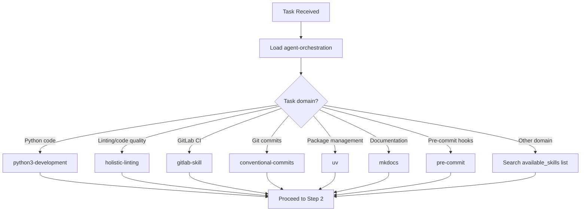

# Delegation Preparation Worksheet

**Workflow Reference**: See the [agent-orchestration skill](../agent-orchestration/SKILL.md) for the complete delegation flow, DONE/BLOCKED signaling protocol, and agent selection guide.

**CRITICAL**: You are an orchestrator. Complete ALL steps before invoking the Agent tool. Incomplete preparation causes failed delegations, wasted agent context, and poor outcomes.

<user_instructions>$ARGUMENTS</user_instructions>

---

## Conditional Execution



---

## Core Delegation Principles

Your role as orchestrator — apply these throughout all 10 steps:

- Route observations and context between user and agents
- Define measurable success criteria
- Enable comprehensive agent discovery
- NEVER pre-gather data agents will collect themselves
- NEVER prescribe HOW agents should work (tools, steps, implementation)
- ALWAYS state WHAT must be achieved and WHY it matters

**Reason**: Agents have 200k context windows and specialized expertise. Pre-gathering causes context rot and duplicates work. Prescribing HOW limits agents from discovering better solutions.

---

## Step 1: Load Framework

**ACTION**: Activate the agent-orchestration skill NOW:

```text
Skill(skill: "agent-orchestration:agent-orchestration")
```

Then load domain-specific skills based on task type:



**Why**: Domain skills contain specialized knowledge agents need. Loading before delegation ensures agents have access to project conventions and best practices.

---

## Step 2: Identify Task Type

**ACTION**: Select the task type that best matches this delegation:

- [ ] **FOCUSED** — single file, clear test, known location
- [ ] **INVESTIGATIVE** — unknown cause, needs research
- [ ] **ARCHITECTURAL** — multi-component, system-wide

**Why**: Task type determines context depth. Focused tasks need precise location. Investigative tasks need all observations. Architectural tasks need system-wide context.

**TASK SUMMARY** (write one clear sentence):

```text
[Example: "Fix authentication failing for OAuth2 users" or "Investigate why CI pipeline times out on large PRs"]
```

---

## Step 3: Gather Observations

**ACTION**: List ONLY data already in your context. Use "observed", "measured", "reported" language.

**CRITICAL**: Do NOT run commands to pre-gather data. Agents gather their own comprehensive data.

**Why**: Pre-gathering wastes your context, duplicates agent work, and causes context rot. Pass through existing observations; let agents collect fresh data.

**OBSERVATIONS FROM USER:**

```text
[Example: "User reported: 'OAuth login redirects to 404'" or "User stated build fails on Python 3.12"]
```

**OBSERVATIONS FROM PRIOR AGENTS** (if any):

```text
[Example: "context-gathering agent found 3 instances of deprecated auth.login() in src/handlers/"]
```

**ERRORS ALREADY IN CONTEXT** (verbatim, if any):

```text
[Example: Exact error text already received — not pre-gathered by running commands now]
```

**KNOWN LOCATIONS** (file:line references already in context):

```text
[Example: "src/auth/oauth.py:127 — where user reported issue occurs"]
```

---

## Step 4: Define Success

**ACTION**: Define specific, measurable outcomes and verification methods.

**Why**: Clear success criteria prevent scope creep and tell agents exactly when they are done.

**WHAT must be true when done** (measurable outcome):

```text
[Example: "OAuth login completes successfully for all providers" or "All pytest tests in test_auth.py pass"]
```

**HOW will completion be verified:**

```text
[Example: "Run `pytest test_auth.py -v` — all tests pass" or "Manual test: log in with Google/GitHub/Microsoft accounts"]
```

---

## Step 5: Provide World-Building Context

**ACTION**: Define WHERE to look, WHAT to achieve, and WHY it matters. Focus on context, not implementation.

**Why**: World-building enables agents to understand the problem space and make informed decisions about HOW to solve it.

**WHERE** (problem location, scope boundaries):

```text
[Example: "Authentication module at src/auth/ — OAuth handlers specifically" or "CI pipeline .github/workflows/test.yml"]
```

**WHAT** (identification criteria, acceptance criteria):

```text
[Example: "OAuth redirect must return 200 status with valid session token" or "Pipeline must complete within 10 minutes"]
```

**WHY** (expected outcomes, user requirements):

```text
[Example: "Users cannot log in with enterprise SSO accounts, blocking customer onboarding" or "Slow CI blocks PRs, reducing team velocity"]
```

---

## Step 6: Describe Available Resources

**ACTION**: Describe the ecosystem and available tools. List capabilities — do not prescribe which to use.

**Why**: Agents choose tools based on their expertise. Prescribing tools limits discovery.

**PROJECT ECOSYSTEM** (language, package manager, build system):

```text
[Example: "Python project using uv for all operations — activate uv skill" or "Node.js with pnpm workspaces"]
```

**AUTHENTICATED CLIS** (gh, glab, aws, etc.):

```text
[Example: "gh CLI pre-authenticated for GitHub operations" or "glab configured for GitLab access"]
```

**MCP TOOLS AVAILABLE** (check your functions list):

```text
[Example: "Excellent MCP servers installed — check <functions> list and prefer MCP tools (Ref, context7, exa) over built-in alternatives"]
```

**PROJECT-SPECIFIC RESOURCES** (scripts, reports, docs):

```text
[Example: "Validation scripts in ./scripts/ — check README.md" or "Previous fixes documented in .tmp/reports/"]
```

---

## Step 7: Select Agent

**ACTION**: Choose the agent type that best matches the task domain and requirements.

**Why**: Specialized agents have domain expertise and optimized workflows for their task types.

**AGENT TYPE** (from available subagent_types):

```text
[Example: "python-cli-architect" or "linting-root-cause-resolver" or "context-gathering"]
```

**RATIONALE** (why this agent matches the task):

```text
[Example: "Task involves Python code changes — python-cli-architect has Python expertise and best practices" or "Need comprehensive context without polluting orchestrator context — context-gathering agent is optimized for this"]
```

---

## Step 8: Pre-Flight Verification

**ACTION**: Review your filled sections against each criterion. Mark pass or fail.

**Why**: This checklist catches anti-patterns that limit agent effectiveness before they reach the agent.

**Verification checklist:**

- Will start with `Your ROLE_TYPE is sub-agent.` — if not, add to Step 9 prompt
- Contains only factual observations — if not, remove "I think", "probably", "likely"
- No assumptions stated as facts — if not, replace with "Hypothesis to verify:"
- Defines WHAT, not HOW — if not, remove tool names, prescribed steps, line-number prescriptions
- Lists resources, does not prescribe tools — if not, change "Use X" to "X is available"
- No pre-gathered data — if not, remove command outputs you collected now rather than from context

---

## Step 9: Construct Task Prompt

**ACTION**: Use your filled sections to construct the delegation prompt following this template.

**Why**: This structure ensures agents receive observations, success criteria, and autonomy to apply their expertise.

**Copy this template and fill in from your worksheet:**

```text
Your ROLE_TYPE is sub-agent.

[Task summary from Step 2]

OBSERVATIONS:
[From Step 3 — verbatim, not paraphrased]

DEFINITION OF SUCCESS:
[From Step 4]

CONTEXT:
[From Step 5 — WHERE, WHAT, WHY]

YOUR TASK:
1. Perform comprehensive context gathering using available tools, skills, and resources
2. Form hypothesis based on evidence
3. Design and execute experiments
4. Verify findings against authoritative sources
5. Implement solution following best practices
6. Verify `/am-i-complete` criteria satisfied with evidence

AVAILABLE RESOURCES:
[From Step 6 — describe ecosystem, do not prescribe tools]
```

---

## Step 10: Delegate

**ACTION**: Final check, then delegate.

**READY TO DELEGATE?** Mark pass or fail:

- [ ] All verification checks in Step 8 passed
- [ ] Prompt constructed from Step 9 template
- [ ] Agent type selected from Step 7
- [ ] No pre-gathered data included
- [ ] Defines WHAT and WHY, not HOW

**If all pass, invoke the Agent tool:**

```text
Agent(
  agent="[agent type from Step 7]",
  prompt="[your constructed prompt from Step 9]"
)
```

**Why final check matters**: One incomplete step causes agent confusion, wasted context, or failed delegation. Thirty seconds of verification saves ten minutes of back-and-forth.
