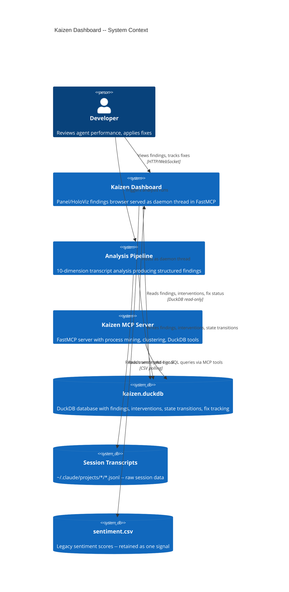
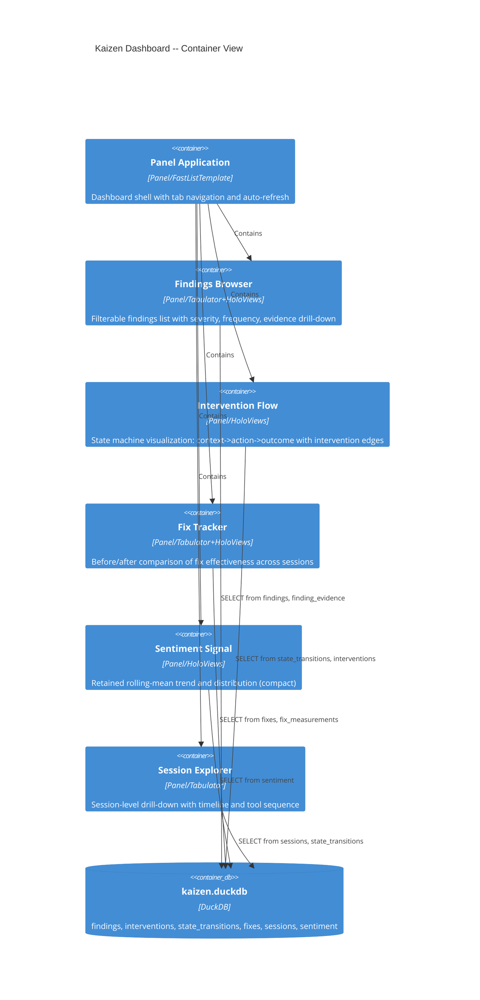
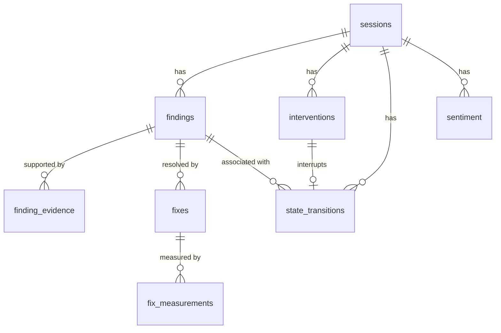
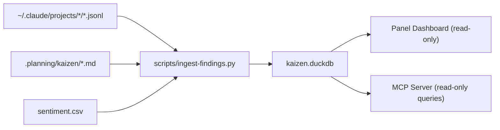

# Kaizen Dashboard Redesign -- Architecture Specification

## 1. Executive Summary

The kaizen dashboard is being redesigned from a sentiment chart gallery into a **findings browser with intervention flow visualization**. The current dashboard shows VADER sentiment scores across four chart types (scatter, heatmap, histogram, Tabulator). The redesigned dashboard will show where AI agent processes broke down, what context was present when they broke, what correlates with divergence, and whether applied fixes resolved the pattern in subsequent sessions.

The core abstraction is a state machine trace: `information + context -> action -> outcome`, where edges are either normal flow continuations or human interventions. The dashboard reads from a structured DuckDB database that the analysis pipeline populates. The dashboard itself performs no analysis -- it is a read-only view layer.

**Constraints carried forward:**
- Panel/HoloViz served as a daemon thread inside FastMCP server process
- DuckDB as the structured data store (already in the stack)
- OS-assigned ephemeral port
- Dashboard polls/reads from database; analysis pipeline writes to database
- Not a real-time monitor (forensic/historical orientation)

**Companion documents:**
- [Database Schema](./kaizen-dashboard-db-schema.md) -- DuckDB table definitions, relationships, migration SQL
- [Dashboard Views](./kaizen-dashboard-views.md) -- Panel component specifications per tab
- [Testing Architecture](./kaizen-dashboard-testing.md) -- test strategy and coverage

---

## 2. Architecture Overview

### C4 Context Diagram



### C4 Container Diagram



---

## 3. Technology Stack

| Layer | Technology | Justification |
|-------|-----------|---------------|
| Dashboard framework | Panel 1.3+ with FastListTemplate | Already in use; daemon thread hosting model proven; Tabs container for multi-view |
| Charting | HoloViews/hvplot with Bokeh (WebGL) | Already in use; interactive hover, linked brushing, streaming updates |
| Tables | Panel Tabulator | Already in use for Hot Spots; filterable, sortable, frozen columns, row selection |
| Database | DuckDB 1.0+ | Already in stack; read_ndjson_auto for JSONL ingestion; analytical SQL; single-file embedded |
| Database access | duckdb Python API (read-only connection) | Dashboard opens read-only connection; analysis pipeline writes separately |
| Web server | Tornado (via Panel) | Already in use; /health endpoint pattern proven |
| State machine viz | HoloViews Graph/Sankey or Bokeh network plot | Best fit for directed graph rendering within Panel; no new dependency |
| Threading | daemon thread via `pn.serve(threaded=True)` | Proven pattern from current dashboard |

### Not Adding

| Technology | Reason for exclusion |
|-----------|---------------------|
| Plotly/Dash | Would replace Panel; constraint says stay on Panel/HoloViz |
| NetworkX | Overkill for state machine rendering; HoloViews Graph handles directed graphs |
| SQLAlchemy | DuckDB Python API is sufficient for read-only queries; no ORM needed |
| React/Vue frontend | Dashboard must remain pure Panel served as daemon thread |

---

## 4. Component Design

### Component Hierarchy

```text
mcp/dashboard.py                  (existing -- to be restructured)
  _create_app()                   Application factory (FastListTemplate)
  _build_findings_tab()           Findings Browser view
  _build_flow_tab()               Intervention Flow view
  _build_fix_tracker_tab()        Fix Tracker view
  _build_sentiment_tab()          Sentiment Signal view (compacted)
  _build_session_tab()            Session Explorer view

mcp/db.py                         (new -- database access layer)
  KaizenDB                        Read-only DuckDB query interface
    .findings()                   Query findings with filters
    .interventions()              Query intervention events
    .state_transitions()          Query state machine edges
    .fixes()                      Query fix records with measurements
    .sessions()                   Query session metadata
    .sentiment()                  Query sentiment data from DuckDB table

scripts/ingest-findings.py        (new -- analysis output -> DuckDB)
  Parses .planning/kaizen/*.md    Structured markdown -> DuckDB rows
  Extracts intervention events    From JSONL transcripts
  Builds state transitions        From tool sequences + interventions
```

### Interface Signatures (no implementations)

```python
# mcp/db.py -- Database access layer

from __future__ import annotations

import enum
from dataclasses import dataclass
from pathlib import Path
from typing import TYPE_CHECKING

if TYPE_CHECKING:
    import pandas as pd


class Severity(enum.StrEnum):
    """Finding severity levels."""
    critical = "critical"
    warning = "warning"
    info = "info"


class FindingDimension(enum.StrEnum):
    """The 10 analysis dimensions from transcript-analysis skill."""
    tool_misuse = "tool_misuse"
    repeated_errors = "repeated_errors"
    user_frustration = "user_frustration"
    missing_tooling = "missing_tooling"
    delegation_patterns = "delegation_patterns"
    shortest_path = "shortest_path"
    red_herring = "red_herring"
    system_interruptions = "system_interruptions"
    missing_hooks = "missing_hooks"
    duckdb_querying = "duckdb_querying"


class FixStatus(enum.StrEnum):
    """Fix lifecycle states."""
    proposed = "proposed"
    applied = "applied"
    verified = "verified"
    ineffective = "ineffective"
    reverted = "reverted"


class TransitionOutcome(enum.StrEnum):
    """State transition outcomes."""
    success = "success"
    intervention = "intervention"
    error = "error"
    abandoned = "abandoned"


@dataclass(slots=True)
class FindingFilter:
    """Filter criteria for findings queries."""
    dimension: FindingDimension | None = None
    severity: Severity | None = None
    project_name: str | None = None
    session_id: str | None = None
    min_frequency: int | None = None
    has_fix: bool | None = None


@dataclass(slots=True)
class SessionFilter:
    """Filter criteria for session queries."""
    project_name: str | None = None
    session_id: str | None = None
    has_interventions: bool | None = None
    date_from: str | None = None
    date_to: str | None = None


class KaizenDB:
    """Read-only query interface to the kaizen DuckDB database.

    Opens a read-only connection. All methods return pandas DataFrames
    suitable for direct use in Panel/HoloViews components.
    """

    def __init__(self, db_path: Path) -> None: ...
    def close(self) -> None: ...

    def findings(self, filters: FindingFilter | None = None) -> pd.DataFrame: ...
    def finding_evidence(self, finding_id: str) -> pd.DataFrame: ...
    def interventions(self, session_id: str | None = None) -> pd.DataFrame: ...
    def state_transitions(
        self, session_id: str | None = None, finding_id: str | None = None
    ) -> pd.DataFrame: ...
    def fixes(self, status: FixStatus | None = None) -> pd.DataFrame: ...
    def fix_measurements(self, fix_id: str) -> pd.DataFrame: ...
    def sessions(self, filters: SessionFilter | None = None) -> pd.DataFrame: ...
    def sentiment(self, session_id: str | None = None) -> pd.DataFrame: ...
    def dimension_summary(self) -> pd.DataFrame: ...
    def intervention_rate_over_time(self, window_sessions: int = 10) -> pd.DataFrame: ...
```

### Dashboard View Functions (signatures only)

```python
# mcp/dashboard.py -- View builder signatures

def _build_findings_tab(db: KaizenDB) -> pn.Column: ...
def _build_flow_tab(db: KaizenDB) -> pn.Column: ...
def _build_fix_tracker_tab(db: KaizenDB) -> pn.Column: ...
def _build_sentiment_tab(db: KaizenDB) -> pn.Column: ...
def _build_session_tab(db: KaizenDB) -> pn.Column: ...
def _build_dashboard(db: KaizenDB) -> pn.Tabs: ...
def _create_app(db_path: Path, csv_path: Path) -> pn.template.FastListTemplate: ...
```

---

## 5. Data Architecture

Full DuckDB schema is in the companion document: [Database Schema](./kaizen-dashboard-db-schema.md).

### Table Summary

| Table | Purpose | Primary Key | Row Count Estimate |
|-------|---------|------------|-------------------|
| `sessions` | Session metadata (project, dates, tool counts) | `session_id` | ~500 |
| `findings` | Detected anti-patterns from 10-dimension analysis | `finding_id` (UUID) | ~2000 |
| `finding_evidence` | Specific evidence instances for each finding | `evidence_id` (UUID) | ~10000 |
| `interventions` | Human interruptions/corrections during sessions | `intervention_id` (UUID) | ~3000 |
| `state_transitions` | `context -> action -> outcome` flow edges | `transition_id` (UUID) | ~50000 |
| `fixes` | Applied corrections (hooks, patches, CLAUDE.md updates) | `fix_id` (UUID) | ~200 |
| `fix_measurements` | Before/after metrics for each fix | `measurement_id` (UUID) | ~1000 |
| `sentiment` | Per-message sentiment scores (migrated from CSV) | `(session_id, message_index)` | ~100000 |

### Entity Relationships



### Data Pipeline



The ingestion script is the single writer. It:

1. **Parses analysis markdown** -- Extracts structured findings from `.planning/kaizen/analysis-*.md` files using the output format defined in the transcript-analysis skill (severity, evidence, frequency, recommendation type).

2. **Extracts intervention events** -- Scans JSONL transcripts for `[Request interrupted by user]`, tool denials, direct corrections, and compact boundaries that follow investigation sequences.

3. **Builds state transitions** -- For each assistant turn, creates a `(context_summary, action, outcome)` triple. Context is derived from the preceding user turn + active tools/files. Action is the tool call or text response. Outcome is determined by the subsequent user turn (tool result success/error, correction, continuation).

4. **Links fixes to findings** -- When a fix record references a finding_id, measures the finding's occurrence rate in sessions before and after the fix was applied.

5. **Migrates sentiment data** -- Reads the existing `sentiment` table or CSV and writes to the unified schema.

---

## 6. Security Architecture

| Concern | Mitigation |
|---------|-----------|
| Database write isolation | Dashboard opens DuckDB with `read_only=True`; only the ingestion script writes |
| Credential exposure | No credentials in the dashboard; DuckDB is a local file |
| Path traversal | All file paths resolved via `Path.expanduser().resolve()`; no user-supplied paths in SQL |
| SQL injection | Dashboard uses parameterized queries only; no string interpolation in SQL |
| Port binding | `localhost` only (same as current); no external network exposure |
| Session transcript privacy | Transcripts stay on disk; dashboard reads aggregated findings, not raw text. `message_preview` field is truncated to 200 chars |

### Security Checklist

- [ ] DuckDB connection opened with `read_only=True` in dashboard
- [ ] No `f"..."` or `.format()` in SQL query strings
- [ ] All user-facing text sanitized (no raw HTML injection into Panel Markdown panes)
- [ ] Health endpoint returns no sensitive data (port, PID, uptime only)
- [ ] Ingestion script validates markdown structure before parsing

---

## 7. Testing Architecture

Full testing specification is in the companion document: [Testing Architecture](./kaizen-dashboard-testing.md).

### Strategy Summary

| Test Type | Coverage Target | Key Concerns |
|-----------|----------------|--------------|
| Database layer unit tests | 95% (KaizenDB methods) | Query correctness, filter combinations, empty result handling |
| View builder unit tests | 80% (each _build_*_tab) | Component structure, data binding, empty state rendering |
| Integration tests | Dashboard startup, tab rendering, health endpoint | Tornado IOLoop safety, periodic callback registration |
| Ingestion script tests | 90% (parsing, extraction, linking) | Markdown parsing edge cases, JSONL schema variations |

### Testing Stack

```text
pytest>=8.0.0
pytest-cov>=6.0.0
pytest-mock>=3.14.0
duckdb>=1.0.0           (in-memory database for test isolation)
```

---

## 8. Distribution Architecture

**No change from current.** The dashboard remains a module (`mcp/dashboard.py`) inside the agentskill-kaizen plugin, served as a daemon thread by `mcp/server.py`. The new database access layer (`mcp/db.py`) and ingestion script (`scripts/ingest-findings.py`) follow the existing plugin structure.

The ingestion script uses PEP 723 inline metadata (same pattern as `sentiment-score.py`):

```python
#!/usr/bin/env -S uv --quiet run --active --script
# /// script
# requires-python = ">=3.11"
# dependencies = [
#     "duckdb>=1.0.0",
#     "typer>=0.23.1",
# ]
# ///
```

Dependencies for the dashboard (`panel`, `hvplot`, `holoviews`, `bokeh`, `duckdb`) are already declared in `mcp/server.py`'s PEP 723 metadata block. The `duckdb` dependency needs to be added there.

---

## 9. Architectural Decisions (ADRs)

### ADR-001: DuckDB as the Structured Data Store (not SQLite, not Postgres)

**Context:** The dashboard needs a structured database between the analysis pipeline and the visualization layer. The current stack already uses DuckDB for ad-hoc JSONL queries via MCP tools.

**Decision:** Use DuckDB for all structured data storage.

**Rationale:**
- Already in the dependency tree (sentiment-score.py writes to it, MCP server queries it)
- `read_ndjson_auto()` enables direct JSONL ingestion without ETL
- Analytical query performance (columnar storage) is ideal for aggregation queries the dashboard needs
- Single-file embedded database matches the local-first architecture (no server process)
- Read-only connection mode provides natural write isolation for the dashboard

**Consequences:**
- Single-writer constraint: only the ingestion script writes; dashboard and MCP tools read
- No concurrent write support (DuckDB limitation for single-file mode)

### ADR-002: Separate Ingestion Script (not Dashboard-Internal Analysis)

**Context:** The dashboard could either perform analysis internally (read JSONL, analyze, display) or read from a pre-populated database.

**Decision:** A separate ingestion script (`scripts/ingest-findings.py`) populates the database. The dashboard is a pure read-only view layer.

**Rationale:**
- Separation of concerns: analysis is CPU-intensive; dashboard is I/O-bound
- The dashboard runs as a daemon thread in the MCP server -- CPU-intensive work would block Tornado's IOLoop
- The analysis pipeline already exists (transcript-analyst agent, 10-dimension skill, process mining tools)
- Decoupling allows the ingestion script to run on a schedule or on-demand without restarting the dashboard
- The ingestion script can be tested independently of Panel/Tornado

**Consequences:**
- Dashboard data freshness depends on how recently the ingestion script was run
- Need a "last ingested" timestamp visible in the dashboard so the user knows data currency

### ADR-003: State Machine as Directed Graph (not Timeline/Gantt)

**Context:** The intervention flow visualization could be rendered as a timeline (horizontal time axis), a Gantt chart, a directed graph, or a Sankey diagram.

**Decision:** Use HoloViews `Graph` (directed graph) with Bokeh rendering for the state machine view.

**Rationale:**
- The core abstraction is `context -> action -> outcome` with branching at intervention points -- this is naturally a directed graph
- HoloViews `Graph` is already available (no new dependency)
- Directed graph shows the flow structure (what leads to what) rather than just temporal ordering
- Intervention edges can be visually distinct (color, dash pattern) from normal flow edges
- Node tooltips can show context state, action details, and outcome
- For individual sessions, a per-session timeline can be shown in the Session Explorer tab

**Consequences:**
- Graph layout algorithm selection matters for readability (force-directed vs hierarchical)
- Large graphs (50+ nodes) may need aggregation or filtering to remain readable
- Complemented by the Session Explorer tab which shows per-session temporal ordering

### ADR-004: Retain Sentiment as a Secondary Signal (not Remove)

**Context:** The current dashboard is entirely sentiment-focused. The redesign makes findings the primary view. Sentiment could be removed entirely or retained.

**Decision:** Retain sentiment as one compact tab with rolling-mean trend and distribution.

**Rationale:**
- Sentiment correlates with intervention frequency (observed in existing data)
- The sentiment scoring pipeline is already built and stable
- Removing it would lose a longitudinal signal that has been tracked over time
- As a secondary signal it adds context without dominating the interface

**Consequences:**
- The sentiment table in DuckDB replaces CSV polling (single data source)
- The sentiment tab is simplified from 4 sub-views to 2 (trend + distribution)

### ADR-005: Dashboard Polls DuckDB (not WebSocket Push)

**Context:** The dashboard needs to reflect new data. Options: periodic polling, file-watcher triggers, or WebSocket push from the ingestion script.

**Decision:** Dashboard polls DuckDB on a periodic callback (same pattern as current CSV polling).

**Rationale:**
- Proven pattern: current dashboard polls CSV every 5 seconds without issues
- No additional infrastructure needed (no message queue, no WebSocket channel)
- Ingestion runs infrequently (on-demand or scheduled) -- push has no advantage when the data source updates rarely
- DuckDB read-only connections can coexist with a write connection from the ingestion script
- Polling interval can be longer (30 seconds) since this is forensic, not real-time

**Consequences:**
- Up to 30-second delay between ingestion completion and dashboard update
- Acceptable for forensic analysis (not real-time monitoring)

---

## 10. Scalability Strategy

### Data Volume

| Metric | Current | Expected at Scale |
|--------|---------|------------------|
| Sessions | ~200 | ~2000 |
| JSONL total size | ~200MB | ~2GB |
| Findings | ~100 | ~5000 |
| State transitions | ~5000 | ~100000 |
| Sentiment rows | ~20000 | ~500000 |

### Resource Management

- **DuckDB read-only connection**: opened once at dashboard startup, kept alive for the session. Connection is lightweight (no server process). Closed on dashboard shutdown.
- **Query result caching**: Dashboard caches query results in memory between poll intervals. Only re-queries when the poll timer fires.
- **Lazy tab loading**: Each tab queries DuckDB only when first activated (Panel's `dynamic=True` on Tabs). Reduces startup query load.
- **Pagination in Tabulator**: Findings browser and session explorer use server-side pagination (Tabulator `pagination='remote'`, `page_size=50`). Prevents loading 5000+ findings into the browser DOM.
- **Graph node aggregation**: Intervention flow graph aggregates nodes by action type when showing cross-session views (e.g., all "Bash grep" actions become one node with an edge weight). Per-session view shows individual nodes.
- **Periodic callback interval**: 30 seconds (up from current 5 seconds). Forensic data does not need sub-second freshness.

### Async Patterns

The dashboard runs in Tornado's IOLoop (single-threaded). All DuckDB queries are executed via `pn.state.execute` or wrapped in `asyncio.to_thread()` to avoid blocking the event loop. This matches the existing pattern in `server.py` where MCP tools use `asyncio.to_thread()` for CPU-bound work.

---

## Scope Boundaries

### In Scope

- DuckDB schema design for findings, interventions, state transitions, fixes, sessions
- Data pipeline design (ingestion script architecture)
- Dashboard view specifications (5 tabs replacing current 4)
- Component architecture within Panel constraints
- Query patterns for each dashboard view
- Migration path from current sentiment-only dashboard

### Not In Scope

- **Real-time session monitoring** -- that is a different tool (see Claude Code Agent Monitor reference). This dashboard is forensic/historical.
- **Automated analysis execution** -- the ingestion script is triggered manually or by cron. Automated trigger design is a separate concern.
- **JSONL schema changes** -- the dashboard reads existing JSONL schema as documented in `references/jsonl-schema.md`.
- **MCP tool changes** -- existing MCP tools in `server.py` are unaffected. The dashboard reads from DuckDB, not from MCP tools.
- **Sentiment scoring changes** -- `sentiment-score.py` continues to produce sentiment data. The ingestion script reads its output.
