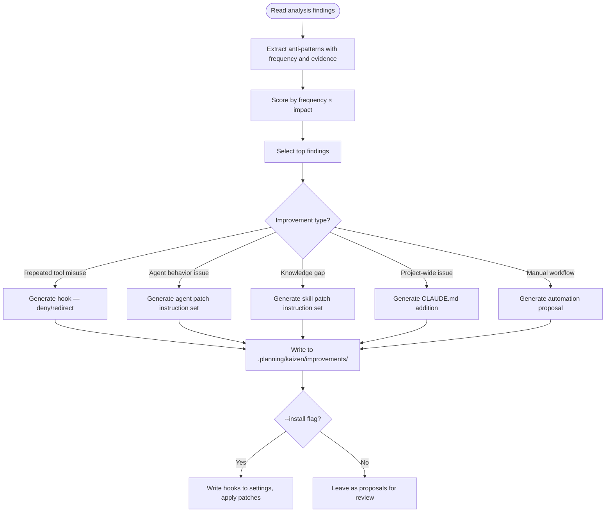

# Kaizen Improvement

Transform analysis findings from `.planning/kaizen/` into actionable improvements — hooks, agent patches, skill refinements, CLAUDE.md updates, and automation scripts.

**Prerequisite:** Analysis findings must exist in `.planning/kaizen/` (generated by the transcript-analysis skill).

## Improvement Types

Five categories of output, each with a delegation template:

1. **Hook generation** — PreToolUse deny/redirect, SubagentStart context injection, Stop quality gates
2. **Agent prompt refinement** — surgical fixes to agent system prompts via @subagent-refactorer
3. **Skill patches** — add missing knowledge to skills via /plugin-creator:skill-creator
4. **CLAUDE.md updates** — project-wide behavioral rules
5. **Script automation** — replace repeated manual workflows with scripts or skills

For detailed templates and examples, see [Improvement Templates](./references/improvement-templates.md).

## Workflow

## Hook Generation

Read findings → generate hook configuration + optional script.

For hook patterns mapped to each anti-pattern type, see [Hook Patterns](./references/hook-patterns.md).

Key principles: one anti-pattern per hook, prefer `command` type for deterministic checks, scope matchers narrowly. For full guidelines and patterns, see [Hook Patterns](./references/hook-patterns.md).

## Delegation Protocol

Improvements are instruction sets for specialist agents, not direct edits. Follow outcome-focused delegation:

- Describe the problem with evidence (session IDs, tool calls, frequency)
- State the desired outcome
- Let the specialist agent determine the implementation approach
- Never prescribe specific code changes in the delegation prompt

## Output Modes

### Draft mode (default)

Write all proposals to `.planning/kaizen/improvements/` as markdown files. Each file contains:

- Finding summary with evidence
- Proposed improvement
- Delegation prompt for the appropriate specialist agent
- Priority score

### Install mode (--install flag)

For hooks only — write directly to `.claude/settings.json` or `hooks/hooks.json`. Other improvement types always produce delegation prompts (never direct edits).

## Priority Scoring

Rank improvements by:

1. **Frequency × Impact** — occurrences across sessions × cost per occurrence
2. **Automation potential** — hooks > scripts > documentation
3. **Blast radius** — project-wide > single-agent > single-session
4. **Implementation cost** — hook (minutes) < CLAUDE.md (minutes) < skill (hours) < agent (days)
