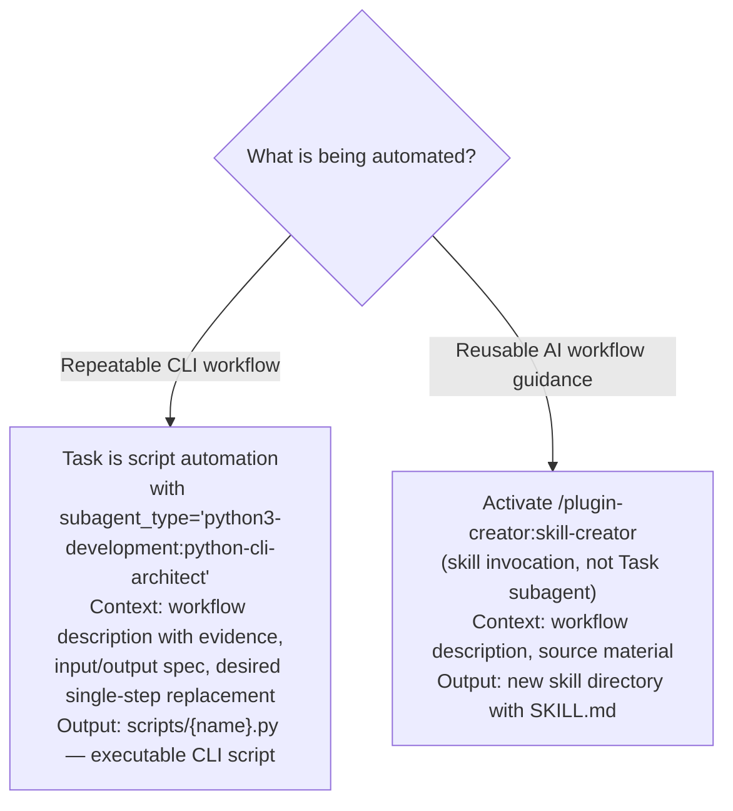

# Improvement Templates

Templates for generating actionable improvements from kaizen analysis findings. Each template produces an instruction set that can be delegated to a specialist agent.

## Template 1: Hook Generation

Input: Anti-pattern finding with frequency and evidence.
Output: Hook configuration + script (draft or installed).

````markdown
## Hook Proposal: {anti_pattern_name}

**Finding:** {description of the anti-pattern}
**Frequency:** {N} occurrences across {M} sessions
**Evidence:** {session_ids and specific tool calls}

### Proposed Hook

**Event:** {PreToolUse | SubagentStart | Stop | ...}
**Type:** {command | prompt}
**Matcher:** {tool name regex or empty}

**Configuration:**
{JSON hook configuration}

**Script** (if command type):
{Script content}

**Expected behavior:**
- Triggers when: {condition}
- Action taken: {deny/redirect/inject context/validate}
- User sees: {message or nothing}

**Testing:**
```bash
claude --debug -p "trigger the anti-pattern" --allowedTools "Bash,Read"
```
````

## Template 2: Agent Prompt Refinement

Input: Agent behavior finding (wrong tool selection, incomplete output, etc.).
Output: Delegation step for the agent prompt specialist.

````markdown
## Agent Improvement: {agent_name}

**Finding:** {description of problematic behavior}
**Sessions affected:** {list}
**Evidence:** {specific transcript excerpts}

### Delegation Step

Task is agent prompt refinement with subagent_type="plugin-creator:subagent-refactorer"
Context to include in the prompt: {file_path} (agent file), evidence excerpts from
  {session_id_list} showing the observed anti-pattern
Output: .planning/kaizen/improvements/{agent_name}-patch.md — revised agent prompt
  with rationale for each change and a no-regression checklist

**Observations to include in prompt:**
- Agent {agent_name} located at {file_path}
- Observed behavior: {what it does wrong}
- Expected behavior: {what it should do}
- Evidence from {N} sessions confirms this is a pattern, not an anomaly

**Desired Outcome to include in prompt:**
- Agent's system prompt prevents the observed anti-pattern
- No regression in other agent behaviors
- Changes are minimal and targeted — surgical fix only
- The agent decides HOW to implement the fix
````

## Template 3: Skill Patch

Input: Knowledge gap or missing guidance in a skill.
Output: Delegation step for the skill creator specialist.

````markdown
## Skill Improvement: {skill_name}

**Finding:** {description of knowledge gap}
**Sessions affected:** {list}
**Evidence:** Claude repeatedly {specific behavior} because skill lacks {specific guidance}

### Delegation Step

Task is skill content improvement with subagent_type="plugin-creator:skill-creator"
Context to include in the prompt: {skill_path} (skill directory), {source_material_paths}
  (official docs or empirical data supporting the addition)
Output: updated {skill_path}/SKILL.md — with the knowledge gap filled; addition
  concise (under 50 lines added)

**Observations to include in prompt:**
- Skill at {skill_path}
- Current content lacks: {specific missing information}
- This causes: {observed negative outcome in N sessions}

**Desired Outcome to include in prompt:**
- Skill includes {specific information}
- Claude no longer exhibits {problematic behavior} when skill is active
- Addition is concise (under 50 lines added)

**Source Material to pass:**
- {references to official docs, verified patterns, or empirical data}
````

## Template 4: CLAUDE.md Update

Input: Project-wide behavioral issue.
Output: Proposed addition to project CLAUDE.md.

````markdown
## CLAUDE.md Update Proposal

**Finding:** {description of project-wide issue}
**Frequency:** {N} occurrences across {M} sessions
**Impact:** {cost in wasted tokens, user frustration, failed tasks}

### Proposed Addition

**Section:** {existing section to append to, or new section name}

**Content:**
```text
{Exact markdown to add to CLAUDE.md}
```

**Rationale:**
- Addresses {anti-pattern} observed in {N} sessions
- Expected reduction: {estimated impact}
- Does not conflict with existing CLAUDE.md rules (verified)
````

## Template 5: Script Automation

Input: Repeated manual workflow.
Output: Proposal for new script or skill.

````markdown
## Automation Proposal: {workflow_name}

**Finding:** {description of repeated manual steps}
**Frequency:** {N} occurrences across {M} sessions
**Average steps:** {tool call count per occurrence}

### Proposed Automation

**Type:** {script | skill | command}
**Location:** {where it would live}

**Current manual workflow:**
1. {step 1 — tool and input}
2. {step 2 — tool and input}
3. {step N — tool and input}

**Proposed automation:**
- Single invocation replaces {N} manual steps
- Saves ~{estimated token reduction} tokens per occurrence

### Delegation Step



**Observations:**
{workflow description with evidence}

**Desired Outcome:**
{single-step replacement for the multi-step workflow}
````

<!-- Priority Scoring is defined in SKILL.md as the authoritative source -->
