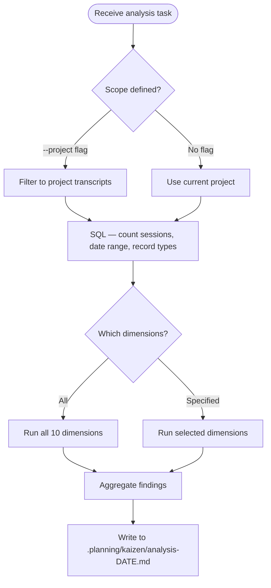

# Transcript Analysis

Analyze Claude Code JSONL session transcripts to detect anti-patterns, inefficiencies, user frustration, and workflow improvement opportunities.

## Data Location

Transcripts live under `~/.claude/projects/` in project-specific directories named after the project path (with hyphens replacing slashes).

```text
~/.claude/projects/{project-key}/
├── {uuid}.jsonl              # Main session transcripts
├── agent-{id}.jsonl          # Orphan agent transcripts
└── {uuid}/
    ├── subagents/
    │   └── agent-{id}.jsonl  # Subagent transcripts
    └── tool-results/
        └── {tool-use-id}.txt # Async task outputs
```

## JSONL Record Types

Every line is a JSON object. The `type` field discriminates record types.

Primary record types for analysis:

- `assistant` — LLM response turns containing tool calls and text
- `user` — Human input and tool results
- `system` — Metadata events (stop_hook_summary, turn_duration, compact_boundary, api_error, local_command)
- `progress` — Hook execution and subagent streaming
- `file-history-snapshot` — File edit tracking
- `summary` — Session title/summary

For full schema details including JSON structures for each record type, see [JSONL Schema Reference](./references/jsonl-schema.md).

## Signal Catalog

Ten analysis dimensions, each with extraction methodology.

### 1. Tool Misuse Detection

Extract from `assistant.message.content[]` where `name == "Bash"`. Parse `input.command` for file-operation patterns that should use built-in tools.

```sql
SELECT
  json_extract_string(line, '$.message.content') as content,
  json_extract_string(line, '$.sessionId') as session_id
FROM read_ndjson_auto('path/to/*.jsonl')
WHERE json_extract_string(line, '$.type') = 'assistant'
```

Then parse tool_use blocks for Bash commands matching:

- `grep` → should use Grep tool
- `find -name` → should use Glob tool
- `cat`, `head`, `tail` → should use Read tool
- `ls` → should use Glob or Bash(ls) with description
- `sed`, `awk` → should use Edit tool

Exclude legitimate uses in pipelines (`git ... | grep`, `uv run ... | head`).

### 2. Repeated Errors

Extract from tool results where `is_error: true`. Classify error types:

- "File has not been read yet" — Edit-before-Read anti-pattern
- "String to replace not found" — stale Edit target
- "User denied tool use" — permission/trust issue
- Pre-commit hook failures (exit code 1)
- Missing binary / command not found

### 3. User Frustration Signals

Extract from `user` records where `toolUseResult` is absent. Match patterns:

- `[Request interrupted by user]` — Ctrl+C
- `[Request interrupted by user for tool use]` — tool denial
- Direct corrections — "No,", "Don't", "Stop", "Why did you", "wrong", "incorrect"

Filter out system-generated content (XML tags, session continuation messages, skill injections).

### 4. Missing Tooling Opportunities

Identify repeated multi-step manual workflows across sessions via tool-sequence trigram analysis. High-frequency trigrams like `Bash → Bash → Bash` or `Read → Read → Read` suggest missing scripts or skills.

### 5. Subagent Delegation Patterns

Extract from `Task` tool_use blocks. Track `subagent_type`, `description`, `model`. Flag when `general-purpose` is used where a specialized agent exists.

### 6. Shortest Path Analysis

Compare successful vs failed attempts at the same goal. Measure tool-call count between goal statement (user turn) and successful outcome (final assistant turn). High variance across sessions for similar goals indicates wasted steps.

### 7. Red Herring Detection

Track investigation branches that get abandoned. Signal: a sequence of Read/Grep/Bash calls on a topic followed by `compact_boundary` or direction change without resolution. Cross-session frequency of the same abandoned paths reveals systematic red herrings.

### 8. System Process Interruptions

Extract `system.compact_boundary`, `system.api_error`, and hook-related `progress` events. Map their position relative to active work to identify when system processes derailed correct execution paths.

### 9. Missing Hooks

Identify manual corrections that recur across sessions. When the same correction appears 3+ times, it is a candidate for automated prevention via PreToolUse hook (deny + redirect) or SubagentStart hook (inject context).

### 10. DuckDB SQL Querying

Use the MotherDuck MCP server (`execute_query` tool) for direct SQL access to JSONL files. DuckDB natively reads JSONL via `read_ndjson_auto()`.

For SQL query patterns and examples, see [DuckDB Query Patterns](./references/duckdb-queries.md).

## Process Mining Methodology

Use the custom kaizen MCP server tools for analyses SQL cannot express:

- `extract_tool_sequences` — Convert JSONL → ordered tool-call arrays per session
- `discover_process_model` — PM4Py Heuristic Miner on tool-call event logs
- `check_conformance` — Compare sessions against a reference process model
- `find_frequent_patterns` — PrefixSpan sequential pattern mining
- `detect_frustration_signals` — NLP extraction from user turns
- `cluster_sessions` — Trace clustering by behavioral similarity

## Analysis Workflow



## Output Format

Write analysis findings to `.planning/kaizen/` as structured markdown with:

- Session ID and date for each finding
- Severity (critical / warning / info)
- Evidence — exact JSON field paths and values
- Frequency — how many sessions exhibit the pattern
- Recommendation type — hook, skill patch, agent prompt fix, CLAUDE.md update
