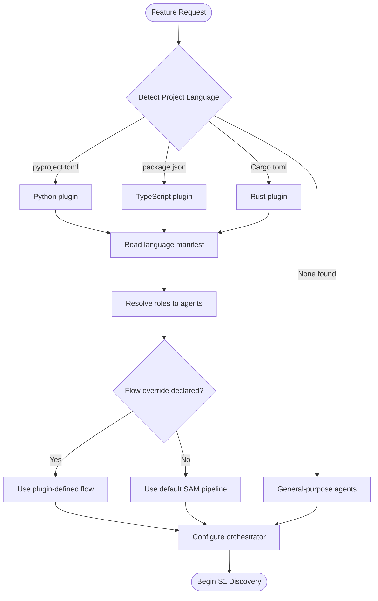
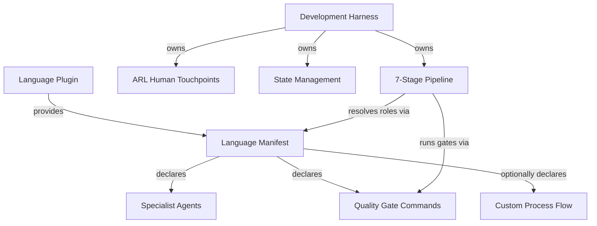

# Development Harness Plugin - AI-Facing Documentation

Language-agnostic development process harness that orchestrates feature development through a structured 7-stage pipeline. Any language plugin can compose with this harness by providing a language manifest declaring specialist agents and quality gates.

---

## Plugin Identity

**Name:** `dh`
**Version:** 0.1.0
**Purpose:** Provide a reusable, language-independent development workflow based on the Stateless Agent Methodology (SAM) with ARL-derived human touchpoints and Voltron-style language plugin composition.

**Design Principles:**

- The harness owns the *process*; language plugins own the *specialists*
- Every stage produces a file-based artifact (stateless handoff)
- Human escalation follows ARL constraint analysis, not arbitrary checkpoints
- Without a language manifest, the harness falls back to general-purpose agents

---

## How It Works

### SAM 7-Stage Pipeline

The harness walks a feature request through seven stages, each producing a named artifact stored in `plan/`. Stages gate on artifact completion, not conversation state.

1. **S1 Discovery** - Understand the feature, codebase, and constraints
2. **S2 Planning + RT-ICA** - Generate a plan with information completeness analysis
3. **S3 Context Integration** - Validate the plan against actual codebase state
4. **S4 Task Decomposition** - Break the plan into executable task files
5. **S5 Execution** - Implement tasks using language-appropriate specialists
6. **S6 Forensic Review** - Verify each task against its acceptance criteria
7. **S7 Final Verification** - Certify the feature meets original requirements

The default flow with ARL touchpoint gates is defined in [./skills/development-harness/references/default-development-flow.md](./skills/development-harness/references/default-development-flow.md).

### ARL Human Touchpoints

Not every stage requires human review. The harness uses ARL-derived constraint analysis to decide when to escalate. Escalation triggers include unbound constraints, domain knowledge gaps, high-risk irreversible changes, and novel architecture decisions. Routine changes with existing patterns proceed autonomously.

Details in [./skills/development-harness/references/human-touchpoint-model.md](./skills/development-harness/references/human-touchpoint-model.md).

### Voltron-Style Composition

Language plugins snap into the harness by providing a manifest that maps abstract roles to concrete agents and declares quality gate commands. The harness resolves roles at runtime based on project detection.

---

## Role Resolution

The full resolution protocol is documented in [./skills/development-harness/references/role-resolution-protocol.md](./skills/development-harness/references/role-resolution-protocol.md).

---

## State Management

All artifacts are written to the per-project state directory (`~/.dh/projects/{project-slug}/plan/`) resolved via `dh_paths.plan_dir()`. The `{project-slug}` is derived from the absolute project root path (replacing `/` with `-`). The base state directory can be overridden via the `DH_STATE_HOME` environment variable (used in CI and testing).

**Token pattern:** `ARTIFACT:{TYPE}({SCOPE_OR_ID})`

**File layout example** (under `~/.dh/projects/{project-slug}/`):

- `plan/feature-context-{slug}.md` - S1 output
- `plan/architect-{slug}.md` - architecture output
- `plan/P{NNN}-{slug}.yaml` - task plan
- `plan/T0-baseline-{slug}.yaml` - pre-implementation baseline
- `plan/TN-verification-{slug}.yaml` - post-implementation verification
- `backlog/*.md` - backlog item cache (synced from GitHub Issues)
- `context/active-task-{session-id}.json` - ephemeral task execution context

The `.dh/` directory in the repository root (Tier 1) holds committed project configuration. State files live outside the repo at `~/.dh/`, preventing pollution of the working tree.

Full conventions in [./skills/development-harness/references/artifact-conventions.md](./skills/development-harness/references/artifact-conventions.md).

---

## Artifact Manifest System

Plan artifacts are registered in a structured manifest stored in the GitHub Issue body. The manifest is the discovery mechanism — consumers query it via MCP to find artifacts for an issue.

**MCP tools (on backlog server) — Artifact Management:**

- `artifact_register` — Register or update an artifact entry (issue_number, type, path, status, agent)
- `artifact_list` — List all artifacts for an issue, optionally filtered by type
- `artifact_get` — Get metadata for a specific artifact type on an issue
- `artifact_read` — Read artifact file content from root worktree path (with path safety validation)

**Artifact types:** `feature-context`, `architect`, `task-plan`, `codebase-analysis`, `T0-baseline`, `TN-verification`, `dispatch-plan`

**Registration:** Producers call `artifact_register` after creation. Auto-registration is built into `sam_create` and `backlog_update(plan=...)`.

**Consumer discovery:** Consumers (including worktree-isolated agents) call `artifact_list` then `artifact_read` instead of filesystem access — plan files are in the root worktree and not visible inside isolated worktrees.

## Dispatch Orchestration System

Wave-based parallel execution state for `/work-milestone`. State is persisted to SQLite at `~/.dh/projects/{project-slug}/dispatch-state.db` via the `dispatch_state.DispatchStateManager` class (imported by `server.py`).

**MCP tools (on backlog server) — Dispatch Orchestration:**

- `dispatch_read(milestone_number)` — Read an existing dispatch plan from `plan/milestone-{N}-dispatch.yaml`. Returns parsed plan structure or error.
- `dispatch_validate(milestone_number)` — Validate structural integrity of an existing dispatch plan. Returns is_valid, errors, warnings.
- `dispatch_stale_check(milestone_number)` — Check whether any wave items have stale or dead PIDs and return staleness summary.
- `dispatch_create_plan(milestone_number, plan_yaml, overwrite, validate, issue)` — Validate and persist a dispatch plan YAML atomically. Returns plan_path, wave_count, item_count, and validation results. Set overwrite=True when re-grooming. Pass issue to auto-register as a `dispatch-plan` artifact.
- `dispatch_wave_start(milestone, wave_num, items)` — Create a wave entry; initialise all items with `status=pending`. Call before spawning processes. Returns error if wave already exists.
- `dispatch_item_status(milestone, issue, status, result, error, cost)` — Record completion or failure of one item. Looks up item by milestone+issue across all waves. Valid status: `complete`, `failed`, `skipped`.
- `dispatch_wave_status(milestone, wave_num)` — Query wave progress with per-item detail and elapsed time. Checks stale PIDs (marks dead processes failed) before returning.
- `dispatch_spawn(milestone, wave_num, ...)` — Background task tool (`task=True`) that calls `dispatch_wave_start` then spawns one `claude -p` kage-bunshin process per wave item. Used by `/work-milestone`.

**Workflow:** `/groom-milestone` calls `dispatch_create_plan` to validate and persist the dispatch plan YAML. `/work-milestone` calls `dispatch_wave_start` per wave, `dispatch_spawn` to launch sessions, and `dispatch_wave_status` to poll progress. Spawned sessions call `dispatch_item_status` on completion.

---

## Composition Model

**What the harness owns:**

- Process orchestration (stage sequencing, gating, looping)
- Human touchpoint decisions (ARL constraint analysis)
- Artifact management (naming, storage, cross-referencing)
- Fallback behavior (general-purpose agents when no manifest exists)

**What language plugins own:**

- Specialist agents (architect, test-designer, code-reviewer)
- Quality gate commands (format, lint, typecheck, test)
- Project detection markers (config files, source patterns)
- Optionally, a custom process flow overriding the default pipeline

Language plugin authors should use the template at [./templates/language-manifest-template.md](./templates/language-manifest-template.md).

The manifest schema is documented in [./skills/development-harness/references/language-manifest-schema.md](./skills/development-harness/references/language-manifest-schema.md).

---

## Skills Overview (30)

**Main orchestration:**

- `/dh:development-harness` - Entry point. Detects language, resolves roles, orchestrates S1-S7.

**SAM workflow (4):**

- `/dh:add-new-feature` - Plan a feature: discovery, analysis, architecture, task decomposition
- `/dh:implement-feature` - Execute tasks from a SAM task file via agent delegation loop
- `/dh:start-task` - Start or complete a specific task inside a SAM task file
- `/dh:complete-implementation` - Quality gates after all tasks are COMPLETE

**Workflow stages (7):**

- `/dh:workflows:discovery` - S1 feature and codebase understanding
- `/dh:workflows:planning` - S2 plan generation with RT-ICA
- `/dh:workflows:context-integration` - S3 plan validation against codebase
- `/dh:workflows:task-decomposition` - S4 break plan into executable tasks
- `/dh:workflows:execution` - S5 implement tasks with language specialists
- `/dh:workflows:forensic-review` - S6 verify task completion
- `/dh:workflows:final-verification` - S7 certify feature completion

**Planning tools (4):**

- `/dh:clear-cove-task-design` - Task design methodology
- `/dh:generate-task` - Generate individual task files
- `/dh:planner-rt-ica` - Information completeness analysis for planning
- `/dh:validation-protocol` - Validation patterns and checklists

**Implementation:**

- `/dh:implementation-manager` - Coordinate implementation across tasks

**Backlog management (4):**

- `/dh:backlog` - Backlog overview and operations reference
- `/dh:create-backlog-item` - Create new backlog items
- `/dh:work-backlog-item` - Work on a backlog item through its lifecycle
- `/dh:groom-backlog-item` - Groom and prioritize backlog items

**Milestone management (2):**

- `/dh:groom-milestone` - Groom milestone issues into dispatch plans
- `/dh:work-milestone` - Execute milestone tasks in isolated worktrees

**Testing (3):**

- `/dh:testing:comprehensive-test-review` - Review test coverage and quality
- `/dh:testing:analyze-test-failures` - Diagnose and categorize test failures
- `/dh:testing:test-failure-mindset` - Systematic approach to understanding test failures

**Other (4):**

- `/dh:dispatch` - Dispatch tasks to agents using teams-first parallel execution; prefer over implement-feature when milestone-scoped work needs concurrent agent dispatch
- `/dh:dh-meta-docs` - Plugin meta-documentation
- `/dh:interop` - Cross-plugin interoperability
- `/dh:subagent-contract` - Subagent contract definitions

---

## Agents Overview (15)

**Planning and decomposition:**

- `@dh:swarm-task-planner` - Decompose features into parallel task streams
- `@dh:plan-validator` - Validate plans for completeness and feasibility

**Research and analysis:**

- `@dh:feature-researcher` - Research feature requirements and prior art
- `@dh:codebase-analyzer` - Analyze codebase structure and patterns
- `@dh:ecosystem-researcher` - Research external dependencies and ecosystem

**Verification:**

- `@dh:feature-verifier` - Verify feature meets acceptance criteria
- `@dh:integration-checker` - Check integration points and compatibility
- `@dh:t0-baseline-capture` - Capture baseline state before implementation
- `@dh:tn-verification-gate` - Verify acceptance criteria after implementation

**Context management:**

- `@dh:context-gathering` - Gather context from codebase and documentation
- `@dh:context-refinement` - Refine and validate gathered context

**Documentation:**

- `@dh:doc-drift-auditor` - Detect documentation drift from implementation
- `@dh:service-docs-maintainer` - Generate and maintain service documentation

**Execution:**

- `@dh:generic-stage-agent` - Generic agent for pipeline stages
- `@dh:task-worker` - Execute individual tasks

---

## When to Use

Activate this plugin when:

- Starting feature development in any language project
- Planning an implementation that needs structured decomposition
- Running the full development workflow from discovery through verification
- Working in a multi-language project where process should be consistent
- Needing human touchpoint decisions based on constraint analysis rather than arbitrary gates

Do NOT use when:

- Making a quick fix that does not need staged planning
- Working on documentation-only changes
- The language plugin already provides its own complete workflow (check for flow override in manifest)

---

## Layer Model

This harness implements the **SDLC Layer Separation Architecture**. Layer 0 = framework (this harness); Layer 1 = language plugin; Layer 2 = stack profile (optional). See [docs/sdlc-layers/](./docs/sdlc-layers/) and [docs/sdlc-layers/layer-2/](./docs/sdlc-layers/layer-2/).

---

## Backend Providers

When discussing, extending, or adding backend providers for the development harness — including state management, task management, planning, issues, jobs, milestones, or boards — read [docs/backend-providers.md](./docs/backend-providers.md) first. Amend that document with any new points, references, discoveries, or user inputs that arise during the conversation.

The development harness supports pluggable backends via Protocol-based abstractions. The current implementation uses GitHub. Future backends include GitLab, Linear, and Supabase. Each backend uses its platform's native primitives — see the reference doc for verified capabilities and official documentation URLs per platform.

The backlog MCP server also exposes `profile_load` (agent_profile tool) for loading named agent profiles that specialize task-worker behavior at dispatch time. Profile definitions live in the backlog server configuration; see [docs/backend-providers.md](./docs/backend-providers.md) for the module boundary.

---

## References

- [Backend Providers](./docs/backend-providers.md)
- [Default Development Flow](./skills/development-harness/references/default-development-flow.md)
- [Role Resolution Protocol](./skills/development-harness/references/role-resolution-protocol.md)
- [Language Manifest Schema](./skills/development-harness/references/language-manifest-schema.md)
- [Human Touchpoint Model](./skills/development-harness/references/human-touchpoint-model.md)
- [Artifact Conventions](./skills/development-harness/references/artifact-conventions.md)
- [Language Manifest Template](./templates/language-manifest-template.md)

---

## Sources

- SAM methodology: <https://github.com/bitflight-devops/stateless-agent-methodology>
- Flow experiments & learnings: <https://github.com/Jamie-BitFlight/sam-flow-experiments>
- ARL skill: `plugins/plugin-creator/skills/arl/`
- RT-ICA skill: `plugins/development-harness/skills/planner-rt-ica/`
