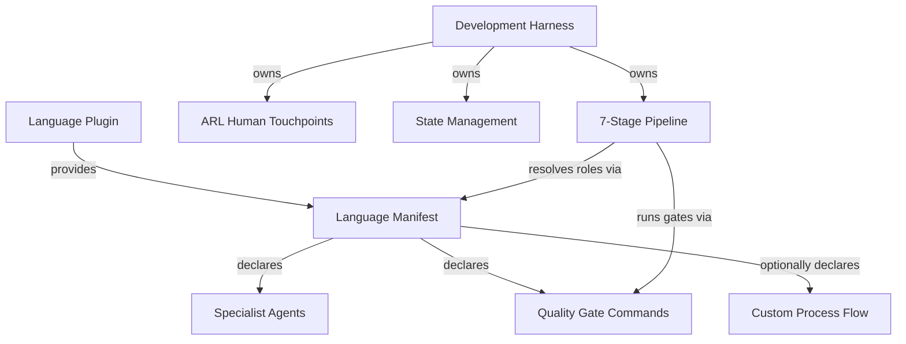

# Development Harness Plugin - AI-Facing Documentation

Language-agnostic development process harness that orchestrates feature development through a structured 7-stage pipeline. Any language plugin can compose with this harness by providing a language manifest declaring specialist agents and quality gates.

---

## Plugin Identity

**Name:** `dh`
**Version:** 0.1.0
**Purpose:** Provide a reusable, language-independent development workflow based on the Stateless Agent Methodology (SAM) with ARL-derived human touchpoints and Voltron-style language plugin composition.

**Design Principles:**

- The harness owns the *process*; language plugins own the *specialists*
- Every stage produces a file-based artifact (stateless handoff)
- Human escalation follows ARL constraint analysis, not arbitrary checkpoints
- Without a language manifest, the harness falls back to general-purpose agents

---

## How It Works

### SAM 7-Stage Pipeline

The harness walks a feature request through seven stages, each producing a named artifact stored in `.planning/harness/`. Stages gate on artifact completion, not conversation state.

1. **S1 Discovery** - Understand the feature, codebase, and constraints
2. **S2 Planning + RT-ICA** - Generate a plan with information completeness analysis
3. **S3 Context Integration** - Validate the plan against actual codebase state
4. **S4 Task Decomposition** - Break the plan into executable task files
5. **S5 Execution** - Implement tasks using language-appropriate specialists
6. **S6 Forensic Review** - Verify each task against its acceptance criteria
7. **S7 Final Verification** - Certify the feature meets original requirements

The default flow with ARL touchpoint gates is defined in [./skills/development-harness/references/default-development-flow.md](./skills/development-harness/references/default-development-flow.md).

### ARL Human Touchpoints

Not every stage requires human review. The harness uses ARL-derived constraint analysis to decide when to escalate. Escalation triggers include unbound constraints, domain knowledge gaps, high-risk irreversible changes, and novel architecture decisions. Routine changes with existing patterns proceed autonomously.

Details in [./skills/development-harness/references/human-touchpoint-model.md](./skills/development-harness/references/human-touchpoint-model.md).

### Voltron-Style Composition

Language plugins snap into the harness by providing a manifest that maps abstract roles to concrete agents and declares quality gate commands. The harness resolves roles at runtime based on project detection.

---

## Role Resolution

The full resolution protocol is documented in [./skills/development-harness/references/role-resolution-protocol.md](./skills/development-harness/references/role-resolution-protocol.md).

---

## State Management

All artifacts are written to `.planning/harness/` using SAM naming conventions.

**Token pattern:** `ARTIFACT:{TYPE}({SCOPE_OR_ID})`

**File layout example:**

- `.planning/harness/discovery-auth-feature.md` - S1 output
- `.planning/harness/plan-auth-feature.md` - S2 output
- `.planning/harness/task-001-add-jwt-middleware.md` - S4 output per task
- `.planning/harness/execution-001.md` - S5 output per task
- `.planning/harness/review-auth-feature.md` - S6 output
- `.planning/harness/verification-auth-feature.md` - S7 output

This directory coexists with `.planning/gsd/` and other planning tools without conflict.

Full conventions in [./skills/development-harness/references/artifact-conventions.md](./skills/development-harness/references/artifact-conventions.md).

---

## Composition Model

**What the harness owns:**

- Process orchestration (stage sequencing, gating, looping)
- Human touchpoint decisions (ARL constraint analysis)
- Artifact management (naming, storage, cross-referencing)
- Fallback behavior (general-purpose agents when no manifest exists)

**What language plugins own:**

- Specialist agents (architect, test-designer, code-reviewer)
- Quality gate commands (format, lint, typecheck, test)
- Project detection markers (config files, source patterns)
- Optionally, a custom process flow overriding the default pipeline

Language plugin authors should use the template at [./templates/language-manifest-template.md](./templates/language-manifest-template.md).

The manifest schema is documented in [./skills/development-harness/references/language-manifest-schema.md](./skills/development-harness/references/language-manifest-schema.md).

---

## Skills Overview (16)

**Main orchestration:**

- `/development-harness` - Entry point. Detects language, resolves roles, orchestrates S1-S7.

**Workflow stages (7):**

- `/dh:discovery` - S1 feature and codebase understanding
- `/dh:planning` - S2 plan generation with RT-ICA
- `/dh:context-integration` - S3 plan validation against codebase
- `/dh:task-decomposition` - S4 break plan into executable tasks
- `/dh:execution` - S5 implement tasks with language specialists
- `/dh:forensic-review` - S6 verify task completion
- `/dh:final-verification` - S7 certify feature completion

**Planning tools (4):**

- `/dh:clear-cove-task-design` - Task design methodology
- `/dh:generate-task` - Generate individual task files
- `/dh:planner-rt-ica` - Information completeness analysis for planning
- `/dh:validation-protocol` - Validation patterns and checklists

**Implementation:**

- `/dh:implementation-manager` - Coordinate implementation across tasks

**Testing (3):**

- `/dh:comprehensive-test-review` - Review test coverage and quality
- `/dh:analyze-test-failures` - Diagnose and categorize test failures
- `/dh:test-failure-mindset` - Systematic approach to understanding test failures

---

## Agents Overview (11)

**Planning and decomposition:**

- `@dh:swarm-task-planner` - Decompose features into parallel task streams
- `@dh:plan-validator` - Validate plans for completeness and feasibility

**Research and analysis:**

- `@dh:feature-researcher` - Research feature requirements and prior art
- `@dh:codebase-analyzer` - Analyze codebase structure and patterns
- `@dh:ecosystem-researcher` - Research external dependencies and ecosystem

**Verification:**

- `@dh:feature-verifier` - Verify feature meets acceptance criteria
- `@dh:integration-checker` - Check integration points and compatibility

**Context management:**

- `@dh:context-gathering` - Gather context from codebase and documentation
- `@dh:context-refinement` - Refine and validate gathered context

**Documentation:**

- `@dh:doc-drift-auditor` - Detect documentation drift from implementation
- `@dh:service-docs-maintainer` - Generate and maintain service documentation

---

## When to Use

Activate this plugin when:

- Starting feature development in any language project
- Planning an implementation that needs structured decomposition
- Running the full development workflow from discovery through verification
- Working in a multi-language project where process should be consistent
- Needing human touchpoint decisions based on constraint analysis rather than arbitrary gates

Do NOT use when:

- Making a quick fix that does not need staged planning
- Working on documentation-only changes
- The language plugin already provides its own complete workflow (check for flow override in manifest)

---

## Layer Model

This harness implements the **SDLC Layer Separation Architecture**. Layer 0 = framework (this harness); Layer 1 = language plugin; Layer 2 = stack profile (optional). See [.claude/docs/sdlc-layers/](../../.claude/docs/sdlc-layers/) and [plugins/development-harness/docs/layer-2/](./docs/layer-2/).

---

## References

- [Default Development Flow](./skills/development-harness/references/default-development-flow.md)
- [Role Resolution Protocol](./skills/development-harness/references/role-resolution-protocol.md)
- [Language Manifest Schema](./skills/development-harness/references/language-manifest-schema.md)
- [Human Touchpoint Model](./skills/development-harness/references/human-touchpoint-model.md)
- [Artifact Conventions](./skills/development-harness/references/artifact-conventions.md)
- [Language Manifest Template](./templates/language-manifest-template.md)

---

## Sources

- SAM methodology: <https://github.com/bitflight-devops/stateless-agent-methodology>
- Flow experiments & learnings: <https://github.com/Jamie-BitFlight/sam-flow-experiments>
- ARL skill: `plugins/plugin-creator/skills/arl/`
- RT-ICA skill: `plugins/python3-development/skills/planner-rt-ica/`
