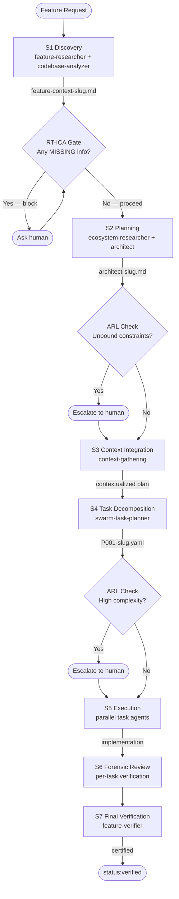
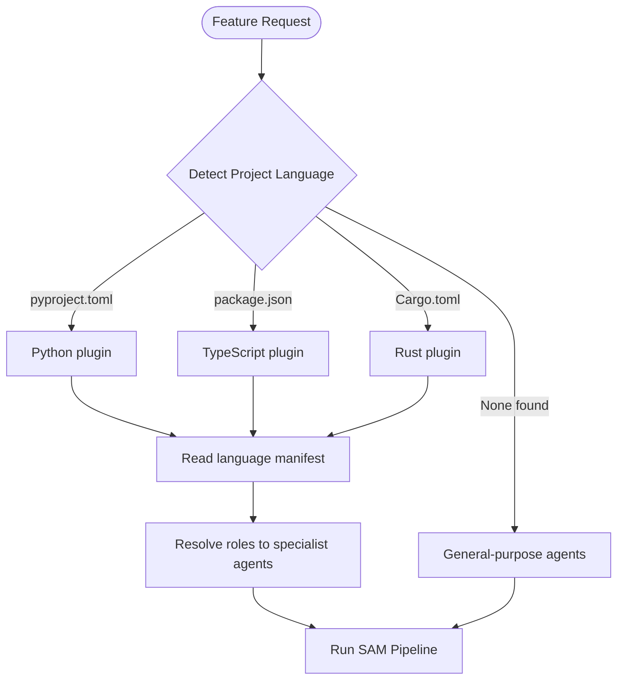

<p align="center">
  
</p>

# development-harness

A language-agnostic development process harness that takes a feature idea from discovery through verified delivery using a structured 7-stage pipeline. Claude handles the orchestration — you handle the decisions that matter.

## Why Install This?

Software development breaks down in predictable ways: work begins before requirements are fully understood, implementation happens in isolation and diverges from the plan, quality checks are skipped under time pressure, and context is lost between sessions. The development harness addresses all of these by turning Claude into a structured engineering partner rather than a chat assistant.

With this plugin installed, Claude will:

- Break features into stages with explicit artifacts before writing a single line of code
- Route work to specialist agents based on your project language
- Run quality gates automatically after implementation completes
- Manage a GitHub-backed backlog and escalate to you only when constraints genuinely require human judgment
- Execute milestone-scale work with true parallel orchestration using isolated git worktrees

## What You Get

### Core Workflow (4 Commands)

The primary interface is four commands that walk a feature from idea to verified delivery:

#### `/dh:add-new-feature`

Plans a feature through 6 sequential research phases before any implementation begins.

```text
/dh:add-new-feature "add JWT authentication to the API"
```

What happens:

1. A feature researcher studies the problem space, desired outcomes, and constraints
2. A codebase analyzer maps existing patterns and conventions in your repo
3. An architecture agent writes a specification
4. A task planner decomposes the spec into a parallel-executable task file
5. A plan validator checks the task file for completeness and feasibility
6. A context-gathering agent writes a context manifest so subsequent agents have full situational awareness

All outputs land in `~/.dh/projects/{your-project}/plan/` as named files. The GitHub issue body records an artifact manifest so worktree-isolated agents can discover them.

**RT-ICA Gate**: Before planning begins, Claude runs a Reverse Thinking Information Completeness Assessment. If any required information is genuinely missing (not just derivable), planning blocks and you are asked to provide it. This prevents plans built on assumptions.

#### `/dh:implement-feature`

Executes a SAM task plan produced by `/dh:add-new-feature`.

```text
/dh:implement-feature plan/P001-jwt-authentication.yaml
```

What happens:

- Queries the task file for ready tasks (not-started with all dependencies complete)
- When 2 or more tasks are ready simultaneously, dispatches parallel agents via TeamCreate
- Each task runs through `/dh:start-task`, which claims the task, executes it, and records divergence notes when implementation differs from plan
- A SubagentStop hook automatically marks tasks complete
- Bookend tasks run automatically: T0 captures baseline state before implementation begins, TN verifies acceptance criteria after all implementation tasks finish

#### `/dh:start-task`

Claims and executes a single task from a SAM plan. Used directly when you want to run one task at a time rather than the full loop.

```text
/dh:start-task plan/P001-jwt-authentication.yaml T3
```

Writes an active-task context file for hook tracking. Records divergence classification (`design-refinement` vs `intent-divergence`) when what gets built differs from what was planned.

#### `/dh:complete-implementation`

Runs quality gates after all tasks are complete. Takes either a plan file path or a GitHub issue number.

```text
/dh:complete-implementation plan/P001-jwt-authentication.yaml
/dh:complete-implementation #42
```

**SAM path** (when a linked plan exists) — 6 phases:

| Phase | Agent | Purpose |
|---|---|---|
| T1 | code-reviewer | Reviews implementation against standards |
| T2 | feature-verifier | Verifies feature meets acceptance criteria |
| T3 | integration-checker | Checks integration points and compatibility |
| T4 | doc-drift-auditor | Detects documentation drift from implementation |
| T5 | service-docs-maintainer | Updates documentation (skippable if no drift found) |
| T6 | context-refinement | Refines stored context with discoveries |

**Proportional path** (for issues without a linked plan) — 3 phases: code review, test verification, acceptance criteria check.

On completion, applies `status:verified` to the GitHub issue.

---

### Backlog Management

GitHub Issues are the source of truth. The plugin exposes 4 commands and 10 MCP tools for managing your backlog with AI assistance.

#### `/dh:create-backlog-item`

Creates a new backlog item and corresponding GitHub issue.

```text
/dh:create-backlog-item "Add rate limiting to the auth endpoints"
```

Supports priorities P0 through P2 and Ideas. Types: Feature, Bug, Refactor, Docs, Chore.

#### `/dh:work-backlog-item`

Works on an existing backlog item through its full lifecycle — from picking it up, through planning and implementation, to completion.

```text
/dh:work-backlog-item #42
```

#### `/dh:groom-backlog-item`

Grooms a backlog item: fact-checks claims, maps required resources, identifies gaps, estimates effort, and writes structured acceptance criteria.

```text
/dh:groom-backlog-item #42
```

#### `/dh:backlog`

Reference overview for all backlog operations and the 10 MCP tools available (`backlog_add`, `backlog_list`, `backlog_view`, `backlog_sync`, `backlog_close`, `backlog_resolve`, `backlog_update`, `backlog_groom`, `backlog_normalize`, `backlog_pull`).

Local backlog files at `~/.dh/projects/{your-project}/backlog/` are a derived cache. All mutations go through the MCP tools, which sync to GitHub Issues.

---

### Milestone Management

#### `/dh:groom-milestone`

Analyzes all issues in a GitHub milestone and produces a wave-based dispatch plan. Issues that touch overlapping files are placed in separate waves so wave items are always independent of each other.

```text
/dh:groom-milestone 3
```

#### `/dh:work-milestone`

Executes a groomed milestone with full parallel isolation. For each wave:

1. Creates an integration branch
2. Creates isolated git worktrees per issue
3. Spawns independent `claude -p` sessions (kage-bunshin) — each is a full orchestrator with the Agent tool, TeamCreate, and all MCP servers
4. Merges branches sequentially, classifying conflicts as trivial, medium, or heavy
5. Relays discoveries from completed waves to subsequent waves
6. Lands the integration branch to main after all quality gates pass

```text
/dh:work-milestone 3
```

---

### Parallel Orchestration: Kage-Bunshin Sessions

`/dh:kage-bunshin` spawns persistent interactive Claude CLI sessions in tmux with bidirectional communication. Unlike subagents (which report only to their caller), kage-bunshin sessions are full orchestrators — they have the Agent tool, TeamCreate, and can delegate to their own sub-agents.

This is what enables true parallel milestone execution: multiple independent Claude instances, each working on a separate issue in its own worktree, coordinated by the parent orchestrator.

```bash
# Spawn a session
spawn.py spawn --name worker-42 --model haiku "Load /dh:work-backlog-item #42"

# Steer mid-flight
spawn.py send --name worker-42 "Deprioritize UI. Focus on API contract first."

# Read the current screen
spawn.py read --name worker-42

# Stop a session
spawn.py stop --name worker-42
```

---

### Testing Skills

#### `/dh:comprehensive-test-review`

Reviews test coverage and quality across your codebase. Identifies gaps, redundancies, and weak assertions.

#### `/dh:analyze-test-failures`

Diagnoses and categorizes test failures. Distinguishes flaky tests from genuine regressions, environment issues from code defects.

#### `/dh:test-failure-mindset`

Applies a systematic approach to understanding test failures rather than patching symptoms.

---

### Planning Tools

#### `/dh:planner-rt-ica`

The RT-ICA (Reverse Thinking Information Completeness Assessment) gate as a standalone tool. Run it before planning any complex task to identify what information is missing vs. what can be derived.

#### `/dh:clear-cove-task-design`

Task design methodology for decomposing features into executable, independently-verifiable units.

#### `/dh:generate-task`

Generates individual task files following SAM conventions. Useful when you want to add tasks to an existing plan manually.

#### `/dh:validation-protocol`

Validation patterns and checklists for verifying task completion. Defines what "done" means at each stage.

---

### Other Skills

- `/dh:dispatch` — Dispatch tasks to agents using teams-first parallel execution. Prefer over `/dh:implement-feature` for milestone-scoped concurrent dispatch.
- `/dh:interop` — Cross-plugin interoperability reference for plugin authors composing with the harness.
- `/dh:subagent-contract` — Defines contracts subagents must satisfy when executing SAM tasks.
- `/dh:dh-meta-docs` — Plugin meta-documentation and internals reference.

---

### Individual Pipeline Stage Skills

Each of the 7 SAM stages is also available as a standalone skill when you need to re-run a specific stage:

| Skill | Stage | Purpose |
|---|---|---|
| `/dh:discovery` | S1 | Feature and codebase understanding |
| `/dh:planning` | S2 | Plan generation with RT-ICA assessment |
| `/dh:context-integration` | S3 | Plan validation against actual codebase state |
| `/dh:task-decomposition` | S4 | Break plan into executable tasks |
| `/dh:execution` | S5 | Implement tasks with language specialists |
| `/dh:forensic-review` | S6 | Verify task completion against acceptance criteria |
| `/dh:final-verification` | S7 | Certify feature meets original requirements |

---

## How the Pipeline Works



### ARL Human Touchpoints

The harness does not insert arbitrary human review gates. Escalation follows constraint analysis (ARL methodology):

- **Pre-scheduled**: After Discovery if unbound constraints exist; after Task Decomposition if complexity is high
- **Dynamic**: After 3 consecutive NEEDS_WORK iterations on a task; after 2 NOT_CERTIFIED iterations on final verification

Routine work with established patterns proceeds autonomously. You are consulted when the situation genuinely requires your judgment.

### Language Plugin Composition

The harness owns the process. Language plugins own the specialists.



Install the `python3-development` plugin alongside this one for full Python specialist support. TypeScript and Rust plugins are planned.

---

## Agents

The harness ships 15 specialist agents that are invoked automatically during pipeline stages:

**Planning and decomposition:**

- `swarm-task-planner` — Decomposes a feature into parallel-executable task streams with explicit dependency ordering
- `plan-validator` — Validates a task file for completeness, feasibility, and DAG integrity before execution begins

**Research and analysis:**

- `feature-researcher` — Studies the problem space: what the feature must do, why it's needed, what constraints apply
- `codebase-analyzer` — Maps what exists today: patterns, conventions, test approaches, file ownership
- `ecosystem-researcher` — Researches external dependencies, libraries, and ecosystem context

**Verification:**

- `feature-verifier` — Verifies the implemented feature meets its original acceptance criteria
- `integration-checker` — Checks that integrated components are compatible and integration points are sound
- `t0-baseline-capture` — Records baseline state (test results, metrics, behavior) before implementation begins
- `tn-verification-gate` — Compares post-implementation state against the T0 baseline to confirm acceptance criteria are met

**Context management:**

- `context-gathering` — Builds a context manifest from codebase and documentation
- `context-refinement` — Updates stored context with discoveries from the completed implementation

**Documentation:**

- `doc-drift-auditor` — Identifies documentation that no longer reflects the implementation
- `service-docs-maintainer` — Generates and updates service-level documentation

**Execution:**

- `task-worker` — Universal SAM task executor for implementation tasks
- `generic-stage-agent` — General-purpose agent for pipeline stages without a specialist

---

## State Management

All state lives outside the repository at `~/.dh/projects/{project-slug}/`:

```text
plan/
  feature-context-{slug}.md       Discovery output (S1)
  architect-{slug}.md             Architecture specification (S2)
  P{NNN}-{slug}.yaml              Task plan (S4)
  T0-baseline-{slug}.yaml         Pre-implementation baseline
  TN-verification-{slug}.yaml     Post-implementation verification
  QG{NNN}-qg-{slug}.yaml          Quality gate plan
backlog/                          Local cache of GitHub Issues
context/
  active-task-{session-id}.json   Ephemeral task tracking (deleted after task)
kage-bunshin/
  registry.json                   Active parallel session registry
dispatch-state.db                 Wave execution state (SQLite)
```

`{project-slug}` is derived from your absolute project path with `/` replaced by `-`. Override the base location with the `DH_STATE_HOME` environment variable (useful for CI and testing).

The `.dh/` directory inside your repository holds committed project configuration only. Runtime state never pollutes your working tree.

---

## SDLC Layer Architecture

The harness is organized in three layers:

| Layer | Owns | Examples |
|---|---|---|
| Layer 0 | Process framework | SAM pipeline, ARL touchpoints, RT-ICA, artifact conventions, verification protocol |
| Layer 1 | Language specifics | Language manifest declaring specialist agents and quality gates, project detection |
| Layer 2 | Stack/goal specifics | Architecture patterns, toolchain config (e.g., Python CLI, Python FastAPI) |

An ARL Meta-Layer sits above all three, running an observation-improvement loop: Observe → Identify → Probe → Accumulate → Improve. This loop surfaces systemic issues in the development process itself.

Plugin authors composing with this harness write a Layer 1 language manifest that maps abstract roles (design-spec, test-designer, code-reviewer) to their concrete agents. The harness resolves roles at runtime based on project detection.

---

## Example: Full Feature Workflow

You have a Python project and want to add rate limiting to your API.

**Step 1: Plan the feature**

```text
/dh:add-new-feature "add rate limiting to the API endpoints"
```

Claude runs 6 research phases. You're consulted if any required information is genuinely missing (e.g., "what rate limit strategy — token bucket or fixed window?"). Artifacts land in `~/.dh/projects/{your-project}/plan/`.

**Step 2: Execute the plan**

```text
/dh:implement-feature plan/P001-rate-limiting.yaml
```

Claude queries ready tasks. If tasks T1 (implement middleware) and T2 (write tests) are both ready and independent, it spawns parallel agents. Each agent claims its task, implements it, and the hook marks it complete. T0 captures your test suite state before any code changes. TN verifies all acceptance criteria after implementation.

**Step 3: Run quality gates**

```text
/dh:complete-implementation plan/P001-rate-limiting.yaml
```

Code review, feature verification, integration check, documentation drift audit, documentation update, context refinement — all run in sequence. The GitHub issue receives `status:verified` when all gates pass.

---

## Example: Milestone Execution

You have a milestone with 8 issues. Three of them touch `auth/middleware.py` and must not run concurrently. The other five are independent.

```text
/dh:groom-milestone 5
```

Claude analyzes file ownership across all issues and produces a dispatch plan: Wave 1 has the 5 independent issues, Wave 2 has the 3 auth-touching issues (sequenced to avoid conflicts).

```text
/dh:work-milestone 5
```

Wave 1: 5 kage-bunshin sessions spawn simultaneously, each in its own worktree. They complete independently. Their branches merge, discoveries relay to Wave 2. Wave 2 runs the 3 auth issues with conflict awareness from Wave 1's output. Integration branch lands to main.

---

## Installation

First, add the marketplace (one-time setup):

```bash
/plugin marketplace add jamie-bitflight/claude_skills
```

Then install the plugin:

```bash
/plugin install development-harness@jamie-bitflight-skills
```

For full Python specialist support, also install:

```bash
/plugin install python3-development@jamie-bitflight-skills
```

Restart your Claude Code session after installation to load all components.

### Cursor IDE

The **`.cursor-plugin/plugin.json`** manifest is for Cursor (see [Plugins reference](https://cursor.com/docs/reference/plugins.md)). MCP entries mirror **Claude Code** for the script path: **`${CLAUDE_PLUGIN_ROOT}/scripts/...`**, because Cursor resolves **`./scripts/...` against `${workspaceFolder}`** (the open project), which points at the wrong tree (e.g. `vm-flightsimulator/scripts/...` instead of the installed plugin). **`DH_PROJECT_ROOT`** is set to **`${workspaceFolder}`** so backlog/SAM resolve the **git repo** you have open. If your Cursor build does not set **`CLAUDE_PLUGIN_ROOT`** for this plugin, override the MCP `args` in **`.cursor/mcp.json`** with an absolute path to `scripts/run_backlog_server.py` under your plugin install, or report the gap to Cursor.

---

## Requirements

- Claude Code v2.0+
- GitHub repository (required for backlog and milestone features)
- `GITHUB_TOKEN` in your environment (for MCP tool access to Issues)
- Python 3.11+ (for the MCP server backends — installed automatically)
- `uv` package manager (for running Python components)

---

## When to Use This Plugin

**Use it when:**

- Starting a feature that benefits from structured planning before implementation
- Managing a GitHub Issues backlog and want AI-assisted grooming and prioritization
- Running a milestone with multiple parallel work streams
- You want quality gates (code review, verification, documentation, context) enforced after implementation
- Working across a multi-language codebase where consistent process matters

**Skip it when:**

- Fixing a one-line typo or a known, trivial bug
- Making documentation-only changes
- Your language plugin already provides its own complete workflow (check for a flow override in its manifest)

---

## References

- [Context-Fit Complexity Model](./docs/sdlc-layers/layer-0/context-fit-complexity.md) — Task complexity as context sufficiency: decomposition, constraint economics, progressive disclosure
- SAM methodology: <https://github.com/bitflight-devops/stateless-agent-methodology>
- Flow experiments: <https://github.com/Jamie-BitFlight/sam-flow-experiments>
- ARL provenance: <https://github.com/bitflight-devops/stateless-agent-methodology/blob/main/research/arl/PROVENANCE.md>
