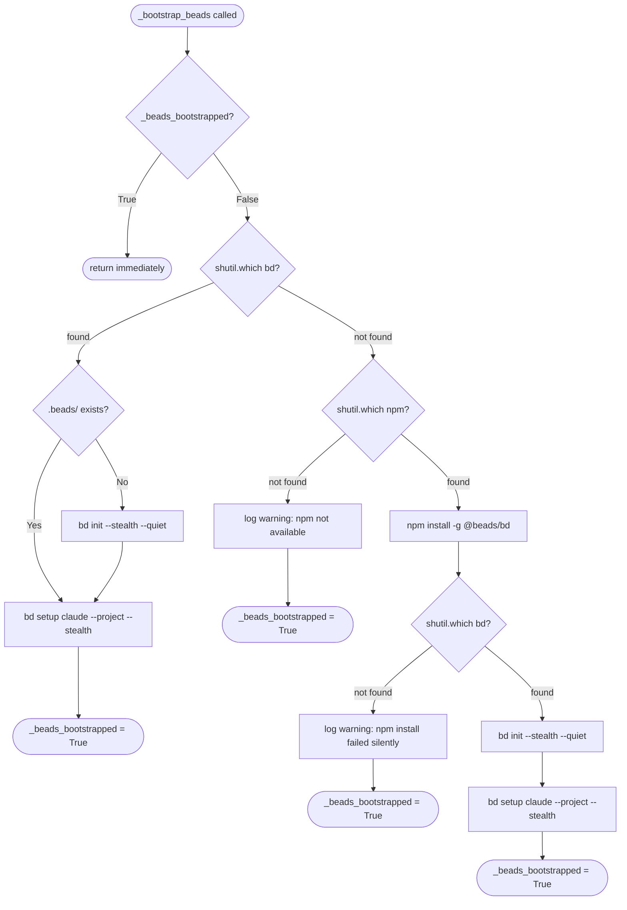

# Backlog MCP Package — Architecture Spec

## Overview

Extract all business logic from `.claude/skills/backlog/scripts/backlog.py` into a clean Python package at `.claude/skills/backlog/backlog_core/`. The package exposes the same functionality through two thin wrappers:

1. **CLI wrapper** (`backlog.py`) — Typer CLI, calls operations module
2. **MCP server** (`server.py`) — FastMCP 3.x, calls operations module

## Source File

All logic originates from: `.claude/skills/backlog/scripts/backlog.py`

Each agent MUST read the full source file and extract ONLY the functions assigned to their module.

## I/O Modules (post-YAML migration)

Local file I/O is handled by two dedicated modules:

- `yaml_io.py` — pure-YAML read/write for backlog items (`.yaml` format). Primary path for all
  new items. Uses `ruamel.yaml` directly; no `python-frontmatter` dependency.
- `github_sync.py` — GitHub issue body parsing (extracts sections, groomed data). Replaces the
  parsing functions that reconstructed local `.md` bodies from GitHub issue bodies.

## Dependency: frontmatter_utils

`frontmatter_utils.py` wraps `python-frontmatter` with a `ruamel.yaml` round-trip handler.
It is retained for:

- `parsing.py` — legacy `.md` file parsing via `loads_frontmatter` / `dump_frontmatter`.
  The `.md` path (`parse_item_file`) is kept for backward compatibility and migration tooling.
- `agent_profile/parser.py` — reads agent `.md` files with YAML frontmatter via `load_frontmatter`.

New code should use `yaml_io.py` (for backlog items) or `ruamel.yaml` directly. Do not add new
callers of `frontmatter_utils`.

## Module Dependency Graph

```text
models.py             ← standalone, no imports from other mcp modules
frontmatter_utils.py  ← wraps python-frontmatter with ruamel.yaml; used by parsing.py and agent_profile/
yaml_io.py            ← pure-YAML read/write for .yaml backlog items; imports from models, parsing
github_sync.py        ← GitHub issue body parsing; imports from models, parsing
parsing.py            ← imports from models, frontmatter_utils; re-exports loads_frontmatter/dump_frontmatter
github.py             ← imports from models, parsing
operations.py         ← imports from models, parsing, github, yaml_io
dispatch_state.py     ← imports from models (DispatchItemRecord, DispatchWaveRecord); no MCP awareness
server.py             ← imports from models, operations, dispatch_state
backlog.py            ← imports from operations (thin CLI wrapper)
```

## Output Pattern

Functions that previously used `typer.echo()` for status/progress messages must instead use an `Output` object (defined in models.py). Each function that needs to communicate status takes an optional `output: Output | None = None` parameter.

```python
# In models.py — ALL models use Pydantic BaseModel
from pydantic import BaseModel, Field

class BacklogItem(BaseModel):
    """Parsed backlog item — replaces untyped dict."""
    title: str = ""
    description: str = ""
    source: str = "Not specified"
    added: str = ""
    priority: str = ""
    item_type: str = "Feature"
    issue: str = ""
    plan: str = ""
    research_first: str = ""
    files: str = ""
    suggested_location: str = ""
    section: str = ""
    file_path: str = ""
    skip: bool = False
    groomed: str = ""
    last_synced: str = ""
    raw_body: str = ""

class Output(BaseModel):
    messages: list[str] = Field(default_factory=list)
    warnings: list[str] = Field(default_factory=list)
    errors: list[str] = Field(default_factory=list)

    def info(self, msg: str) -> None: ...
    def warn(self, msg: str) -> None: ...
    def error(self, msg: str) -> None: ...

# Also: IssueStatus, PullRequestRef, ViewItemResult, IssueLocalFields
```

**CRITICAL**: No `Any` type anywhere. Use `BacklogItem` instead of `dict` for items.
Use `IssueStatus` instead of `dict[str, str]` for status results.
Use `PullRequestRef` instead of `dict[str, Any]` for PR references.
Use `ViewItemResult` instead of `dict[str, Any]` for view results.

Replace `typer.echo(msg)` → `output.info(msg)`
Replace `typer.echo(msg, err=True)` → `output.warn(msg)`
Replace `typer.Exit(1)` → raise appropriate exception from models.py

## Error Handling Pattern

Functions that previously raised `typer.Exit(1)` must instead raise one of:

- `BacklogError` — general errors
- `ItemNotFoundError(selector)` — item not found
- `DuplicateItemError(duplicates)` — fuzzy duplicate detected
- `GitHubUnavailableError` — GITHUB_TOKEN missing or API unreachable
- `ValidationError` — input validation failure

---

## Module: models.py

**Responsibility**: Constants, regex patterns, type maps, exceptions, Output handler.

**Functions/data extracted from backlog.py** (line references are approximate):

- Constants: `BACKLOG_DIR`, `DEFAULT_REPO`, `SECTION_RE`, `SKIP_STATUS`, `GITHUB_ISSUE_URL_RE`, `GITHUB_ISSUE_TITLE_TRUNCATE`, `MIN_FRONTMATTER_PARTS`, `TYPE_TO_LABEL`, `ROLE_MAP`, `BENEFIT_MAP`, `FUZZY_DUPLICATE_THRESHOLD`, `_COMMIT_PREFIX_RE`, `_FIELD_TO_INDEX`
- Add new: `PRIORITY_SECTIONS` dict mapping priority strings to section headings (from the `add` command)
- Exception classes: `BacklogError`, `ItemNotFoundError`, `DuplicateItemError`, `GitHubUnavailableError`, `ValidationError`
- Pydantic models: `BacklogItem`, `Output`, `IssueStatus`, `PullRequestRef`, `ViewItemResult`, `IssueLocalFields`

**Exports** (public API):
All constants, all exception classes, all Pydantic models.

**Imports from other modules**: None.

---

## Module: parsing.py

**Responsibility**: File parsing, item search, slug generation, body section utilities, view helpers, normalize helpers.

**Current active functions** (post-YAML migration):

- Date helpers: `today()`, `now_iso()`
- Slug/title: `title_to_slug()`, `normalize_issue_title()`, `infer_type()`
- Selector: `parse_issue_selector()`
- Item parsing: `parse_item_file()` (legacy `.md` path — deprecated, kept for migration tooling),
  `parse_backlog_from_directory()`, `parse_backlog()`
- Item search: `find_item()`, `find_fuzzy_duplicates()`
- Item filtering: `items_needing_issues()`, `items_with_issues()`
- Issue body: `build_issue_body()`, `build_issue_body_from_file()`
- Body utilities (still used by `operations.py` and `github.py`): `extract_body_field_pairs()`,
  `apply_field_to_result()`, `merge_field_into_result()`, `parse_body_extra_fields()`,
  `extract_groomed_section()`, `build_body_extra_only()`, `append_or_replace_section()`,
  `reconstruct_body_from_sections()`, `merge_sections()`
- Section extraction (used by `github_sync.py`): `extract_sections()`, `extract_groomed_section()`
- View helper: `view_result_from_local_item()`
- Normalize helper: `extract_normalize_metadata()`

**Deprecated / legacy**: `build_backlog_frontmatter()` — builds `.md` frontmatter; superseded by
`yaml_io.save_item()` for new items. Retained because test coverage depends on it.

**Exports**: All functions above (without leading underscores).
Also re-exports `loads_frontmatter` and `dump_frontmatter` from `frontmatter_utils` for backward
compatibility with `operations.py` callers.

**Imports from other modules**: `from .models import ...`, `from .frontmatter_utils import ...`.

---

## Module: github.py

**Responsibility**: GitHub API connection, issue CRUD, status/label management, view enrichment.

**Functions extracted from backlog.py**:

- Connection: `_get_github()` → `get_github()`, `_try_get_github()` → `try_get_github()`
- Issue CRUD: `create_issue_for_item()`, `_close_github_issue()` → `close_github_issue()`, `_resolve_github_issue()` → `resolve_github_issue()`
- PR check: `_check_open_prs_for_issue()` → `check_open_prs_for_issue()`
- Status: `_batch_fetch_statuses()` → `batch_fetch_statuses()`, `_fetch_item_status()` → `fetch_item_status()`, `_apply_status_in_progress()` → `apply_status_in_progress()`
- Issue queries: `_fetch_open_issues_by_title()` → `fetch_open_issues_by_title()`
- View enrichment: `_view_enrich_from_github()` → `view_enrich_from_github()`
- Issue data: `_issue_to_local_fields()` → `issue_to_local_fields()`
- Groomed sync: `_sync_groomed_to_github_issue()` → `sync_groomed_to_github_issue()`
- Fetch: `_fetch_github_issue_body()` → `fetch_github_issue_body()`

**Exports**: All functions listed above.

**Imports from other modules**:
- `from .models import ...` (constants, Output, exceptions)
- `from .parsing import ...` (build_issue_body, infer_type, normalize_issue_title, etc.)

---

## Module: operations.py

**Responsibility**: High-level CRUD operations that combine parsing, GitHub, and file I/O. Each public function returns a dict or list and takes an optional `output: Output` parameter.

**Functions extracted/refactored from backlog.py**:

- File metadata: `_update_item_metadata()` → `update_item_metadata()`
- ADD: `_add_item_index_format()` → part of `add_item()`; duplicate check logic from `add` command
- LIST: logic from `list_items` command → `list_items()`; `_refresh_local_cache_from_github()` → `refresh_local_cache_from_github()`
- VIEW: logic from `view` command → `view_item()`
- SYNC: `_sync_create_missing_issues()` → `sync_create_missing_issues()`, `_sync_push_groomed_content()` → `sync_push_groomed_content()`, combined `sync_items()`; `_find_or_create_issue()` → `find_or_create_issue()`
- CLOSE: `_close_item_index()`, `_close_cleanup()` → part of `close_item()`
- RESOLVE: `_resolve_item_index()` → part of `resolve_item()`
- UPDATE: refactored `update` command → `update_item()`; `_apply_plan_to_item()`, `_create_issue_and_update_item()`, `_handle_update_groomed()`, `_ensure_github_issue()`, `_write_groomed_to_github()`, `_write_groomed_to_item_file()`, `_resolve_groomed_content()`
- GROOM: `groom` command → `groom_item()`
- NORMALIZE: `normalize` command → `normalize_items()`; `_build_normalized_content()`, `_normalize_item_file()`
- PULL: `pull` command → `pull_items()`; `_pull_single_issue()` → `pull_single_issue()`, `_pull_item()`, `_pull_item_create_new()`, `_pull_item_update_existing()`, `_overwrite_body_from_github()`

**Exports**: `add_item`, `list_items`, `view_item`, `sync_items`, `close_item`, `resolve_item`, `update_item`, `groom_item`, `normalize_items`, `pull_items`, `update_item_metadata`, `pull_single_issue`, `refresh_local_cache_from_github`, `sync_create_missing_issues`, `sync_push_groomed_content`

**Imports from other modules**:
- `from .models import ...`
- `from .parsing import ...`
- `from .github import ...`

---

## Module: server.py

**Responsibility**: FastMCP 3.x server exposing all operations as MCP tools.

**Pattern**: Each CLI subcommand becomes a `@mcp.tool()` decorated function that calls the corresponding operation and returns a dict.

**Tools** (14 total):

*Backlog management (10):*

1. `backlog_add` — calls `operations.add_item()`
2. `backlog_list` — calls `operations.list_items()`
3. `backlog_view` — calls `operations.view_item()`
4. `backlog_sync` — calls `operations.sync_items()`
5. `backlog_close` — calls `operations.close_item()`
6. `backlog_resolve` — calls `operations.resolve_item()`
7. `backlog_update` — calls `operations.update_item()`
8. `backlog_groom` — calls `operations.groom_item()`
9. `backlog_normalize` — calls `operations.normalize_items()`
10. `backlog_pull` — calls `operations.pull_items()`

*Dispatch orchestration (4):*

11. `dispatch_wave_start(milestone, wave_num, items)` — creates a wave entry with item records; initialises all items with `status=pending`; returns error if wave already exists
12. `dispatch_item_status(milestone, issue, status, result, error, cost)` — records completion or failure of a single dispatch item; looks up item by milestone+issue across all waves; valid status values: `complete`, `failed`, `skipped`
13. `dispatch_wave_status(milestone, wave_num)` — queries current wave status with per-item detail; checks stale PIDs (marks dead processes failed) before returning
14. `dispatch_spawn(milestone, wave_num, ...)` — background task (`@mcp.tool(task=True)`) that spawns parallel kage-bunshin sessions for a wave; calls `dispatch_wave_start` then launches one `claude -p` process per item

**Key patterns**:
- Use `Annotated[type, Field(...)]` for parameter validation
- Catch `BacklogError` subclasses and convert to structured error responses
- Return dicts with result data + output messages
- Dispatch tools wrap `dispatch_state.DispatchStateManager` via `asyncio.to_thread()`
- Use `if __name__ == "__main__": mcp.run()` for STDIO transport

**Imports**: `from fastmcp import FastMCP`, `from .models import ...`, `from .operations import ...`, `from .dispatch_state import DispatchStateManager`

---

## Module: dispatch_state.py

**Responsibility**: SQLite-backed state persistence for dispatch orchestration. Standalone — no MCP or FastMCP imports.

**Class**: `DispatchStateManager(db_path)`

- `ensure_schema()` — creates `waves` and `items` tables if absent; idempotent
- `create_wave(milestone, wave_num, items)` → `DispatchWaveRecord` — inserts wave row and all item rows; raises `sqlite3.IntegrityError` if wave already exists
- `get_wave(milestone, wave_num)` → `DispatchWaveRecord | None`
- `get_all_waves(milestone)` → `list[DispatchWaveRecord]`
- `set_item_in_progress(milestone, wave_num, issue, pid)` — marks item in-progress, records PID
- `set_item_complete(milestone, wave_num, issue, result, cost)` — marks item complete; triggers wave completion check
- `set_item_failed(milestone, wave_num, issue, error)` — marks item failed; triggers wave completion check
- `get_item(milestone, wave_num, issue)` → `DispatchItemRecord | None`
- `get_wave_items(milestone, wave_num)` → `list[DispatchItemRecord]`
- `check_stale_pids()` → `list[DispatchItemRecord]` — probes each in-progress PID with `os.kill(pid, 0)`; marks dead items failed; returns newly failed items

**Storage**: SQLite at `~/.dh/projects/{project-slug}/dispatch-state.db`. `server.py` initialises the path; `dispatch_state.py` does not resolve it.

**Imports from other modules**: `from .models import DispatchItemRecord, DispatchWaveRecord`

---

## Lifespan Bootstrap

At server startup, `server.py` auto-bootstraps the [beads](https://github.com/beads-dev/beads) toolchain so every user gets the `bd` binary, `.beads/` project database, and Claude PreCompact/SessionStart hooks without manual setup.

### How It Wires In

The FastMCP constructor receives a `lifespan=_beads_lifespan` parameter (see `server.py`, `FastMCP(...)` call). FastMCP invokes this hook once per server startup (or once per `Client(mcp)` context manager entry in tests). The hook runs `_bootstrap_beads()` in a thread executor before yielding to accept tool calls:

```text
FastMCP startup → _beads_lifespan → asyncio.run_in_executor(_bootstrap_beads) → yield → tools available
```

The `@lifespan` decorator is imported from `fastmcp.server.lifespan`.

### Sentinel Pattern

A module-level `_beads_bootstrapped: bool = False` sentinel prevents repeated execution. The sentinel is checked at the top of `_bootstrap_beads()` and set to `True` on every exit path (including degradation paths). This matters because tests open multiple `Client(mcp)` connections — without the sentinel, bootstrap would run on every connection.

Tests reset the sentinel via `monkeypatch.setattr("backlog_core.server._beads_bootstrapped", False)`.

### Bootstrap Decision Tree



### Execution Paths

| Path | Condition | Actions |
|------|-----------|---------|
| Happy (bd present, `.beads/` exists) | `bd` on PATH, `.beads/` directory exists | `bd setup claude --project --stealth` |
| Happy (bd present, no `.beads/`) | `bd` on PATH, `.beads/` missing | `bd init --stealth --quiet`, then `bd setup claude --project --stealth` |
| Install | `bd` absent, `npm` present | `npm install -g @beads/bd`, `bd init`, `bd setup` |
| Degraded — npm absent | `bd` absent, `npm` absent | Warning logged, returns |
| Degraded — install failed | `bd` absent, `npm` present but install silent-failed | Warning logged, returns |

### Subprocess Call Contracts

All subprocess calls in `_bootstrap_beads()` follow these rules:

- `check=False` — non-zero exits do not raise exceptions; the next `shutil.which()` check determines outcome
- `capture_output=True` — suppresses stdout/stderr from subprocess; prevents MCP transport pollution
- `cwd=project_dir` — set on all `bd` commands; absent on `npm install` (npm installs globally)
- Command as list (never `shell=True`) — prevents shell injection

### Project Directory Source

Bootstrap receives the project root from `models.get_repo_root()`, which returns the path set during `_init_models()` at module import time. The sequence is: `sys.argv` → `_parse_args()` → `_init_models(project_dir)` → `models._REPO_ROOT` → `models.get_repo_root()` → `_bootstrap_beads(project_dir)`.

---

## CLI wrapper: backlog.py (rewritten)

**Responsibility**: Thin Typer CLI that imports from `operations` module.

**Pattern**: Each `@app.command()` function:
1. Creates `Output()` instance
2. Calls the corresponding `operations.*()` function
3. Prints `output.messages` and `output.warnings`
4. Catches exceptions and converts to `typer.Exit(1)`

**Keeps**: Rich table formatting for `list` command, text formatting for `view` command.
These are CLI-specific display concerns that don't belong in core logic.

**Imports**: `from .mcp.operations import ...`, `from .mcp.models import ...`
