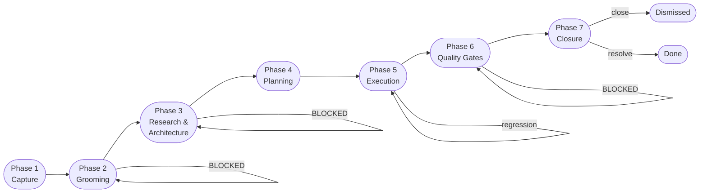
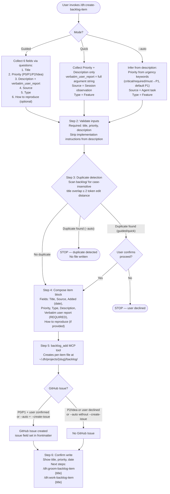
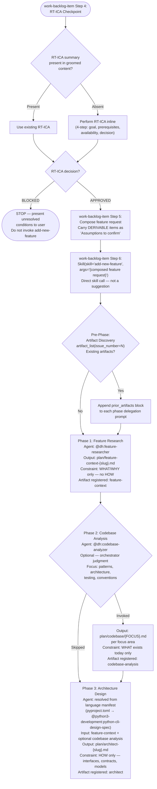
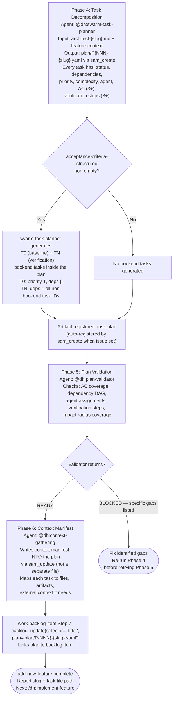
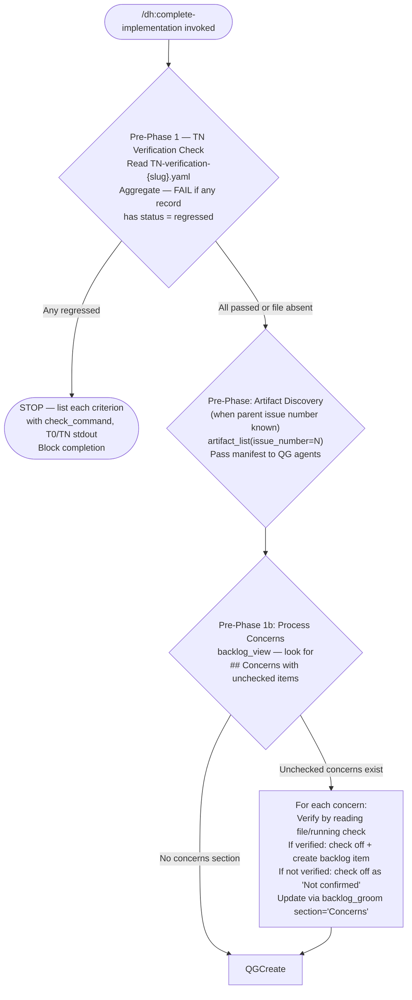
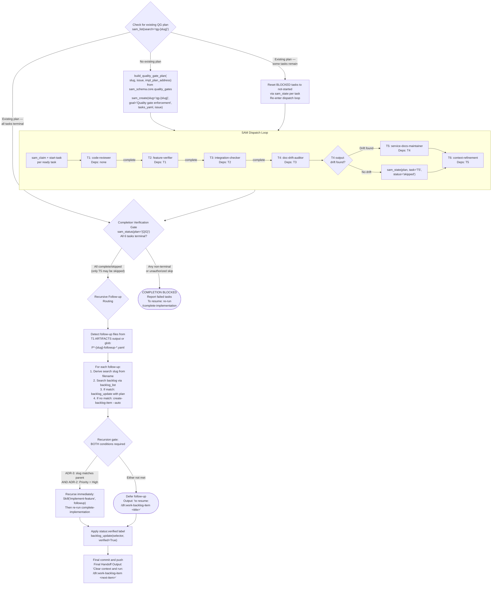
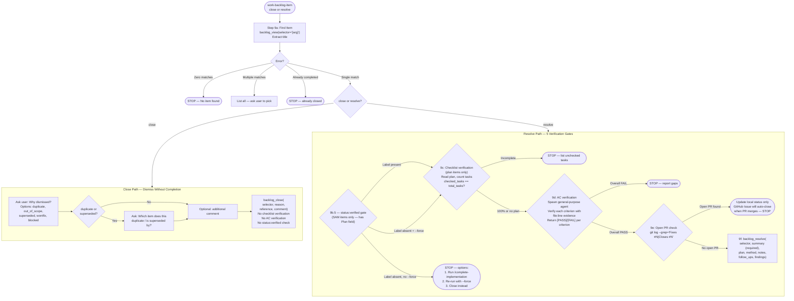

# Backlog Item End-to-End Lifecycle

**Purpose**: Authoritative process graph for the full journey of a backlog item — from idea capture through implementation, verification, and closure. This document connects the backlog management layer (item creation, grooming, research) to the SAM execution layer (planning, implementation, quality gates).

**Sources**:

- `plugins/development-harness/skills/create-backlog-item/SKILL.md`
- `plugins/development-harness/skills/groom-backlog-item/SKILL.md`
- `plugins/development-harness/skills/add-new-feature/SKILL.md`
- `plugins/development-harness/skills/work-backlog-item/SKILL.md`
- `plugins/development-harness/skills/implement-feature/SKILL.md`
- `plugins/development-harness/skills/start-task/SKILL.md`
- `plugins/development-harness/skills/complete-implementation/SKILL.md`
- `plugins/development-harness/docs/adr-9-close-resolve-semantics.md`

**Last verified**: 2026-03-25

---

## Overview

Phases 3 and 4 both execute inside the `/dh:add-new-feature` skill (invoked by `/dh:work-backlog-item`). The skill runs 6 sequential phases: discovery, codebase analysis, architecture, task decomposition, plan validation, and context manifest.

Each phase produces artifacts stored via the three-primitive model defined in [Backend Providers](./backend-providers.md): Work Items (IssueBackend) for coordination state, Sub-items (TaskBackend) for SAM task orchestration, and Documents (DocumentBackend) for durable handoff content between phases.

---

## Phase 1: Item Capture

**Entry precondition**: User identifies a feature, bug, or chore worth tracking.

**Skill**: `/dh:create-backlog-item`

**Actor**: Orchestrator (guided/quick mode) or orchestrator in auto mode.

**Strip implementation instructions from description** (Step 2): **Why:** Implementation instructions in the description contaminate the problem statement. Grooming and architecture phases need to understand WHAT is broken, not HOW to fix it. The `verbatim_user_report` preserves the original words — including any solution suggestions — for reference.

**Key fields**:

- `verbatim_user_report` — REQUIRED, never omitted. The exact user words from Question 3 (guided) or the full argument string (quick/auto). Never edited, summarized, or reformatted. **Why:** The verbatim report is the only field that captures the user's mental model unfiltered. When grooming reveals a misunderstanding between what the user asked for and what the agent interpreted, it is the arbiter of original intent.
- `how_to_reproduce` — optional. Omitted entirely from the MCP call if user skipped or no reproduction steps found.

**Canonical status after this phase**: `needs-grooming`

**Failure paths**:

- Missing required field (title, priority, description) — STOP, report field name.
- Duplicate detected in auto mode — STOP, no file written.
- `GITHUB_TOKEN` not set for P0/P1 issue creation — per-item file still written; issue creation skipped with error report.

**Transition to next phase**: Text suggestion only ("Next steps: Groom: /dh:groom-backlog-item {title}"). No automatic invocation. The transition from capture to grooming is entirely implied — a human or orchestrator must decide to invoke the next step. (Confirmed: audit Finding 9 Gap A.)

---

## Phase 2: Grooming

**Entry precondition**: Item has status `needs-grooming` and is selected for detail work.

**Skill**: `/dh:groom-backlog-item`

**Actor**: Orchestrator dispatches a parallel grooming swarm (team mode) or sequential agents (fallback mode).

```mermaid
flowchart TD
    Start([Item selected for grooming]) --> S1["Step 1: backlog_list MCP<br>Filter items by scope argument"]
    S1 --> S2{"Step 2: Validity Check<br>4 sequential checks per item"}

    S2 --> C1{"C1: Is the job still valid?<br>Does this item still belong<br>in the backlog given current context?"}
    C1 -->|"No — scope/priority/context changed"| Skip(["Report invalid — skip this item"])
    C1 -->|Yes| C2{"C2: Evidence work already done?<br>git log + backlog_list_merged_prs + file read"}
    C2 -->|"Already done"| Skip
    C2 -->|Not done| C3{"C3: Has GitHub issue?<br>Check metadata.issue or index link"}
    C3 --> C4{"C4: Already groomed today?<br>groomed == today's date<br>AND all required sections present?"}
    C4 -->|Yes| Drift["Step 2.5: Drift Check<br>Mode A: Plan Drift<br>Mode B: Grooming Drift<br>Then STOP — do not proceed to Step 3"]
    C4 -->|No| S3["Step 3: Extract item details<br>title, description, research questions,<br>source, suggested_location"]

    S3 --> S35["Step 3.5: RT-ICA Initial Snapshot<br>(Actor: orchestrator or rtica-assessor)<br>Categorize info as:<br>AVAILABLE / DERIVABLE / MISSING<br>Write via backlog_groom section='RT-ICA'"]

    S35 --> S36["Step 3.6: Scope Sizing<br>Choose: MINIMAL / NARROW /<br>STANDARD / FULL<br>Sizes the swarm agents"]

    S36 --> Swarm

    subgraph Swarm [Steps 4-8: Parallel Grooming Swarm]
        direction TB
        W1["Wave 1 (parallel):<br>• fact-checker teammate<br>• impact-radius teammate"]
        W2["Wave 2 (blocked by Wave 1):<br>• rtica-assessor teammate<br>• issue-classifier teammate"]
        W3["Wave 3 (blocked by Wave 2):<br>• groomer teammate"]
        W1 --> W2
        W2 --> W3
    end

    Swarm --> S85["Step 8.5: RT-ICA Final Pass<br>(Actor: orchestrator or rtica-assessor)<br>Re-assess ALL conditions with full swarm output<br>Self-resolution pass: attempt tool-based resolution<br>for each MISSING/DERIVABLE condition<br>Replaces Step 3.5 snapshot"]

    S85 --> Decision{RT-ICA result?}
    Decision -->|"APPROVED — all AVAILABLE<br>or DERIVABLE resolved"| S9["Step 9: Write groomed content<br>via backlog_groom MCP calls<br>(one call per section, incremental)"]
    Decision -->|"BLOCKED — MISSING conditions<br>remain after self-resolution"| Block(["STOP — batch all MISSING<br>conditions and present to user<br>Wait for user answers<br>Re-check after responses"])

    S9 --> Done["Set groomed frontmatter field<br>(YYYY-MM-DD date)<br>Sync to GitHub issue body<br>if issue exists"]
```

**Swarm agents and their outputs**:

- **fact-checker** (Wave 1) — Verifies item claims against primary sources. Produces `Fact-Check Summary` with VERIFIED/REFUTED/INCONCLUSIVE counts and citations. REFUTED claims become MISSING conditions in RT-ICA. INCONCLUSIVE become DERIVABLE. Writes via `backlog_groom(section="Fact-Check")`.
- **impact-radius** (Wave 1) — Assesses blast radius. Writes via `backlog_groom(section="Impact Radius")`.
- **rtica-assessor** (Wave 2) — Runs RT-ICA analysis with swarm context. Blocked by fact-checker and impact-radius completion.
- **issue-classifier** (Wave 2) — Classifies the issue type. Writes via `backlog_groom(section="Issue Classification")`.
- **groomer** (Wave 3) — Reads all prior sections. Produces: Reproducibility, Priority, Impact, Benefits, Expected Behavior, Acceptance Criteria, Files, Resources, Dependencies, Effort. Each subsection written individually via `backlog_groom(section="{subsection name}")`.

**RT-ICA runs twice**: Step 3.5 (initial snapshot, item-level info only) and Step 8.5 (final pass, full swarm output). The Step 8.5 result replaces the Step 3.5 snapshot in the item file (same `section="RT-ICA"` call overwrites). **Why:** The initial snapshot calibrates swarm intensity — scope sizing (Step 3.6) uses the AVAILABLE/DERIVABLE/MISSING distribution to choose swarm intensity. The final pass incorporates swarm discoveries (fact-check results convert DERIVABLE to AVAILABLE, refuted claims convert AVAILABLE to MISSING).

**Metadata written**: `groomed` frontmatter field set to `YYYY-MM-DD` (not nested under `metadata.`). No explicit GitHub label transition is documented in the skill source — the only documented state change is the `groomed` frontmatter field.

**Failure paths**:

- Validity check fails (C1-C4) — item skipped with report.
- RT-ICA BLOCKED — STOP, present MISSING conditions to user, wait for answers.
- No validation step exists between groomer output and Step 9 write (audit Finding 6 — groomer output written directly, no quality gate on groomer sections).

**Transition to next phase**: No explicit invocation of the next skill. The groomed item is available for `/dh:work-backlog-item` to pick up. Transition from grooming to milestone grouping is not mentioned (audit Finding 9 Gap B).

**Missing reference files**: The SKILL.md references `./references/issue-classification.md` and `./references/groomer-agent.md` — neither file exists on disk.

**Recommended completeness check before Phase 3**: The RT-ICA presence check in `work-backlog-item` Step 4 does not verify full grooming completeness. The recommended approach before entering Phase 3 is to verify presence of the RT-ICA section AND the Acceptance Criteria section AND the Description section. An item missing acceptance criteria would enter planning with incomplete information, producing a plan that cannot be validated against its own acceptance criteria.

---

## Phase 3: Research and Architecture

**Entry precondition**: Item is groomed. `/dh:work-backlog-item` has been invoked, which performs an RT-ICA checkpoint (Step 4) and composes a feature request (Step 5) before invoking `/dh:add-new-feature` via `Skill()` call (Step 6).

**Skill**: `/dh:add-new-feature` (Phases 1-3 of 6 internal phases)

**Actor**: Orchestrator invokes `/dh:add-new-feature`; each internal phase delegates to a specialist agent sequentially.

Phases 3 and 4 of the lifecycle both execute inside `/dh:add-new-feature`. The skill runs 6 sequential phases internally: Pre-Phase (artifact discovery), Phase 1 (feature research), Phase 2 (codebase analysis), Phase 3 (architecture), Phase 4 (task decomposition), Phase 5 (plan validation), Phase 6 (context manifest).

**Agent selection for architecture**: The skill does NOT hardcode `@python3-development:python-cli-design-spec`. It resolves the `design-spec` role from the language manifest at runtime based on project detection markers (`pyproject.toml` → Python, `package.json` → TypeScript, `Cargo.toml` → Rust, none → general-purpose fallback).

**Artifact registration**: Each phase calls `artifact_register` after writing its file, with `issue_number`, `artifact_type`, `path` (state-relative), and `agent` fields.

**Storage**: Feature context and architecture specs are registered as Documents via the artifact manifest system. See [Backend Providers — SAM Storage Model](./backend-providers.md#sam-storage-model) for the document lifecycle.

**All paths are state-relative**: Resolved via `dh_paths.plan_dir()` → `~/.dh/projects/{project-slug}/plan/`. NOT repo-relative.

**No feasibility gate exists** between RT-ICA APPROVED and SAM planning invocation. The transition from "do we have enough information?" to "start planning" is direct — no assessment of technical feasibility, effort/value, risk, or alternative approaches (audit Finding 1).

---

## Phase 4: Planning

**Entry precondition**: Architecture document (`plan/architect-{slug}.md`) exists. Still inside `/dh:add-new-feature` (Phases 4-6 of 6 internal phases).

**Skill**: `/dh:add-new-feature` (Phases 4-6)

**Actor**: Orchestrator delegates to specialist agents sequentially.

**Storage**: The SAM plan is created via `sam_create`, which maps to TaskBackend operations (Work Item for the plan, Sub-items for tasks). See [Backend Providers — TaskBackend Protocol](./backend-providers.md#taskbackend-protocol-912--to-be-created).

**plan-validator returns READY or BLOCKED** (not PASS/BLOCKED as previously documented). BLOCKED includes specific gaps that must be fixed before retrying.

**T0 baseline is a bookend task during EXECUTION, not during planning**. The `swarm-task-planner` generates T0 and TN as tasks inside `P{NNN}-{slug}.yaml` with appropriate priority and dependency settings. They dispatch automatically during execution via normal SAM readiness ordering — T0 fires first (priority 1, no deps), TN fires last (depends on all implementation tasks). No special handling is needed in the dispatch loop.

**context-gathering writes into the plan YAML** via `sam_update`, not to a separate file. The plan file path remains `~/.dh/projects/{project-slug}/plan/P{NNN}-{slug}.yaml`.

**Status advance**: `backlog_update(selector="{title}", plan="plan/P{NNN}-{slug}.yaml")` links the SAM plan file to the GitHub issue. The `status` field transition to `in-progress` happens via `work-backlog-item` Step 7.

**Failure paths**:

- plan-validator returns BLOCKED — re-run Phase 4 (task decomposition) to fix gaps before retrying Phase 5.
- No specific fix protocol is defined for BLOCKED plans beyond "fix the identified gaps." The recommended approach is to re-invoke `swarm-task-planner` with the validator's BLOCKED output (listing specific gaps) as additional context, so the planner can address each gap directly rather than regenerating from scratch.

---

## Phase 5: Execution

**Entry precondition**: SAM plan exists and is linked to the backlog item. `/dh:add-new-feature` has completed.

**Skill**: `/dh:implement-feature`

**Actor**: Orchestrator runs the dispatch loop; specialist agents execute individual tasks via `/dh:start-task`.

**start-task internal procedure** (Actor: specialist agent):

1. `sam_read(plan="P{N}", task="T{M}")` — returns `TaskAssignment` JSON
2. Optionally discovers plan artifacts via `artifact_list` + `artifact_read`
3. Selects task (from `--task` argument or first `not-started` with resolved deps)
4. Loads task-level skills via `Skill(skill="{skill-name}")` for each name in `task.skills`
5. `sam_claim(plan="P{N}", task="T{M}")` — if `claimed: false`, STOP (do not implement). **Storage**: Task claiming uses atomic `sam_claim` which maps to TaskBackend's `claim_task` — an atomic conditional write preventing concurrent claims. See [Backend Providers — TaskBackend Protocol](./backend-providers.md#taskbackend-protocol-912--to-be-created).
6. Writes active-task context file to `~/.dh/projects/{project-slug}/context/active-task-{CLAUDE_SESSION_ID}.json` (required for hook-driven updates)
7. Implements against acceptance criteria and verification steps
8. Commits (prohibition on `Fixes #N` trailers — only `/dh:complete-implementation` Final Step may include these)

**Hook mechanisms**:

- `SubagentStop` hook (on `/dh:implement-feature`) — marks task COMPLETE after sub-agent finishes, syncs to GitHub sub-issue
- `PostToolUse` hook (on `/dh:start-task`, matcher: Write|Edit|Bash) — records `last-activity` timestamp on every tool call during task execution. Uses the active-task context file to know which task to update.

**Bookend task dispatch**:

- T0 dispatches first (priority 1, no dependencies) — runs `t0-baseline-capture` agent, writes `T0-baseline-{slug}.yaml`
- TN dispatches last (depends on all non-bookend tasks) — runs `tn-verification-gate` agent, writes `TN-verification-{slug}.yaml`
- Both write to `~/.dh/projects/{project-slug}/plan/`
- When parent story issue number is known, `artifact_register` instructions are added to bookend task delegation prompts

**complete-implementation is explicitly invoked** when all tasks show COMPLETE. The skill uses `Skill(skill="complete-implementation", args="{task_file_path}")` — a direct invocation, not a text suggestion.

**BLOCKED task handling**: NOT FOUND in source. Neither `implement-feature` nor `start-task` documents an explicit procedure for BLOCKED tasks. The completion gate triggers only when all tasks are COMPLETE. No documented escalation path or loop-exit condition for BLOCKED tasks exists in these skill files.

**Recommended BLOCKED task escalation**: When `sam_status` shows tasks in BLOCKED state after multiple dispatch cycles with no progress, the recommended approach is for the orchestrator to escalate to the user with: the blocked task list, each task's blocking reason (from the task body or status output), and a request for direction. The dispatch loop should not spin indefinitely on BLOCKED tasks — if a full dispatch cycle produces no state changes (no tasks transition from BLOCKED to another state), the orchestrator should break the loop and report. This guidance is not currently codified in the skill files; it is a documented recommendation for orchestrator behavior.

**Failure paths**:

- `sam_claim` returns `claimed: false` — agent stops, does not implement (another agent is running this task)
- TN verification with `status: regressed` on any criterion — detected in Phase 6 pre-phase, not in the execution loop itself

---

## Phase 6: Quality Gates

**Entry precondition**: All SAM execution tasks reach terminal status (COMPLETE).

**Skill**: `/dh:complete-implementation`

**Actor**: Orchestrator invokes the skill; it delegates to 6 specialist agents sequentially via start-task.

### Pre-Phases (before QG dispatch)

### Quality Gate Plan Creation and Dispatch

**Input modes**: The skill accepts either a plan file path (SAM path → 6-task QG) or an issue number (proportional path → 3-task QG when issue has no linked plan).

**Proportional Quality Gate path** (issue-only, no linked plan):

- 3 tasks: T1 code-reviewer, T2 test verification, T3 acceptance check
- Plan created via `build_proportional_quality_gate_plan(slug=f"issue-{N}", ...)` with `pqg-` prefix
- All 3 tasks required — no skip whitelist
- No recursive follow-up handling (explicitly skipped)
- `status:verified` applied directly via `backlog_update(selector="#{N}", verified=True)`

**T5 skip condition**: After T4 completes, orchestrator inspects T4 output for `## Findings` section. If "No documentation drift detected" or empty findings → skip T5 via `sam_state(status='skipped')`. Otherwise T5 proceeds. **Why:** Documentation update has no value when no drift exists. Other QG tasks (code review, feature verification, integration check) always have verification value even if the implementation is perfect — but running `service-docs-maintainer` on a codebase with no drift would produce no changes.

**Recursive follow-up routing** requires BOTH conditions: (1) the follow-up slug matches the parent feature slug (ADR-3), and (2) the follow-up priority is High (ADR-2). **Why:** Slug matching prevents unrelated bugs found during review from hijacking the current feature's quality gates. Priority gating prevents low-priority same-feature follow-ups from delaying completion.

**complete-implementation does NOT invoke work-backlog-item close/resolve**. After quality gates pass, it: (1) applies `status:verified` label, (2) commits and pushes, (3) outputs a handoff message telling the user to run `/dh:work-backlog-item <next-item>`. The explicit instruction to resolve the current item is absent from the output (audit Finding 9 Gap D — partially resolved).

**Recommended resolve handoff**: After applying `status:verified`, the best path is for the orchestrator to output: "Resolve the current item: `/dh:work-backlog-item resolve {current-item-title}`" before any "work next item" instruction. This ensures the verified item transitions to closure rather than lingering in a verified-but-not-resolved state.

**Failure paths**:

- TN regression detected — STOP, block completion with per-criterion details
- Any QG task non-terminal or unauthorized skip (skip on task other than T5) — COMPLETION BLOCKED, report failed tasks, user re-runs the skill
- BLOCKED tasks on resume are reset to `not-started` via `sam_state`, then loop re-enters

---

## Phase 7: Closure

**Entry precondition**: `status:verified` label applied (for SAM items via `/dh:complete-implementation`). Or: user decides to dismiss an item at any point.

**Skill**: `/dh:work-backlog-item` (Step 9 — close or resolve sub-commands)

**Actor**: Orchestrator, with user input for reason/summary.

### Semantics (ADR-9)

ADR-9 inverted the close/resolve semantics from ADR-8 to match natural language:

- **close** = dismissed without completion. Item will NOT be worked. Terminal, no work done.
- **resolve** = completed with evidence trail. Work IS done. Terminal.

Both operations close the GitHub Issue. The distinction lives in the structured comment and optionally in labels.

**close metadata** (ADR-9): `{"status": "closed", "close_reason": "{reason}"}`. GitHub comment: `Closed ({reason}). Reference: {reference}. {comment}`. GitHub issue state: `closed`.

**resolve metadata** (ADR-9): `{"status": "done", "priority": "completed", "plan": "{plan}"}`. GitHub comment: structured markdown with non-empty sections only. GitHub issue state: `closed`.

**"Already implemented" discovery** during grooming should use `resolve(summary="Already implemented via PR #N / commit {sha}")`, not `close` (per ADR-9 Consequences).

**complete-milestone is NOT referenced** anywhere in `work-backlog-item/SKILL.md`. The transition from resolve to milestone closure is not documented (audit Finding 9 Gap E).

**Failure paths**:

- Resolve without `status:verified` and no `--force` — STOP with 3 options
- Checklist incomplete — STOP with unchecked task list
- AC verification FAIL — STOP with per-criterion gap report
- Open PR detected — defer GitHub issue close to PR merge, update local status only

**`--cleanup` flag**: Both `backlog_close` and `backlog_resolve` accept `cleanup: bool` to remove local file after operation. Documented in ADR-9 tool params but NOT exercised in the current Step 9 procedure.

**`--force` flag**: Bypasses `status:verified` gate (9b.5) and open PR gate (9e).

---

## Unimplemented Extensions and Known Gaps

### Gap 1: No Batch Section Write for Grooming (Audit F6, session observation)

Each grooming section requires a separate `backlog_groom` call with `section` and `content`. No single-call API writes all sections atomically. This makes the grooming process chatty (7+ sequential MCP calls) and complicates failure recovery if interrupted mid-way.

### Gap 2: Description / Groomed Section Overlap (Session observation)

The item's initial `## Description` body and the groomed `### Output / Evidence` / `### Decision` subsections frequently contain overlapping content. No deduplication or handoff mechanism exists.

### Gap 3: No Auto-Advance After Grooming (Session observation)

After `backlog_groom` writes all sections and sets the `groomed` frontmatter field, no automatic label transition occurs. The skill source does not document an explicit `status:groomed` label change — only the frontmatter field is set.

### Gap 4: No Machine-Readable Parent/Child Links (Session observation)

The GraphQL `addSubIssue` mutation is implemented in `backlog_core/github.py` and used for SAM task sub-issues. However, no general `backlog_link_parent` MCP tool exists for arbitrary backlog-to-backlog item linking. Inter-item dependencies in groomed items are prose-only (the `### Dependencies` section lists titles or issue numbers as text).

### Gap 5: Compaction Recovery (Tracked: #1069)

When the orchestrator runs `/dh:implement-feature` and spawns a team via `TeamCreate`, the team's state is held only in the orchestrator's context window. If auto-compaction fires, the orchestrator loses awareness of running teammates and abandons them.

Target fix: Write team state to beads (`bd`) after `TeamCreate`. `PreCompact` hook folds active beads into compact summary. `SessionStart` hook restores. On recovery, `bd list --status=in_progress` resumes from last known state.

### Gap 6: Proactive Handoff Flush (Tracked: #1070)

At 40% context pressure, write a structured handoff before compaction rather than losing state. Not yet implemented.

### Audit Finding F1: No Feasibility Assessment Step (Severity: High)

No gate exists between RT-ICA APPROVED and SAM planning invocation for technical feasibility, effort/value assessment, risk assessment, or alternative evaluation. RT-ICA checks information completeness, not feasibility. Source: audit Finding 1 (2026-03-02).

### Audit Finding F2: Discussion Phase Absent (Severity: Medium)

No skill provides a structured discussion or interview step between creation and grooming. ARL human-probing design doc exists but is not implemented (marked "Status: Design"). Source: audit Finding 2 (2026-03-02).

### Audit Finding F3: RT-ICA Staleness (Severity: Low-Medium)

No staleness check on RT-ICA results. If groomed in a previous session and codebase changed, old RT-ICA may be stale — yet `work-backlog-item` accepts without re-verification. No defined policy for when RT-ICA should be re-run vs. accepted from cache. Source: audit Finding 3 (2026-03-02).

### Audit Finding F4: Vague "Is Job Valid?" Condition (Severity: Medium)

`groom-backlog-item` Step 2, check C1: "Is the job still valid?" — no observable fact or concrete check specified. What signals indicate invalid scope is not defined. Source: audit Finding 4 (2026-03-02).

### Audit Finding F6: No Feedback Loop on Groomer Agent Quality (Severity: Medium)

Groomer output is written directly to the item file in Step 9. No quality check, no section completeness validation, no rejection/retry path if output is incomplete or includes implementation details. Source: audit Finding 6 (2026-03-02).

### Audit Finding F7: Auto-Mode P1 Default (Severity: Low)

`create-backlog-item` auto mode defaults to P1 when no urgency keywords match. Most items default to P1 regardless of actual importance. Source: audit Finding 7 (2026-03-02).

### Audit Finding F8: Fact-Check Auto-Commits and Pushes (Severity: Low)

`fact-check` SKILL.md Step 6 auto-commits and pushes without user confirmation. No other skill in the chain auto-pushes. Source: audit Finding 8 (2026-03-02).

### Audit Finding F9: Implied Handoffs (Severity: High)

Six critical transitions between skills are implied (text suggestions) but not explicitly invoked:

- **Gap A**: `create-backlog-item` → `groom-backlog-item` — text output only
- **Gap B**: `groom-backlog-item` → `group-items-to-milestone` — not mentioned
- **Gap C**: `group-items-to-milestone` → `start-milestone` — not mentioned
- **Gap D**: `complete-implementation` → `work-backlog-item resolve` — partially resolved. `complete-implementation` outputs a handoff to the next item but not an explicit resolve instruction for the current item. This document now recommends adding the resolve instruction (see Phase 6, "Recommended resolve handoff")
- **Gap E**: `work-backlog-item resolve` → `complete-milestone` — not mentioned (`complete-milestone` not referenced in skill)
- **Gap F**: `fact-check` → back to `groom-backlog-item` — implicit session coupling

Source: audit Finding 9 (2026-03-02).

### Audit Finding F10: Draft Lifecycle Doc Not Promoted (Severity: Medium) — Addressed

A draft lifecycle doc existed but was not referenced by any skill. This document (the one you are reading) was created to address this gap and supersedes the draft. Source: audit Finding 10 (2026-03-02).

### Missing Reference Files (Session observation 2026-03-25)

`groom-backlog-item/SKILL.md` references `./references/issue-classification.md` and `./references/groomer-agent.md` — neither file exists on disk. The `references/` directory under `groom-backlog-item/` does not exist.

### BLOCKED Task Handling Undocumented (Session observation 2026-03-25)

Neither `implement-feature` nor `start-task` documents an explicit procedure for BLOCKED tasks during execution. The completion gate triggers only on COMPLETE. No escalation path or loop-exit condition for mixed terminal states (COMPLETE + BLOCKED) exists in these skill files.

---

## Related Documents

- [Backlog Item Lifecycle (Draft — superseded by this document)](./backlog-lifecycle.draft.md)
- [Workflow Architecture Diagram (SAM pipeline detail)](./workflow-architecture-diagram.md)
- [Plan Artifact Lifecycle Policy](./plan-artifact-lifecycle.md)
- [Backend Providers](./backend-providers.md)
- [ADR-9: Close/Resolve Semantics](./adr-9-close-resolve-semantics.md)
- [Process Audit (2026-03-02)](./process-audit-backlog-lifecycle-2026-03-02.md)
