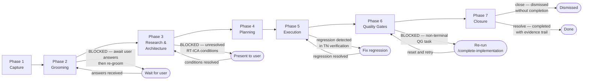
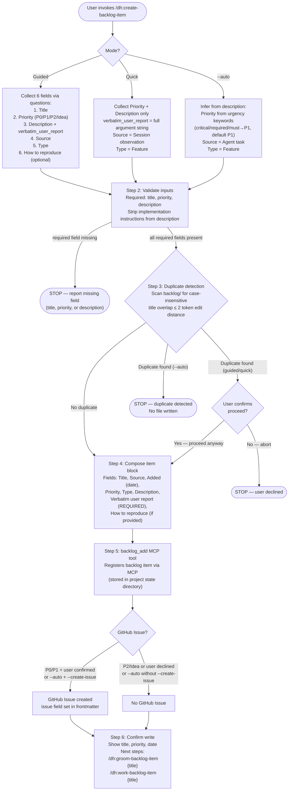
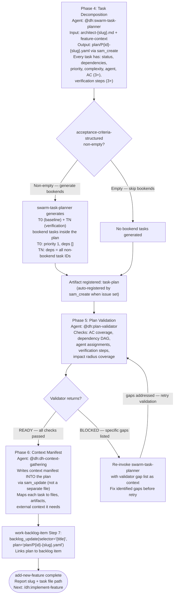
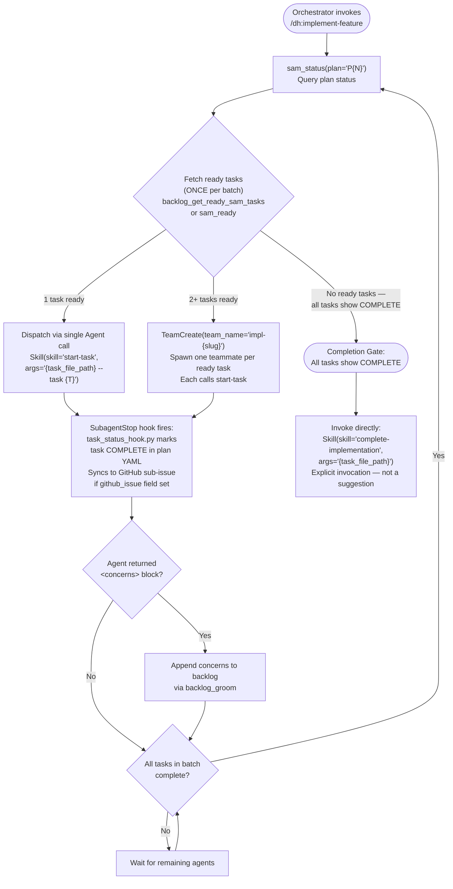
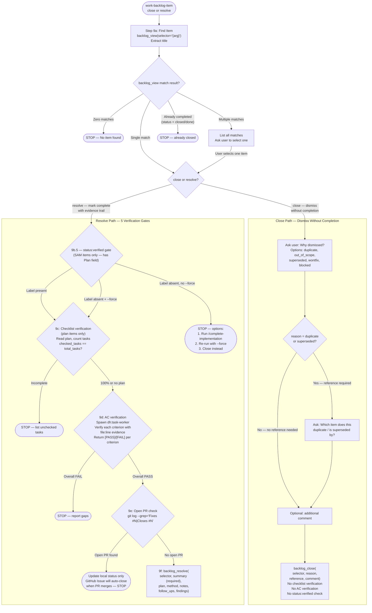

# Backlog Item End-to-End Lifecycle

**Purpose**: Authoritative process graph for the full journey of a backlog item — from idea capture through implementation, verification, and closure. This document connects the backlog management layer (item creation, grooming, research) to the SAM execution layer (planning, implementation, quality gates).

**Sources**:

- `plugins/development-harness/skills/create-backlog-item/SKILL.md`
- `plugins/development-harness/skills/groom-backlog-item/SKILL.md`
- `plugins/development-harness/skills/add-new-feature/SKILL.md`
- `plugins/development-harness/skills/work-backlog-item/SKILL.md`
- `plugins/development-harness/skills/implement-feature/SKILL.md`
- `plugins/development-harness/skills/start-task/SKILL.md`
- `plugins/development-harness/skills/complete-implementation/SKILL.md`
- `plugins/development-harness/docs/adr-9-close-resolve-semantics.md`

**Last verified**: 2026-05-27

## Governing Design Constraint: Context-Fit Complexity

This lifecycle is structured according to the [Context-Fit Complexity Model](./sdlc-layers/layer-0/context-fit-complexity.md). Phase boundaries, node contracts, and step granularity follow the model's core equation:

```text
Complexity = context required for (knowledge loading + uncertainty resolution + execution)
             relative to context available
```

**How to read node contracts through the context-fit lens:**

- **Inputs column** = the knowledge payload the agent must load. When inputs come from a single prior node, the knowledge is already in scope — zero-overhead execution. When inputs require 5 artifacts from 3 sources, the knowledge payload is large — candidate for scale-out.
- **Outputs column** = what persists as durable findings for downstream consumption. Transient context (intermediate research, failed attempts, verbose logs) should be garbage-collected — only the durable output survives.
- **Edge Conditions column** = the uncertainty resolution gate. Each condition is an observable fact that determines the next node. When all conditions are AVAILABLE, uncertainty cost is zero. When conditions require tool verification, uncertainty adds to the context budget.

**Optimization principle:** When adjacent nodes share the same knowledge payload, combining them reduces handoff overhead without increasing complexity. When a single node's knowledge payload exceeds comfortable working context, slicing at knowledge-boundary seams produces subtasks that each fit. The goal is context-fit right-sizing — not minimum steps, not maximum parallelism, but each agent receiving exactly the context it needs to act reliably.

**Why:** "Stateless" in SAM (Stateless Agent Methodology) means each agent receives complete context, acts, and terminates. The context-fit model formalizes what "complete context" means. This lifecycle document is the map of how that context flows from idea to implementation. Optimizing the lifecycle means finding better context fits so fewer steps are needed to reach implementation.

### Knowledge Reuse vs Knowledge Gathering

Every lifecycle execution generates knowledge — codebase patterns discovered during grooming, architecture decisions made during planning, domain constraints surfaced during research. The context-fit optimization question for each piece of knowledge is: should it be gathered fresh each time, or stored for retrieval by relationship?

**Gathered knowledge** is discovered by agents during execution — file reads, web searches, codebase analysis. It costs context budget every time. It is always fresh but always expensive.

**Stored knowledge** lives in a persistent graph — the groomed item's sections, the architect spec, the artifact manifest, the backlog item's dependencies and cross-references. It costs retrieval by key or relationship, not discovery. It can go stale but is cheap to access.

**The optimization:**

- When the same knowledge is gathered by multiple agents across multiple items (e.g., "what testing framework does this project use?", "what is the module boundary for backlog_core?"), that knowledge is a candidate for the persistent graph. Store it once, retrieve by relationship.
- When knowledge is item-specific and changes between executions (e.g., "what files did the architect spec identify?", "what are the acceptance criteria for this task?"), it belongs in the artifact flow — passed as node contract Inputs, not stored globally.
- When knowledge is both reusable AND volatile (e.g., "what is the current state of the codebase?"), use progressive disclosure — store the stable structure, gather the volatile details on demand.

**Practical signals for what to store vs gather:**

- If a gathering agent runs the same Grep/Read pattern across 3+ items → store the result as a codebase-analysis artifact, reference by relationship
- If an agent needs domain context that was already produced by a prior phase of a different item → cross-reference via the artifact manifest, do not re-discover
- If the grooming swarm's fact-checker verifies the same claim across multiple items → store the verification as a reusable finding, not per-item
- If the swarm-task-planner makes the same decomposition pattern for similar features → extract the pattern as a template, not a one-off plan

The node contracts in this document support this: the Inputs column shows what knowledge each node needs. When that knowledge is the same across many executions of the same node, it belongs in the persistent graph. When it varies per execution, it belongs in the artifact flow.

---

> [!IMPORTANT]
> When provided a process map or Mermaid diagram, treat it as the authoritative procedure. Execute steps in the exact order shown, including branches, decision points, and stop conditions.
> A Mermaid process diagram is an executable instruction set. Follow it exactly as written: respect sequence, conditions, loops, parallel paths, and terminal states. Do not improvise, reorder, or skip steps. If any node is ambiguous or missing required detail, pause and ask a clarifying question before continuing.
> When interacting with a user, report before acting the interpreted path you will follow from the diagram, then execute.

---

## Overview

The following diagram is the authoritative procedure for backlog item phase overview. Execute steps in the exact order shown, including branches, decision points, and stop conditions.



Phases 3 and 4 both execute inside the `/dh:add-new-feature` skill (invoked by `/dh:work-backlog-item`). The skill runs 6 sequential phases: discovery, codebase analysis, architecture, task decomposition, plan validation, and context manifest.

Each phase produces artifacts stored via the three-primitive model defined in [Backend Providers](./backend-providers.md): Work Items (IssueBackend) for coordination state, Sub-items (TaskBackend) for SAM task orchestration, and Documents (DocumentBackend) for durable handoff content between phases.

---

## Phase 1: Item Capture

**Entry precondition**: User identifies a feature, bug, or chore worth tracking.

**Skill**: `/dh:create-backlog-item`

**Actor**: Orchestrator (guided/quick mode) or orchestrator in auto mode.

The following diagram is the authoritative procedure for Phase 1 — Item Capture (/dh:create-backlog-item). Execute steps in the exact order shown, including branches, decision points, and stop conditions.



### Node Contracts

| Node | Actor | Inputs | Outputs | Edge Conditions |
|------|-------|--------|---------|-----------------|
| P1_START | user | feature/bug/chore description | skill invocation | always → P1_MODE |
| P1_MODE | orchestrator | user args, `--auto` flag | mode selection | guided → P1_COLLECT_GUIDED, quick → P1_COLLECT_QUICK, `--auto` → P1_COLLECT_AUTO |
| P1_COLLECT_GUIDED | orchestrator | 6 user answers (title, priority, description, source, type, reproduction) | collected fields, `verbatim_user_report` | always → P1_VALIDATE |
| P1_COLLECT_QUICK | orchestrator | priority + description args | collected fields, `verbatim_user_report` = full argument string | always → P1_VALIDATE |
| P1_COLLECT_AUTO | orchestrator | description text | inferred fields (priority from keywords, source=Agent task, type=Feature) | always → P1_VALIDATE |
| P1_VALIDATE | orchestrator | collected fields | validated fields, stripped description | valid → P1_DEDUP, missing required field → STOP |
| P1_DEDUP | orchestrator | validated title, `backlog/` file listing | duplicate match result | duplicate + guided/quick → P1_CONFIRM, duplicate + auto → P1_STOP_DUP, no duplicate → P1_COMPOSE |
| P1_CONFIRM | user | duplicate item title | proceed/decline decision | yes → P1_COMPOSE, no → P1_STOP_DECLINE |
| P1_STOP_DUP | orchestrator | duplicate detection result | error report (no file written) | terminal |
| P1_STOP_DECLINE | orchestrator | user decline | error report | terminal |
| P1_COMPOSE | orchestrator | validated fields | item block (title, source, added, priority, type, description, verbatim_user_report, how_to_reproduce) | always → P1_ADD |
| P1_ADD | `backlog_add` MCP | item block | registered backlog item (project state managed by MCP server), `issue` field if created | always → P1_ISSUE |
| P1_ISSUE | orchestrator | priority, user preference, `--create-issue` flag | issue creation decision | P0/P1 + confirmed → P1_GH_CREATE, otherwise → P1_NO_GH |
| P1_GH_CREATE | `backlog_add` MCP | item fields | GitHub Issue number, `issue` frontmatter field | always → P1_DONE |
| P1_NO_GH | orchestrator | — | no issue created | always → P1_DONE |
| P1_DONE | orchestrator | item file path, title, priority | confirmation message, next-step suggestions | terminal |

**Strip implementation instructions from description** (Step 2): **Why:** Implementation instructions in the description contaminate the problem statement. Grooming and architecture phases need to understand WHAT is broken, not HOW to fix it. The `verbatim_user_report` preserves the original words — including any solution suggestions — for reference.

**Key fields**:

- `verbatim_user_report` — REQUIRED, never omitted. The exact user words from Question 3 (guided) or the full argument string (quick/auto). Never edited, summarized, or reformatted. **Why:** The verbatim report is the only field that captures the user's mental model unfiltered. When grooming reveals a misunderstanding between what the user asked for and what the agent interpreted, it is the arbiter of original intent.
- `how_to_reproduce` — optional. Omitted entirely from the MCP call if user skipped or no reproduction steps found.

**Canonical status after this phase**: `needs-grooming`

**Failure paths**:

- Missing required field (title, priority, description) — STOP, report field name.
- Duplicate detected in auto mode — STOP, no file written.
- `GITHUB_TOKEN` not set for P0/P1 issue creation — per-item file still written; issue creation skipped with error report.

**Transition to next phase**: Text suggestion only ("Next steps: Groom: /dh:groom-backlog-item {title}"). No automatic invocation. The transition from capture to grooming is entirely implied — a human or orchestrator must decide to invoke the next step. (Confirmed: audit Finding 9 Gap A.)

---

## Phase 2: Grooming

**Entry precondition**: Item has status `needs-grooming` and is selected for detail work.

**Skill**: `/dh:groom-backlog-item`

**Actor**: Orchestrator dispatches a parallel grooming swarm (team mode) or sequential agents (fallback mode).

The following diagram is the authoritative procedure for Phase 2 — Grooming (/dh:groom-backlog-item). Execute steps in the exact order shown, including branches, decision points, and stop conditions.

```mermaid
flowchart TD
    P2_START([Item selected for grooming]) --> P2_LIST["Step 1: backlog_list MCP<br>Filter items by scope argument"]
    P2_LIST --> P2_VALIDATE["Step 2: Validity Check<br>Run 4 sequential checks per item"]

    P2_VALIDATE --> P2_VALID{"C1: Is the job still valid?<br>Does this item still belong<br>in the backlog given current context?"}
    P2_VALID -->|"No — scope/priority/context changed"| P2_SKIP(["Report invalid — skip this item"])
    P2_VALID -->|"Yes — still belongs in backlog"| P2_DONE_CHECK{"C2: Evidence work already done?<br>git log + backlog_list_merged_prs + file read"}
    P2_DONE_CHECK -->|"Already done — evidence found"| P2_SKIP
    P2_DONE_CHECK -->|"Not done — no evidence"| P2_ISSUE_CHECK["C3: Check GitHub issue presence<br>Check metadata.issue or index link<br>(result does not affect routing)"]
    P2_ISSUE_CHECK --> P2_GROOMED_CHECK{"C4: Already groomed today?<br>groomed == today's date<br>AND all required sections present?"}
    P2_GROOMED_CHECK -->|"Yes — already groomed today<br>with all sections present"| P2_DRIFT["Step 2.5: Drift Check<br>Mode A: Plan Drift<br>Mode B: Grooming Drift<br>Then STOP — do not proceed to Step 3"]
    P2_GROOMED_CHECK -->|"No — not groomed today<br>or sections missing"| P2_EXTRACT["Step 3: Extract item details<br>title, description, research questions,<br>source, suggested_location"]

    P2_EXTRACT --> P2_RTICA_INIT["Step 3.5: RT-ICA Initial Snapshot<br>(Actor: orchestrator)<br>Categorize info as:<br>AVAILABLE / DERIVABLE / MISSING<br>using extracted item details only<br>Write via backlog_groom section='RT-ICA'"]

    P2_RTICA_INIT --> P2_SCOPE["Step 3.6: Scope Sizing<br>Choose: MINIMAL / NARROW /<br>STANDARD / FULL<br>Sizes the swarm agents"]

    P2_SCOPE --> P2_WAVE1

    subgraph P2_SWARM [Steps 4-8: Parallel Grooming Swarm]
        direction TB
        P2_WAVE1["Wave 1 (parallel):<br>• fact-checker teammate<br>• impact-analyst teammate<br>• classifier teammate"]
        P2_WAVE2["Wave 2 (blocked by Wave 1):<br>• rtica-assessor teammate<br>• alignment-analyst teammate"]
        P2_WAVE3["Wave 3 (blocked by Wave 2):<br>• groomer teammate"]
        P2_WAVE1 --> P2_WAVE2
        P2_WAVE2 --> P2_WAVE3
    end

    P2_WAVE3 --> P2_RTICA_FINAL["Step 8.5: RT-ICA Final Pass<br>(Actor: orchestrator or rtica-assessor)<br>Re-assess ALL conditions with full swarm output<br>Self-resolution pass: attempt tool-based resolution<br>for each MISSING/DERIVABLE condition<br>Replaces Step 3.5 snapshot"]

    P2_RTICA_FINAL --> P2_DECISION{RT-ICA result?}
    P2_DECISION -->|"APPROVED — all AVAILABLE<br>or DERIVABLE resolved"| P2_WRITE["Step 9: Write groomed content<br>via backlog_groom MCP calls<br>(one call per section, incremental)"]
    P2_DECISION -->|"BLOCKED — MISSING conditions<br>remain after self-resolution"| P2_BLOCKED(["STOP — batch all MISSING<br>conditions and present to user<br>Wait for user answers<br>Re-check after responses"])

    P2_WRITE --> P2_DONE["Set groomed frontmatter field<br>(YYYY-MM-DD date)<br>Sync to GitHub issue body<br>if issue exists"]
```



### Node Contracts

| Node | Actor | Inputs | Outputs | Edge Conditions |
|------|-------|--------|---------|-----------------|
| P2_START | orchestrator | item selector (title or `#N`) | skill invocation | always → P2_LIST |
| P2_LIST | `backlog_list` MCP | scope argument | filtered item list | always → P2_VALIDATE |
| P2_VALIDATE | orchestrator | item list | per-item validation sequence | always → P2_VALID (per item) |
| P2_VALID | orchestrator | item context, current backlog state | validity determination | invalid → P2_SKIP, valid → P2_DONE_CHECK |
| P2_DONE_CHECK | orchestrator | `git log`, `backlog_list_merged_prs`, file reads | already-done evidence | done → P2_SKIP, not done → P2_ISSUE_CHECK |
| P2_ISSUE_CHECK | orchestrator | `metadata.issue` field, index link | GitHub issue presence | always → P2_GROOMED_CHECK |
| P2_GROOMED_CHECK | orchestrator | `groomed` frontmatter field, required section presence | groomed-today determination | groomed today → P2_DRIFT, not groomed → P2_EXTRACT |
| P2_SKIP | orchestrator | validity/done-check result | skip report | terminal (for this item) |
| P2_DRIFT | orchestrator | plan state, groomed content, codebase state | drift report (Mode A or B) | terminal (STOP — do not proceed to Step 3) |
| P2_EXTRACT | orchestrator | item file content | title, description, research questions, source, suggested_location | always → P2_RTICA_INIT |
| P2_RTICA_INIT | orchestrator | extracted item details only (Wave 1 sections not yet produced) | AVAILABLE/DERIVABLE/MISSING categorization written via `backlog_groom(section='RT-ICA')` | always → P2_SCOPE |
| P2_SCOPE | orchestrator | RT-ICA distribution (AVAILABLE/DERIVABLE/MISSING counts) | scope size (MINIMAL/NARROW/STANDARD/FULL) | always → P2_SWARM |
| P2_WAVE1 | `fact-checker` + `impact-analyst` + `classifier` (parallel teammates) | item description, codebase state, primary sources | Fact-Check Summary via `backlog_groom(section='Fact-Check')`, Impact Radius via `backlog_groom(section='Impact Radius')`, Issue Classification via `backlog_groom(section='Issue Classification')` | all complete → P2_WAVE2 |
| P2_WAVE2 | `rtica-assessor` + `alignment-analyst` (parallel teammates) | Wave 1 outputs, item details | RT-ICA reassessment, Design Intent Alignment via `backlog_groom(section='Design Intent Alignment')` | all complete → P2_WAVE3 |
| P2_WAVE3 | `groomer` teammate | all prior sections | Reproducibility, Priority, Impact, Benefits, Expected Behavior, AC, Files, Resources, Dependencies, Effort — each via `backlog_groom(section='{name}')` | complete → P2_RTICA_FINAL |
| P2_RTICA_FINAL | orchestrator or `rtica-assessor` | full swarm output, all groomed sections | final RT-ICA assessment (replaces P2_RTICA_INIT snapshot), self-resolution attempts | always → P2_DECISION |
| P2_DECISION | orchestrator | RT-ICA final result | APPROVED or BLOCKED determination | APPROVED → P2_WRITE, BLOCKED → P2_BLOCKED |
| P2_WRITE | `backlog_groom` MCP (multiple calls) | groomed sections content | per-section writes to item file | always → P2_DONE |
| P2_BLOCKED | orchestrator | MISSING conditions list | user-facing report of unresolved conditions | terminal (wait for user answers) |
| P2_DONE | `backlog_groom` MCP | groomed date | `groomed` frontmatter field (YYYY-MM-DD), GitHub issue body sync | terminal |

**Swarm agents and their outputs**:

- **fact-checker** (Wave 1) — Verifies item claims against primary sources. Produces `Fact-Check Summary` with VERIFIED/REFUTED/INCONCLUSIVE counts and citations. REFUTED claims become MISSING conditions in RT-ICA. INCONCLUSIVE become DERIVABLE. Writes via `backlog_groom(section="Fact-Check")`.
- **impact-analyst** (Wave 1) — Assesses blast radius. Writes via `backlog_groom(section="Impact Radius")`.
- **classifier** (Wave 1) — Classifies the issue type using a 5-branch decision tree (procedural, recurring-pattern, defect, missing-guardrail, unbounded-design). No blocking dependencies. Writes via `backlog_groom(section="Issue Classification")`. For `defect` items, also produces a Root-Cause Analysis section via the find-cause skill. For `recurring-pattern` items, runs frequency analysis against resolved items via `backlog_list`.
- **rtica-assessor** (Wave 2) — Runs RT-ICA analysis with swarm context. Blocked by fact-checker and impact-analyst completion.
- **alignment-analyst** (Wave 2) — Compares existing implementation against the item's design intent (Description field). Samples affected systems from the Impact Radius section. Produces: Alignment assessment (ALIGNED | DIVERGENT | NOT_APPLICABLE), divergences table (Area, Expected, Actual, Severity, File), and summary counts. Writes via `backlog_groom(section="Design Intent Alignment")`. Blocked by impact-analyst completion.
- **groomer** (Wave 3) — Reads all prior sections. Produces: Reproducibility, Priority, Impact, Benefits, Expected Behavior, Acceptance Criteria, Files, Resources, Dependencies, Effort. Each subsection written individually via `backlog_groom(section="{subsection name}")`.

**RT-ICA runs twice**: Step 3.5 (initial snapshot, item-level info only) and Step 8.5 (final pass, full swarm output). The Step 8.5 result replaces the Step 3.5 snapshot in the item file (same `section="RT-ICA"` call overwrites). **Why:** The initial snapshot calibrates swarm intensity — scope sizing (Step 3.6) uses the AVAILABLE/DERIVABLE/MISSING distribution to choose swarm intensity. The final pass incorporates swarm discoveries (fact-check results convert DERIVABLE to AVAILABLE, refuted claims convert AVAILABLE to MISSING).

**Metadata written**: `groomed` frontmatter field set to `YYYY-MM-DD` (not nested under `metadata.`). This field records when grooming occurred and is distinct from the item's status field.

**Status advancement via `mark_groomed`**: Passing `mark_groomed=True` to the `backlog_groom` MCP tool triggers a status transition after all content writes complete:

1. The item's `metadata.status` field is set to `groomed` in the local per-item file.
2. When the active backend is `github`: the `status:needs-grooming` GitHub label is removed from the issue (no-op if already absent — it is removed as a side effect of each content sync, so it may already be gone). For other backends, the equivalent status field is cleared in the backend store.
3. When the active backend is `github`: the `status:groomed` GitHub label is added to the issue; if the label does not exist on the repository, it is created automatically. For other backends, the equivalent `groomed` status marker is applied in the backend store.

The flag works with both single-section writes and the batch `sections` parameter. When `sections` is used with `mark_groomed=True`, all sections are written first; the status transition fires exactly once after the batch completes.

**Idempotent**: Calling `backlog_groom` with `mark_groomed=True` multiple times is safe. If `status:groomed` is already present on the issue, the GitHub label update is skipped entirely. If `status:needs-grooming` was already removed, the removal is a no-op.

**Error handling**: If the GitHub label transition fails, the local frontmatter update still applies and a warning is recorded in the result. Content writes are not affected.

**Re-lookup failure**: After content is written, `groom_item` re-parses the backlog to locate the item by selector before advancing status. If this re-lookup returns `None` (e.g., selector ambiguity after a title change during content write), the status advance is skipped. The response contains `mark_groomed_skipped: true` and a human-readable `mark_groomed_skip_reason` that includes the selector and indicates the item was not found in the re-parsed backlog. A warning is also emitted. The caller must check for `mark_groomed_skipped` in the result dict and re-run the `backlog_groom` call if the status advance is required.

**When to use**: Pass `mark_groomed=True` on the final `backlog_groom` call when all required sections have been written and the item is approved for planning. Using the `sections` parameter to write all sections in a single call combined with `mark_groomed=True` is the recommended pattern — it writes all content and advances the status atomically.

**Failure paths**:

- Validity check fails (C1-C4) — item skipped with report.
- RT-ICA BLOCKED — STOP, present MISSING conditions to user, wait for answers.
- Advisory AC overlap check: `_check_ac_overlap()` in `operations.py` issues a non-blocking warning when the Acceptance Criteria section is written and the description already contains checkbox items or acceptance headers (`## Acceptance`, `### Acceptance Criteria`). This fires for both single-section and batch `sections` writes.

**Transition to next phase**: No explicit invocation of the next skill. The groomed item is available for `/dh:work-backlog-item` to pick up. Transition from grooming to milestone grouping is not mentioned (audit Finding 9 Gap B).

**Recommended completeness check before Phase 3**: The RT-ICA presence check in `work-backlog-item` Step 4 does not verify full grooming completeness. The recommended approach before entering Phase 3 is to verify presence of the RT-ICA section AND the Acceptance Criteria section AND the Description section. An item missing acceptance criteria would enter planning with incomplete information, producing a plan that cannot be validated against its own acceptance criteria.

---

## Phase 3: Research and Architecture

**Entry precondition**: Item is groomed. `/dh:work-backlog-item` has been invoked, which performs an RT-ICA checkpoint (Step 4) and composes a feature request (Step 5) before invoking `/dh:add-new-feature` via `Skill()` call (Step 6).

**Skill**: `/dh:add-new-feature` (Phases 1-3 of 6 internal phases)

**Actor**: Orchestrator invokes `/dh:add-new-feature`; each internal phase delegates to a specialist agent sequentially.

Phases 3 and 4 of the lifecycle both execute inside `/dh:add-new-feature`. The skill runs 6 sequential phases internally: Pre-Phase (artifact discovery), Phase 1 (feature research), Phase 2 (codebase analysis), Phase 3 (architecture), Phase 4 (task decomposition), Phase 5 (plan validation), Phase 6 (context manifest).

The following diagram is the authoritative procedure for Phase 3 — Research and Architecture (/dh:work-backlog-item through /dh:add-new-feature Phases 1-3). Execute steps in the exact order shown, including branches, decision points, and stop conditions.

```mermaid
flowchart TD
    P3_RTICA_CHECK(["work-backlog-item Step 4:<br>RT-ICA Checkpoint"]) --> P3_RTICA_PRESENT{"RT-ICA summary<br>present in groomed content?"}
    P3_RTICA_PRESENT -->|"Present — reuse existing"| P3_RTICA_USE["Use existing RT-ICA"]
    P3_RTICA_PRESENT -->|"Absent — run inline"| P3_RTICA_RUN["Perform RT-ICA inline<br>(4-step: goal, prerequisites,<br>availability, decision)"]
    P3_RTICA_USE --> P3_RTICA_GATE{RT-ICA decision?}
    P3_RTICA_RUN --> P3_RTICA_GATE
    P3_RTICA_GATE -->|BLOCKED| P3_BLOCKED(["STOP — present unresolved<br>conditions to user<br>Do not invoke add-new-feature"])
    P3_RTICA_GATE -->|APPROVED| P3_COMPOSE["work-backlog-item Step 5:<br>Compose feature request<br>Carry DERIVABLE items as<br>'Assumptions to confirm'"]
    P3_COMPOSE --> P3_INVOKE["work-backlog-item Step 6:<br>Skill(skill='add-new-feature',<br>args='{composed feature request}')<br>Direct skill call — not a suggestion"]

    P3_INVOKE --> P3_ARTIFACT_DISCOVER{"Pre-Phase:<br>Artifact Discovery<br>artifact_list(item_id=N)<br>Existing artifacts?"}
    P3_ARTIFACT_DISCOVER -->|"Artifacts exist —<br>inject into delegation prompts"| P3_ARTIFACT_APPEND["Append prior_artifacts block<br>to each phase delegation prompt"]
    P3_ARTIFACT_DISCOVER -->|"No artifacts —<br>start fresh"| P3_RESEARCH
    P3_ARTIFACT_APPEND --> P3_RESEARCH

    P3_RESEARCH["Phase 1: Feature Research<br>Agent: @dh:feature-researcher<br>Output: plan/feature-context-{slug}.md<br>Constraint: WHAT/WHY only — no HOW<br>Artifact registered: feature-context"]

    P3_RESEARCH --> P3_CODEBASE{"Phase 2: Codebase Analysis<br>Does feature-context reference unfamiliar<br>patterns, unknown architecture, or<br>untested conventions?<br>Agent: @dh:codebase-analyzer"}
    P3_CODEBASE -->|"Yes — unknown patterns<br>or conventions present"| P3_CODEBASE_OUT["Output: plan/codebase/{FOCUS}.md<br>per focus area<br>Constraint: WHAT exists today only<br>Artifact registered: codebase-analysis"]
    P3_CODEBASE -->|"No — patterns already<br>captured in feature-context"| P3_ARCHITECT
    P3_CODEBASE_OUT --> P3_ARCHITECT

    P3_ARCHITECT["Phase 3: Architecture Design<br>Agent: resolved from language manifest<br>(pyproject.toml → @python3-development:python-cli-design-spec)<br>Input: feature-context + optional codebase analysis<br>Output: plan/architect-{slug}.md<br>Constraint: HOW only — interfaces, contracts, models<br>Artifact registered: architect"]
```



### Node Contracts

| Node | Actor | Inputs | Outputs | Edge Conditions |
|------|-------|--------|---------|-----------------|
| P3_RTICA_CHECK | orchestrator (`work-backlog-item` Step 4) | groomed item content | RT-ICA checkpoint invocation | always → P3_RTICA_PRESENT |
| P3_RTICA_PRESENT | orchestrator | groomed content sections | RT-ICA presence determination | present → P3_RTICA_USE, absent → P3_RTICA_RUN |
| P3_RTICA_USE | orchestrator | existing RT-ICA section content | RT-ICA decision (APPROVED/BLOCKED) | always → P3_RTICA_GATE |
| P3_RTICA_RUN | orchestrator | item details (goal, prerequisites, availability) | inline RT-ICA assessment | always → P3_RTICA_GATE |
| P3_RTICA_GATE | orchestrator | RT-ICA decision | gate result | BLOCKED → P3_BLOCKED, APPROVED → P3_COMPOSE |
| P3_BLOCKED | orchestrator | MISSING conditions list | user-facing report, skill NOT invoked | terminal |
| P3_COMPOSE | orchestrator (`work-backlog-item` Step 5) | groomed item, DERIVABLE items | composed feature request with 'Assumptions to confirm' | always → P3_INVOKE |
| P3_INVOKE | orchestrator (`work-backlog-item` Step 6) | composed feature request | `Skill()` call to `add-new-feature` | always → P3_ARTIFACT_DISCOVER |
| P3_ARTIFACT_DISCOVER | `artifact_list` MCP | `item_id` | existing artifact manifest (or empty) | artifacts exist → P3_ARTIFACT_APPEND, none → P3_RESEARCH |
| P3_ARTIFACT_APPEND | orchestrator | artifact manifest | `prior_artifacts` block added to delegation prompts | always → P3_RESEARCH |
| P3_RESEARCH | `@dh:feature-researcher` | composed feature request, prior artifacts (if any) | `plan/feature-context-{slug}.md`, `artifact_register(type='feature-context')` | always → P3_CODEBASE |
| P3_CODEBASE | orchestrator | feature context, codebase state | codebase analysis decision | invoked → P3_CODEBASE_OUT, skipped → P3_ARCHITECT |
| P3_CODEBASE_OUT | `@dh:codebase-analyzer` | focus areas (patterns, architecture, testing, conventions) | `plan/codebase/{FOCUS}.md` per focus, `artifact_register(type='codebase-analysis')` | always → P3_ARCHITECT |
| P3_ARCHITECT | language manifest agent (e.g. `@python3-development:python-cli-design-spec`) | feature context + optional codebase analysis | `plan/architect-{slug}.md`, `artifact_register(type='architect')` | terminal (continues to Phase 4) |

**Agent selection for architecture**: The skill does NOT hardcode `@python3-development:python-cli-design-spec`. It resolves the `design-spec` role from the language manifest at runtime based on project detection markers (`pyproject.toml` → Python, `package.json` → TypeScript, `Cargo.toml` → Rust, none → general-purpose fallback).

**Artifact registration**: Each phase calls `artifact_register` after writing its file, with `item_id`, `artifact_type`, `path` (state-relative), and `agent` fields.

**Storage**: Feature context and architecture specs are registered as Documents via the artifact manifest system. See [Backend Providers — SAM Storage Model](./backend-providers.md#sam-storage-model) for the document lifecycle.

**Artifact access is MCP-first**: Consumers retrieve artifacts via `artifact_read(item_id, artifact_type)` and register them via `artifact_register(item_id, artifact_type, path, agent, content)`. Task plans are accessed via `sam_read(plan, task)`. The MCP servers resolve storage internally — consumers never construct filesystem paths.

**No feasibility gate exists** between RT-ICA APPROVED and SAM planning invocation. The transition from "do we have enough information?" to "start planning" is direct — no assessment of technical feasibility, effort/value, risk, or alternative approaches (audit Finding 1).

---

## Phase 4: Planning

**Entry precondition**: Architecture document (`plan/architect-{slug}.md`) exists. Still inside `/dh:add-new-feature` (Phases 4-6 of 6 internal phases).

**Skill**: `/dh:add-new-feature` (Phases 4-6)

**Actor**: Orchestrator delegates to specialist agents sequentially.

The following diagram is the authoritative procedure for Phase 4 — Planning (/dh:add-new-feature Phases 4-6). Execute steps in the exact order shown, including branches, decision points, and stop conditions.



### Node Contracts

| Node | Actor | Inputs | Outputs | Edge Conditions |
|------|-------|--------|---------|-----------------|
| P4_DECOMPOSE | `@dh:swarm-task-planner` | `plan/architect-{slug}.md`, `plan/feature-context-{slug}.md` | `plan/P{id}-{slug}.yaml` via `sam_create`, tasks with status/deps/priority/complexity/agent/AC/verification | always → P4_BOOKEND |
| P4_BOOKEND | orchestrator | `acceptance-criteria-structured` field | bookend decision | non-empty → P4_BOOKEND_GEN, empty → P4_NO_BOOKEND |
| P4_BOOKEND_GEN | `@dh:swarm-task-planner` | structured acceptance criteria | T0 task (priority 1, deps=[]) + TN task (deps=all non-bookend IDs) inside plan | always → P4_REGISTER |
| P4_NO_BOOKEND | orchestrator | — | no bookend tasks | always → P4_REGISTER |
| P4_REGISTER | `sam_create` MCP (auto-registration) | plan YAML, issue number | `artifact_register(type='task-plan')` | always → P4_VALIDATE |
| P4_VALIDATE | `@dh:plan-validator` | plan YAML | READY or BLOCKED with specific gap list | always → P4_VAL_RESULT |
| P4_VAL_RESULT | orchestrator | validator output | routing decision | READY → P4_CONTEXT, BLOCKED → P4_FIX |
| P4_FIX | orchestrator | validator BLOCKED output with gap list | re-invoke `swarm-task-planner` with gap context | loops back to P4_DECOMPOSE |
| P4_CONTEXT | `@dh:dh-context-gathering` | plan YAML, codebase state, artifact manifest | context manifest written into plan via `sam_update` | always → P4_LINK |
| P4_LINK | `backlog_update` MCP | item selector (title), plan path | `plan` field linked on backlog item, `status` → `in-progress` | always → P4_DONE |

> **Quick-path exception**: When the fix arrives via the Proactive Fix Gate (--quick), the SAM plan
> slug is `quick-{slug}` with a single T1 task (complexity=low). The state machine transition
> (`groomed → in-progress` or `needs-grooming → in-progress` when the item was created inline by
> quick/start.md Step 2) occurs during quick-path execution, not at Step 7 of the full
> work-backlog-item pipeline.

| P4_DONE | orchestrator | slug, task file path | completion report, next-step instruction (`/dh:implement-feature`) | terminal |

**Storage**: The SAM plan is created via `sam_create`, which maps to TaskBackend operations (Work Item for the plan, Sub-items for tasks). See [Backend Providers — TaskBackend Protocol](./backend-providers.md#taskbackend-protocol-912--to-be-created).

**plan-validator returns READY or BLOCKED** (not PASS/BLOCKED as previously documented). BLOCKED includes specific gaps that must be fixed before retrying.

**T0 baseline is a bookend task during EXECUTION, not during planning**. The `swarm-task-planner` generates T0 and TN as tasks inside `P{id}-{slug}.yaml` with appropriate priority and dependency settings. They dispatch automatically during execution via normal SAM readiness ordering — T0 fires first (priority 1, no deps), TN fires last (depends on all implementation tasks). No special handling is needed in the dispatch loop.

**context-gathering writes into the plan YAML** via `sam_update`, not to a separate file. The plan file path remains `~/.dh/projects/{project-slug}/plan/P{id}-{slug}.yaml`.

**Status advance**: `backlog_update(selector="{title}", plan="plan/P{id}-{slug}.yaml")` links the SAM plan file to the GitHub issue. The `status` field transition to `in-progress` happens via `work-backlog-item` Step 7. For the quick-path case, see the Quick-path exception note in the P4_LINK row above.

**Failure paths**:

- plan-validator returns BLOCKED — re-run Phase 4 (task decomposition) to fix gaps before retrying Phase 5.
- No specific fix protocol is defined for BLOCKED plans beyond "fix the identified gaps." The recommended approach is to re-invoke `swarm-task-planner` with the validator's BLOCKED output (listing specific gaps) as additional context, so the planner can address each gap directly rather than regenerating from scratch.

---

## Phase 5: Execution

**Entry precondition**: SAM plan exists and is linked to the backlog item. `/dh:add-new-feature` has completed.

**Skill**: `/dh:implement-feature`

**Actor**: Orchestrator runs the dispatch loop; specialist agents execute individual tasks via `/dh:start-task`.

The following diagram is the authoritative procedure for Phase 5 — Execution (/dh:implement-feature). Execute steps in the exact order shown, including branches, decision points, and stop conditions.



### Node Contracts

| Node | Actor | Inputs | Outputs | Edge Conditions |
|------|-------|--------|---------|-----------------|
| P5_START | orchestrator | task file path (from P4_DONE) | skill invocation | always → P5_STATUS |
| P5_STATUS | `sam_status` MCP | plan address `P{N}` | plan status summary (per-task states) | always → P5_READY |
| P5_READY | `backlog_get_ready_sam_tasks` or `sam_ready` MCP | plan address | list of ready tasks (deps resolved, not claimed) | none ready + all terminal → P5_COMPLETE, 1 ready → P5_DISPATCH_SINGLE, 2+ ready → P5_DISPATCH_TEAM |
| P5_DISPATCH_SINGLE | orchestrator | task file path, task ID | `Skill('start-task', args)` call | always → P5_HOOK |
| P5_DISPATCH_TEAM | orchestrator | task file path, ready task IDs | `TeamCreate` with one teammate per task, each calls `start-task` | always → P5_HOOK |
| P5_HOOK | `task_status_hook.py` (SubagentStop) | agent completion signal, active-task context file | task status → COMPLETE in plan YAML, GitHub sub-issue sync | always → P5_CONCERNS |
| P5_CONCERNS | orchestrator | agent output | concerns block presence check | concerns present → P5_LOG_CONCERNS, none → P5_BATCH_CHECK |
| P5_LOG_CONCERNS | `backlog_groom` MCP | concerns text | concerns appended to backlog item | always → P5_BATCH_CHECK |
| P5_BATCH_CHECK | orchestrator | batch task states | batch completion check | all complete → P5_STATUS (loop), incomplete → P5_WAIT |
| P5_WAIT | orchestrator | running agent handles | agent completion signals | agent completes → P5_BATCH_CHECK |
| P5_COMPLETE | orchestrator | `sam_status` showing all COMPLETE | completion gate passed | always → P5_INVOKE_QG |
| P5_INVOKE_QG | orchestrator | task file path | `Skill('complete-implementation', args)` call | terminal (enters Phase 6) |

**start-task internal procedure** (Actor: specialist agent):

1. `sam_read(plan="P{N}", task="T{M}")` — returns `TaskAssignment` JSON
2. Optionally discovers plan artifacts via `artifact_list` + `artifact_read`
3. Selects task (from `--task` argument or first `not-started` with resolved deps)
4. Loads task-level skills via `Skill(skill="{skill-name}")` for each name in `task.skills`
5. `sam_claim(plan="P{N}", task="T{M}")` — if `claimed: false`, STOP (do not implement). **Storage**: Task claiming uses atomic `sam_claim` which maps to TaskBackend's `claim_task` — an atomic conditional write preventing concurrent claims. See [Backend Providers — TaskBackend Protocol](./backend-providers.md#taskbackend-protocol-912--to-be-created).
6. Writes active-task context file to `~/.dh/projects/{project-slug}/context/active-task-{CLAUDE_CODE_SESSION_ID}.json` (required for hook-driven updates)
7. Implements against acceptance criteria and verification steps
8. Commits (prohibition on `Fixes #N` trailers — only `/dh:complete-implementation` Final Step may include these)

**Hook mechanisms**:

- `SubagentStop` hook (on `/dh:implement-feature`) — marks task COMPLETE after sub-agent finishes, syncs to the backend sub-issue (GitHub issue number when using `github` backend; beads child-issue ID when using `beads` backend)
- `PostToolUse` hook (on `/dh:start-task`, matcher: Write|Edit|Bash) — records `last-activity` timestamp on every tool call during task execution. Uses the active-task context file to know which task to update.

**Bookend task dispatch**:

- T0 dispatches first (priority 1, no dependencies) — runs `t0-baseline-capture` agent, writes `T0-baseline-{slug}.yaml`
- TN dispatches last (depends on all non-bookend tasks) — runs `tn-verification-gate` agent, writes `TN-verification-{slug}.yaml`
- Both write to `~/.dh/projects/{project-slug}/plan/`
- When parent story issue number is known, `artifact_register` instructions are added to bookend task delegation prompts

**complete-implementation is explicitly invoked** when all tasks show COMPLETE. The skill uses `Skill(skill="complete-implementation", args="{task_file_path}")` — a direct invocation, not a text suggestion.

**BLOCKED task handling**: NOT FOUND in source. Neither `implement-feature` nor `start-task` documents an explicit procedure for BLOCKED tasks. The completion gate triggers only when all tasks are COMPLETE. No documented escalation path or loop-exit condition for BLOCKED tasks exists in these skill files.

**Recommended BLOCKED task escalation**: When `sam_status` shows tasks in BLOCKED state after multiple dispatch cycles with no progress, the recommended approach is for the orchestrator to escalate to the user with: the blocked task list, each task's blocking reason (from the task body or status output), and a request for direction. The dispatch loop should not spin indefinitely on BLOCKED tasks — if a full dispatch cycle produces no state changes (no tasks transition from BLOCKED to another state), the orchestrator should break the loop and report. This guidance is not currently codified in the skill files; it is a documented recommendation for orchestrator behavior.

**Failure paths**:

- `sam_claim` returns `claimed: false` — agent stops, does not implement (another agent is running this task)
- TN verification with `status: regressed` on any criterion — detected in Phase 6 pre-phase, not in the execution loop itself

---

## Phase 6: Quality Gates

**Entry precondition**: All SAM execution tasks reach terminal status (COMPLETE).

**Skill**: `/dh:complete-implementation`

**Actor**: Orchestrator invokes the skill; it delegates to 6 specialist agents sequentially via start-task.

### Full Phase 6 Flow (Pre-Phases through Closure)

The following diagram is the authoritative procedure for Phase 6 — Quality Gates (/dh:complete-implementation). Execute steps in the exact order shown, including branches, decision points, and stop conditions.

```mermaid
flowchart TD
    P6_START(["/dh:complete-implementation invoked"]) --> P6_TN_CHECK{"Pre-Phase 1 — TN Verification Check<br>Read TN-verification-{slug}.yaml<br>Aggregate — FAIL if any record<br>has status = regressed"}
    P6_TN_CHECK -->|"Any regressed"| P6_TN_BLOCK(["STOP — list each criterion<br>with check_command, T0/TN stdout<br>Block completion"])
    P6_TN_CHECK -->|"All passed or file absent"| P6_ARTIFACT_DISCOVER

    P6_ARTIFACT_DISCOVER["Pre-Phase 1a: Artifact Discovery<br>artifact_list(item_id=N)<br>when parent issue number is known<br>Pass manifest to QG agents"]

    P6_ARTIFACT_DISCOVER --> P6_CONCERNS{"Pre-Phase 1b: Process Concerns<br>backlog_view — does item have<br>## Concerns section with<br>unchecked items?"}
    P6_CONCERNS -->|"Unchecked concerns exist"| P6_CONCERNS_VERIFY["For each concern:<br>Verify by reading file/running check<br>If verified: check off + create backlog item<br>If not verified: check off as 'Not confirmed'<br>Update via backlog_groom section='Concerns'"]
    P6_CONCERNS -->|"No concerns section<br>or all checked"| P6_QG_CREATE
    P6_CONCERNS_VERIFY --> P6_QG_CREATE

    P6_QG_CREATE{"Check for existing QG plan<br>sam_list(search='qg-{slug}')<br>Result?"}
    P6_QG_CREATE -->|"No existing plan"| P6_QG_BUILD["build_quality_gate_plan(<br>slug, issue, impl_plan_address)<br>from sam_schema.core.quality_gates<br><br>sam_create(slug='qg-{slug}',<br>goal='Quality gate enforcement',<br>tasks=[...], issue)"]
    P6_QG_CREATE -->|"Existing plan —<br>some tasks remain non-terminal"| P6_QG_RESET["Reset BLOCKED tasks to not-started<br>via sam_state per task<br>Re-enter dispatch loop"]
    P6_QG_CREATE -->|"Existing plan —<br>all tasks terminal"| P6_VERIFY_GATE

    P6_QG_BUILD --> P6_CLAIM
    P6_QG_RESET --> P6_CLAIM

    subgraph P6_LOOP [SAM Dispatch Loop]
        P6_CLAIM["sam_claim + start-task<br>per ready task"] --> P6_T1
        P6_T1["T1: code-reviewer<br>Deps: none"]
        P6_T1 -->|complete| P6_T2["T2: feature-verifier<br>Deps: T1"]
        P6_T2 -->|complete| P6_T3["T3: integration-checker<br>Deps: T2"]
        P6_T3 -->|complete| P6_T4["T4: doc-drift-auditor<br>Deps: T3"]
        P6_T4 --> P6_T4_DRIFT{"T4 output:<br>## Findings section<br>contains drift?"}
        P6_T4_DRIFT -->|"Drift found"| P6_T5["T5: service-docs-maintainer<br>Deps: T4"]
        P6_T4_DRIFT -->|"No drift —<br>'No documentation drift detected'<br>or empty findings"| P6_SKIP_T5["sam_state(plan, task='T5',<br>status='skipped')"]
        P6_T5 --> P6_T6["T6: context-refinement<br>Deps: T5"]
        P6_SKIP_T5 --> P6_T6
    end

    P6_LOOP --> P6_VERIFY_GATE{"Completion Verification Gate<br>sam_status(plan='{QG}')<br>All 6 tasks terminal?"}
    P6_VERIFY_GATE -->|"All complete/skipped<br>(only T5 may be skipped)"| P6_FOLLOWUP
    P6_VERIFY_GATE -->|"Any non-terminal<br>or unauthorized skip"| P6_BLOCKED(["COMPLETION BLOCKED<br>Report failed tasks<br>To resume: re-run<br>/complete-implementation"])

    P6_FOLLOWUP["Recursive Follow-up Detection<br>Detect follow-up files from<br>T1 ARTIFACTS output or glob:<br>P*-{slug}-followup-*.yaml"]
    P6_FOLLOWUP --> P6_DETECT{"Follow-up files found?"}
    P6_DETECT -->|"No follow-up files"| P6_APPLY_VERIFIED
    P6_DETECT -->|"Follow-up files exist"| P6_ROUTE["For each follow-up:<br>1. Derive search slug from filename<br>2. Search backlog via backlog_list<br>3. If match: backlog_update with plan<br>4. If no match: create-backlog-item --auto"]

    P6_ROUTE --> P6_DEPTH_GUARD{depth >= 5?}
    P6_DEPTH_GUARD -->|"Yes — limit reached"| P6_DEPTH_STOP["RECURSION DEPTH LIMIT REACHED<br>Route remaining to backlog"]
    P6_DEPTH_GUARD -->|"No — continue"| P6_RTCA_GUARD{BLOCKED-FOR-PLANNING?}
    P6_RTCA_GUARD -->|"Yes — blocked"| P6_RTCA_STOP["RECURSION STOPPED — RT-ICA BLOCKED<br>Resume: /dh:work-backlog-item"]
    P6_RTCA_GUARD -->|"No — proceed"| P6_RECURSE{"Recursion gate:<br>BOTH conditions required<br>1. follow-up slug matches parent (ADR-3)<br>2. follow-up priority = High (ADR-2)"}
    P6_RECURSE -->|"Both conditions met"| P6_RECURSE_IMMEDIATE["Recurse immediately:<br>Skill('implement-feature', followup)<br>Then re-run complete-implementation"]
    P6_RECURSE -->|"Either condition not met"| P6_DEFER(["Defer follow-up<br>Output: 'to resume:<br>/dh:work-backlog-item &lt;title&gt;'"])

    P6_RECURSE_IMMEDIATE --> P6_APPLY_VERIFIED
    P6_DEFER --> P6_APPLY_VERIFIED

    P6_APPLY_VERIFIED["Apply status:verified label<br>backlog_update(selector, verified=True)"]
    P6_APPLY_VERIFIED --> P6_FINAL["Final commit and push<br>Read resolved issue Concerns: surface active entries<br>Final Handoff Output:<br>'Clear context and run:<br>/dh:work-backlog-item &lt;next-item&gt;'"]
```



### Node Contracts

| Node | Actor | Inputs | Outputs | Edge Conditions |
|------|-------|--------|---------|-----------------|
| P6_START | orchestrator | task file path (from P5_INVOKE_QG) | skill invocation | always → P6_TN_CHECK |
| P6_TN_CHECK | orchestrator | `TN-verification-{slug}.yaml` | aggregated TN result (pass/regressed) | any regressed → P6_TN_BLOCK, all passed or file absent → P6_ARTIFACT_DISCOVER |
| P6_TN_BLOCK | orchestrator | per-criterion regression details (check_command, T0/TN stdout) | regression report | terminal (blocks completion) |
| P6_ARTIFACT_DISCOVER | `artifact_list` MCP | `item_id` | artifact manifest for QG agents | always → P6_CONCERNS |
| P6_CONCERNS | `backlog_view` MCP | item selector | `## Concerns` section with unchecked items | unchecked concerns → P6_CONCERNS_VERIFY, no concerns → P6_QG_CREATE |
| P6_CONCERNS_VERIFY | orchestrator | unchecked concern items | per-concern: verified → backlog item created, not verified → checked off as 'Not confirmed'; `backlog_groom(section='Concerns')` | always → P6_QG_CREATE |
| P6_QG_CREATE | `sam_list` MCP | `search='qg-{slug}'` | existing QG plan presence check | no plan → P6_QG_BUILD, plan with remaining tasks → P6_QG_RESET, all terminal → P6_VERIFY_GATE |
| P6_QG_BUILD | `build_quality_gate_plan()` + `sam_create` MCP | slug, issue, impl_plan_address | QG plan YAML (`qg-{slug}`) with 6 tasks | always → P6_LOOP |
| P6_QG_RESET | `sam_state` MCP (per task) | BLOCKED task IDs | tasks reset to `not-started` | always → P6_LOOP |
| P6_CLAIM | orchestrator | ready task IDs from QG plan | `sam_claim` + `start-task` per ready task | always → P6_T1 (first iteration) |
| P6_T1 | `code-reviewer` agent | implementation code, plan artifacts | code review output | complete → P6_T2 |
| P6_T2 | `feature-verifier` agent | T1 output, implementation, acceptance criteria | feature verification result | complete → P6_T3 |
| P6_T3 | `integration-checker` agent | T2 output, integration points | integration check result | complete → P6_T4 |
| P6_T4 | `doc-drift-auditor` agent | T3 output, documentation files, codebase | drift audit with `## Findings` section | always → P6_T4_DRIFT |
| P6_T4_DRIFT | orchestrator | T4 `## Findings` section content | drift presence determination | drift found → P6_T5, no drift → P6_SKIP_T5 |
| P6_T5 | `service-docs-maintainer` agent | T4 drift findings, documentation files | updated documentation | complete → P6_T6 |
| P6_SKIP_T5 | `sam_state` MCP | T5 task ID, `status='skipped'` | T5 marked skipped | always → P6_T6 |
| P6_T6 | `context-refinement` agent | T5 output (or skip), full QG context | refined context artifacts | complete → P6_VERIFY_GATE |
| P6_VERIFY_GATE | `sam_status` MCP | QG plan address | all-terminal check | all complete/skipped (T5 only) → P6_FOLLOWUP, non-terminal or unauthorized skip → P6_BLOCKED |
| P6_BLOCKED | orchestrator | failed task list | blocked report with resume instruction | terminal |
| P6_FOLLOWUP | orchestrator | QG plan state | follow-up routing decision | always → P6_DETECT |
| P6_DETECT | orchestrator | T1 ARTIFACTS output, glob `P*-{slug}-followup-*.yaml` | follow-up file list | always → P6_ROUTE |
| P6_ROUTE | orchestrator + `backlog_list` + `backlog_update` or `create-backlog-item` MCP | follow-up files, backlog state | follow-ups linked or created | always → P6_RECURSE |
| P6_DEPTH_GUARD | orchestrator | `{recursion_depth}`, `DH_RECURSIVE_REVIEW_TASK_DEPTH` (=5) | depth comparison result | depth >= 5 → P6_DEPTH_STOP; depth < 5 → P6_RTCA_GUARD |
| P6_DEPTH_STOP | orchestrator | in-scope follow-up titles, parent issue number, depth count | systemic design issue warning; `backlog_add` per remaining in-scope finding | terminal for recursion path |
| P6_RTCA_GUARD | orchestrator | plan artifact (BLOCKED-FOR-PLANNING signal) | RT-ICA status determination | BLOCKED → P6_RTCA_STOP; not BLOCKED → P6_RECURSE |
| P6_RTCA_STOP | orchestrator | blocking gaps from planner-rt-ica artifact, followup backlog item title | RT-ICA BLOCKED message with gap list and resume instruction | terminal for this follow-up; continues to next follow-up if any |
| P6_RECURSE | orchestrator | follow-up slug, follow-up priority, parent slug | recursion gate evaluation | slug matches parent AND priority=High → P6_RECURSE_IMMEDIATE, either not met → P6_DEFER |
| P6_RECURSE_IMMEDIATE | orchestrator | follow-up plan path | `Skill('implement-feature', followup)` then re-run `complete-implementation` | always → P6_APPLY_VERIFIED |
| P6_DEFER | orchestrator | follow-up title | deferred follow-up message | always → P6_APPLY_VERIFIED |
| P6_APPLY_VERIFIED | `backlog_update` MCP | item selector, `verified=True` | `status:verified` label applied to GitHub Issue | always → P6_RESOLVE |
| P6_RESOLVE | `backlog_resolve` MCP | item selector, summary | issue closed, item state → resolved | always → P6_FINAL |
| P6_FINAL | orchestrator | resolved issue number `#{N}` (from P6_RESOLVE) | final commit, push; Concerns block displayed if active entries present; slug-search routing output | active concerns → Concerns block + slug-search; no concerns or section absent → slug-search only; backend error → ⚠ warning + slug-search |

**Input modes**: The skill accepts either a plan file path (SAM path → 6-task QG) or an issue number (proportional path → 3-task QG when issue has no linked plan).

**Proportional Quality Gate path** (issue-only, no linked plan):

- 3 tasks: T1 code-reviewer, T2 test verification, T3 acceptance check
- Plan created via `build_proportional_quality_gate_plan(slug=f"issue-{N}", ...)` with `pqg-` prefix
- All 3 tasks required — no skip whitelist
- No recursive follow-up handling (explicitly skipped)
- `status:verified` applied directly via `backlog_update(selector="#{N}", verified=True)`

**T5 skip condition**: After T4 completes, orchestrator inspects T4 output for `## Findings` section. If "No documentation drift detected" or empty findings → skip T5 via `sam_state(status='skipped')`. Otherwise T5 proceeds. **Why:** Documentation update has no value when no drift exists. Other QG tasks (code review, feature verification, integration check) always have verification value even if the implementation is perfect — but running `service-docs-maintainer` on a codebase with no drift would produce no changes.

**Recursive follow-up routing** requires BOTH conditions: (1) the follow-up slug matches the parent feature slug (ADR-3), and (2) the follow-up priority is High (ADR-2). **Why:** Slug matching prevents unrelated bugs found during review from hijacking the current feature's quality gates. Priority gating prevents low-priority same-feature follow-ups from delaying completion.

**Depth guard**: The recursion counter `{recursion_depth}` is initialized to 0 at skill invocation and increments by 1 before each call to `implement-feature`. When `{recursion_depth}` reaches `DH_RECURSIVE_REVIEW_TASK_DEPTH = 5`, Guard 1 fires: all remaining in-scope follow-ups are routed to the backlog with a systemic design issue warning and recursion stops. The counter resets between separate `/complete-implementation` invocations — it is not persisted.

**RT-ICA BLOCKED stop**: Guard 2 checks whether the follow-up's linked planner-rt-ica artifact contains `BLOCKED-FOR-PLANNING`. If so, the follow-up is not recursed and the user receives the blocking conditions with a resume instruction: `/dh:work-backlog-item {title}`. Remaining follow-ups continue processing.

**Out-of-scope routing**: A follow-up task file with `## Scope: out-of-scope` is routed to the backlog via `backlog_add` at the Classify step (Step 3) and never reaches the recursion gate. This prevents out-of-scope findings from blocking the current implementation cycle.

**complete-implementation invokes `backlog_resolve` as its terminal step**. After quality gates pass, it: (1) applies `status:verified` label, (2) commits and pushes, (3) calls `backlog_resolve(selector, summary="Implementation complete — AC verified PASS")` to close the issue and transition to resolved. This closes the GitHub Issue (or equivalent per backend) without requiring manual follow-up. `/work-backlog-item resolve` remains available as a fallback if `complete-implementation` was interrupted before the resolve step.

**Failure paths**:

- TN regression detected — STOP, block completion with per-criterion details
- Any QG task non-terminal or unauthorized skip (skip on task other than T5) — COMPLETION BLOCKED, report failed tasks, user re-runs the skill
- BLOCKED tasks on resume are reset to `not-started` via `sam_state`, then loop re-enters

---

## Phase 7: Closure

**Entry precondition**: `status:verified` label applied (for SAM items via `/dh:complete-implementation`). Or: user decides to dismiss an item at any point.

**Skill**: `/dh:work-backlog-item` (Step 9 — close or resolve sub-commands)

**Actor**: Orchestrator, with user input for reason/summary.

### Semantics (ADR-9)

ADR-9 inverted the close/resolve semantics from ADR-8 to match natural language:

- **close** = dismissed without completion. Item will NOT be worked. Terminal, no work done.
- **resolve** = completed with evidence trail. Work IS done. Terminal.

Both operations close the GitHub Issue. The distinction lives in the structured comment and optionally in labels.

The following diagram is the authoritative procedure for Phase 7 — Closure (/dh:work-backlog-item close or resolve). Execute steps in the exact order shown, including branches, decision points, and stop conditions.



### Node Contracts

| Node | Actor | Inputs | Outputs | Edge Conditions |
|------|-------|--------|---------|-----------------|
| P7_START | user | `close` or `resolve` sub-command + item selector | skill invocation | always → P7_FIND |
| P7_FIND | `backlog_view` MCP | item selector (title, `#N`, or search string) | item match result, extracted title | always → P7_FIND_RESULT |
| P7_FIND_RESULT | orchestrator | match result | routing decision | zero matches → P7_STOP_NOTFOUND, multiple → P7_PICK, already closed → P7_STOP_CLOSED, single match → P7_ROUTE |
| P7_STOP_NOTFOUND | orchestrator | — | error report | terminal |
| P7_PICK | orchestrator | multiple matching items | user selection prompt | user selects → P7_ROUTE |
| P7_STOP_CLOSED | orchestrator | — | already-closed report | terminal |
| P7_ROUTE | orchestrator | sub-command (`close`/`resolve`) | path selection | close → P7_CLOSE_REASON, resolve → P7_VERIFIED_GATE |
| P7_CLOSE_REASON | user | — | dismissal reason (duplicate, out_of_scope, superseded, wontfix, blocked) | always → P7_CLOSE_REF |
| P7_CLOSE_REF | orchestrator | reason value | reference-needed check | duplicate/superseded → P7_CLOSE_ASK_REF, other → P7_CLOSE_COMMENT |
| P7_CLOSE_ASK_REF | user | — | reference item (title or `#N`) | always → P7_CLOSE_COMMENT |
| P7_CLOSE_COMMENT | user | — | optional comment text | always → P7_CLOSE_CALL |
| P7_CLOSE_CALL | `backlog_close` MCP | selector, reason, reference, comment | GitHub Issue closed, `{"status": "closed", "close_reason": "{reason}"}` metadata | terminal |
| P7_VERIFIED_GATE | orchestrator | `status:verified` label on GitHub Issue, `--force` flag, Plan field presence | verified gate result | label present → P7_CHECKLIST_GATE, absent + `--force` → P7_CHECKLIST_GATE, absent without force → P7_STOP_UNVERIFIED |
| P7_STOP_UNVERIFIED | orchestrator | — | 3-option report (run QG, force, or close) | terminal |
| P7_CHECKLIST_GATE | orchestrator | plan YAML, task completion counts | checklist completeness check | incomplete → P7_STOP_UNCHECKED, 100% or no plan → P7_AC_GATE |
| P7_STOP_UNCHECKED | orchestrator | unchecked task list | unchecked tasks report | terminal |
| P7_AC_GATE | `dh:task-worker` | acceptance criteria, codebase state | per-criterion `[PASS]`/`[FAIL]` with file:line evidence | overall PASS → P7_PR_CHECK, overall FAIL → P7_STOP_AC_FAIL |
| P7_STOP_AC_FAIL | orchestrator | per-criterion gap report | AC failure report | terminal |
| P7_PR_CHECK | orchestrator | `git log --grep='Fixes #N\|Closes #N'` | open PR presence check | PR found → P7_STOP_PR_WAIT, no PR → P7_RESOLVE_CALL |
| P7_STOP_PR_WAIT | orchestrator | open PR reference | local status update only, wait for PR merge | terminal |
| P7_RESOLVE_CALL | `backlog_resolve` MCP | selector, summary (required), plan, method, notes, follow_ups, findings | GitHub Issue closed, `{"status": "done", "priority": "completed", "plan": "{plan}"}` metadata | terminal |

**close metadata** (ADR-9): `{"status": "closed", "close_reason": "{reason}"}`. When using the `github` backend: a comment `Closed ({reason}). Reference: {reference}. {comment}` is added and the GitHub issue state is set to `closed`. For other backends, the equivalent close operation is applied in the backend store.

**resolve metadata** (ADR-9): `{"status": "done", "priority": "completed", "plan": "{plan}"}`. When using the `github` backend: a structured markdown comment is added and the GitHub issue state is set to `closed`. For other backends, the equivalent resolve operation is applied in the backend store.

**"Already implemented" discovery** during grooming should use `resolve(summary="Already implemented via PR #N / commit {sha}")`, not `close` (per ADR-9 Consequences).

**complete-milestone is NOT referenced** anywhere in `work-backlog-item/SKILL.md`. The transition from resolve to milestone closure is not documented (audit Finding 9 Gap E).

**Failure paths**:

- Resolve without `status:verified` and no `--force` — STOP with 3 options
- Checklist incomplete — STOP with unchecked task list
- AC verification FAIL — STOP with per-criterion gap report
- Open PR detected — defer GitHub issue close to PR merge, update local status only

**`--cleanup` flag**: Both `backlog_close` and `backlog_resolve` accept `cleanup: bool` to remove local file after operation. Documented in ADR-9 tool params but NOT exercised in the current Step 9 procedure.

**`--force` flag**: Bypasses `status:verified` gate (9b.5) and open PR gate (9e).

---

## Unimplemented Extensions and Known Gaps

### Gap 1: No Batch Section Write for Grooming (Audit F6, session observation)

Each grooming section requires a separate `backlog_groom` call with `section` and `content`. No single-call API writes all sections atomically. This makes the grooming process chatty (7+ sequential MCP calls) and complicates failure recovery if interrupted mid-way.

### Gap 2: Description / Groomed Section Overlap (Session observation)

The item's initial `## Description` body and groomed subsections (especially `### Acceptance Criteria`) frequently contain overlapping content.

**Convention enforced as of #1077:**
- `backlog_groom` emits an advisory warning in `output.warnings` when writing an "Acceptance Criteria" section and the item's description contains checkboxes (`- [ ]`) or an `## Acceptance` / `### Acceptance Criteria` header.
- The groomer agent prompt (`references/groomer-agent.md`) includes an explicit DESCRIPTION / AC SEPARATION instruction to prevent restatement.

The warning is advisory — the write still proceeds. No suppression mechanism exists; the warning fires on every qualifying `backlog_groom` call.

### Gap 3: No Auto-Advance After Grooming (Session observation)

After `backlog_groom` writes all sections and sets the `groomed` frontmatter field, no automatic label transition occurs. The skill source does not document an explicit `status:groomed` label change — only the frontmatter field is set.

### Gap 4: No Machine-Readable Parent/Child Links (Session observation)

The GraphQL `addSubIssue` mutation is implemented in `backlog_core/gh_client.py` and used for SAM task sub-issues. However, no general `backlog_link_parent` MCP tool exists for arbitrary backlog-to-backlog item linking. Inter-item dependencies in groomed items are prose-only (the `### Dependencies` section lists titles or issue numbers as text).

### Gap 5: Compaction Recovery (Tracked: #1069)

When the orchestrator runs `/dh:implement-feature` and spawns a team via `TeamCreate`, the team's state is held only in the orchestrator's context window. If auto-compaction fires, the orchestrator loses awareness of running teammates and abandons them.

Target fix: Write team state to beads (`bd`) after `TeamCreate`. `PreCompact` hook folds active beads into compact summary. `SessionStart` hook restores. On recovery, `bd list --status=in_progress` resumes from last known state.

### Gap 6: Proactive Handoff Flush (Tracked: #1070)

At 40% context pressure, write a structured handoff before compaction rather than losing state. Not yet implemented.

### Audit Finding F1: No Feasibility Assessment Step (Severity: High)

No gate exists between RT-ICA APPROVED and SAM planning invocation for technical feasibility, effort/value assessment, risk assessment, or alternative evaluation. RT-ICA checks information completeness, not feasibility. Source: audit Finding 1 (2026-03-02).

### Audit Finding F2: Discussion Phase Absent (Severity: Medium)

No skill provides a structured discussion or interview step between creation and grooming. ARL human-probing design doc exists but is not implemented (marked "Status: Design"). Source: audit Finding 2 (2026-03-02).

### Audit Finding F3: RT-ICA Staleness (Severity: Low-Medium)

No staleness check on RT-ICA results. If groomed in a previous session and codebase changed, old RT-ICA may be stale — yet `work-backlog-item` accepts without re-verification. No defined policy for when RT-ICA should be re-run vs. accepted from cache. Source: audit Finding 3 (2026-03-02).

### Audit Finding F4: Vague "Is Job Valid?" Condition (Severity: Medium)

`groom-backlog-item` Step 2, check C1: "Is the job still valid?" — no observable fact or concrete check specified. What signals indicate invalid scope is not defined. Source: audit Finding 4 (2026-03-02).

### Audit Finding F6: No Feedback Loop on Groomer Agent Quality (Severity: Medium)

Groomer output is written directly to the item file in Step 9. No quality check, no section completeness validation, no rejection/retry path if output is incomplete or includes implementation details. Source: audit Finding 6 (2026-03-02).

### Audit Finding F7: Auto-Mode P1 Default (Severity: Low)

`create-backlog-item` auto mode defaults to P1 when no urgency keywords match. Most items default to P1 regardless of actual importance. Source: audit Finding 7 (2026-03-02).

### Audit Finding F8: Fact-Check Auto-Commits and Pushes (Severity: Low)

`fact-check` SKILL.md Step 6 auto-commits and pushes without user confirmation. No other skill in the chain auto-pushes. Source: audit Finding 8 (2026-03-02).

### Audit Finding F9: Implied Handoffs (Severity: High)

Six critical transitions between skills are implied (text suggestions) but not explicitly invoked:

- **Gap A**: `create-backlog-item` → `groom-backlog-item` — text output only
- **Gap B**: `groom-backlog-item` → `group-items-to-milestone` — not mentioned
- **Gap C**: `group-items-to-milestone` → `start-milestone` — not mentioned
- **Gap D**: `complete-implementation` → `work-backlog-item resolve` — partially resolved. `complete-implementation` outputs a handoff to the next item but not an explicit resolve instruction for the current item. This document now recommends adding the resolve instruction (see Phase 6, "Recommended resolve handoff")
- **Gap E**: `work-backlog-item resolve` → `complete-milestone` — not mentioned (`complete-milestone` not referenced in skill)
- **Gap F**: `fact-check` → back to `groom-backlog-item` — implicit session coupling

Source: audit Finding 9 (2026-03-02).

### Audit Finding F10: Draft Lifecycle Doc Not Promoted (Severity: Medium) — Addressed

A draft lifecycle doc existed but was not referenced by any skill. This document (the one you are reading) was created to address this gap and supersedes the draft. Source: audit Finding 10 (2026-03-02).

### Missing Reference Files (Session observation 2026-03-25)

`groom-backlog-item/SKILL.md` references `./references/issue-classification.md` and `./references/groomer-agent.md` — neither file exists on disk. The `references/` directory under `groom-backlog-item/` does not exist.

### BLOCKED Task Handling Undocumented (Session observation 2026-03-25)

Neither `implement-feature` nor `start-task` documents an explicit procedure for BLOCKED tasks during execution. The completion gate triggers only on COMPLETE. No escalation path or loop-exit condition for mixed terminal states (COMPLETE + BLOCKED) exists in these skill files.

---

## Related Documents

- [Backlog Item Lifecycle (Draft — superseded by this document)](./backlog-lifecycle.draft.md)
- [Workflow Architecture Diagram (SAM pipeline detail)](./workflow-architecture-diagram.md)
- [Plan Artifact Lifecycle Policy](./plan-artifact-lifecycle.md)
- [Default Development Flow (S1-S7 pipeline)](../skills/development-harness/references/default-development-flow.md)
- [Artifact Conventions (naming, file layout)](../skills/development-harness/references/artifact-conventions.md)
- [Task File Format (task field reference, sam CLI)](./TASK_FILE_FORMAT.md)
- [Domain model source (authoritative field definitions)](../sam_schema/core/models.py)
- [Backend Providers](./backend-providers.md)
- [ADR-9: Close/Resolve Semantics](./adr-9-close-resolve-semantics.md)
- [Process Audit (2026-03-02)](./process-audit-backlog-lifecycle-2026-03-02.md)
