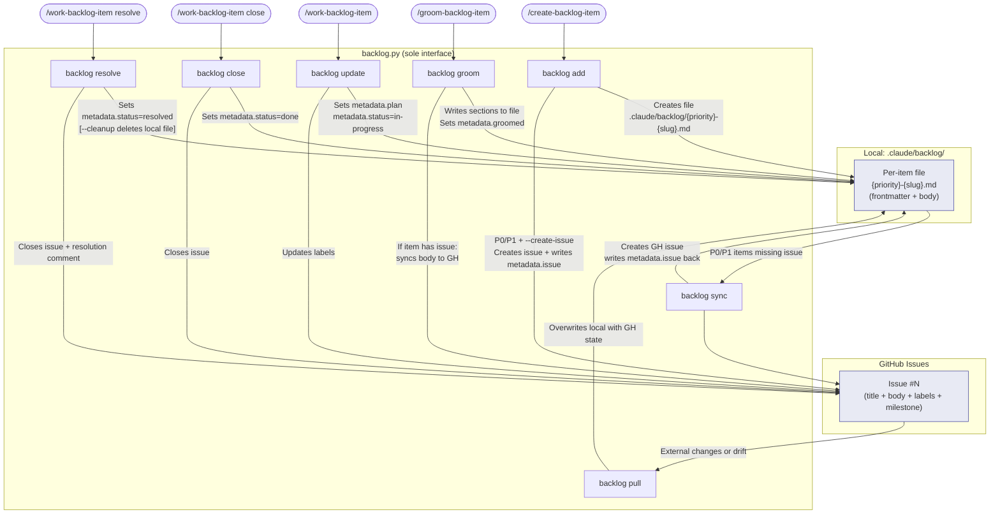

<!-- DRAFT — 2026-02-27 — Pending verification against live script behavior -->
# Backlog Item Lifecycle

**STATUS: DRAFT** — This document was derived from reading source files on 2026-02-27.
Claims marked with `[VERIFY]` require confirmation against live script execution before
this document is promoted to canonical reference.

SOURCE: Derived from reading `.claude/skills/backlog/SKILL.md`,
`.claude/skills/backlog/references/state-machine.md`,
`.claude/skills/backlog/references/item-schema.md`,
`.claude/skills/backlog/scripts/backlog.py` (lines 1–100),
`.claude/skills/work-backlog-item/SKILL.md`,
`.claude/skills/create-backlog-item/SKILL.md`,
`.claude/skills/groom-backlog-item/SKILL.md` (accessed 2026-02-27).

---

## 1. Data Architecture

Three-layer system. Each layer has a distinct role; they are not interchangeable.

### Layer 1 — GitHub Issues (canonical source of truth)

GitHub Issues are authoritative for item status and priority. The label set on the issue
is the canonical status. When a local file and its linked issue disagree, the GitHub issue
wins.

- Status is encoded as `status:*` labels (one per item at any time)
- Priority is encoded as `priority:*` labels (P0/P1/P2/Ideas)
- Issue body mirrors the item file body after each sync
- Milestone field mirrors `metadata.milestone`

### Layer 2 — `.claude/backlog/*.md` (local cache for agent consumption)

Per-item files exist to avoid GitHub API saturation during agent sessions. Agents read
these files instead of hitting the API for every lookup.

- Named `{priority}-{slug}.md` — e.g., `p1-error-recovery.md`
- Contain YAML frontmatter + body sections
- Written by `backlog.py`; never edited directly by skills or agents
- Stale when their linked issue has changed state without a `backlog pull` [VERIFY: pull subcommand behavior]

### Layer 3 — `backlog.py` (sole interface)

All reads and writes to both layers go through this script. No direct edits to
`.claude/backlog/*.md` files. No direct `gh issue edit` calls — use `backlog_update` MCP tool instead. The script handles:

- Creating per-item files with correct frontmatter
- Creating and closing GitHub Issues
- Syncing groomed content to issue bodies
- Writing label transitions
- Writing `metadata.issue` back to the local file after issue creation

```bash
uv run .claude/skills/backlog/scripts/backlog.py <subcommand> [options]
```

---

## 2. Item Lifecycle Flow

### State 1: Created (local only)

**Trigger**: `/create-backlog-item` collects fields and invokes `backlog add`.

**Command**:

```bash
uv run .claude/skills/backlog/scripts/backlog.py add \
  --title "Item title" \
  --priority P1 \
  --description "Description" \
  --source "Session observation" \
  --type Feature \
  [--research-first "questions"] \
  [--no-create-issue]
```

**What gets created**:

- Per-item file: `.claude/backlog/{priority}-{slug}.md`
- Frontmatter fields set: `name`, `description`, `metadata.topic`, `metadata.source`,
  `metadata.added`, `metadata.priority`, `metadata.type`, `metadata.status: needs-grooming`
- Body sections written: Description, optionally Acceptance Criteria, Research First,
  Suggested Location

**Where data lives**: Local file only. No GitHub issue unless P0/P1 and `--create-issue` was
passed (or the user confirmed in guided/quick mode).

**GitHub behavior**:

- P0 or P1 with `--create-issue`: GitHub Issue created immediately; `metadata.issue: '#N'`
  written to file
- P0 or P1 without `--create-issue`: local file only; issue created later by `backlog sync`
  or `backlog update --create-issue`
- P2 or Ideas: always local only at creation; `--no-create-issue` is set automatically

---

### State 2: Synced to GitHub

**Trigger**: `backlog sync` (also triggered by GitHub Action on `.claude/backlog/` changes).

**Command**:

```bash
uv run .claude/skills/backlog/scripts/backlog.py sync [--dry-run]
```

**What happens**:

- Script scans `.claude/backlog/` for P0/P1 items without a `metadata.issue` field
- Creates a GitHub Issue for each such item
- Writes `metadata.issue: '#N'` back to the per-item file frontmatter
- Applies `status:needs-grooming` and `priority:P*` labels to the issue

**Where data lives**: Both local file and GitHub Issue. The local file is now linked.

**GitHub Action integration**: [VERIFY] The GitHub Action triggers `backlog sync` when
`.claude/backlog/` files are changed in a push. This means committing a new P0/P1 item
file triggers issue creation automatically without a manual sync call.

---

### State 3: Groomed

**Trigger**: `/groom-backlog-item <title>` orchestrates fact-checking, RT-ICA, and the
`backlog-item-groomer` agent, then writes sections via `backlog groom`.

**Commands** (incremental, preferred):

```bash
# After fact-check step
uv run .claude/skills/backlog/scripts/backlog.py groom "{title}" \
  --section "Fact-Check" --content "{fact-check summary}"

# After RT-ICA step
uv run .claude/skills/backlog/scripts/backlog.py groom "{title}" \
  --section "RT-ICA" --content "{rt-ica summary}"

# After groomer agent output
uv run .claude/skills/backlog/scripts/backlog.py groom "{title}" \
  --section "Reproducibility" --content "{content}"
# ... repeated for each of the 7 required subsections
```

**Alternative (full body at once)**:

```bash
uv run .claude/skills/backlog/scripts/backlog.py groom "{title}" \
  --groomed-content "{full groomed body}"
# Or from file:
uv run .claude/skills/backlog/scripts/backlog.py groom "{title}" \
  --groomed-file path/to/groomed.md
```

**What gets written to the item file**:

- `metadata.groomed: YYYY-MM-DD` (set only after ALL 7 required sections are present)
- Body sections appended: Fact-Check, RT-ICA, then groomed subsections (Reproducibility,
  Priority, Impact, Scope, Output / Evidence, Dependencies, Research, Skills, Agents,
  Prior Work, Files, Decision)

**Where data lives**: Local file updated with all sections. If the item has a linked GitHub
Issue, `backlog groom` syncs the groomed content to the issue body. [VERIFY: whether the
script pushes body to GH on every `groom` call or only on explicit sync]

**GitHub label transition**: `status:needs-grooming` removed, `status:groomed` added.

**Item is considered fully groomed only when** all 7 canonical sections are present
(Fact-Check, RT-ICA, Reproducibility, Dependencies, Skills, Agents, Prior Work) AND
`metadata.groomed` is set. Partial grooming (some sections present) is not groomed —
`/groom-backlog-item` resumes from the first missing section on re-run.

---

### State 4: In Milestone

**Trigger**: `/group-items-to-milestone` assigns the item to a GitHub milestone.

**What happens**:

- `metadata.milestone: {N}` written to per-item file
- GitHub Issue milestone field updated
- GitHub label: `status:groomed` removed, `status:in-milestone` added

**Where data lives**: Both local and GitHub, now with milestone linkage.

**Note**: This state is managed by `/group-items-to-milestone`, which is not documented in
the source files read for this draft. [VERIFY: exact command invoked by that skill]

---

### State 5: In Progress

**Trigger**: `/work-backlog-item <title>` — after RT-ICA returns APPROVED and the SAM plan
file is created.

**Command**:

```bash
uv run .claude/skills/backlog/scripts/backlog.py update "{title}" \
  --plan "plan/P{NNN}-{slug}.yaml" \
  --status in-progress \
  -R Jamie-BitFlight/claude_skills
```

**What gets written**:

- `metadata.plan: plan/P{NNN}-{slug}.yaml` in per-item file frontmatter
- `metadata.status: in-progress` in frontmatter
- GitHub label: current status label removed, `status:in-progress` added

**Critical constraint**: `status:in-progress` MUST NOT be set before RT-ICA returns APPROVED
and the plan file exists. Setting it during grooming or RT-ICA checking is incorrect.

**Where data lives**: Both local and GitHub. Plan file exists at `plan/P{NNN}-{slug}.yaml`.

---

### State 6: Done / Closed

**Trigger**: `/work-backlog-item close <title>` — after plan checklist is 100% complete and
acceptance criteria verification passes.

**Command**:

```bash
uv run .claude/skills/backlog/scripts/backlog.py close "{title}" \
  --plan "plan/P{NNN}-{slug}.yaml" \
  --checklist-pass \
  [-R Jamie-BitFlight/claude_skills]
```

**Preconditions enforced before this command is called**:

1. Plan file checklist: all `- [x]` (zero unchecked items)
2. Acceptance criteria verification agent returns PASS (per-criterion, not overall guess)

**What happens**:

- `metadata.status: done` written to per-item file
- GitHub label: `status:in-progress` removed, `status:done` added
- GitHub Issue closed

**Optional cleanup flag** (`--cleanup`) [VERIFY: whether this flag exists on `close` or only
on `resolve`]: removes the local per-item file after closing. Without `--cleanup`, the file
remains but has `status: done`.

**Terminal state (closed)**: `done` → `closed` transition happens only when
`/complete-milestone` archives the milestone. At that point `metadata.status: closed` is set
and a milestone completion archive is written to `.claude/milestones/v{N}-completion.md`.

---

### State 7: Resolved (won't-fix / obsolete)

**Trigger**: Any skill or `/work-backlog-item resolve <title>` when an item is invalid,
obsolete, or superseded.

**Command**:

```bash
uv run .claude/skills/backlog/scripts/backlog.py resolve "{title or #N}" \
  --reason "reason text" \
  [-R Jamie-BitFlight/claude_skills]
```

**What happens**:

- `metadata.status: resolved` written to per-item file
- GitHub label: current status label removed, `status:resolved` added
- GitHub Issue closed (with resolution comment if `--reason` provided)
- `--cleanup` removes the local file [VERIFY: cleanup flag presence on resolve]

**Can be triggered from any state** — not just in-progress. An item can be resolved from
`needs-grooming`, `groomed`, `in-milestone`, or `in-progress`.

---

### State 8: Pulling from GitHub

**Trigger**: Manual `backlog pull` call to sync GitHub state back to local files.

**Command**:

```bash
uv run .claude/skills/backlog/scripts/backlog.py pull [--dry-run] [--force]
```

**What happens** [VERIFY: exact pull behavior — inferred from docstring]:

- Fetches current issue state from GitHub for each item with a `metadata.issue` field
- Overwrites or merges local file body with current issue body
- Updates `metadata.status` to match GitHub label state
- `--dry-run`: shows what would change without writing
- `--force`: overwrites local changes without prompting [VERIFY]

**Use case**: When a GitHub Issue is updated externally (e.g., via web UI or another agent),
`backlog pull` brings those changes into the local cache.

---

## 3. Data Flow Diagram



### When items are local-only (no GitHub issue)

- P2 and Ideas items at creation — `backlog add` with `--no-create-issue`
- P0/P1 items before first `backlog sync` — if created without `--create-issue`
- Any item between creation and the next GitHub Action trigger [VERIFY: GH Action timing]

### When items get pushed to GitHub

- P0/P1 at creation if `--create-issue` passed or user confirms in guided mode
- On `backlog sync` — creates issues for all P0/P1 items missing them
- On `backlog groom` — syncs groomed body to existing issue
- On `backlog update --status in-progress` — updates labels
- On `backlog close` — closes issue
- On `backlog resolve` — closes issue with comment

### When local files get removed

- `backlog close --cleanup`: file deleted after issue is closed [VERIFY: flag exists]
- `backlog resolve --cleanup`: file deleted after issue is resolved [VERIFY: flag exists]
- After `/complete-milestone`: milestone archive written; [VERIFY: whether local files are
  deleted or only status is set to `closed`]

### Sync direction

- **Push (local → GitHub)**: `backlog add`, `backlog sync`, `backlog groom`, `backlog update`,
  `backlog close`, `backlog resolve`
- **Pull (GitHub → local)**: `backlog pull`
- **Write-back on create**: `backlog add --create-issue` and `backlog sync` write `metadata.issue`
  back to the local file after creating the GH issue (bidirectional in a single operation)

---

## 4. Label and Priority Mapping

### Status Labels (1:1 with states)

| Status | GitHub Label | Set by |
|--------|-------------|--------|
| `needs-grooming` | `status:needs-grooming` | `backlog add` |
| `groomed` | `status:groomed` | `backlog groom` (after all 7 sections present) |
| `blocked` | `status:blocked` | `backlog groom` (RT-ICA BLOCKED) or `backlog update` |
| `in-milestone` | `status:in-milestone` | `/group-items-to-milestone` |
| `in-progress` | `status:in-progress` | `backlog update --status in-progress` |
| `done` | `status:done` | `backlog close` |
| `resolved` | `status:resolved` | `backlog resolve` |
| `closed` | `status:closed` | `/complete-milestone` only |

Labels are exclusive — exactly one `status:*` label per issue at any time. The backlog script
manages label transitions; no direct `gh label` calls are permitted. Use `backlog_update` MCP tool with `status` parameter instead.

### Priority Labels (orthogonal to status)

| Priority | GitHub Label | Local file naming |
|----------|-------------|------------------|
| P0 | `priority:P0` | `.claude/backlog/p0-{slug}.md` |
| P1 | `priority:P1` | `.claude/backlog/p1-{slug}.md` |
| P2 | `priority:P2` | `.claude/backlog/p2-{slug}.md` |
| Ideas | `priority:Ideas` | `.claude/backlog/ideas-{slug}.md` |

Priority labels are set at creation and do not change unless the item is explicitly
re-prioritized. [VERIFY: whether `backlog update` supports `--priority` flag]

### Type Labels

| Type | GitHub Label |
|------|-------------|
| Feature | `type:feature` |
| Bug | `type:bug` |
| Refactor | `type:refactor` |
| Docs | `type:docs` |
| Chore | `type:chore` |

---

## 5. What Happens at Each Point

### After `backlog add`

```text
.claude/backlog/{priority}-{slug}.md  — CREATED
  frontmatter:
    name: "Item title"
    description: "one-sentence summary"
    metadata:
      topic: "item-title-slug"
      source: "Session observation"
      added: 2026-02-27
      priority: P1
      type: Feature
      status: needs-grooming
  body:
    ## Description
    {prose}

    ## Acceptance Criteria
    {bullet list — if provided}

    ## Research First
    {questions — if provided}

GitHub Issue: NOT YET CREATED (unless P0/P1 + --create-issue)
```

### After `backlog sync` (P0/P1 item gets issue)

```text
.claude/backlog/p1-{slug}.md  — MODIFIED
  frontmatter:
    metadata.issue: '#42'          ← written back by script

GitHub Issue #42:
  title:  "Item title"
  body:   {mirrored from local file body}
  labels: [priority:P1, status:needs-grooming]
  state:  open
```

### After `backlog groom` (all sections written)

```text
.claude/backlog/p1-{slug}.md  — MODIFIED
  frontmatter:
    metadata.groomed: 2026-02-27   ← set after all 7 sections present
    metadata.status: groomed       ← [VERIFY: whether groom sets status or only update does]
  body additions:
    ## Fact-Check
    ## RT-ICA
    ## Groomed
      ### Reproducibility
      ### Dependencies
      ### Skills
      ### Agents
      ### Prior Work
      (+ others)

GitHub Issue #42:
  body:   {updated to include groomed sections}
  labels: [priority:P1, status:groomed]  ← status:needs-grooming replaced
```

### After `backlog update --status in-progress`

```text
.claude/backlog/p1-{slug}.md  — MODIFIED
  frontmatter:
    metadata.plan: "plan/P{NNN}-{slug}.yaml"
    metadata.status: in-progress

GitHub Issue #42:
  labels: [priority:P1, status:in-progress]  ← previous status label replaced
```

### After `backlog close --checklist-pass`

```text
.claude/backlog/p1-{slug}.md  — MODIFIED (or DELETED if --cleanup)
  frontmatter:
    metadata.status: done

GitHub Issue #42:
  state:  closed
  labels: [priority:P1, status:done]
```

### After `backlog resolve --reason "..."`

```text
.claude/backlog/p1-{slug}.md  — MODIFIED (or DELETED if --cleanup)
  frontmatter:
    metadata.status: resolved

GitHub Issue #42:
  state:  closed
  labels: [priority:P1, status:resolved]
  comment: resolution reason text appended
```

### After `backlog close --cleanup` (or equivalent with cleanup)

```text
.claude/backlog/p1-{slug}.md  — DELETED

GitHub Issue #42:  (state unchanged — already closed by backlog close)
```

### After PR merge + next `backlog sync`

```text
Already-closed issues (state: closed on GitHub) are skipped by backlog sync.
The sync command only creates issues for P0/P1 items that have no issue yet.
Closed issues are not re-opened or re-synced.  [VERIFY: exact skip logic in sync]
```

---

## 6. Item File Structure (Annotated)

```yaml
---
name: "Fix error recovery in rollback"           # title; matches GH issue title
description: "Rollback does not handle partial…"  # one-sentence summary
metadata:
  topic: "fix-error-recovery-in-rollback"         # kebab-case slug, max 60 chars
  source: "Code review 2026-02-20"                # trigger
  added: 2026-02-20                               # creation date
  priority: P1                                    # P0|P1|P2|Ideas
  type: Bug                                       # Feature|Bug|Refactor|Docs|Chore
  status: in-progress                             # current state (see state machine)
  groomed: 2026-02-21                             # set by groom-backlog-item
  issue: '#42'                                    # GitHub issue number
  milestone: 3                                    # GitHub milestone number
  plan: plan/P005-fix-error-recovery.yaml          # SAM task file path
---

## Description

{prose — what the problem is, not how to fix it}

## Acceptance Criteria

- Running `command X` produces `output Y`
- File `.claude/backlog/p1-{slug}.md` exists with correct frontmatter

## Research First

{questions to answer before grooming}

## Suggested Location

`plugins/plugin-creator/scripts/`

## Fact-Check

Claims checked: 3
VERIFIED: 2 | REFUTED: 1 | INCONCLUSIVE: 0
Refuted claims: [...]
Citations: [...]

## RT-ICA

Goal: {one sentence}
Conditions:
1. {condition} | Status: AVAILABLE | Info needed: —
Decision: APPROVED
Missing: None

## Groomed

### Reproducibility
### Dependencies
### Skills
### Agents
### Prior Work
### Files
### Decision

## Acceptance Criteria Verification

[PASS] Running `command X` produces `output Y` — verified at src/main.py:42
[PASS] File exists with correct frontmatter — confirmed at .claude/backlog/p1-…
Overall: PASS (2/2 criteria met)
```

---

## 7. Testing Checklist

Items to verify in the next session by running the commands and observing actual output.

### Data Architecture

- [ ] Confirm `backlog add` with `--no-create-issue` produces no GitHub API call (check with `--dry-run` if available, or observe GH issue list before/after)
- [ ] Confirm `backlog add` with `--create-issue` writes `metadata.issue: '#N'` to the local file (read file after command)
- [ ] Confirm `backlog sync` skips items that already have `metadata.issue` set
- [ ] Confirm `backlog sync` with `--dry-run` shows what would be created without writing

### State Transitions

- [ ] Confirm `backlog groom "{title}" --section "Fact-Check" --content "..."` appends without overwriting existing sections
- [ ] Confirm `metadata.groomed` is set only after all 7 required sections are present (try with 6 sections and verify field is absent)
- [ ] Confirm `backlog update --status in-progress` requires a prior `--plan` to be set, or can set status independently
- [ ] Confirm `backlog close` without `--checklist-pass` flag is rejected (expected: error or warning)
- [ ] Confirm `backlog resolve` without `--reason` is rejected

### Cleanup Behavior

- [ ] Verify whether `--cleanup` flag exists on `backlog close` (check `backlog close --help`)
- [ ] Verify whether `--cleanup` flag exists on `backlog resolve` (check `backlog resolve --help`)
- [ ] Confirm whether `backlog close --cleanup` deletes the local file or only marks it deleted
- [ ] Confirm what `/complete-milestone` does to local per-item files (deletes or sets `status: closed`)

### Pull / Bidirectional Sync

- [ ] Run `backlog pull --dry-run` and confirm it shows current GH state vs local state
- [ ] Confirm `backlog pull` overwrites `metadata.status` to match GH label
- [ ] Confirm `backlog pull` does not overwrite `metadata.plan` or `metadata.groomed` with empty values from GH

### Priority and Label Mapping

- [ ] Confirm P2 and Ideas items never get GH issues via `backlog sync` (even if present in backlog dir)
- [ ] Confirm label transitions are atomic: old label removed and new label added in same API call [VERIFY with `backlog_view(selector='#N')` MCP tool]
- [ ] Verify `backlog update --priority` exists or confirm re-prioritization path

### GitHub Action Integration

- [ ] Confirm GitHub Action triggers on `.claude/backlog/` file changes (read `.github/workflows/` for trigger definition)
- [ ] Confirm Action calls `backlog sync` (not a different command)
- [ ] Confirm Action runs with GITHUB_TOKEN available

### Post-Merge Behavior

- [ ] After merging a PR that fixes `#N`, confirm issue is closed on GH
- [ ] Run `backlog sync` after merge and confirm closed items are skipped
- [ ] Confirm `backlog list` excludes or marks closed/resolved items
