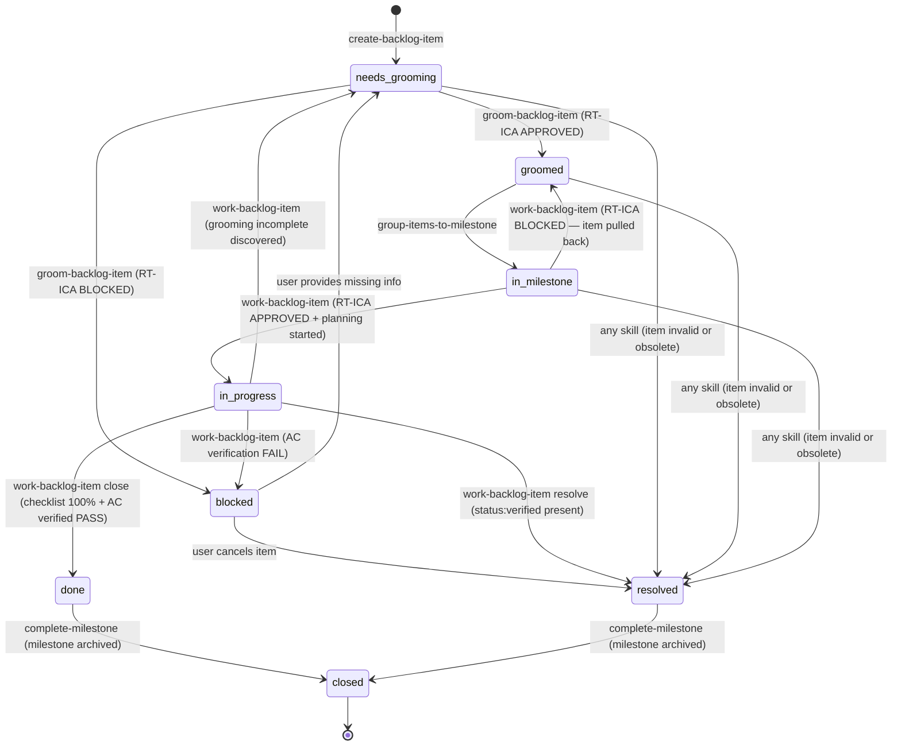

# Backlog Item Lifecycle — Canonical Reference

This document is the authoritative reference for the backlog item lifecycle state machine, handoff
protocol, state persistence, and data architecture. All skills that modify item state MUST
enforce only the transitions defined here.

The draft document (`backlog-lifecycle.draft.md`) remains as a historical reference. Do not edit
the draft — update this canonical document instead.

---

## 1. State Machine

Canonical stateDiagram-v2 derived from `skills/backlog/references/state-machine.md` (verified
in Phase 2 codebase analysis — all claims confirmed against live source files), with two
additions per architect spec Issue #398 Section 8:

1. `in-progress → needs-grooming` transition for re-queue after discovery that grooming was incomplete
2. Observable signal note for the `status:verified` gate in `complete-implementation → resolve` path



### State Definitions

| State | Description | GitHub label |
|---|---|---|
| `needs-grooming` | Item created, not yet fact-checked or groomed | `status:needs-grooming` |
| `groomed` | All 7 canonical sections present, RT-ICA APPROVED | `status:groomed` |
| `blocked` | RT-ICA BLOCKED — missing information prevents grooming or work | `status:blocked` |
| `in-milestone` | Assigned to a GitHub milestone, awaiting work | `status:in-milestone` |
| `in-progress` | Work started, plan file created, implementation underway | `status:in-progress` |
| `done` | Implementation complete, AC verified PASS, checklist 100% | `status:done` |
| `resolved` | Item closed without full implementation (obsolete, invalid, superseded) | `status:resolved` |
| `closed` | Terminal state — milestone archived, item no longer active | `status:closed` |

### Critical State Constraints

**`status:in-progress` timing**: The in-progress label MUST be set only after the RT-ICA gate
returns APPROVED and the SAM plan file is created. Setting it during grooming or RT-ICA checking
is incorrect.

**`metadata.groomed` timing**: Only set when ALL 7 canonical sections are present in the item
file. Partial grooming is not groomed.

**`blocked` and `in-progress` are exclusive**: If AC verification fails during close, revert to
`blocked` — do not close.

**`closed` entry**: The only transition into `closed` is from `complete-milestone`. No other skill
sets this status.

**`status:verified` observable signal**: `complete-implementation` applies `status:verified` to
the GitHub Issue after all quality gates pass. `work-backlog-item` Step 5.4 gates the resolve
call on this label: `backlog_view(selector="#N").labels` must contain `status:verified`. This
label is not a lifecycle state — it is a cross-skill signal.

### Transition Detail: in-progress → needs-grooming

```text
Trigger:    work-backlog-item discovers during Phase 3 that a required groomed section is missing
            or the RT-ICA result is stale and cannot be re-run (depends on user input)
Precondition: grooming incomplete — at least one of the 7 required sections absent
Action:     backlog_update(status="needs-grooming")
             GitHub label: remove status:in-progress, add status:needs-grooming
             Report reason to user — which sections are missing
             User re-runs /groom-backlog-item before item can re-enter in-progress
```

SOURCE: `backlog/references/state-machine.md` (base diagram, accessed 2026-03-30).
Addition verified against architect spec Issue #398, Section 8 (accessed 2026-03-30).

---

## 2. Handoff Protocol

Six handoffs connect lifecycle stages. Each completing skill emits a `NEXT:` token; the
orchestrator reads it and invokes the next skill. Skills are NOT tightly coupled — they do
not directly call each other.

**Token format:**

```text
NEXT: skill="<skill-name>" args="<args>" condition="<observable check>"
```

The condition field must be a machine-evaluable expression. The orchestrator checks the
condition before invoking the next skill.

### Handoff A: create-backlog-item → groom-backlog-item

**Location**: `create-backlog-item/SKILL.md` completion section.

**NEXT token:**

```text
NEXT: skill="groom-backlog-item" args="{item title}" condition="item created successfully AND metadata.status=needs-grooming"
```

**Required fields before this handoff fires:**

- `title` — non-empty string
- `description` — non-empty string
- `metadata.status` — needs-grooming
- `metadata.priority` — one of P0, P1, P2, Ideas

**Receiving skill input contract** (groom-backlog-item Step 1):

- Expects selector resolvable via `backlog_list(title=<arg>)`
- Zero matches: BLOCKED — do not assume item was created
- `metadata.status != needs-grooming`: skip (already groomed or in later state)

---

### Handoff B: groom-backlog-item → group-items-to-milestone

**Location**: `groom-backlog-item/SKILL.md` Step 9 completion section.

**NEXT token:**

```text
NEXT: skill="group-items-to-milestone" args="" condition="mark_groomed=True applied AND metadata.status=groomed"
```

**Observable trigger condition**: `backlog_view.sections["RT-ICA"]` contains
`Decision: APPROVED` AND `backlog_list` shows `groomed: true` for the item.

This handoff is advisory — grooming does not auto-invoke `group-items-to-milestone`. The NEXT
token signals to a human operator or `--auto` orchestrator that the item is milestone-ready.

---

### Handoff C: group-items-to-milestone → start-milestone

**Location**: `group-items-to-milestone/SKILL.md` completion section.

**NEXT token:**

```text
NEXT: skill="start-milestone" args="{milestone number}" condition="all target items assigned AND milestone open_issues > 0"
```

**Observable trigger condition**: `backlog_list_milestones` shows milestone with assigned items
and state `open`.

---

### Handoff D: complete-implementation → work-backlog-item resolve

**Location**: `complete-implementation` final step.

**NEXT token:**

```text
NEXT: skill="work-backlog-item" args="resolve {item title}" condition="status:verified label applied to GitHub Issue #N"
```

**Observable input contract** (work-backlog-item Step 5.4):

- Gate check: `backlog_view(selector="#N").labels` contains `status:verified`
- If absent and `--force` not set: BLOCKED with message
  `"status:verified not found on #N — run /complete-implementation or use resolve --force"`

---

### Handoff E: work-backlog-item resolve → complete-milestone

**Location**: `close-resolve-procedure.md` Step 5.7 (after `backlog_resolve` succeeds).

**NEXT token (conditional — only emit when `open_issues == 0` after resolve):**

```text
NEXT: skill="complete-milestone" args="{milestone number}" condition="all milestone issues status:done OR status:resolved AND open_issues == 0"
```

**Observable trigger condition**: Query `backlog_list_milestones(milestone=N)` — emit NEXT
token only if `open_issues == 0`. If `open_issues > 0`, do not emit (milestone still has work).

---

### Handoff F: fact-checker → groom-backlog-item

**Type**: Return artifact contract (not a routing handoff — `fact-checker` returns to
`groom-backlog-item` as the calling skill).

The `fact-checker` agent does not commit, push, or write to backlog files. It returns a
structured verdict. The orchestrator (`groom-backlog-item`) writes the verdict.

**Fact-checker output contract — required fields:**

```text
verdict: VERIFIED | REFUTED | INCONCLUSIVE
claim: {exact claim from item}
evidence: {tool result citation — WebFetch, WebSearch, Bash, or Read output}
source: {URL or file path with line numbers}
```

**groom-backlog-item validation before writing to `section="Fact-Check"`:**

- `verdict` field absent: reject, log `"fact-checker output missing verdict field"`, do not write
- `evidence` field absent: mark claim INCONCLUSIVE, write with note `"evidence field missing"`
- Verdict to RT-ICA mapping: REFUTED maps to MISSING condition, INCONCLUSIVE maps to DERIVABLE

SOURCE: Architect spec Issue #398, Section 2 (accessed 2026-03-30).

---

## 3. State Persistence

State is persisted in four layers. Each layer has a distinct role.

### Layer 1 — GitHub Issues (canonical source of truth)

GitHub labels are the canonical lifecycle state. When a local file and its linked issue
disagree, the GitHub issue wins.

- `status:*` labels — one per item at any time; managed by `state_handler.apply_github_transition()`
- `priority:*` labels — orthogonal to status; set at creation, changed only by explicit re-prioritization
- Issue body — mirrors the local item file body after each sync
- Milestone field — mirrors `metadata.milestone`

Skills interact with GitHub exclusively through MCP tools (`backlog_update` with `status`
parameter). Direct `gh label` calls are prohibited.

### Layer 2 — Local per-item files (read cache for agent consumption)

Path: `~/.dh/projects/{slug}/backlog/{priority}-{slug}.md`

Written only by MCP tools (`backlog_add`, `backlog_groom`, `backlog_update`, `backlog_close`,
`backlog_resolve`, `backlog_pull`). Direct edits bypass sync logic and are prohibited.

Fields stored locally:

| Field | Set by | Description |
|---|---|---|
| `metadata.status` | MCP tools | Mirrors the GitHub `status:*` label |
| `metadata.priority` | `backlog_add` | Mirrors the GitHub `priority:*` label |
| `metadata.groomed` | `backlog_groom` | Date when grooming completed (set after all 7 sections present) |
| `metadata.plan` | `backlog_update(plan=...)` | SAM plan address (`P{NNN}`) — backend signal, not a file path |
| `metadata.issue` | `backlog_add`, `backlog_sync` | GitHub issue number |
| `metadata.milestone` | `group-items-to-milestone` | GitHub milestone number |
| Groomed sections | `backlog_groom` | RT-ICA, Impact Radius, Fact-Check, and other groomed subsections |

### Layer 3 — SAM plan files

Path: `~/.dh/projects/{slug}/plan/P{NNN}-{slug}.yaml`

Created by `add-new-feature` Phase 4 via `sam_create`. Managed by the SAM MCP server — not
accessed via filesystem path directly. Access via `sam_read(plan="P{NNN}")` and
`sam_list(search="{slug}")`.

The plan address is written back to the backlog item via
`backlog_update(selector="{title}", plan="P{NNN}")`. The `metadata.plan` field is a
backend signal — it records the plan address so the MCP can resolve it, not a filesystem
path. Do not write or read it as a file path.

### Layer 4 — Active-task context files (ephemeral)

Path: `~/.dh/projects/{slug}/context/active-task-{session-id}.json`

Written by `/dh:start-task` at execution start. Contains `task_file_path`, `task_id`, and
`parent_issue_number`. Read by `task_status_hook.py` to correlate agent completions to tasks.
Deleted after SubagentStop fires.

SOURCE: Codebase architecture analysis Issue #398 (accessed 2026-03-30), Section 2.

---

## 4. Skill Routing Reference

Flat lookup table: for each state transition, which skill initiates it and the observable
condition that triggers it.

| From State | To State | Initiating Skill | Observable Trigger Condition |
|---|---|---|---|
| `[*]` | `needs-grooming` | `create-backlog-item` | Item created, `metadata.status=needs-grooming` |
| `needs-grooming` | `groomed` | `groom-backlog-item` | RT-ICA APPROVED AND all 7 canonical sections present |
| `needs-grooming` | `blocked` | `groom-backlog-item` | RT-ICA BLOCKED — one or more MISSING conditions |
| `blocked` | `needs-grooming` | (user re-queues) | User provides missing info; operator runs `groom-backlog-item` again |
| `blocked` | `resolved` | any skill | User cancels item; explicit reason provided |
| `groomed` | `in-milestone` | `group-items-to-milestone` | Item assigned to open milestone; `metadata.milestone` set |
| `in-milestone` | `in-progress` | `work-backlog-item` | RT-ICA APPROVED AND SAM plan file created |
| `in-milestone` | `groomed` | `work-backlog-item` | RT-ICA BLOCKED — item pulled back for re-grooming |
| `in-progress` | `done` | `work-backlog-item` (close) | Plan checklist 100% AND AC verified PASS AND `--checklist-pass` flag |
| `in-progress` | `resolved` | `work-backlog-item` (resolve) | `status:verified` label present on GitHub Issue AND explicit reason |
| `in-progress` | `blocked` | `work-backlog-item` | AC verification FAIL |
| `in-progress` | `needs-grooming` | `work-backlog-item` | Required groomed section absent during work |
| `done` | `closed` | `complete-milestone` | Milestone archived; all items done or resolved |
| `resolved` | `closed` | `complete-milestone` | Milestone archived; `open_issues == 0` |
| any | `resolved` | any skill | Item detected invalid, obsolete, or superseded |

### GitHub Label Taxonomy

Labels are managed exclusively by `state_handler.apply_github_transition()` via `backlog_update`.
Do not set labels with `gh label` directly.

```text
status:needs-grooming   — item created, awaiting grooming
status:groomed          — grooming complete, RT-ICA APPROVED
status:blocked          — RT-ICA BLOCKED or AC verification FAIL
status:in-milestone     — assigned to active milestone
status:in-progress      — implementation started
status:done             — implementation complete, AC verified
status:resolved         — closed without full implementation
status:closed           — terminal: milestone archived by complete-milestone
```

`status:needs-review` exists in the label taxonomy but is NOT a backlog lifecycle state. It has
no defined entry or exit transitions. Backlog commands MUST NOT set it during state transitions.
It is retained for backwards compatibility with PR code review workflows only.

SOURCE: `backlog/references/state-machine.md`, GitHub Label Taxonomy section (accessed 2026-03-30).

---

## 5. Priority Labels and Auto-Mode Defaults

Priority is orthogonal to status. Priority labels are set at creation and do not change unless
the item is explicitly re-prioritized.

| Priority | GitHub Label | Local file naming | Description |
|---|---|---|---|
| P0 | `priority:P0` | `p0-{slug}.md` | Critical — blocks other work; manual assignment only |
| P1 | `priority:P1` | `p1-{slug}.md` | High — urgency keyword matched or explicit flag |
| P2 | `priority:P2` | `p2-{slug}.md` | Normal — default when no urgency keyword present |
| Ideas | `priority:Ideas` | `ideas-{slug}.md` | Speculative — no GitHub issue created |

### Auto-Mode Priority Derivation (F7 Fix)

In `--auto` mode, `create-backlog-item` derives priority from description urgency keywords:

```text
Priority: infer from description urgency keywords
  - "critical", "required", "must" to P1
  - "nice to have", "optional" to P2
  - default: P2

P1 requires either a matched urgency keyword or explicit --priority=P1 flag.
P0 is never assigned by auto-mode — P0 must be set manually.
```

Auto-mode log message (default case):

```text
[AUTO] Priority: P2 — no urgency keywords found, defaulting P2
```

**Why P2 default, not P1**: Unclassified items that receive P1 by default inflate the P1 backlog
with unreviewed work. P2 default requires explicit intent to reach P1, preventing accidental
high-priority assignment in automated workflows.

SOURCE: Architect spec Issue #398, Section 8 and Section 9 (AC8, F7) (accessed 2026-03-30).

---

## 6. Data Architecture — Groomed Item Schema

### Required Frontmatter Fields

```yaml
title: {string}
description: {string}
metadata:
  status: needs-grooming | groomed | in-milestone | in-progress | done | resolved | closed | blocked
  priority: P0 | P1 | P2 | Ideas
  groomed: {YYYY-MM-DD} | null
  issue: {GitHub issue number} | null
  milestone: {milestone number} | null
  plan: {plan address P{NNN}} | null
  updated_at: {ISO timestamp}
```

### 7 Required Groomed Sections

An item is considered fully groomed only when ALL 7 sections are present with minimum content.
`metadata.groomed` MUST NOT be set until all 7 sections pass the presence check.

| Section | Required | Minimum Content |
|---|---|---|
| `RT-ICA` | Required | Contains `Decision: APPROVED` or `Decision: BLOCKED` and `Date: YYYY-MM-DD` |
| `Impact Radius` | Required | Contains at least one entry under `Systems Inventory` |
| `Fact-Check` | Required | Contains at least one claim with `verdict:` field |
| `Acceptance Criteria` | Required | Non-empty — at least one criterion listed |
| `Reproducibility` | Required | Non-empty — may be "N/A for feature items" but must be present |
| `Issue Classification` | Required | Contains `Type:` field with valid type value |
| `Priority` | Required | Contains `Effort:` field |

Optional sections (not validated for presence): `Root-Cause Analysis`, `Impact`, `Benefits`,
`Expected Behavior`, `Files`, `Resources`, `Dependencies`, `Scope`, `Decision`.

### RT-ICA Section Format

```text
## RT-ICA

Date: YYYY-MM-DD
Goal: {one sentence describing what the implementation must achieve}
Conditions:
1. {condition} | Status: AVAILABLE | Info needed: —
2. {condition} | Status: DERIVABLE | Info needed: {what to check}
3. {condition} | Status: MISSING | Info needed: {what is required}
Decision: APPROVED | BLOCKED
Missing: {list of MISSING conditions, or "None"}
```

The `Date:` header is mandatory. It is used by `work-backlog-item` staleness policy (Step 3.2):
an RT-ICA result is stale if the date is older than 7 calendar days OR the item's
`metadata.updated_at` is newer than the RT-ICA date.

### Groomer Output Validation

Before writing groomed sections to the canonical item file, `groom-backlog-item` Step 8.7 runs
a pre-write validation gate. Full procedure:
[Groomer Output Validation](../skills/groom-backlog-item/references/groomer-output-validation.md).

Retry model: haiku groomer (first attempt) → haiku groomer with targeted prompt (retry) → sonnet
groomer (escalation) → `status:blocked` with explicit error. No silent failures.

SOURCE: Architect spec Issue #398, Section 7 (AC3 validation schema) (accessed 2026-03-30).

---

## 7. Severity Counting Policy

### Discrete Severity Tiers

Process audit findings use four discrete severity tiers, in descending order:

```text
HIGH > MEDIUM > LOW-MEDIUM > LOW
```

**LOW-MEDIUM** is a distinct tier. It applies when a finding is more impactful than LOW but does
not clearly meet the MEDIUM threshold (e.g., a gap that causes reporting ambiguity without
blocking execution).

### Counting Rules

When reporting severity totals (e.g., "3 HIGH, 5 MEDIUM, 3 LOW"):

1. **Count each tier separately.** Do not collapse LOW-MEDIUM into either LOW or MEDIUM.
2. **Report LOW-MEDIUM explicitly** as its own row/count in the severity summary table.
3. **If a collapsed "total low severity" is needed**, LOW-MEDIUM counts toward the LOW bucket for that aggregate only, and the note "includes N LOW-MEDIUM" must accompany the aggregate.

### Example

A 10-finding audit with: 2 HIGH, 5 MEDIUM, 1 LOW-MEDIUM, 2 LOW reports as:

```text
HIGH:        2
MEDIUM:      5
LOW-MEDIUM:  1
LOW:         2
Total:       10
```

Not as:

```text
HIGH:    2
MEDIUM:  5
LOW:     3   ← WRONG — collapses LOW-MEDIUM without annotation
```

SOURCE: Architect spec Issue #398, Section 9 (AC7 severity policy decision) (accessed 2026-03-30).
Decision: "treat severity-count ambiguity as a documentation/policy deliverable during implementation" (RT-ICA 2026-03-03).

---

## References

- [State Machine](../skills/backlog/references/state-machine.md) — canonical state DAG source
- [Feasibility Gate](../skills/work-backlog-item/references/feasibility-gate.md) — Step 3.4 procedure
- [Groomer Output Validation](../skills/groom-backlog-item/references/groomer-output-validation.md) — Step 8.7 procedure
- Architect Spec — access via `artifact_read(issue_number=398, artifact_type="architect")` — authoritative design decisions
- Codebase Architecture Analysis — access via `artifact_read(issue_number=398, artifact_type="codebase-analysis")` — Phase 2 analysis
