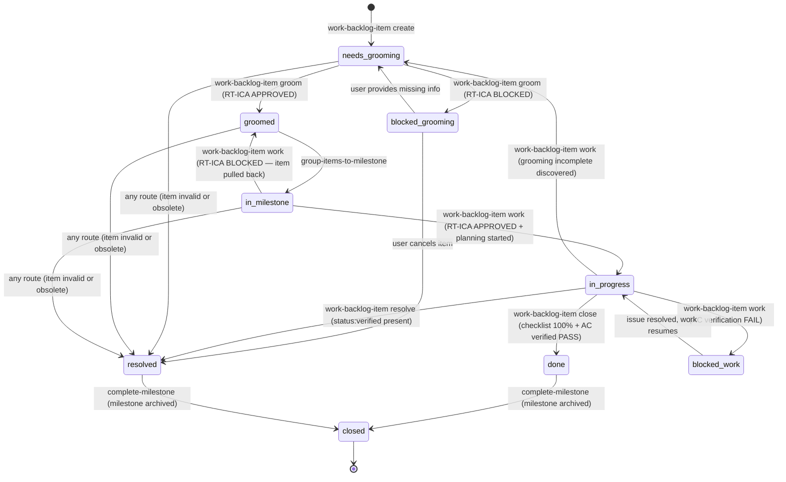
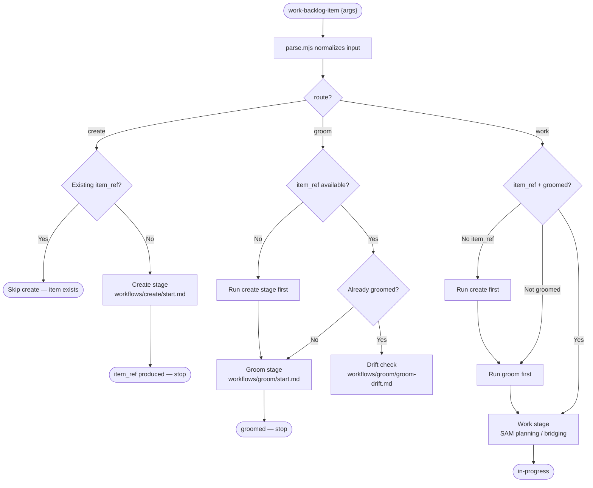

# Backlog Item Lifecycle — Canonical Reference

This document is the authoritative reference for the backlog item lifecycle state machine,
stage transitions, state persistence, and data architecture. All routes within
`work-backlog-item` that modify item state MUST enforce only the transitions defined here.

---

## 1. State Machine

**Naming convention**: State names use hyphens (`needs-grooming`). Mermaid `stateDiagram-v2`
requires underscores for node IDs — those are rendering aliases, not separate states.
`needs_grooming` in a diagram and `needs-grooming` in a status field refer to the same state.



### State Definitions

| State | Status value | Description |
|---|---|---|
| `needs-grooming` | `needs-grooming` | Item created, not yet fact-checked or groomed |
| `groomed` | `groomed` | All required sections present (defined in finalize.md), RT-ICA APPROVED |
| `blocked-grooming` | `blocked` | RT-ICA BLOCKED during grooming — missing information prevents grooming |
| `blocked-work` | `blocked` | AC verification FAIL during work — implementation issue prevents completion |
| `in-milestone` | `in-milestone` | Assigned to a milestone, awaiting work |
| `in-progress` | `in-progress` | Work started, plan file created, implementation underway |
| `done` | `done` | Implementation complete, AC verified PASS, checklist 100% |
| `resolved` | `resolved` | Item closed without full implementation (obsolete, invalid, superseded) |
| `closed` | `closed` | Terminal state — milestone archived, item no longer active |

**`blocked` disambiguation**: Both `blocked-grooming` and `blocked-work` use the same status
value `blocked` in the backend. The distinction is contextual — the route that set the blocked
status determines which resolution path applies:

- `blocked` set during `groom` → resolution: user provides missing info → re-enters `needs-grooming`
- `blocked` set during `work` → resolution: implementation issue fixed → re-enters `in-progress`

### Critical State Constraints

- **`in-progress` timing**: Set only after the RT-ICA gate returns APPROVED and the SAM plan
  file is created. Not during grooming or RT-ICA checking.
- **`groomed` timing**: Set only when ALL required sections are present with minimum content (defined in finalize.md).
  Partial grooming is not groomed.
- **`blocked` and `in-progress` are exclusive**: If AC verification fails during close, set
  `blocked` — do not close.
- **`closed` entry**: The only transition into `closed` is from `complete-milestone`. No other
  route sets this status.
- **`status:verified` signal**: `complete-implementation` applies a `verified` status marker
  after all quality gates pass. `work-backlog-item` resolve gates on this marker:
  `backlog_view(selector='{item_ref}').labels` must contain the verified marker. This is a
  cross-route signal, not a lifecycle state.

### Ideas Items Exception

Items with priority `Ideas` may not have a backend issue linked (`issue_number` absent).
When no backend issue exists:

- State transitions still apply via local metadata only
- Discovery gate is skipped (requires `issue_number`)
- Artifact tools (`artifact_list`, `artifact_read`) are unavailable
- `backlog_comment_issue` is unavailable
- The item can still be groomed, but with reduced scope (MINIMAL or NARROW sizing)

To promote an Ideas item into the standard lifecycle, assign it a priority of P0/P1/P2.
The backend creates an issue at that point via `backlog_sync`.

### Transition Detail: in-progress → needs-grooming

```text
Trigger:    work-backlog-item discovers during planning that a required groomed section
            is missing or the RT-ICA result is stale and cannot be re-run
Precondition: grooming incomplete — at least one of the required sections absent (defined in finalize.md)
Action:     backlog_update(selector='{item_ref}', status='needs-grooming')
            Report reason to user — which sections are missing
            User re-runs /dh:work-backlog-item groom {item_ref} before item can
            re-enter in-progress
```

SOURCE: `backlog/references/state-machine.md` (base diagram, accessed 2026-03-30).
Additions verified against architect spec Issue #398, Section 8 (accessed 2026-03-30).
Updated 2026-04-06 for skill consolidation, blocked disambiguation, and Ideas exception.

---

## 2. Pipeline Stages

The `work-backlog-item` skill is the single entry point for all backlog lifecycle operations.
A parser (`parse.mjs`) normalizes user input into structured JSON with a `route` field. The
skill's SKILL.md routes execution to stage-specific workflow files.

Pipeline order: `create` → `groom` → `work`

Before running a target stage, the skill checks whether earlier stages have completed. If a
prerequisite stage's output is missing, it runs that stage first. This replaces the previous
NEXT-token handoff model where separate skills passed control to each other.

### Stage Definitions

| Stage | Route | Workflow file | Produces | Status on completion |
|---|---|---|---|---|
| Create | `create` | `workflows/create/scope.md` + `start.md` | `item_ref` (`#N`), backend issue | `needs-grooming` |
| Groom | `groom` | `workflows/groom/scope.md` + `start.md` | DEEP item with all required sections (defined in finalize.md) | `groomed` |
| Work | `work` | `workflows/work/scope.md` + `start.md` | SAM plan | `open/groomed` → `in-progress` |

### Stage Transitions



### Prerequisite Checks

Each stage checks its prerequisites before executing:

- **Create**: No prerequisite. Runs only when no `item_ref` is available.
- **Groom**: Requires `item_ref`. If absent, runs `create` first. Checks `status` — if already
  `groomed` and groomed today, routes to drift check instead.
- **Work**: Requires `item_ref` and `groomed` status. If `item_ref` absent, runs `create`.
  If not groomed, runs `groom`. If groomed but RT-ICA stale (older than 7 days or
  `metadata.updated_at` newer than RT-ICA date), re-runs groom.

### Blocking Gates

A gate blocks progression when a later stage's required prerequisites are missing or a
workflow rule explicitly marks the item `blocked`.

| Gate | Location | Blocks | Resolution |
|---|---|---|---|
| RT-ICA BLOCKED | Groom stage (finalize.md) | groom → work | User provides missing info |
| Output validation | Groom stage (finalize.md) | groom → work | Retry model (haiku → sonnet → blocked) |
| RT-ICA stale | Work stage entry | work execution | Re-run groom |
| AC verification FAIL | Work stage close | work → done | Fix implementation |
| `verified` marker absent | Work stage resolve | work → resolved | Run `/dh:complete-implementation` or use `--force` |

### Quality Gates for `verified` Marker

The `verified` marker (applied by `complete-implementation`) requires these gates to pass:

1. All SAM plan tasks in COMPLETE state
2. All acceptance criteria verified PASS
3. Linting passes (`ruff check`, `ty check`)
4. Tests pass (`pytest`)
5. No unresolved code review findings

SOURCE: Architect spec Issue #398, Section 8 (accessed 2026-03-30).
Updated 2026-04-06 for pipeline model replacing NEXT-token handoffs.

---

## 3. State Persistence

State is persisted through the `BacklogBackend` Protocol (`backlog_core/backend_protocol.py`).
The active backend is the source of truth. When local cache and the backend disagree, the
backend wins.

All state mutations go through MCP tools (`backlog_update`, `backlog_groom`, `backlog_close`,
`backlog_resolve`). Direct edits to local cache files or backend-native APIs bypass sync
logic and are prohibited.

### Persistence Layers

| Layer | Purpose | Access method |
|---|---|---|
| Backend | Source of truth for status, priority, sections, comments | MCP tools (`mcp__plugin_dh_backlog__*`) |
| Local cache | Read-optimized derived copy of backend state | Written only by MCP tools; never edited directly |
| SAM plans | Task decomposition and execution state | SAM MCP tools (`mcp__plugin_dh_sam__*`) |
| Active-task context | Ephemeral session state for task execution | Written by `/dh:start-task`, deleted after completion |

### Backend Selection

Resolution order:

1. `BACKLOG_BACKEND` environment variable
2. `[backend] name` in `backend.toml` (project root, then `~/.dh/`)
3. Default: `github`

Available backends: `github` (default), `sqlite` (local, no credentials), `memory` (test double).

See [Backend Providers](./backend-providers.md) for full Protocol reference, method groups,
and configuration.

### Fields Stored Per Item

| Field | Set by | Description |
|---|---|---|
| `status` | MCP tools | Current lifecycle state (`needs-grooming`, `groomed`, `blocked`, etc.) |
| `priority` | `backlog_add` | P0, P1, P2, or Ideas |
| `groomed` | `backlog_groom` | Date when grooming completed (set after all required sections present — defined in finalize.md) |
| `plan` | `backlog_update(plan=...)` | SAM plan address (`P{id}`) — a backend reference, not a file path |
| `issue` | `backlog_add` | Backend issue identifier (`#N` format) |
| `milestone` | `group-items-to-milestone` | Milestone identifier |
| Groomed sections | `backlog_groom` | RT-ICA, Impact Radius, Fact-Check, and other groomed subsections |

### SAM Plan Files

Created by `add-new-feature` Phase 4 via `sam_create`. Managed by the SAM MCP server.
Access via `sam_read(plan="P{id}")` and `sam_list(search="{slug}")` — not via filesystem path.

The plan address is written to the backlog item via
`backlog_update(selector='{item_ref}', plan='P{id}')`. The `plan` field is a backend
reference, not a filesystem path.

SOURCE: Codebase architecture analysis Issue #398 (accessed 2026-03-30), Section 2.
Updated 2026-04-06 for backend-agnostic model.

---

## 4. Route Reference

Flat lookup table: for each state transition, which route initiates it and the observable
condition that triggers it.

### Routes That Modify Item State

These are the bounded set of routes that perform state transitions. No other route or skill
may modify lifecycle state without being added to this table.

| From State | To State | Initiating Route | Observable Trigger Condition |
|---|---|---|---|
| `[*]` | `needs-grooming` | `work-backlog-item create` | `backlog_add` returns success with `item_ref` |
| `needs-grooming` | `groomed` | `work-backlog-item groom` | RT-ICA APPROVED AND all required sections present (defined in finalize.md) |
| `needs-grooming` | `blocked` | `work-backlog-item groom` | RT-ICA BLOCKED — one or more MISSING conditions |
| `blocked` | `needs-grooming` | (user re-queues) | User provides missing info; operator runs `groom` again |
| `blocked` | `resolved` | any route | User cancels item; explicit reason provided |
| `groomed` | `in-milestone` | `group-items-to-milestone` | Item assigned to open milestone |
| `in-milestone` | `in-progress` | `work-backlog-item work` | RT-ICA APPROVED AND SAM plan file created |
| `in-milestone` | `groomed` | `work-backlog-item work` | RT-ICA BLOCKED — item pulled back for re-grooming |
| `in-progress` | `done` | `work-backlog-item close` | Plan checklist 100% AND AC verified PASS |
| `in-progress` | `resolved` | `work-backlog-item resolve` | `verified` marker present AND explicit summary |
| `in-progress` | `blocked` | `work-backlog-item work` | AC verification FAIL |
| `in-progress` | `needs-grooming` | `work-backlog-item work` | Required groomed section absent during work |
| `done` | `closed` | `complete-milestone` | Milestone archived; all items done or resolved |
| `resolved` | `closed` | `complete-milestone` | Milestone archived |
| any | `resolved` | any route | Item detected invalid, obsolete, or superseded |

### Status Values

Status values are managed through MCP tools (`backlog_update` with `status` parameter).
The active backend handles the storage representation (labels, columns, fields, etc.)
according to its own implementation.

```text
needs-grooming   — item created, awaiting grooming
groomed          — grooming complete, RT-ICA APPROVED
blocked          — RT-ICA BLOCKED or AC verification FAIL (see disambiguation in Section 1)
in-milestone     — assigned to active milestone
in-progress      — implementation started
done             — implementation complete, AC verified
resolved         — closed without full implementation
closed           — terminal: milestone archived by complete-milestone
```

`verified` exists as a cross-route signal applied by `complete-implementation` after quality
gates pass. It is NOT a lifecycle state and has no entry/exit transitions in the state machine.

SOURCE: `backlog/references/state-machine.md` (accessed 2026-03-30).
Updated 2026-04-06 for route-based naming.

---

## 5. Priority and Auto-Mode Defaults

Priority is orthogonal to status. Priority is set at creation and does not change unless
the item is explicitly re-prioritized.

| Priority | Description | Backend issue created? |
|---|---|---|
| P0 | Critical — blocks other work; manual assignment only | Yes |
| P1 | High — urgency keyword matched or explicit flag | Yes |
| P2 | Normal — default when no urgency keyword present | Yes |
| Ideas | Speculative — exploratory items | No (see Ideas exception in Section 1) |

### Auto-Mode Priority Derivation

In `auto` mode, `work-backlog-item create` derives priority from description urgency keywords:

```text
Priority derivation:
  - "critical", "required", "must" → P1
  - "nice to have", "optional" → P2
  - default: P2

P1 requires either a matched urgency keyword or explicit priority flag.
P0 is never assigned by auto mode — P0 must be set manually.
```

Auto-mode log message (default case):

```text
[AUTO] Priority: P2 — no urgency keywords found, defaulting P2
```

**Why P2 default, not P1**: Unclassified items that receive P1 by default inflate the P1 backlog
with unreviewed work. P2 default requires explicit intent to reach P1, preventing accidental
high-priority assignment in automated workflows.

SOURCE: Architect spec Issue #398, Section 8 and Section 9 (AC8, F7) (accessed 2026-03-30).

---

## 6. Data Architecture — Groomed Item Schema

### Required Item Fields

```yaml
title: {string}
description: {string}
metadata:
  status: needs-grooming | groomed | in-milestone | in-progress | done | resolved | closed | blocked
  priority: P0 | P1 | P2 | Ideas
  groomed: {YYYY-MM-DD} | null
  issue: {item_ref #N} | null
  milestone: {milestone identifier} | null
  plan: {plan address P{id}} | null
  updated_at: {ISO timestamp}
```

### Required Groomed Sections

An item is considered fully groomed only when ALL required sections are present with minimum content (defined in finalize.md validation table).
`metadata.groomed` MUST NOT be set until all required sections pass the presence check.

| Section | Required | Minimum Content |
|---|---|---|
| `RT-ICA` | Required | Contains `Decision: APPROVED` or `Decision: BLOCKED` and `Date: YYYY-MM-DD` |
| `Impact Radius` | Required | Contains at least one entry under `Systems Inventory` |
| `Fact-Check` | Required | Contains at least one claim with `verdict:` field |
| `Acceptance Criteria` | Required | Non-empty — at least one criterion listed |
| `Reproducibility` | Required | Non-empty — "N/A for feature items" is acceptable but must be present |
| `Issue Classification` | Required | Contains `Type:` field with a valid type value (see below) |
| `Priority` | Required | Contains `Effort:` field with a valid effort value (see below) |

Optional sections (not validated for presence): `Root-Cause Analysis`, `Impact`, `Benefits`,
`Expected Behavior`, `Files`, `Resources`, `Dependencies`, `Scope`, `Decision`.

### Valid Issue Classification Types

| Type | Description |
|---|---|
| `procedural` | Typo, naming, formatting, or surface fix — no analysis required |
| `recurring-pattern` | Same problem class appeared 2+ times — 6-sigma analysis |
| `defect` | Traceable failure with identifiable cause chain — 5-whys analysis |
| `missing-guardrail` | System allowed bad outcome a gate should have prevented — no analysis |
| `unbounded-design` | No traceable failure, no pattern — design-framing analysis |

### Valid Effort Values

| Value | Description |
|---|---|
| `trivial` | < 1 hour, single file, no dependencies |
| `small` | 1–4 hours, few files, minimal dependencies |
| `medium` | 4–16 hours, multiple files, some dependencies |
| `large` | 16+ hours, cross-system, significant dependencies |
| `unknown` | Insufficient information to estimate — flag for research |

### RT-ICA Section Format

```text
## RT-ICA

Date: YYYY-MM-DD
Goal: {one sentence describing what the implementation must achieve}
Conditions:
1. {condition} | Status: AVAILABLE | Info needed: —
2. {condition} | Status: DERIVABLE | Info needed: {what to check}
3. {condition} | Status: MISSING | Info needed: {what is required}
Decision: APPROVED | BLOCKED
Missing: {list of MISSING conditions, or "None"}
```

The `Date:` header is mandatory. It is used by the work stage staleness policy: an RT-ICA
result is stale if the date is older than 7 calendar days OR the item's `metadata.updated_at`
is newer than the RT-ICA date. Date comparisons use UTC calendar dates.

### Groomer Output Validation

Before writing groomed sections, the groom stage runs a pre-write validation gate. Full
procedure: [Groom Finalize](../skills/work-backlog-item/references/workflows/groom/finalize.md).

Retry model: haiku groomer (first attempt) → haiku groomer with targeted prompt (retry) →
sonnet groomer (escalation) → `status:blocked` with explicit error. No silent failures.

SOURCE: Architect spec Issue #398, Section 7 (AC3 validation schema) (accessed 2026-03-30).
Updated 2026-04-06 with valid type and effort value enumerations.

---

## 7. Severity Counting Policy

### Discrete Severity Tiers

Process audit findings use four discrete severity tiers, in descending order:

```text
HIGH > MEDIUM > LOW-MEDIUM > LOW
```

**LOW-MEDIUM** is a distinct tier. It applies when a finding is more impactful than LOW but does
not clearly meet the MEDIUM threshold (e.g., a gap that causes reporting ambiguity without
blocking execution).

### Counting Rules

When reporting severity totals (e.g., "3 HIGH, 5 MEDIUM, 3 LOW"):

1. **Count each tier separately.** Do not collapse LOW-MEDIUM into either LOW or MEDIUM.
2. **Report LOW-MEDIUM explicitly** as its own row/count in the severity summary table.
3. **If a collapsed "total low severity" is needed**, LOW-MEDIUM counts toward the LOW bucket for that aggregate only, and the note "includes N LOW-MEDIUM" must accompany the aggregate.

### Example

A 10-finding audit with: 2 HIGH, 5 MEDIUM, 1 LOW-MEDIUM, 2 LOW reports as:

```text
HIGH:        2
MEDIUM:      5
LOW-MEDIUM:  1
LOW:         2
Total:       10
```

Not as:

```text
HIGH:    2
MEDIUM:  5
LOW:     3   ← WRONG — collapses LOW-MEDIUM without annotation
```

SOURCE: Architect spec Issue #398, Section 9 (AC7 severity policy decision) (accessed 2026-03-30).

---

## References

- [Create Scope](../skills/work-backlog-item/references/workflows/create/scope.md) — Create stage scope boundary
- [Create Workflow](../skills/work-backlog-item/references/workflows/create/start.md) — create stage procedure
- [Work Scope](../skills/work-backlog-item/references/workflows/work/scope.md) — Work stage scope boundary
- [Groom Workflow](../skills/work-backlog-item/references/workflows/groom/start.md) — groom stage index
- [Groom Finalize](../skills/work-backlog-item/references/workflows/groom/finalize.md) — output validation and write procedure
- [Backend Providers](./backend-providers.md) — BacklogBackend Protocol, available backends, configuration
- [State Machine](../skills/backlog/references/state-machine.md) — canonical state DAG source
- [Feasibility Gate](../skills/work-backlog-item/references/feasibility-gate.md) — work stage feasibility check
- Architect Spec — access via `artifact_read(issue_number=398, artifact_type="architect")` — authoritative design decisions
