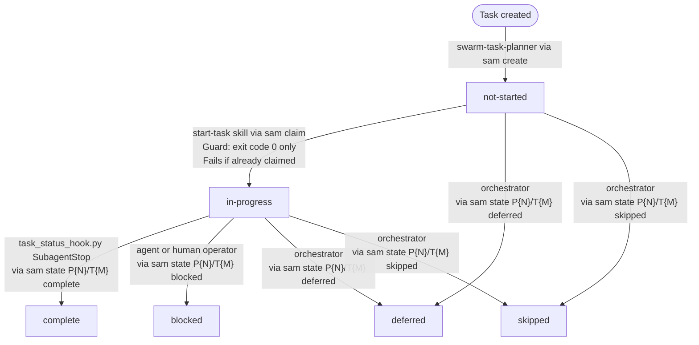
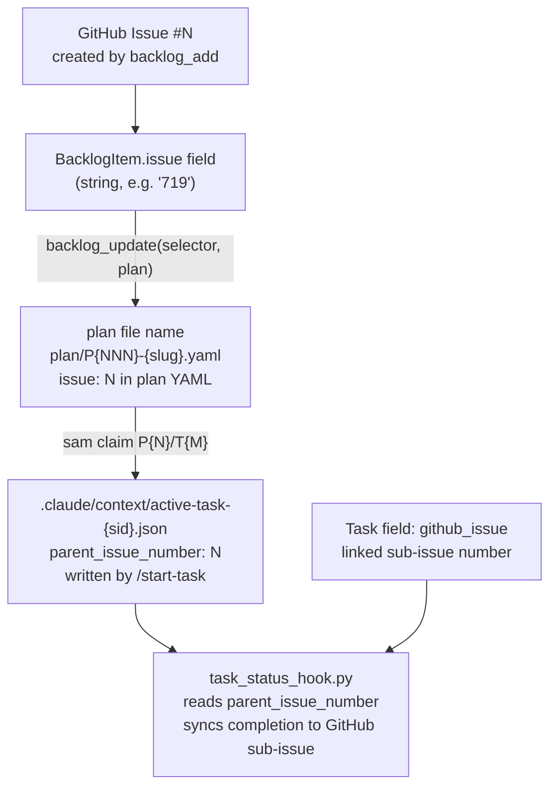

# Workflow Architecture Diagram

> **Snapshot**: 2026-03-21T15:00:00Z (pre-SAM-consolidation-migration)
>
> Sources: `plugins/development-harness/docs/TASK_FILE_FORMAT.md`, `backlog_core/server.py`, `backlog_core/models.py`,
> `plugins/development-harness/skills/implementation-manager/scripts/task_status_hook.py`
> Last verified: 2026-03-21

**Table of Contents**

- [1. Pipeline Overview](#1-pipeline-overview)
- [2. Data Structure Shapes](#2-data-structure-shapes)
- [3. Publisher-Consumer Map](#3-publisher-consumer-map)
- [4. SAM Task State Lifecycle](#4-sam-task-state-lifecycle)
- [5. Cross-System Dependency Chain](#5-cross-system-dependency-chain)
- [6. Hook Trigger Conditions](#6-hook-trigger-conditions)

---

## 1. Pipeline Overview

```mermaid
flowchart TD
    subgraph Planning [Phase 1 — Planning]
        S1["/add-new-feature"]
        A1["feature-researcher"]
        A2["codebase-analyzer"]
        A3["python-cli-design-spec"]
        A4["swarm-task-planner"]
        A5["plan-validator"]
        A6["context-gathering"]
        M1["backlog_add"]
        M2["backlog_list"]
        M3["backlog_view"]
        M4["backlog_update(selector, plan)"]
        C1["sam create"]
        S1 --> A1
        S1 --> A2
        A1 --> A3
        A2 --> A3
        A3 --> A4
        A4 --> A5
        A5 --> A6
        A4 -->|"§2.1 sam create"| C1
        M1 -->|"§2.5 BacklogItem"| M4
        M2 --> M3
    end

    subgraph Execution [Phase 2 — Execution]
        S2["/implement-feature"]
        S3["/start-task"]
        A7["t0-baseline-capture"]
        A8["tn-verification-gate"]
        M5["backlog_get_ready_sam_tasks(parent_issue_number)"]
        C2["sam ready"]
        C3["sam status"]
        C4["sam claim"]
        C5["sam read"]
        H1["task_status_hook.py SubagentStop"]
        H2["task_status_hook.py PostToolUse"]
        S2 -->|"§2.1"| M5
        S2 -->|"§2.1"| C2
        S2 --> C3
        S2 --> A7
        S2 --> S3
        S3 -->|"§2.7"| C4
        S3 -->|"§2.2"| C5
        S3 -->|"§2.6"| H2
        A7 -->|"§2.3"| A8
        H1 -->|"status: complete"| C4
        H2 -->|"last-activity"| C4
    end

    subgraph QualityGates [Phase 3 — Quality Gates]
        S4["/complete-implementation"]
        A9["code-reviewer"]
        A10["feature-verifier"]
        A11["integration-checker"]
        A12["doc-drift-auditor"]
        A13["service-docs-maintainer"]
        A14["context-refinement"]
        S4 -->|"§2.4"| A9
        S4 --> A10
        S4 --> A11
        S4 --> A12
        A12 --> A13
        S4 --> A14
    end

    subgraph ArtifactManifest [Artifact Manifest — GitHub Issue Body]
        AR["artifact_register"]
        AL["artifact_list"]
        AREAD["artifact_read"]
    end

    A1 -->|"register feature-context"| AR
    A3 -->|"register architect-spec"| AR
    A4 -->|"register task-plan"| AR
    S3 -->|"discover artifacts"| AL
    A10 -->|"discover artifacts"| AL
    A14 -->|"discover artifacts"| AL
    S3 -->|"worktree content access"| AREAD

    Planning --> Execution
    Execution -->|"§2.4 TN verification"| QualityGates
```



---

## 2. Data Structure Shapes

### 2.1 sam_ready output (ReadyTasksResult)

Output of `mcp__plugin_dh_sam__sam_ready(plan="P{N}")` and `backlog_get_ready_sam_tasks(parent_issue_number)`. CLI fallback: `uv run sam ready P{N} --format json`.

```json
{
  "feature": "string (plan slug)",
  "ready_tasks": [
    {
      "task": "T01",
      "title": "string",
      "agent": "string",
      "skills": ["skill-name"],
      "priority": 1,
      "complexity": "low|medium|high",
      "dependencies": []
    }
  ],
  "count": 3
}
```

### 2.2 TaskAssignment (sam_read P{N}/T{M})

Output of `mcp__plugin_dh_sam__sam_read(plan="P{N}", task="T{M}")`. CLI fallback: `uv run sam read P{N}/T{M} --format json`.

```json
{
  "plan_number": 719,
  "plan_slug": "string",
  "plan_goal": "string",
  "plan_context": "string",
  "plan_acceptance_criteria": ["string"],
  "task": {
    "task": "T04",
    "title": "string",
    "status": "not-started|in-progress|complete|blocked|deferred|skipped",
    "agent": "string",
    "dependencies": ["T01"],
    "priority": 1,
    "complexity": "low|medium|high",
    "skills": ["string"],
    "started": "ISO 8601 | null",
    "completed": "ISO 8601 | null",
    "last-activity": "ISO 8601 | null",
    "github_issue": "int | null",
    "is-bookend": "bool | null",
    "bookend-type": "t0-baseline|tn-verification | null",
    "body": "markdown string"
  }
}
```

### 2.3 T0 Baseline YAML (plan/T0-baseline-{slug}.yaml)

Written by `t0-baseline-capture` agent. Array of per-criterion capture records.

```yaml
- criterion_id: "AC1"
  check_command: "uv run pytest tests/"
  exit_code: 1
  stdout: "string"
  stderr: "string"
```

### 2.4 TN Verification YAML (plan/TN-verification-{slug}.yaml)

Written by `tn-verification-gate` agent. Array of `BookendVerification` records. No top-level verdict field.

```yaml
- criterion_id: "AC1"
  check_command: "uv run pytest tests/"
  t0_exit_code: 1
  tn_exit_code: 0
  status: "passed|regressed|pre-existing-fail|newly-passing"
  stdout_diff_summary: "string"
```

`/complete-implementation` aggregates the verdict by scanning all records for `status: regressed`.

### 2.5 BacklogItem fields (backlog_core/models.py `BacklogItem`)

Relevant fields for the pipeline:

```json
{
  "title": "string",
  "priority": "P0|P1|P2|Ideas",
  "description": "string",
  "source": "string",
  "item_type": "Feature|Bug|Refactor|Docs|Chore",
  "issue": "string (GitHub issue number as string, or empty)",
  "plan": "string (file path) | empty string"
}
```

### 2.6 Active-task context file (.claude/context/active-task-{CLAUDE_SESSION_ID}.json)

Written by `/start-task` skill. Read by `task_status_hook.py` PostToolUse handler.

```json
{
  "task_file_path": "plan/P719-my-feature.yaml",
  "task_id": "T04",
  "parent_issue_number": 719
}
```

`parent_issue_number` is omitted when the story issue number is unknown. The hook treats absence as `None` and skips GitHub sync.

### 2.7 sam_claim output

Output of `mcp__plugin_dh_sam__sam_claim(plan="P{N}", task="T{M}")`. CLI fallback: `uv run sam claim P{N}/T{M} --format json`.

```json
{
  "claimed": true,
  "task_id": "T04",
  "started": "2026-03-15T13:00:00Z"
}
```

Exit code 1 when: already claimed, task not found, or `status != not-started`.

---

## 3. Publisher-Consumer Map

| Artifact | Publisher | Consumer(s) |
|----------|-----------|-------------|
| `plan/feature-context-{slug}.md` | `feature-researcher` | `python-cli-design-spec`, `swarm-task-planner` |
| `plan/codebase/{FOCUS}.md` | `codebase-analyzer` | `swarm-task-planner` |
| `plan/architect-{slug}.md` | `python-cli-design-spec` | `swarm-task-planner`, executing agents via `/start-task` |
| `plan/P{NNN}-{slug}.yaml` | `swarm-task-planner` via `sam create` | `/implement-feature`, `sam ready`, `sam status`, all execution agents |
| `plan/T0-baseline-{slug}.yaml` | `t0-baseline-capture` | `tn-verification-gate` |
| `plan/TN-verification-{slug}.yaml` | `tn-verification-gate` | `/complete-implementation` Pre-Phase 1 check |
| `.claude/context/active-task-{sid}.json` | `/start-task` skill | `task_status_hook.py` PostToolUse handler |
| `last-activity` field in task | `task_status_hook.py` PostToolUse handler | progress reporting |
| `status: complete`, `completed` field | `task_status_hook.py` SubagentStop handler | `sam ready` readiness evaluation |
| `status: in-progress`, `started` field | `sam claim` via `/start-task` | `sam status`, `sam ready` exclusion |
| Follow-up task files | `code-reviewer` | `/complete-implementation` recursion gate |
| Context Manifest in task file | `context-gathering`, `context-refinement` | executing agents, future sessions |
| Artifact manifest (GitHub Issue body) | Producer agents via `artifact_register` | Consumer agents via `artifact_list`, worktree agents via `artifact_read` |

---

## 4. SAM Task State Lifecycle



Readiness rule: a task is ready when `status == not-started` AND all dependency task IDs have `status == complete`.

---

## 5. Cross-System Dependency Chain

The `parent_issue_number` (GitHub issue) propagates through these fields:



Key invariant: `parent_issue_number` in the context file is the GitHub story issue number for the plan. `task.github_issue` is the sub-issue to close on completion. The hook uses both fields independently.

---

## 6. Hook Trigger Conditions

Script: `plugins/development-harness/skills/implementation-manager/scripts/task_status_hook.py`

Hook input arrives via stdin as JSON. The hook reads `hook_event_name` to route.

### 6.1 SubagentStop

```text
Trigger:    hook_event_name == "SubagentStop"
Matcher:    (none — fires on every sub-agent completion)
Context:    Declared on /implement-feature skill
```

Processing sequence:

1. Read `prompt` field from hook input (falls back to `tool_input.prompt`).
2. Parse prompt for `/start-task <path> --task <id>` or `Skill(skill="start-task", args="<path> --task <id>")` pattern.
3. If no match, fall back to `.claude/context/active-task-{session_id}.json`.
4. If still no match, exit 0 silently (not a `/start-task` sub-agent).
5. Call `sam_update_status(full_path, task_id, COMPLETE, timestamp_field="completed")`.
6. Delete `.claude/context/active-task-{session_id}.json`.
7. Call `sync_completion_to_github()` — best-effort, never changes exit code.

Fields written: `status: complete`, `completed: <ISO timestamp>`

### 6.2 PostToolUse (Write|Edit|Bash)

```text
Trigger:    hook_event_name == "PostToolUse"
            AND tool_name in {"Write", "Edit", "Bash"}
Matcher:    Write|Edit|Bash
Context:    Declared on /start-task skill
```

Processing sequence:

1. Read `session_id` from hook input. If absent, exit 0.
2. Read `.claude/context/active-task-{session_id}.json`. If absent, exit 0.
3. Resolve `task_file_path` and `task_id` from context file.
4. Read current task via `sam_get_task`. If `status == complete`, return without writing.
5. Call `sam_update_plan_fields(full_path, task_id, set_fields={"last-activity": <ISO timestamp>})`.

Fields written: `last-activity: <ISO timestamp>`

Guard: skipped silently when task status is already `complete`.
