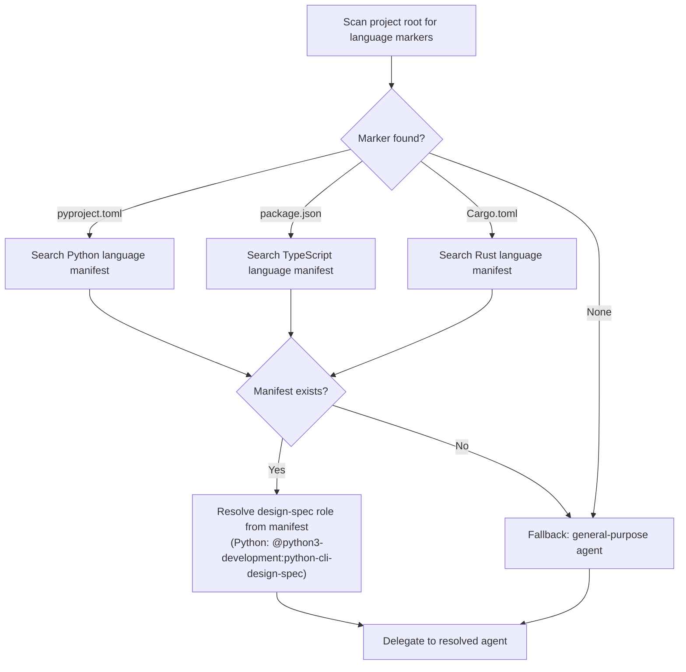

# Add New Feature (SAM Workflow)

You MUST convert the user's request into **durable SAM artifacts** under the repo:

- `plan/feature-context-{slug}.md` (discovery)
- `plan/codebase/{FOCUS}.md` (optional, analysis)
- `plan/architect-{slug}.md` (architecture/design spec)
- `plan/P{NNN}-{slug}.yaml` (executable task plan with Agents, deps, and verification)

<feature_request>
$ARGUMENTS
</feature_request>

---

## Artifact Discovery (Pre-Phase)

Before starting any phase, check whether the feature request references a GitHub Issue. If an issue number is present, discover existing artifacts registered on that issue.

```mermaid
flowchart TD
    Start([Parse feature_request]) --> Q{Contains "GitHub Issue: #N"<br>or "Issue: #N" or "#N"?}
    Q -->|Yes — issue number found| List["Call artifact_list(issue_number=N)<br>to discover registered artifacts"]
    Q -->|No — no issue reference| Skip[Skip artifact discovery<br>Proceed normally]
    List --> Found{Artifacts returned?}
    Found -->|Yes| Store["Store artifact list as discovered_artifacts<br>Include paths and types in each<br>phase delegation prompt"]
    Found -->|No or empty| Skip
    Store --> Phase1([Proceed to Phase 1])
    Skip --> Phase1
```

When `discovered_artifacts` is non-empty, append this block to each phase delegation prompt:

```text
<prior_artifacts>
The following artifacts are already registered for this issue. Read any relevant
ones via artifact_read(issue_number={issue}, artifact_type="{type}") before
starting your work — they contain prior research and analysis that should
inform your output.

{for each artifact: "- {artifact_type}: {path}"}
</prior_artifacts>
```

Research-type artifacts (`artifact_type="research"`) are especially valuable — they contain investigation findings gathered before planning began. Phase agents should read these first when present.

---

## Orchestrator Discipline

You are an orchestrator. You coordinate work across specialized agents. Prefer delegating discovery and analysis.

---

## Shared Delegation Preamble

Every phase delegation prompt starts with this block. Fill `{work_type}`, `{feature_name}`, and `{issue}` from the values in the **Template Variables** section at the bottom of this skill.

```text
You are part of a team that is currently working on the {work_type} {feature_name}.
Read the details about the milestone and plan you are a part of at backlog_view(selector="#{issue}").

<quality_vigilance>
Your task among all other things you are doing is to be consistently striving for
product quality improvements and aligning with the design intent. If you see something
that seems misaligned, verify it, and then note your concerns and findings concisely
in your response in a <concerns></concerns> block. Point out duplication, contradictions,
statements of fact without citation, code smells, missing documentation.
</quality_vigilance>
```

---

## Phase 1: Discovery (@dh:feature-researcher)

**WHAT / WHY only.** The feature-researcher produces problem space and desired outcome — not implementation approach. Output describes what is wanted and why; it does not prescribe how to build it.

Delegation prompt template:

```text
You are part of a team that is currently working on the {work_type} {feature_name}.
Read the details about the milestone and plan you are a part of at backlog_view(selector="#{issue}").

<quality_vigilance>
Your task among all other things you are doing is to be consistently striving for
product quality improvements and aligning with the design intent. If you see something
that seems misaligned, verify it, and then note your concerns and findings concisely
in your response in a <concerns></concerns> block. Point out duplication, contradictions,
statements of fact without citation, code smells, missing documentation.
</quality_vigilance>

Research #{issue}: "{title}".
If research artifacts exist for this issue, read them via
artifact_read(issue_number={issue}, artifact_type="research") before starting
discovery — they contain prior investigation findings that should be incorporated.
Write plan/feature-context-{slug}.md with WHAT/WHY analysis — problem space, desired
outcome, stakeholders, risks, open questions.
Do NOT prescribe HOW to build it.
```

After the agent writes the feature-context file, register it as an artifact on the GitHub Issue:

```text
mcp__plugin_dh_backlog__artifact_register(
    issue_number={issue},
    artifact_type="feature-context",
    path="plan/feature-context-{slug}.md",
    agent="feature-researcher"
)
```

---

## Phase 2: Codebase Analysis (@dh:codebase-analyzer)

**WHAT exists today only.** The codebase-analyzer maps existing patterns, conventions, and constraints — not proposed designs. Output describes what is there; it does not prescribe what to add or change.

If helpful, delegate to `@dh:codebase-analyzer` for one or more focus areas:

- patterns
- architecture
- testing
- conventions

Outputs go to `plan/codebase/`.

Delegation prompt template (one per focus area):

```text
You are part of a team that is currently working on the {work_type} {feature_name}.
Read the details about the milestone and plan you are a part of at backlog_view(selector="#{issue}").

<quality_vigilance>
Your task among all other things you are doing is to be consistently striving for
product quality improvements and aligning with the design intent. If you see something
that seems misaligned, verify it, and then note your concerns and findings concisely
in your response in a <concerns></concerns> block. Point out duplication, contradictions,
statements of fact without citation, code smells, missing documentation.
</quality_vigilance>

Analyze {focus_area} for #{issue}: "{title}".
Write plan/codebase/{focus_area}.md documenting what exists today — patterns,
conventions, constraints.
Do NOT prescribe changes.
```

After the agent writes each codebase analysis file, register it as an artifact:

```text
mcp__plugin_dh_backlog__artifact_register(
    issue_number={issue},
    artifact_type="codebase-analysis",
    path="plan/codebase/{FOCUS}.md",
    agent="codebase-analyzer"
)
```

---

## Phase 3: Architecture Spec (design-spec role)

**HOW only.** The design-spec agent designs the implementation approach — interfaces, data models, module boundaries, and call flows. Output prescribes structure and contracts; it does not re-describe the problem or re-map existing code.

Resolve the `design-spec` role from the language manifest before delegating:



Delegation prompt template:

```text
You are part of a team that is currently working on the {work_type} {feature_name}.
Read the details about the milestone and plan you are a part of at backlog_view(selector="#{issue}").

<quality_vigilance>
Your task among all other things you are doing is to be consistently striving for
product quality improvements and aligning with the design intent. If you see something
that seems misaligned, verify it, and then note your concerns and findings concisely
in your response in a <concerns></concerns> block. Point out duplication, contradictions,
statements of fact without citation, code smells, missing documentation.
</quality_vigilance>

Design the implementation for #{issue}: "{title}".
Read the feature context at plan/feature-context-{slug}.md.
[If codebase analysis exists: Read plan/codebase/ for current state.]
If research artifacts exist for this issue, read them via
artifact_read(issue_number={issue}, artifact_type="research") for prior research
findings that should inform the architecture.
Write plan/architect-{slug}.md with interfaces, contracts, data models, module boundaries.
Do NOT implement — define WHAT to build, not the code.
```

After the agent writes the architect spec, register it as an artifact:

```text
mcp__plugin_dh_backlog__artifact_register(
    issue_number={issue},
    artifact_type="architect",
    path="plan/architect-{slug}.md",
    agent="python-cli-design-spec"
)
```

---

## Phase 4: Task Decomposition (@dh:swarm-task-planner)

Delegate to `@dh:swarm-task-planner` to:

- create `plan/P{NNN}-{slug}.yaml` (via `sam create`)
- ensure every task has:
  - **Status**, **Dependencies**, **Priority**, **Complexity**, **Agent**
  - Acceptance Criteria (3+)
  - Verification Steps (3+)

Delegation prompt template:

```text
You are part of a team that is currently working on the {work_type} {feature_name}.
Read the details about the milestone and plan you are a part of at backlog_view(selector="#{issue}").

<quality_vigilance>
Your task among all other things you are doing is to be consistently striving for
product quality improvements and aligning with the design intent. If you see something
that seems misaligned, verify it, and then note your concerns and findings concisely
in your response in a <concerns></concerns> block. Point out duplication, contradictions,
statements of fact without citation, code smells, missing documentation.
</quality_vigilance>

Decompose #{issue}: "{title}" into executable tasks.
Read the architecture spec at plan/architect-{slug}.md.
Read the feature context at plan/feature-context-{slug}.md.
Goal: {goal_from_feature_request}
Create the plan via sam_create with CLEAR+CoVe task definitions.
```

After the agent writes the task plan, register it as an artifact:

```text
mcp__plugin_dh_backlog__artifact_register(
    issue_number={issue},
    artifact_type="task-plan",
    path="plan/P{NNN}-{slug}.yaml",
    agent="swarm-task-planner"
)
```

---

## Phase 5: Plan Validation Gate (@dh:plan-validator)

Delegation prompt template:

```text
You are part of a team that is currently working on the {work_type} {feature_name}.
Read the details about the milestone and plan you are a part of at backlog_view(selector="#{issue}").

<quality_vigilance>
Your task among all other things you are doing is to be consistently striving for
product quality improvements and aligning with the design intent. If you see something
that seems misaligned, verify it, and then note your concerns and findings concisely
in your response in a <concerns></concerns> block. Point out duplication, contradictions,
statements of fact without citation, code smells, missing documentation.
</quality_vigilance>

Validate plan P{N} for #{issue}: "{title}".
Check: AC coverage, dependency DAG, agent assignments, verification steps,
impact radius coverage.
Return READY or BLOCKED with specific gaps.
```

If the validator returns `BLOCKED`, do not proceed to Phase 6. Fix the identified gaps and re-run Phase 4 before retrying Phase 5.

---

## Phase 6: Context Manifest (@dh:context-gathering)

Delegation prompt template:

```text
You are part of a team that is currently working on the {work_type} {feature_name}.
Read the details about the milestone and plan you are a part of at backlog_view(selector="#{issue}").

<quality_vigilance>
Your task among all other things you are doing is to be consistently striving for
product quality improvements and aligning with the design intent. If you see something
that seems misaligned, verify it, and then note your concerns and findings concisely
in your response in a <concerns></concerns> block. Point out duplication, contradictions,
statements of fact without citation, code smells, missing documentation.
</quality_vigilance>

Add context manifest to plan P{N} for #{issue}: "{title}".
Read the plan via sam_read. Write the context manifest via sam_update.
```

---

## Template Variables

Fill these values before constructing each delegation prompt. All values come from context already in scope — no pre-gathering required.

| Variable | Source |
|---|---|
| `{issue}` | GitHub issue number from the backlog item or user request |
| `{title}` | GitHub issue title from `backlog_view(selector="#{issue}")` |
| `{slug}` | Kebab-case identifier derived from the issue title (e.g., `agent-profile-mcp-tool`) |
| `{work_type}` | "production of the feature" for new features; "fixing of an issue in" for bug fixes |
| `{feature_name}` | Human-readable feature name from the issue title |
| `{focus_area}` | One of: `patterns`, `architecture`, `testing`, `conventions` (Phase 2 only) |
| `{goal_from_feature_request}` | The one-sentence goal extracted from the feature context doc (Phase 4 only) |
| `{N}` | SAM plan number returned by `sam_create` after Phase 4 completes |

---

## Success Outcome

When all phases complete, provide the user:

- the feature slug
- the task file path
- next step: run the `implement-feature` skill with the slug or task file path
