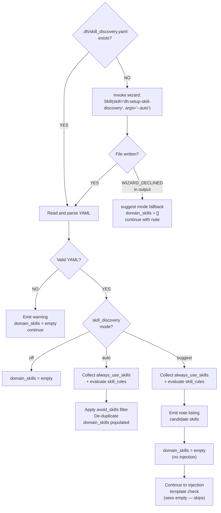

# Add New Feature (SAM Workflow)

You MUST convert the user's request into **durable SAM artifacts** registered via MCP artifact and SAM tools:

- `feature-context-{slug}.md` (discovery)
- `codebase/{FOCUS}.md` (optional, analysis)
- `architect-{slug}.md` (architecture/design spec)
- `P{id}-{slug}.yaml` (executable task plan with Agents, deps, and verification)

<feature_request>
$ARGUMENTS
</feature_request>

---

## Artifact Discovery (Pre-Phase)

Before starting any phase, check whether the feature request references a GitHub Issue. If an issue number is present, discover existing artifacts registered on that issue.

```mermaid
flowchart TD
    Start([Parse feature_request]) --> Q{Contains "GitHub Issue: #N"<br>or "Issue: #N" or "#N"?}
    Q -->|Yes — issue number found| List["Call artifact_list(issue_number=N)<br>to discover registered artifacts"]
    Q -->|No — no issue reference| Skip[Skip artifact discovery<br>Proceed normally]
    List --> Found{Artifacts returned?}
    Found -->|Yes| Store["Store artifact list as discovered_artifacts<br>Include paths and types in each<br>phase delegation prompt"]
    Found -->|No or empty| Skip
    Store --> Phase1([Proceed to Phase 1])
    Skip --> Phase1
```

When `discovered_artifacts` is non-empty, append this block to each phase delegation prompt:

```text
<prior_artifacts>
The following artifacts are already registered for this issue. Read any relevant
ones via artifact_read(issue_number={issue}, artifact_type="{type}") before
starting your work — they contain prior research and analysis that should
inform your output.

{for each artifact: "- {artifact_type}: {path}"}
</prior_artifacts>
```

Research-type artifacts (`artifact_type="research"`) are especially valuable — they contain investigation findings gathered before planning began. Phase agents should read these first when present.

---

## Orchestrator Discipline

You are an orchestrator. You coordinate work across specialized agents. Prefer delegating discovery and analysis.

---

## Shared Delegation Preamble

Every phase delegation prompt starts with this block. Fill `{work_type}`, `{feature_name}`, and `{issue}` from the values in the **Template Variables** section at the bottom of this skill.

```text
You are part of a team that is currently working on the {work_type} {feature_name}.
Read the details about the milestone and plan you are a part of at backlog_view(selector="#{issue}").

<quality_vigilance>
Your task among all other things you are doing is to be consistently striving for
product quality improvements and aligning with the design intent. If you see something
that seems misaligned, verify it, and then note your concerns and findings concisely
in your response in a <concerns></concerns> block. Point out duplication, contradictions,
statements of fact without citation, code smells, missing documentation.
</quality_vigilance>
```

---

## Plan Artifact Taxonomy

Plan artifacts are either **human-decision** (immutable — backlog items, grooming output, interview transcripts) or **generated** (mutable but intent-bound — feature context, architecture spec, task plan). Full taxonomy and divergence rules: [Plan Artifact Lifecycle Policy](../../docs/plan-artifact-lifecycle.md).

---

## Phase 1: Discovery (@dh:feature-researcher)

**WHAT / WHY only.** The feature-researcher produces problem space and desired outcome — not implementation approach. Output describes what is wanted and why; it does not prescribe how to build it.

Delegation prompt template:

```text
You are part of a team that is currently working on the {work_type} {feature_name}.
Read the details about the milestone and plan you are a part of at backlog_view(selector="#{issue}").

<quality_vigilance>
Your task among all other things you are doing is to be consistently striving for
product quality improvements and aligning with the design intent. If you see something
that seems misaligned, verify it, and then note your concerns and findings concisely
in your response in a <concerns></concerns> block. Point out duplication, contradictions,
statements of fact without citation, code smells, missing documentation.
</quality_vigilance>

Research #{issue}: "{title}".
If research artifacts exist for this issue, read them via
artifact_read(issue_number={issue}, artifact_type="research") before starting
discovery — they contain prior investigation findings that should be incorporated.
Produce feature-context-{slug}.md content with WHAT/WHY analysis — problem space, desired
outcome, stakeholders, risks, open questions.
Do NOT prescribe HOW to build it.
If the feature involves replacing or migrating a local module to an external tool,
you MUST perform a Replacement Coverage Analysis: enumerate all capabilities of the
local module, enumerate the replacement's capabilities, and produce a coverage matrix
(COVERED/PARTIAL/MISSING for each capability). Include the matrix in the feature-context
document. Surface any PARTIAL or MISSING capabilities as questions.

Register your deliverable with:
    artifact_type="feature-context"
    artifact_id="plan/feature-context-{slug}.md"
    issue_number={issue}
    agent="feature-researcher"
```

After the agent completes, verify the artifact was registered:

```text
mcp__plugin_dh_backlog__artifact_list(issue_number={issue}, artifact_type="feature-context")
```

If `count == 0`, the agent did not register the artifact. Re-dispatch with an explicit
reminder that `artifact_register(content=...)` is the agent's responsibility, not the
orchestrator's. The orchestrator MUST NOT call `artifact_register` as a workaround —
the MCP-native rule is that agents own their artifact storage.

---

## Phase 2: Codebase Analysis (@dh:codebase-analyzer)

**WHAT exists today only.** The codebase-analyzer maps existing patterns, conventions, and constraints — not proposed designs. Output describes what is there; it does not prescribe what to add or change.

If helpful, delegate to `@dh:codebase-analyzer` for one or more focus areas:

- patterns
- architecture
- testing
- conventions

Each focus area produces a markdown document. The agent returns the content in its response; the orchestrator then registers it as an artifact.

Delegation prompt template (one per focus area):

```text
You are part of a team that is currently working on the {work_type} {feature_name}.
Read the details about the milestone and plan you are a part of at backlog_view(selector="#{issue}").

<quality_vigilance>
Your task among all other things you are doing is to be consistently striving for
product quality improvements and aligning with the design intent. If you see something
that seems misaligned, verify it, and then note your concerns and findings concisely
in your response in a <concerns></concerns> block. Point out duplication, contradictions,
statements of fact without citation, code smells, missing documentation.
</quality_vigilance>

Analyze {focus_area} for #{issue}: "{title}".
Produce {focus_area}.md content documenting what exists today — patterns,
conventions, constraints.
Do NOT prescribe changes.

Register each document with:
    artifact_type="codebase-analysis"
    artifact_id="codebase-{focus}-{slug}"  (logical id — use lowercase focus area, e.g. codebase-patterns-{slug})
    issue_number={issue}
    agent="codebase-analyzer"

A single invocation covering multiple focus areas issues one artifact_register call per
focus area with a distinct artifact_id per focus.
```

After the agent completes, verify the artifact was registered:

```text
mcp__plugin_dh_backlog__artifact_list(issue_number={issue}, artifact_type="codebase-analysis")
```

If `count == 0`, the agent did not register the artifact. Re-dispatch with an explicit
reminder that `artifact_register(content=...)` is the agent's responsibility, not the
orchestrator's. The orchestrator MUST NOT call `artifact_register` as a workaround —
the MCP-native rule is that agents own their artifact storage.

---

## Phase 3: Architecture Spec (design-spec role)

**HOW only.** The design-spec agent designs the implementation approach — interfaces, data models, module boundaries, and call flows. Output prescribes structure and contracts; it does not re-describe the problem or re-map existing code.

Resolve the `design-spec` role from the language manifest before delegating:

```mermaid
flowchart TD
    Scan[Scan project root for language markers] --> Found{Marker found?}
    Found -->|pyproject.toml| Py[Search Python language manifest]
    Found -->|package.json| TS[Search TypeScript language manifest]
    Found -->|Cargo.toml| Rust[Search Rust language manifest]
    Found -->|None| FB[Fallback: dh:task-worker<br>(no specialist profile loaded)]
    Py --> ManifestFound{Manifest exists?}
    TS --> ManifestFound
    Rust --> ManifestFound
    ManifestFound -->|Yes| Resolve["Resolve design-spec role from manifest<br>(Python: @python3-development:python-cli-design-spec)"]
    ManifestFound -->|No| FB
    Resolve --> Delegate[Delegate to resolved agent]
    FB --> Delegate
```

### Domain Signal Detection — Config-Driven (`.dh/skill_discovery.yaml`)

Before constructing the architect delegation prompt, populate `{domain_skills}` by reading
the project's skill discovery configuration.

<!-- Source: .dh/skill_discovery.yaml — project-specific skill discovery config.
     To configure or update: /dh:setup-skill-discovery -->

#### Step 1: Locate the config file

Check whether `.dh/skill_discovery.yaml` exists in the project root.



#### Step 2: Collect `{domain_skills}`

When file is present, valid YAML, and `skill_discovery` mode is not `off`:

1. Add all `always_use_skills` entries unconditionally
2. For each `skill_rules` entry: evaluate `when:` using **LLM reasoning** against the
   `feature_request` text — if the condition is satisfied, add all skills in `use:` to the set
3. Remove any skills listed in `avoid_skills`
4. `prefer_skills` entries are tiebreaker advisory — do not add unconditionally
5. De-duplicate the collected set

**Suggest mode**: When `skill_discovery` mode is `suggest`, Steps 1–5 above still execute
(so the candidate list is accurate), but the collected skills are emitted as a note to the
user listing what **would** be injected — they are not actually injected. After emitting the
note, set `domain_skills` to empty and continue to the injection template check (which sees
empty and skips injection).

#### `when:` Evaluation Semantics — LLM Reasoning

Evaluate each `when:` field as a natural-language condition against the semantic content of
the `feature_request`. The rule fires if the condition is **unambiguously satisfied**. Do not
fire speculatively when uncertain.

**Example:** `when: "involves Python, pytest, or uv"` + feature about "pytest fixture for
database" → **fires**

**Example:** same rule + feature about "dark mode toggle button" → **does not fire**

#### Step 3: Inject into architect prompt

If `{domain_skills}` is non-empty, prepend this block at the very top of the architect
delegation prompt, before the shared preamble and before any artifact reads.

**Ordering constraint when `<prior_artifacts>` is also present:** the domain skill block
MUST come first — it is a blocking prerequisite that must complete before any artifact
reads occur. Place domain skills → then prior_artifacts → then the delegation prompt body.
If `{domain_skills}` is empty, prior_artifacts placement is unchanged.

#### Wizard Invocation Protocol

When `.dh/skill_discovery.yaml` does not exist:

1. Inform the user: `"No .dh/skill_discovery.yaml found. Running skill discovery wizard..."`
2. Invoke: `Skill(skill="dh:setup-skill-discovery", args="--auto")` (programmatic context)
3. After wizard returns: re-check for the file (recurse once only)
4. If file still absent (`WIZARD_DECLINED` in wizard output): apply suggest-mode fallback

**Suggest-mode fallback note:**

> Note: No `.dh/skill_discovery.yaml` configured. Skills that may be relevant:
> [judgment-based list based on `feature_request` content].
> To configure permanently: `/dh:setup-skill-discovery`. Continuing without domain skill injection.

Set `{domain_skills}` to empty and continue without blocking.

<domain-skill-injection-template>
Before starting design work, load these domain skills — they define the schemas, APIs,
and delivery conventions required for this feature type:

{domain_skills formatted as Skill(skill="...") calls}

These are BLOCKING prerequisites — do not read any artifacts or write any design until
all Skill() calls above have completed. Training data is not a substitute for live schema
documentation loaded by these skills.
</domain-skill-injection-template>

If `{domain_skills}` is empty, do not add any skill-loading block — proceed directly to
the delegation prompt below without modification.

Delegation prompt template:

```text
You are part of a team that is currently working on the {work_type} {feature_name}.
Read the details about the milestone and plan you are a part of at backlog_view(selector="#{issue}").

<quality_vigilance>
Your task among all other things you are doing is to be consistently striving for
product quality improvements and aligning with the design intent. If you see something
that seems misaligned, verify it, and then note your concerns and findings concisely
in your response in a <concerns></concerns> block. Point out duplication, contradictions,
statements of fact without citation, code smells, missing documentation.
</quality_vigilance>

Design the implementation for #{issue}: "{title}".
Read the feature context via artifact_read(issue_number={issue}, artifact_type="feature-context").
[If codebase analysis exists: Read via artifact_read(issue_number={issue}, artifact_type="codebase-analysis").]
If research artifacts exist for this issue, read them via
artifact_read(issue_number={issue}, artifact_type="research") for prior research
findings that should inform the architecture.
Produce architect-{slug}.md content with interfaces, contracts, data models, module boundaries.
Do NOT implement — define WHAT to build, not the code.

Register your deliverable with:
    artifact_type="architect"
    artifact_id="plan/architect-{slug}.md"
    issue_number={issue}
    agent="python-cli-design-spec"
```

After the agent completes, verify the artifact was registered:

```text
mcp__plugin_dh_backlog__artifact_list(issue_number={issue}, artifact_type="architect")
```

If `count == 0`, the agent did not register the artifact. Re-dispatch with an explicit
reminder that `artifact_register(content=...)` is the agent's responsibility, not the
orchestrator's. The orchestrator MUST NOT call `artifact_register` as a workaround —
the MCP-native rule is that agents own their artifact storage.

---

## Phase 4: Task Decomposition (@dh:swarm-task-planner)

Delegate to `@dh:swarm-task-planner` to:

- create `plan/P{id}-{slug}.yaml` (via `sam create`)
- ensure every task has:
  - **Status**, **Dependencies**, **Priority**, **Complexity**, **Agent**
  - Acceptance Criteria (3+)
  - Verification Steps (3+)

Delegation prompt template:

```text
You are part of a team that is currently working on the {work_type} {feature_name}.
Read the details about the milestone and plan you are a part of at backlog_view(selector="#{issue}").

<quality_vigilance>
Your task among all other things you are doing is to be consistently striving for
product quality improvements and aligning with the design intent. If you see something
that seems misaligned, verify it, and then note your concerns and findings concisely
in your response in a <concerns></concerns> block. Point out duplication, contradictions,
statements of fact without citation, code smells, missing documentation.
</quality_vigilance>

Decompose #{issue}: "{title}" into executable tasks.
Read the architecture spec via artifact_read(issue_number={issue}, artifact_type="architect").
Read the feature context via artifact_read(issue_number={issue}, artifact_type="feature-context").
Goal: {goal_from_feature_request}
Create the plan via sam_plan with CLEAR+CoVe task definitions.

REQUIRED — skills field propagation:
The domain skills identified in Phase 3 are:
{domain_skills}

Every task in the generated plan MUST include a `skills` field populated with ALL of
these domain skills as a YAML list. Example:

  skills:
    - plugin-creator:hook-creator
    - plugin-creator:hooks-io-api

If `{domain_skills}` is empty (no domain signals were detected in Phase 3), omit the
`skills` field from all tasks — do not add an empty list.

The `skills` field is consumed by `implement-feature` to inject skill-loading instructions
into each implementation agent's prompt. Omitting it means implementation agents proceed
without domain schema context.
```

After the agent completes, write the plan path back to the backlog item:

```text
mcp__plugin_dh_backlog__backlog_update(
    selector="{title}",
    plan="P{id}"
)
```

Note: `sam_plan(action='create', issue={issue})` already auto-registers the `task-plan`
artifact. Do NOT call `artifact_register` for the `task-plan` type — it is redundant and
would create a duplicate entry.

The `backlog_update(plan=...)` call writes the plan address into the backlog item's `metadata.plan`
field. This is a backend signal — it records that a plan exists and its address, not a filesystem
path. `work-backlog-item` uses this to route directly to `implement-feature` on subsequent
invocations. The SAM MCP resolves `P{id}` to the full plan without filesystem access.

---

## Phase 5: Plan Validation Gate (@dh:plan-validator)

Delegation prompt template:

```text
You are part of a team that is currently working on the {work_type} {feature_name}.
Read the details about the milestone and plan you are a part of at backlog_view(selector="#{issue}").

<quality_vigilance>
Your task among all other things you are doing is to be consistently striving for
product quality improvements and aligning with the design intent. If you see something
that seems misaligned, verify it, and then note your concerns and findings concisely
in your response in a <concerns></concerns> block. Point out duplication, contradictions,
statements of fact without citation, code smells, missing documentation.
</quality_vigilance>

Validate plan P{N} for #{issue}: "{title}".
Check: AC coverage, dependency DAG, agent assignments, verification steps,
impact radius coverage.
Return READY or BLOCKED with specific gaps.
```

If the validator returns `BLOCKED`, do not proceed to Phase 6. Fix the identified gaps and re-run Phase 4 before retrying Phase 5.

---

## Phase 6: Context Manifest (@dh:dh-context-gathering)

Delegation prompt template:

```text
You are part of a team that is currently working on the {work_type} {feature_name}.
Read the details about the milestone and plan you are a part of at backlog_view(selector="#{issue}").

<quality_vigilance>
Your task among all other things you are doing is to be consistently striving for
product quality improvements and aligning with the design intent. If you see something
that seems misaligned, verify it, and then note your concerns and findings concisely
in your response in a <concerns></concerns> block. Point out duplication, contradictions,
statements of fact without citation, code smells, missing documentation.
</quality_vigilance>

Add context manifest to plan P{N} for #{issue}: "{title}".
Read the plan via sam_plan. Write the context manifest via sam_plan.
```

---

## Template Variables

Fill these values before constructing each delegation prompt. All values come from context already in scope — no pre-gathering required.

| Variable | Source |
|---|---|
| `{issue}` | GitHub issue number from the backlog item or user request |
| `{title}` | GitHub issue title from `backlog_view(selector="#{issue}")` |
| `{slug}` | Kebab-case identifier derived from the issue title (e.g., `agent-profile-mcp-tool`) |
| `{work_type}` | "production of the feature" for new features; "fixing of an issue in" for bug fixes |
| `{feature_name}` | Human-readable feature name from the issue title |
| `{focus_area}` | One of: `patterns`, `architecture`, `testing`, `conventions` (Phase 2 only) |
| `{goal_from_feature_request}` | The one-sentence goal extracted from the feature context doc (Phase 4 only) |
| `{domain_skills}` | Pre-formatted YAML list lines (e.g., `- plugin-creator:hook-creator`) collected by the Phase 3 domain signal scan; empty string if no signals matched; passed verbatim into Phase 4 delegation prompt |
| `{N}` | SAM plan number returned by `sam_plan` after Phase 4 completes |

---

## Success Outcome

When all phases complete, provide the user:

- the feature slug
- the task file path
- next step: run the `implement-feature` skill with the slug or task file path
