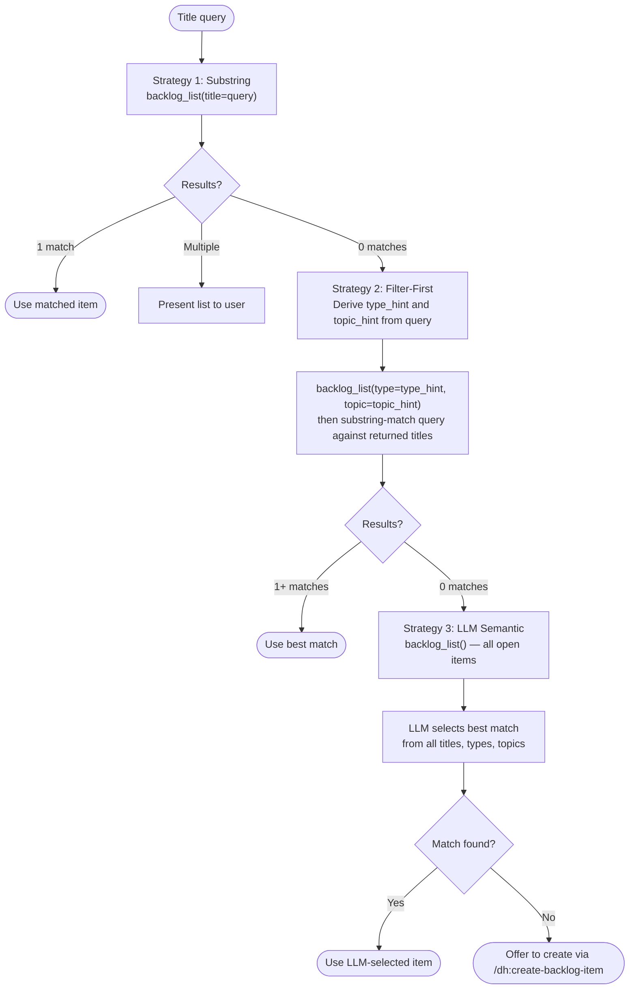

<p align="center">
  
</p>

# Backlog Skill

A unified interface for managing backlog items and GitHub Issues from inside Claude Code sessions. Every item lives in two places at once: a local Markdown file in `~/.dh/projects/{slug}/backlog/` that Claude can read instantly, and a GitHub Issue that humans can browse, comment on, and track. The skill keeps them in sync automatically.

## Why Use This?

Without a structured backlog, ideas raised during a session evaporate. Work gets started before it is understood. Priorities get decided by whoever shouts loudest. This skill enforces a discipline: capture first, groom next, work last.

With this skill active:

- Claude captures every identified task, bug, or idea into a durable local file and a GitHub Issue before work begins
- Items move through a defined lifecycle — `needs-grooming` → `groomed` → `in-milestone` → `in-progress` → `done` — with no skipped steps
- GitHub Issues are the permanent record; local files are the fast-access cache
- Completed work leaves an audit trail: what was done, how, what was learned, what was deferred

## What You Get

### The Local Cache

Each item is a Markdown file at `~/.dh/projects/{slug}/backlog/{priority}-{slug}.md`. The file uses YAML frontmatter for machine-readable metadata and structured Markdown sections for human-readable content.

```text
~/.dh/projects/{slug}/backlog/
  p0-reduce-session-start-context-load.md
  p1-add-fuzzy-duplicate-detection.md
  p2-unify-issue-body-template.md
  ideas-convert-backlog-to-mcp-server.md
  completed-replace-requests-with-httpx.md
```

Priority tiers map directly to file prefixes:

| Prefix | Priority | Meaning |
|--------|----------|---------|
| `p0-` | P0 | Must-have — blocks other work |
| `p1-` | P1 | Should-have — high value |
| `p2-` | P2 | Could-have — lower urgency |
| `ideas-` | Ideas | Exploratory — not yet assessed |

### The MCP Interface (Primary)

Twelve MCP tools are available to Claude in orchestrator sessions via the `mcp__plugin_dh_backlog__` prefix. These are the normal way Claude interacts with the backlog during a session.

| Tool | What it does |
|------|-------------|
| `backlog_add` | Create a new item and optionally a GitHub Issue |
| `backlog_list` | List open items with optional filters |
| `backlog_view` | View one item in full detail (with pagination) |
| `backlog_sync` | Push local items to GitHub, create missing issues |
| `backlog_close` | Dismiss an item (duplicate, out-of-scope, wontfix, etc.) |
| `backlog_resolve` | Mark an item done with a completion summary |
| `backlog_update` | Attach a plan, set status, or write groomed content |
| `backlog_groom` | Write or update the groomed section of an item |
| `backlog_normalize` | One-off maintenance: rewrite files to canonical format |
| `backlog_pull` | Pull issue body content from GitHub into local files |
| `backlog_list_comments` | List comments on a GitHub issue |
| `backlog_read_comment` | Read a specific comment body |

The MCP server also exposes `artifact_*` tools for plan artifact management and `dispatch_*` tools for milestone wave orchestration. See `/dh:backlog` for the complete reference.

### The CI/CLI Interface (Fallback)

GitHub Actions and environments without an MCP client use `fastmcp call` against the server script directly:

```bash
FASTMCP_SHOW_SERVER_BANNER=false FASTMCP_LOG_ENABLED=false \
uv run fastmcp call \
  --command "uv run --script plugins/development-harness/scripts/run_backlog_server.py" \
  backlog_list \
  '{}'
```

Available tools via this interface mirror the MCP tools: `backlog_add`, `backlog_list`, `backlog_view`, `backlog_sync`, `backlog_close`, `backlog_resolve`, `backlog_update`, `backlog_groom`, `backlog_normalize`, `backlog_pull`, and the remaining tools exposed by the server.

### Companion Skills

The backlog skill is the engine. These skills are the user-facing entry points:

| Skill | Purpose |
|-------|---------|
| `/dh:create-backlog-item` | Capture a new item — calls `backlog_add` |
| `/dh:work-backlog-item` | Work through an item end-to-end — calls list, view, update, close, resolve |
| `/dh:groom-backlog-item` | Fact-check and assess an item — calls `backlog_groom` and `backlog_update` |
| `/dh:group-items-to-milestone` | Assign groomed items to a GitHub milestone |

## Item Lifecycle

Items follow a defined state machine. No step can be skipped.

```text
[created]
    |
    v
needs-grooming  ---> blocked (missing info)
    |                   |
    v                   v (user provides info)
groomed         <--- needs-grooming
    |
    v
in-milestone    (assigned to a GitHub milestone)
    |
    v
in-progress     (SAM plan file created, work underway)
    |
    +---> done      (AC verified PASS, checklist 100%)
    |
    +---> resolved  (closed with reason, no full implementation)
              |
              v
           closed   (milestone archived — terminal state)
```

GitHub labels track state in parallel:

```text
status:needs-grooming   status:groomed      status:blocked
status:in-milestone     status:in-progress  status:verified
status:done             status:resolved     status:closed
```

`status:verified` is applied by `/dh:complete-implementation` after quality gates pass (not part of
the lifecycle state machine, but required by `backlog_resolve` for SAM items with a plan).

The backlog tools manage label transitions. Do not set labels with `gh label` directly — use `backlog_update` with the `status` parameter instead.

## Item Schema

Each per-item file has required frontmatter and structured body sections.

### Frontmatter

```yaml
---
name: "Fix duplicate detection before creating new items"
description: "New items can be created without checking for near-duplicates."
metadata:
  topic: fix-duplicate-detection
  source: "Session observation"
  added: 2026-03-03
  priority: P1
  type: Bug
  status: needs-grooming
  groomed: 2026-03-03          # set by groom-backlog-item
  issue: '#142'                # set on GitHub issue creation
  milestone: 5                 # set by group-items-to-milestone
  plan: plan/tasks-7-slug.md   # set by work-backlog-item
---
```

### Body Sections

Sections are populated incrementally as the item moves through the lifecycle. A newly created item has Description and Acceptance Criteria. Downstream skills add the rest.

```text
1.  Description                    (written by: create-backlog-item)
2.  Acceptance Criteria            (written by: create-backlog-item)
3.  Research First                 (optional — written by: create-backlog-item)
4.  Suggested Location             (optional — written by: create-backlog-item)
5.  Fact-Check                     (written by: groom-backlog-item Step 4)
6.  RT-ICA                         (written by: groom-backlog-item Step 5)
7.  Groomed                        (written by: backlog-item-groomer agent)
    Reproducibility, Priority, Impact, Scope, Output/Evidence,
    Dependencies, Research, Skills, Agents, Prior Work, Files, Decision
8.  Acceptance Criteria Verification (written by: work-backlog-item close)
```

An item is **fully groomed** only when all required sections (Fact-Check, RT-ICA, Reproducibility, Dependencies, Skills, Agents, Prior Work) are present. Partial grooming is not groomed.

## MCP Tool Reference

All tools return a dict. Check for the `"error"` key before consuming result fields. Every response includes `messages` and `warnings` lists (may be empty).

```text
Error:   {"error": "<message>", "messages": [...], "warnings": [...]}
Success: {<result fields>,      "messages": [...], "warnings": [...]}
```

The tools `backlog_sync`, `backlog_groom`, `backlog_normalize`, and `backlog_pull` emit
progress messages via the MCP context during execution. You will see status messages at the
start and end of operations and warning messages for any issues encountered. These messages
appear in the MCP client's progress stream and do not affect the return value.

### `backlog_add` — Create an item

```python
mcp__plugin_dh_backlog__backlog_add(
    title="Fix duplicate detection before creating new items",
    priority="P1",              # P0, P1, P2, or Ideas
    description="New items can be created without checking for near-duplicates.",
    source="Session observation",
    type="Bug",                 # Feature, Bug, Refactor, Docs, or Chore
    force=False,                # skip fuzzy duplicate check
)
# Returns: {filepath, filename, title, priority, issue_num?, messages, warnings}
```

### `backlog_list` — List open items

```python
mcp__plugin_dh_backlog__backlog_list(
    from_github=False,          # refresh local cache from GitHub first
    label="priority:p1",        # filter by GitHub label
    section="P1",               # filter by priority: P0, P1, P2, Ideas
    status="needs-grooming",    # filter by status value
    title="duplicate",          # filter by title substring
    type="Bug",                 # filter by metadata.type — case-insensitive exact match
    topic="matching",           # filter by metadata.topic — case-insensitive substring match
)
# Every response item always includes state (open/closed) and status (workflow status)
# Returns: {items: [{title, priority, issue, plan, type, topic}], backend: {...}, messages, warnings}
```

The `backend` dict is always present in the response, regardless of the `from_github` parameter.
It reports the GitHub API availability status checked on every `backlog_list` call.

```python
# backend dict shape
{
    "name": "GitHub",
    "availability": "reachable",   # see BackendAvailability values below
    "open_count": 47,              # live open issue count (0 when not reachable)
    "total_count": 123,            # live total issue count (0 when not reachable)
    "cache_open_count": 45,        # open count from local cache (same filters as items)
    "cache_total_count": 120,      # total count from local cache
    "last_sync": "2026-03-23T10:30:00Z",  # ISO timestamp of most recent sync (empty string if never synced)
    "error": "",                   # error message if availability is not "reachable"
}
```

`cache_open_count` reflects the same label/section/status/title/type/topic filters used for the
`items` result — it is derived from the same local list, not a separate count (ADR-5).

#### BackendAvailability Values

| Value | Meaning |
|-------|---------|
| `reachable` | GitHub API responded successfully |
| `not_checked` | Probe has not run yet (default initial state) |
| `needs_authentication` | `GITHUB_TOKEN` is not set |
| `rate_limited` | Received 403 from GitHub API |
| `error` | Other error during the availability probe |

The probe runs on every `backlog_list` call regardless of the `from_github` parameter (ADR-2).
No automatic sync is performed — the tool reports status only (ADR-3).

`type` and `topic` filters compose with AND logic. Items missing the filtered field are excluded
when that filter is active. The returned `type` and `topic` fields enable downstream semantic
matching without a second `backlog_view` call per item.

#### Matching Behavior — 3-Strategy Fallback Chain

`/dh:work-backlog-item` Step 1 uses `backlog_list` as the backing store for a 3-strategy fallback
chain when resolving a user query to a backlog item:



Strategy 2 derives `type_hint` from keyword groups in the query (`bug`/`fix`/`error` → `Bug`,
`feature`/`add`/`new` → `Feature`, etc.) and `topic_hint` from the longest non-stop-word.
Strategy 3 loads all open items and uses the LLM to pick the best semantic match.

`/dh:complete-implementation` follow-up routing uses Strategies 1 and 2 only — Strategy 3 is
excluded because follow-up filenames are machine-derived slugs with low semantic fidelity against
human-authored backlog titles.

### `backlog_view` — View one item

```python
mcp__plugin_dh_backlog__backlog_view(
    selector="#142",            # GitHub issue URL, #N, bare number, or title substring
    offset=0,                   # skip N entry blocks (for pagination)
    limit=0,                    # show at most N entry blocks (0 = all, no truncation)
)
# Returns: {title, priority, issue, plan, file_path, body, groomed, messages, warnings}
```

### `backlog_sync` — Sync to GitHub

```python
mcp__plugin_dh_backlog__backlog_sync(dry_run=False)
# Returns: {created, pushed, messages, warnings}
# Progress: emits ctx.info() at start/end; ctx.warning() for each warning
```

### `backlog_close` — Dismiss an item

Use for duplicates, out-of-scope items, superseded items, wontfix, or permanently blocked items. For completed work, use `backlog_resolve`.

```python
mcp__plugin_dh_backlog__backlog_close(
    selector="Fix duplicate detection",
    reason="duplicate",         # duplicate, out_of_scope, superseded, wontfix, blocked
    reference="#139",           # related item this duplicates or is superseded by
    comment="Covered by #139.", # additional context
    cleanup=False,              # remove local file after close
    force=False,                # close even if open PRs reference the issue
)
# Returns: {title, reason, closed, messages, warnings}
```

### `backlog_resolve` — Mark an item done

```python
mcp__plugin_dh_backlog__backlog_resolve(
    selector="#142",
    summary="Added fuzzy title matching before item creation.",
    plan="plan/tasks-7-duplicate-detection.md",
    method="Levenshtein distance check in add_item()",
    notes="Edge case: exact-match titles with different casing needed normalization.",
    follow_ups="#155",          # comma-separated follow-up issue refs
    findings="Fuzzy threshold of 0.85 works well for backlog titles.",
    cleanup=False,
    force=False,
)
# Returns: {title, summary, resolved, messages, warnings}
```

### `backlog_update` — Update an item

```python
mcp__plugin_dh_backlog__backlog_update(
    selector="#142",
    plan="plan/tasks-7-slug.md",          # attach a plan file
    status="in-progress",                  # set item status
    verified=False,                        # apply status:verified label (SAM items only)
    groomed_content="### Priority\n...",   # full groomed section replacement
    section="Priority",                    # incremental section update
    content="P1 — blocks item creation.", # content for named section
    title="New title",                     # rename item and GitHub issue
    description="New description.",        # update description (local only)
)
# Returns: {title, changes, messages, warnings}
```

The `verified=True` parameter applies the `status:verified` label to the linked GitHub Issue and
removes `status:in-progress` if present. It is called automatically by `/dh:complete-implementation`
after quality gates pass. The `status:verified` label is a prerequisite for
`/dh:work-backlog-item resolve` on SAM items — resolve is blocked if the label is absent (bypass with
`force=True` on resolve).

### `backlog_groom` — Write groomed content

```python
mcp__plugin_dh_backlog__backlog_groom(
    selector="#142",
    groomed_content="### Priority\nP1...\n### Dependencies\nNone.",  # full replacement
    section="Dependencies",    # or: incremental section update
    content="None.",
)
# Returns: {title, synced, messages, warnings}
# Progress: emits ctx.info() at start/end; ctx.warning() for each warning
```

### `backlog_normalize` — Normalize all files

```python
mcp__plugin_dh_backlog__backlog_normalize(dry_run=True)  # preview first
# Returns: {updated, messages, warnings}
# Progress: emits ctx.info() at start/end; ctx.warning() for each warning
```

### `backlog_pull` — Pull from GitHub

```python
# Pull a single item by selector
mcp__plugin_dh_backlog__backlog_pull(selector="#142")
# Returns: {file_path, messages, warnings}
# Progress: emits ctx.info() with item name; ctx.warning() for each warning

# Bulk pull all items
mcp__plugin_dh_backlog__backlog_pull(
    dry_run=False,
    force=False,   # overwrite local even if local is newer/longer
)
# Returns: {pulled, messages, warnings}
# Progress: emits ctx.info() at start/end; ctx.warning() for each warning
```

## GitHub Integration

The skill requires `GITHUB_TOKEN` in the environment for all GitHub operations. Set it before invoking MCP tools or the CLI.

What the integration provides:

- **Issue creation**: `backlog_add` always creates a GitHub Issue and stores the `#N` reference in local frontmatter
- **Label management**: State transitions update GitHub labels automatically (`status:needs-grooming`, `status:in-progress`, etc.)
- **Body sync**: Groomed content is synced to the issue body when the item has a linked issue
- **Milestone assignment**: `group-items-to-milestone` writes milestone number to both the local frontmatter and the GitHub Issue milestone field
- **PR safety**: `backlog_close` and `backlog_resolve` check for open PRs referencing the issue before closing (bypass with `force=True`)
- **Pull**: `backlog_pull` merges GitHub issue body content into local files, keeping the longer version of each section

GitHub Issues are the source of truth. The local `~/.dh/projects/{slug}/backlog/` files are a read-optimized cache that avoids API saturation during sessions.

## Syncing in CI

GitHub Actions environments without an MCP client use `fastmcp call` against the server script:

```bash
FASTMCP_SHOW_SERVER_BANNER=false FASTMCP_LOG_ENABLED=false \
uv run fastmcp call \
  --command "uv run --script plugins/development-harness/scripts/run_backlog_server.py" \
  backlog_sync \
  '{"dry_run": false}'
```

Set `BACKLOG_BACKEND=sqlite` or `BACKLOG_BACKEND=memory` to test without live GitHub credentials:

```bash
BACKLOG_BACKEND=memory FASTMCP_SHOW_SERVER_BANNER=false FASTMCP_LOG_ENABLED=false \
uv run fastmcp call \
  --command "uv run --script plugins/development-harness/scripts/run_backlog_server.py" \
  backlog_list '{}'
```

## Do Not

- Edit `~/.dh/projects/{slug}/backlog/*.md` files directly — bypasses sync logic
- Use `gh issue edit` to update issues — bypasses label and status tracking. Use `backlog_update` MCP tool instead.
- Set GitHub labels with `gh label` directly — the backlog tools own label transitions. Use `backlog_update` with `status` parameter instead.
- Call `backlog_close` for completed work — use `backlog_resolve` instead

If the MCP tools or CLI lack a needed operation, invoke `/dh:backlog-tools-administrator` to extend both simultaneously.

## Package Layout

```text
plugins/development-harness/
  backlog_core/                  Python package — MCP server and all business logic
    server.py                    FastMCP server (backlog + artifact + dispatch tools)
    models.py                    Pydantic models, constants, exceptions
    parsing.py                   File parsing, item search, frontmatter
    gh_client.py                 GitHub API: issue CRUD, labels, status
    operations.py                High-level CRUD combining all modules
    backends/                    Pluggable backend implementations
    tests/                       Test suite
  scripts/
    run_backlog_server.py        Entry point for the backlog MCP server
  skills/backlog/
    SKILL.md                     AI-facing instructions for this skill
    references/                  State machine, item schema, known patterns
    templates/                   Per-item and milestone archive templates
```

## Requirements

- Python 3.11 or newer
- `GITHUB_TOKEN` environment variable (for GitHub operations)
- `uv` for running the server script
- Dependencies (managed automatically by `uv run --script`): `fastmcp`, `pygithub`, `pydantic`, `ruamel.yaml`

---

> **The Ancient Woe**
>
> *The scatterbrained seneschal who begins building the roof before laying the floor!*

> **The Bard's Decree**
>
> *"Bring me the Master Ledger! We shall not strike a single nail until the grand backlog is written, prioritized, and bound!"*
