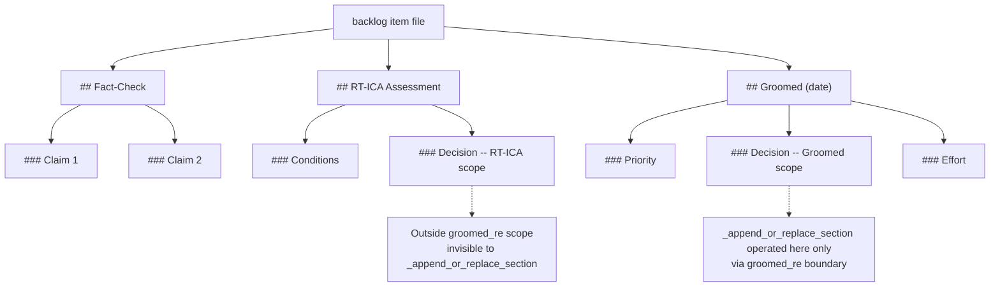

# Known Patterns — backlog_core Section Replacement

## YAML Format (Current — Post Pe1f2a3b4 Migration)

Backlog items are stored as `.yaml` files. Groomed fields (priority, effort, decision, fact-check,
rt-ica) are top-level YAML keys on the `BacklogItem` model. Updates go through
`save_item()` in `yaml_io.py`, which serialises the full model to disk atomically.

To update a single field on a `BacklogItem`, mutate the field and call `save_item(item, path)`.
There are no section-level helpers for the YAML format — the model is the single source of truth.

SOURCE: Pe1f2a3b4 YAML migration — `_md_append_or_replace_section`, `_md_replace_groomed_subsection`,
and `_md_build_section_block` were removed from `operations.py` after zero callers remained
(confirmed by grep, 2026-03-31).

## Legacy `.md` Format (Historical Reference Only)

The following patterns applied to `.md` backlog files before the Pe1f2a3b4 YAML migration. They are
preserved here for archaeological reference — the implementation no longer exists.

### Markdown Heading Regex Must Use `[^\n]*`

When matching a markdown heading by name prefix, the regex must absorb any trailing text on the
heading line before the newline.

**Wrong:** `### SectionName\s*\n` — only matches whitespace after the name. Fails on
`### Decision: BLOCKED`.

**Right:** `### SectionName[^\n]*\n` — matches any trailing text (`: BLOCKED`, `(2026-02-28)`,
etc.).

SOURCE: Session 2026-02-28 — `\s*` regex caused silent no-op when heading had `: BLOCKED`
suffix. Fix validated with 6 unit tests.

### Same Heading Name at Different Structural Levels Are Independent

The legacy `.md` backlog file had multiple structural scopes:

`_append_or_replace_section` operated within `## Groomed` only. A `### Decision` under
`## RT-ICA` was invisible to it.

SOURCE: Session 2026-02-28 — Updated Groomed Decision to UNBLOCKED but RT-ICA Decision still
showed BLOCKED because it lived outside the groomed regex scope.
