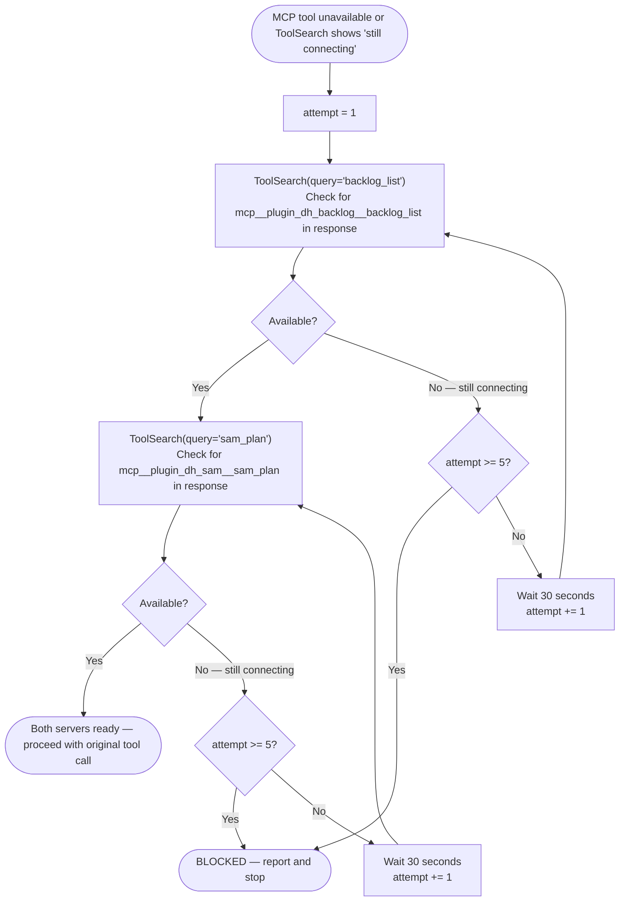

# MCP Server Connection Check

Both `mcp__plugin_dh_backlog__*` and `mcp__plugin_dh_sam__*` tools require their servers
to be connected before use. After a session disconnect and reconnect, these servers take
10–30 seconds to initialize due to stacked module-level costs at startup:

- `tiktoken.get_encoding("cl100k_base")` loaded at import time in both servers (~3–8 s cold)
- PyGithub and gitpython transitive imports (~2–5 s)
- Task/context backend initialization in the SAM server (~1–3 s)
- Two servers starting sequentially, not in parallel

Source: `backlog_core/server.py` line 65, `sam_schema/server.py` lines 68–78, 109.

## When to Apply This Procedure

Apply this procedure before any `mcp__plugin_dh_backlog__*` or `mcp__plugin_dh_sam__*`
tool call when any of the following is true:

- A tool call returns no result or a connection error
- `ToolSearch` response contains `"Some MCP servers are still connecting: plugin:dh:backlog"`
  or `"plugin:dh:sam"`
- Beginning a workflow immediately after a session restart or reconnect event

## Retry Procedure (up to 5 attempts)



**Step-by-step:**

1. Call `ToolSearch(query="backlog_list")` to check backlog server status.
   - Response lists `mcp__plugin_dh_backlog__backlog_list` → proceed to step 2.
   - Response says `"still connecting: plugin:dh:backlog"` → wait 30 s, increment attempt, repeat step 1.
   - After 5 attempts still connecting → report BLOCKED (see below).

2. Call `ToolSearch(query="sam_plan")` to check SAM server status.
   - Response lists `mcp__plugin_dh_sam__sam_plan` → both servers ready, proceed.
   - Response says `"still connecting: plugin:dh:sam"` → wait 30 s, increment attempt, repeat step 2.
   - After 5 attempts still connecting → report BLOCKED (see below).

3. Once both servers show as available, proceed with the original MCP tool call.

## BLOCKED Report Format

After 5 failed attempts (~2.5 minutes), output:

```text
BLOCKED — MCP server {plugin:dh:backlog | plugin:dh:sam} did not connect after 5 attempts
(~2.5 minutes). Cannot proceed with {skill name or tool name}.

To resolve: restart your Claude Code session. If the problem persists, check that uv is
installed and the plugin cache is current (see CLAUDE.md — Testing MCP Servers).
```

## SAM CLI Fallback

If the SAM server is unavailable and the task cannot wait, use the `uv run sam` CLI for
SAM-only operations. For backlog operations there is no CLI equivalent — the MCP server
must be available.

```bash
uv run sam list
uv run sam status P{N}
uv run sam ready P{N}
```
