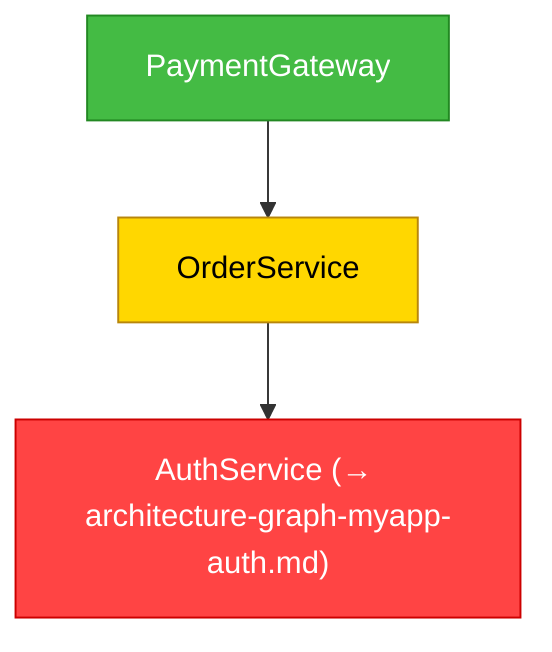
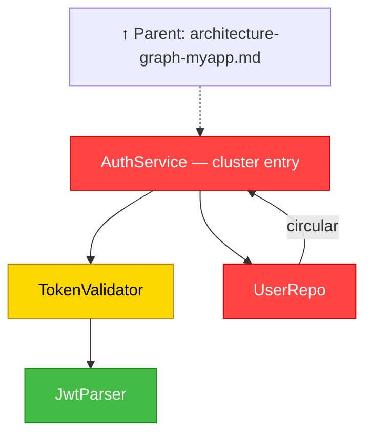
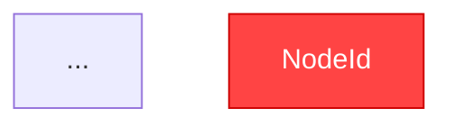
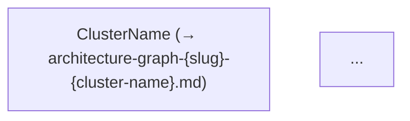
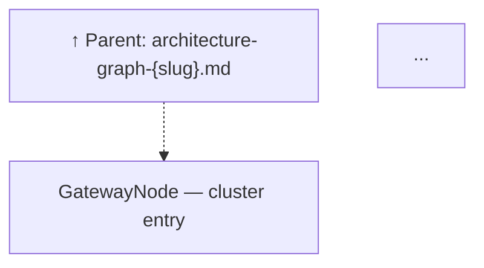

# Architecture Audit — Module Dependency Graph

Generates a Mermaid module-dependency graph with severity color-coding from import/include analysis of the project source. Registers the result as a `codebase-analysis` artifact.

## When to Invoke

Invoke when:

- A task explicitly asks for an architecture review, dependency graph, or coupling analysis
- Circular dependencies need to be detected and visualized
- Module-level coupling must be communicated visually to stakeholders
- Running as part of a broader code review that requires structural analysis

Do NOT invoke for:

- Line-level code quality findings — use `dh:code-review-python`, `dh:code-review-typescript`, etc.
- Test quality analysis (out of scope for this skill)

## SOP (Architecture Audit)

<workflow>

### Step 0: Determine Scope

Auto-detect the analysis scope before touching any source files. Use the **first** of the following that yields a non-empty file set:

1. `git diff --cached --name-only` — files staged for commit
2. `git diff --name-only` — unstaged working-tree changes
3. `git diff main...HEAD --name-only` (or `master...HEAD`) — PR-level changes; try both base branch names
4. **Entire project tree** — fall back when none of the above yields files (e.g., no git history or clean working tree)

Record the detected scope explicitly. It will appear at the top of every output report (e.g., `**Scope:** Full project tree — 360 Python files` or `**Scope:** PR diff — 12 files across 3 modules`).

When scope is a diff subset (cases 1–3), still build the full dependency graph (Steps 1–4) but **highlight** only nodes that appear in the diff set. Do not silently discard the broader graph — cross-boundary edges from diff nodes to stable nodes are the most important coupling signals.

### Step 1: Discover Source Modules

**1a. Probe for AST / knowledge-graph tools**

Before falling back to Glob, check whether a richer indexing skill is available in the current session. Try each probe in order and stop at the first success:

| Tool | Probe command | What it provides |
|---|---|---|
| `ccc` (CocoIndex Code) | `ccc search --limit 1 module imports` | Semantic index of modules, paths, and relationships already built from the codebase |
| `graphify` (global CLI, PyPI: `graphifyy`) | `which graphify` | AST knowledge graph via tree-sitter — local extraction, no API calls for code; outputs `graphify-out/graph.json` + `GRAPH_REPORT.md` |

**If `ccc` is available and initialized:**

1. Run a broad semantic search to enumerate the primary source modules:

   ```bash
   ccc search --limit 50 "module definition class function"
   ccc search --limit 50 "import dependency package"
   ```

2. Collect the returned file paths — these form the initial module set. Deduplicate and normalize to relative paths from the project root.
3. For each module file returned, also check its immediate file-level neighbors with a targeted search:

   ```bash
   ccc search --path '<module_dir>/*' --limit 20 "imports dependencies"
   ```

4. Merge all discovered file paths into the candidate module list and proceed to Step 1b for any gaps.

**If `graphify` is available (globally installed via `uv tool install graphifyy` / `pipx install graphifyy`):**

1. Probe availability: `graphify --version`. If the command fails or is not found, skip this branch.

2. Check whether `graphify-out/graph.json` already exists in the project root.
   - If it **does**, use it directly (it may have been committed to the repo for team use). Treat it as fresh unless it is older than 24 hours or the working tree has uncommitted source file changes, in which case run step 3.
   - If it **does not**, continue to step 3.

3. Build the graph (AST extraction is local — no API calls required for code files):

   ```bash
   graphify . --no-viz
   ```

   `--no-viz` skips the HTML output and produces only `graphify-out/graph.json` and `graphify-out/GRAPH_REPORT.md`.

4. Query the graph to enumerate modules and their dependency edges:

   ```bash
   graphify query "list all source code files and their import dependencies"
   graphify query "show circular imports and highly coupled modules"
   ```

   Also read `graphify-out/GRAPH_REPORT.md` — it summarizes **god nodes** (most-connected modules), **surprising connections**, and confidence-tagged relationships (`EXTRACTED`, `INFERRED`, `AMBIGUOUS`).

5. Use the graphify output to directly populate the module list (Step 1b candidate set), the import edges (Step 2), and the coupling/cycle pre-analysis (Steps 3–4). Only fall back to Grep for intra-project import parsing on nodes where graphify reported `AMBIGUOUS` confidence.

**1b. Glob-based fallback (always run if 1a produced < 20 modules or no tool was available)**

Use `Glob` to enumerate source files. Exclude generated code, vendor trees, and build artifacts:

| Language | Include patterns | Exclude |
|---|---|---|
| Python | `**/*.py` | `**/test_*.py`, `**/__pycache__/**`, `**/.venv/**` |
| TypeScript / JS | `**/*.ts`, `**/*.tsx`, `**/*.js`, `**/*.mjs` | `**/node_modules/**`, `**/dist/**`, `**/.next/**` |
| Go | `**/*.go` | `**/vendor/**` |
| Rust | `**/*.rs` | `**/target/**` |
| Java / Kotlin | `**/*.java`, `**/*.kt` | `**/build/**`, `**/target/**` |

**1b-ii. Claude plugin artifact discovery**

If any `plugin.json` files are found in the project (probe: `glob **/.claude-plugin/plugin.json` or `glob **/plugins/*/plugin.json`), this is a Claude plugin repository. Also discover the following as first-class graph nodes — they form the cross-language runtime invocation chain:

| Artifact | Glob patterns | Node type |
|---|---|---|
| Hook event configs | `**/hooks.json`, `**/.claude/settings.json` | `hook-config` |
| Hook scripts (CJS/MJS) | `**/hooks/*.cjs`, `**/hooks/*.mjs` | `hook-script` |
| Skill / agent / command docs | `**/skills/**/SKILL.md`, `**/agents/*.md`, `**/commands/*.md` | `skill-doc` |
| PEP 723 standalone scripts | `**/scripts/*.py` whose first line matches `#!/usr/bin/env.*--script` | `pep723-script` |

If no `plugin.json` is found, skip this sub-step entirely.

**Merge** Glob results with any paths already discovered in Step 1a, deduplicate, then limit the combined set to at most **200 modules**. If more exist, restrict to the top-level source directories and note the exclusion in the report.

### Step 1c: Language Detection and Module Namespace Establishment

Before running any import parsing, determine which languages are actually present and read the project's own config files to establish the **intra-project module namespace**. This is mandatory — without it, Step 2 cannot reliably distinguish a project's own modules from third-party packages.

**1c-i. Detect languages**

Tally file counts from the Step 1b glob results:

| Language present if… | Min files |
|---|---|
| Python | ≥ 1 `.py` file outside `**/test_*.py` |
| TypeScript / JS | ≥ 1 `.ts`, `.tsx`, `.js`, `.mjs`, or `.cjs` file outside `**/node_modules/**` |
| Go | ≥ 1 `.go` file outside `**/vendor/**` |
| Rust | ≥ 1 `.rs` file outside `**/target/**` |
| Java / Kotlin | ≥ 1 `.java` or `.kt` file outside `**/build/**` |

Record detected languages. A project may have multiple.

**1c-ii. Read project config per detected language**

For each detected language, read the relevant config file(s) to establish the module namespace. This determines which import paths are "owned by this project" vs. third-party.

| Language | Config file | What to extract |
|---|---|---|
| Python | `pyproject.toml` (`[project] name`), or `setup.py` (`name=`) | Package root name (e.g., `claude_skills`). All `import {name}.*` and `from {name}.*` are intra-project. Also note any `packages = find:` / `find_packages()` roots. |
| TypeScript / JS | `tsconfig.json` (`compilerOptions.baseUrl`, `compilerOptions.paths`) | Path alias prefixes (e.g., `@/` → `src/`). All aliased imports and relative imports (`./`, `../`) are intra-project. |
| Go | `go.mod` (first `module` directive) | Module path (e.g., `github.com/org/repo`). All imports beginning with this prefix are intra-project. |
| Rust | `Cargo.toml` (`[workspace] members`) | Workspace crate names. All `use {crate}::` for listed crate names are intra-project. |
| Java / Kotlin | `pom.xml` (`<groupId>`), or `build.gradle` (`group =`) | Group ID prefix (e.g., `com.example`). All imports beginning with this prefix are intra-project. |

If no config file exists for a detected language, use the top-level source directory name as the package root prefix (e.g., if source files live in `src/`, treat `src/` as the root).

Record the namespace map: `{ language → [intra-project prefixes] }`. Step 2 uses this map to filter imports.

**Example for this repository** (claude_skills):
- Python: `pyproject.toml` → `name = "claude_skills"` + source roots: `plugins/`, `scripts/`, `tests/`. Intra-project imports include `from backlog_core`, `from sam_schema`, `from dispatch_schema`, `from plugins.*`.
- JavaScript/TypeScript: `package.json` → `name = "claude_skills"`. Check `tsconfig.json` for path aliases. Relative imports (`./`, `../`) are always intra-project.

### Step 2: Parse Import Relationships

For each module, use `Grep` to extract import/include/require statements:

| Language | Grep pattern |
|---|---|
| Python | `^(import\|from\s+\S+\s+import)` |
| TypeScript / JS | `^(import\s\|const .* = require\()` |
| Go | `"` inside `import (…)` blocks |
| Rust | `^(use\|mod\s)` |
| Java / Kotlin | `^import\s` |

Map each import to its source module. Only record **intra-project** imports — ignore stdlib and third-party packages. A dependency exists when module A imports module B and B is in the discovered module set.

Normalize identifiers to short PascalCase labels for graph readability (e.g., `src/api/handler.ts` → `ApiHandler`, `auth/users.py` → `AuthUsers`).

### Step 2b: Extract Cross-Language Invocations from Skill/Agent/Command Docs

*Skip this step if no `plugin.json` was found in Step 1b-ii.*

For each `skill-doc` node (SKILL.md, agent `.md`, command `.md`) discovered in Step 1b-ii, use `Grep` to find shell invocations that cross language boundaries. Scan both inline backtick code spans and fenced code block lines.

| Grep pattern (applied per file) | Edge type | Example match in this repo |
|---|---|---|
| `` `node\s+["']?\$\{[^}]+\}[^`\s'"]+`` or `` `node\s+[^\s`'"]+`` | `invokes` | `` `node "${CLAUDE_SKILL_DIR}/scripts/parser/parse.mjs" "$ARGUMENTS"` `` |
| `` `uv run\s+(?:--\S+\s+)*[^\s`'"]+\.py`` | `spawns` | `` `uv run plugins/dh/scripts/migrate.py` `` |
| `` `python3?\s+[^\s`'"]+\.py`` | `spawns` | `` `python3 /tmp/cycle_detect.py` `` |

Also scan YAML frontmatter `command:` fields with pattern `^command:\s*(.+)$`.

For each match, record an edge:

- **Source:** the Markdown file path (normalized relative to project root)
- **Target:** the resolved script path — strip `${CLAUDE_SKILL_DIR}` and `${CLAUDE_PLUGIN_ROOT}` placeholders, resolving them against the Markdown file's own directory
- **Edge label:** `invokes` (Node.js target) or `spawns` (Python target via `uv run` or `python3`)

Node ID convention for Markdown files: last two path segments joined in PascalCase — e.g., `work-backlog-item/SKILL.md` → `WorkBacklogItemSkill`, `agents/architect.md` → `AgentsArchitect`.

### Step 2c: Extract Hook Event → Script Edges from Hook Configs

*Skip this step if no `plugin.json` was found in Step 1b-ii.*

For each `hook-config` node (`hooks.json`, `.claude/settings.json`) discovered in Step 1b-ii, read the file as JSON and walk the hook event structure:

1. For each top-level event key (`SessionStart`, `PreToolUse`, `PostToolUse`, `TaskCompleted`, `Stop`, `SubagentStart`, `SubagentStop`, etc.), collect every `"command"` string from all nested `"hooks"` arrays.
2. Extract the script path from each command string:
   - Pattern `node\s+"?\$\{CLAUDE_PLUGIN_ROOT\}([^"]+\.(cjs|mjs))"?` → `hook-script` node; resolve against the `hooks.json` directory
   - Pattern `uv run\s+([^\s]+\.py)` → `pep723-script` node
3. Record an edge:
   - **Source:** virtual node `{PluginDirName}Hook:{EventName}` (e.g., `DevelopmentHarnessHookSessionStart`)
   - **Target:** resolved script path
   - **Edge label:** `fires`

**Example** (from `plugins/development-harness/hooks/hooks.json`):

```json
"SessionStart": [{"hooks": [{"command": "node \"${CLAUDE_PLUGIN_ROOT}/hooks/session-start-session-id.cjs\""}]}]
```

→ Edge: `DevelopmentHarnessHookSessionStart` **--fires→** `hooks/session-start-session-id.cjs`

### Step 2d: Extract PEP 723 Inline Dependencies and `uv run` Spawn Edges

*Skip this step if no `plugin.json` was found in Step 1b-ii.*

**PEP 723 inline dependency blocks**

For each `pep723-script` node (Python file whose first line matches `#!/usr/bin/env.*--script`), extract its inline `# /// script` metadata block:

```bash
grep -n "^# /// script$" <file>
```

Read all lines between the `# /// script` marker and the closing `# ///`. Extract each quoted package name from `dependencies = [...]`. Record these as `ext-pkg` nodes connected to the script with `depends-on` edges. Render them as light-grey hexagon nodes (`{{pkg-name}}` in Mermaid) — they convey runtime requirements without polluting the coupling analysis.

**`uv run <path>` spawn edges across all source files**

Search all in-scope files for `uv run` invocations that reference a local `.py` path:

```bash
grep -rn "uv run[^|&;\n]*\.py" <scope-root> \
  --include="*.py" --include="*.cjs" --include="*.mjs" --include="*.md"
```

For each match where the referenced path resolves to a file in the project tree, record an edge:

- **Source:** the file containing the invocation
- **Target:** the resolved `.py` path
- **Edge label:** `spawns`

This connects, for example, a `.cjs` hook that calls `uv run scripts/foo.py` directly to the Python script in the graph.

**MCP tool call references**

In Markdown files (`skill-doc` nodes), scan for `mcp__<server>__<tool>` patterns (e.g., `mcp__plugin_dh_backlog__artifact_register`). Record each distinct tool name as an `mcp-call` node (Mermaid hexagon shape: `{{mcp__server__tool}}`) with a `calls` edge from the containing Markdown file. Group all calls to the same MCP server under one server node to avoid node explosion.

### Step 3: Detect Circular Dependencies

**Do not attempt to trace cycles mentally across the full module graph.** Use one of the following executable methods, in priority order:

**3a-i. Prefer graphify output (when available from Step 1a)**

If `graphify` was run and produced `graphify-out/GRAPH_REPORT.md`, read that file. It explicitly lists circular imports and confidence-tagged (`EXTRACTED`, `INFERRED`, `AMBIGUOUS`) dependency relationships. Use it as the authoritative cycle list. Only fall back to 3a-ii if graphify output is absent or the report contains only `AMBIGUOUS` entries for the modules in question.

**3a-ii. Run a cycle-detection script**

Write the following script to `/tmp/cycle_detect.py` and execute it with `python3 /tmp/cycle_detect.py <project_root>`. It reads the adjacency list built in Step 2 (passed via stdin as JSON or reconstructed from the module set) and prints all cycles found.

```python
#!/usr/bin/env python3
"""Cycle detection for architecture audit. Reads adjacency JSON from stdin."""
import json, sys
from collections import defaultdict

data = json.loads(sys.stdin.read())  # {module: [dep, dep, ...]}
graph = {k: set(v) for k, v in data.items()}

visited, in_stack, cycles = set(), set(), []

def dfs(node, path):
    if node in in_stack:
        idx = path.index(node)
        cycles.append(path[idx:] + [node])
        return
    if node in visited:
        return
    visited.add(node)
    in_stack.add(node)
    path.append(node)
    for neighbor in graph.get(node, []):
        if neighbor in graph:
            dfs(neighbor, path)
    path.pop()
    in_stack.discard(node)

for m in graph:
    if m not in visited:
        dfs(m, [])

print(json.dumps({"cycles": cycles, "count": len(cycles)}))
```

To run: serialize the filtered adjacency map from Step 2 to JSON, pipe it into the script, and parse the output. Every module that appears in any cycle is classified **critical**.

**3a-iii. Coupling metrics**

After cycle classification, compute in-degree + out-degree for each node from the filtered adjacency map built in Step 2:

- Degree ≥ 10 → **high-coupling** (warning) unless already critical.
- All others → **clean**.

### Step 3b: Conway's Law Alignment Check

Conway's Law states that a system's module structure mirrors the communication structure of the team that built it. Check whether module cluster boundaries align with the project's stated team/ownership structure.

**3b-i. Find team/ownership signals**

Look for the following, in order:

1. `CODEOWNERS` (`.github/CODEOWNERS` or `CODEOWNERS` at root) — each path pattern and its owning team
2. Top-level directory names under `src/`, `packages/`, `plugins/`, or `lib/` — each directory is treated as a domain boundary
3. Package naming conventions (e.g., `@org/auth-*`, `com.example.auth.*`) — shared prefix segments indicate intended domains

**3b-ii. Compare cluster boundaries to ownership boundaries**

For each cluster identified in Step 5b, check whether all modules in the cluster fall under the same CODEOWNERS pattern or top-level directory.

A **Conway violation** occurs when:
- A single cluster contains modules from two or more distinct CODEOWNERS paths (different teams own different parts of what the graph treats as one cohesive unit)
- OR a single team's modules are split across two or more clusters (what belongs together architecturally is fragmented in the graph)

**3b-iii. Record Conway findings**

Each violation is a finding of class **Conway**. Add it to the Findings section (see Output Format). Conway findings do not affect the red/yellow/green node coloring (which is reserved for circular deps and coupling) but must appear in the Findings section separately.

**Example for this repository** (claude_skills):
- Top-level domain boundaries: `plugins/development-harness/`, `plugins/plugin-creator/`, `scripts/`, `tests/`
- Each `plugins/{name}/` directory is an intended domain. If the graph clusters `backlog_core` and `sam_schema` into separate clusters, that is a Conway violation because both live under `plugins/development-harness/` and are owned together.

### Step 4: Color-Code Nodes

| Class | Condition | Fill | Stroke |
|---|---|---|---|
| Critical | Participates in a circular dependency | `#FF4444` | `#CC0000` |
| Warning | Degree ≥ 10 (not critical) | `#FFD700` | `#B8860B` |
| Clean | No circular dep, degree < 10 | `#44BB44` | `#228822` |

### Step 5: Emit the Mermaid Flowchart(s)

**5a — Check diagram size**

Count the distinct nodes in the complete graph (from Steps 1–4).

- If count ≤ 40 → emit a single standalone diagram (skip to 5d).
- If count > 40 → partition before emitting (proceed through 5b–5c, then apply 5d to each resulting sub-graph).

**5b — Partition: semantic clustering (Pass 1)**

Group nodes into clusters by natural domain or responsibility. A cluster boundary is optimal when nodes within the group share more import/call edges with each other than with nodes outside it. Measure this as the ratio of intra-cluster edges to cross-boundary edges.

Rules:
- Target 2–N clusters such that each cluster contains ≤ 40 nodes.
- If a candidate cluster would contain < 5 nodes, merge it into the sibling cluster it shares the most edges with.
- Name each cluster by its dominant responsibility (e.g., `Auth`, `DataLayer`, `NotificationPipeline`).

The partitioning algorithm is **system-agnostic** — it operates on the abstract directed graph built in Steps 1–4 and does not depend on language or framework.

**5c — Gateway selection and edge-cut validation (Pass 2 + Pass 3)**

For each cluster boundary, identify the **gateway node**: the single node with the highest cross-boundary degree (most connections to nodes outside its own cluster). The gateway node:

- Appears in the **parent diagram** as a condensed **reference node** linking to the child diagram.
- Appears as the **entry node** at the top of the **child diagram**.

If two candidate partitions are equally semantically coherent (Pass 1 score tied), prefer the one that severs fewer cross-boundary edges (minimum edge cut — Pass 3 tiebreaker).

**Recursion:** After producing the initial set of child sub-graphs, check each child's node count. If any child still exceeds 40 nodes, repeat 5b–5c on that child. Recursion terminates when all leaf diagrams contain ≤ 40 nodes, or when further splitting would produce a fragment < 5 nodes (merge that fragment into the sibling cluster it shares the most edges with).

**5d — Emit one diagram per sub-graph**

Produce a `flowchart TD` block for each diagram (the parent and every child). Rules that apply to every diagram:

- Each edge `A --> B` means A imports B.
- Circular back-edges are annotated: `A -->|circular| C`.
- Every node gets a `style` directive with its class fill/stroke colors (from Step 4).
- Node IDs are short camelCase — no spaces or special characters.

**Additional rules for the parent diagram** (only when partitioned):

Replace each partitioned child cluster with a single **reference node** using the gateway node name. Use the cluster's human-readable name (e.g., `Auth`, `DataLayer`) as `{cluster-name}` in the artifact ID:

```mermaid
ClusterName["ClusterName (→ architecture-graph-{slug}-{cluster-name}.md)"]
click ClusterName href "architecture-graph-{slug}-{cluster-name}.md" "Open child diagram"
```

The `click` directive makes the node navigable in Mermaid-supporting renderers (GitHub, Obsidian, etc.). The reference node inherits the shape the gateway node would have in a flat (non-partitioned) diagram.

**Additional rules for each child diagram** (only when partitioned):

Add a backreference node as the very first node, linked to the gateway node with a dashed arrow. Replace `{GatewayNodeId}` with the actual camelCase node ID determined in Step 5c:

```mermaid
ParentRef["↑ Parent: architecture-graph-{slug}.md"]
click ParentRef href "architecture-graph-{slug}.md" "Back to parent"
{GatewayNodeId}["{GatewayNodeLabel} — cluster entry"]
ParentRef -.-> {GatewayNodeId}
```

`{GatewayNodeId}` must match the node ID used for the reference node in the parent diagram.

Example — parent diagram (illustrative):

````markdown

````

Example — child diagram for the Auth cluster (illustrative):

````markdown

````

### Step 6: Assemble and Register the Report

Assemble the markdown report (see Output Format below).

**When the graph was NOT partitioned (single diagram — ≤ 40 nodes):**

Register one artifact:

```text
mcp__plugin_dh_backlog__artifact_register(
  item_id={issue_number},
  type="codebase-analysis",
  artifact_id="architecture-graph-{slug}",
  content={report_markdown},
  status="complete",
  agent="code-review-architecture"
)
```

**When the graph WAS partitioned (parent + child diagrams):**

Register each diagram as a separate artifact. Register the parent first, then each child in the order they appear in the parent diagram:

```text
%% Parent
mcp__plugin_dh_backlog__artifact_register(
  item_id={issue_number},
  type="codebase-analysis",
  artifact_id="architecture-graph-{slug}",
  content={parent_report_markdown},
  status="complete",
  agent="code-review-architecture"
)

%% Each child cluster
mcp__plugin_dh_backlog__artifact_register(
  item_id={issue_number},
  type="codebase-analysis",
  artifact_id="architecture-graph-{slug}-{cluster-name}",
  content={child_report_markdown},
  status="complete",
  agent="code-review-architecture"
)
```

If `item_id` is not available, output all reports inline (parent first, then children) and note that artifact registration was skipped.

</workflow>

## Output Format

### Single-Diagram Report (≤ 40 nodes — no partitioning)

````markdown
# Architecture Audit — Module Dependency Graph

**Scope:** {detected-scope} — {language} — {N} modules analyzed

---

## Dependency Graph



---

## Findings

### 🔴 Circular Dependencies (Critical)

| Cycle | Modules Involved |
|---|---|
| Cycle 1 | `ModuleA → ModuleB → ModuleA` |

### 🟡 High-Coupling Modules (Warning)

| Module | In-Degree | Out-Degree | Total Degree |
|---|---|---|---|
| `ServiceFacade` | 8 | 5 | 13 |

### 🔵 Conway's Law Violations

| Violation | Modules | Expected Owner | Actual Owners |
|---|---|---|---|
| Cross-boundary coupling | `auth/users.py`, `billing/users.py` | Single team | `@team-auth`, `@team-billing` |

> Omit this section entirely if no Conway violations were found (Step 3b).

### 🟢 Clean Modules

{N} modules with no circular dependencies and total degree < 10.

---

## Summary

**Detected scope:** {detected-scope}
**Total modules analyzed:** {N}
**Circular dependency participants:** {count} — Critical
**High-coupling modules:** {count} — Warning
**Conway violations:** {count} — (omit line if 0)
**Clean modules:** {count}

{One paragraph describing overall architecture health and the most important findings.}
````

### Partitioned Report — Parent Diagram (> 40 nodes)

The parent report is the entry point. Each over-budget cluster is collapsed to a reference node with a link to its child report.

````markdown
# Architecture Audit — Module Dependency Graph

**Scope:** {detected-scope} — {language} — {N} modules analyzed ({C} clusters — see child diagrams for detail)

---

## Dependency Graph

> This diagram is partitioned. Nodes marked `(→ ...)` expand into child diagrams.



---

## Child Diagrams

| Cluster | Artifact ID | Nodes | Gateway Node |
|---------|-------------|-------|--------------|
| {ClusterName} | `architecture-graph-{slug}-{cluster-name}` | {N} | `{GatewayNodeId}` |

---

## Findings

{Same Findings sections as single-diagram report — report findings across ALL nodes, not only those visible in the parent diagram. Include 🔴 Circular Dependencies, 🟡 High-Coupling Modules, 🔵 Conway's Law Violations (if any), and 🟢 Clean Modules.}

---

## Summary

**Detected scope:** {detected-scope}
**Total modules analyzed:** {N}
**Diagrams produced:** {1 parent + C children}
**Circular dependency participants:** {count} — Critical
**High-coupling modules:** {count} — Warning
**Conway violations:** {count} — (omit line if 0)
**Clean modules:** {count}

{One paragraph describing overall architecture health, partitioning rationale, and the most important findings.}
````

### Partitioned Report — Child Diagram

One child report is produced per cluster. Each links back to the parent.

````markdown
# Architecture Audit — {ClusterName} Cluster

**Parent diagram:** [architecture-graph-{slug}.md](architecture-graph-{slug}.md)
**Scope:** {N} modules in {ClusterName} cluster

---

## Dependency Graph



---

## Findings

{Findings scoped to this cluster only — 🔴 Circular Dependencies, 🟡 High-Coupling Modules, 🔵 Conway Violations (if any within or spanning this cluster's boundary), 🟢 Clean Modules.}

---

## Summary

{One paragraph describing the health of this cluster and any cross-boundary concerns, including whether the cluster boundary aligns with team ownership (Step 3b).}
````

## Color Legend

| Color | Meaning | Recommended Action |
|---|---|---|
| 🔴 Red (`#FF4444`) | Circular dependency — breaks build tooling, causes runtime errors, prevents safe refactoring | Break the cycle by extracting shared types to a common module or applying dependency inversion |
| 🟡 Yellow (`#FFD700`) | High coupling (degree ≥ 10) — high change-propagation risk | Extract a façade or split responsibilities across smaller modules |
| 🟢 Green (`#44BB44`) | Clean — no circular dependency, low coupling | No action required |
| 🔵 Conway violation | Cluster boundary misaligns with team/ownership boundary | Align module groupings with team boundaries, or restructure CODEOWNERS to match the actual dependency clusters |
| 🟤 Brown dashed edge | Cross-language invocation (`invokes`, `fires`, `spawns`) — e.g., SKILL.md → parse.mjs, hooks.json → session-start.cjs, hook → uv run script | Verify the target script exists; ensure input/output contract is documented |
| ⬜ Light grey hexagon | External PEP 723 package dependency (`ext-pkg`) or MCP tool call (`mcp-call`) | No action unless the package has known vulnerabilities or the MCP tool is undocumented |
