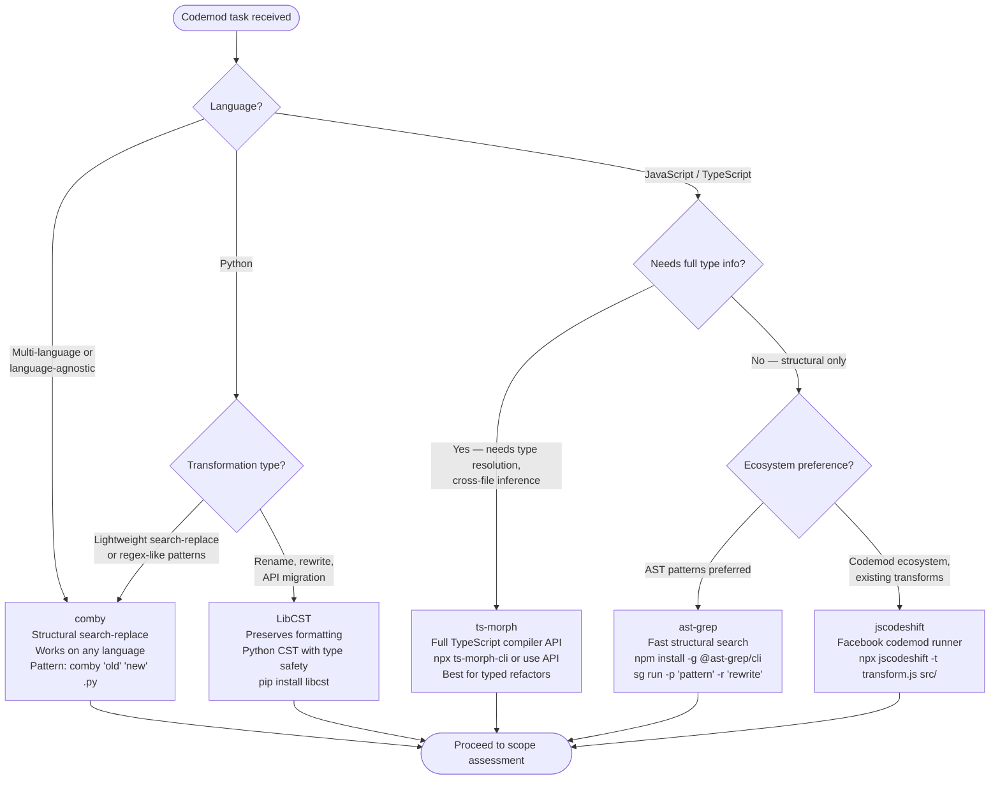

# Codemod Runner

Apply automated code transformations at scale using the right AST tool for the job — with scope assessment, batch execution, and idempotency verification before committing.

---

## Tool Selection



---

## Phase 1 — Scope Assessment (run before any transformation)

Assess impact size before touching files:

```bash
# Count affected files
rg -l 'old-pattern' | wc -l

# Preview first 25 affected files (saves to batch list)
rg -l 'old-pattern' | head -25 > batch.list
cat batch.list

# Count total occurrences (not just files)
rg -c 'old-pattern' | awk -F: '{sum+=$2} END {print sum}'
```

If the file count exceeds 50, process in batches using `batch.list`:

```bash
# Build per-batch lists of 25 files each
rg -l 'old-pattern' | split -l 25 - batch-
ls batch-*  # batch-aa, batch-ab, ...
```

---

## Phase 2 — Batch Execution

Run the codemod against one batch at a time. Replace `TOOL_CMD` with the selected tool:

```bash
# ast-grep example
sg run -p 'old_fn($A)' -r 'new_fn($A)' --lang python $(cat batch-aa)

# comby example
comby 'old_fn(:[args])' 'new_fn(:[args])' -f .py $(cat batch-aa)

# jscodeshift example
npx jscodeshift -t transform.js $(cat batch-aa)

# LibCST — use a script, pass files as args
uv run codemod_script.py $(cat batch-aa)

# ts-morph — use a script targeting the batch
npx ts-node transform.ts --files $(cat batch-aa)
```

---

## Phase 3 — Per-Batch Idempotency Check

After each batch completes, verify the transformation is idempotent (running it twice produces zero diff):

```bash
# Run the transformation a second time on the same batch
TOOL_CMD $(cat batch-aa)

# Confirm no further changes
git diff --stat
# Expected output: (empty — no changes)
```

If `git diff` shows changes after the second run, the transformation is not idempotent. Investigate the transform logic before proceeding to the next batch.

---

## Phase 4 — Verification Trend

After each batch, measure progress toward zero remaining occurrences:

```bash
# Before starting:  rg 'old-pattern' | wc -l  → baseline count N
# After batch 1:    rg 'old-pattern' | wc -l  → should decrease
# After all batches: rg 'old-pattern' | wc -l  → 0

# One-liner to track trend across iterations
echo "Remaining: $(rg 'old-pattern' | wc -l)"
```

The count MUST decrease monotonically after each batch. If it does not decrease, the transform did not apply — investigate before continuing.

Final state: `rg 'old-pattern' | wc -l` returns `0`.

---

## Phase 5 — Commit

Once all batches pass idempotency and the verification count reaches 0:

```bash
git add -p   # or specific files
git commit -m "codemod: migrate old-pattern → new-pattern"
```

Commit after all batches complete and verification passes — not per-batch.

---

## Tool Quick Reference

SOURCE: Tool official documentation — comby (comby.dev, accessed 2026-05-22), ast-grep (ast-grep.github.io, accessed 2026-05-22), jscodeshift (github.com/facebook/jscodeshift, accessed 2026-05-22), ts-morph (ts-morph.com, accessed 2026-05-22), LibCST (libcst.readthedocs.io, accessed 2026-05-22).

| Tool | Install | Strengths | Avoid when |
|---|---|---|---|
| **comby** | `brew install comby` or binary | Language-agnostic, structural | Need type information |
| **ast-grep** | `npm i -g @ast-grep/cli` | Fast, multi-language AST patterns | Complex rewrites needing APIs |
| **jscodeshift** | `npm i -g jscodeshift` | Rich JS/TS ecosystem, existing codemods | Python or non-JS targets |
| **ts-morph** | `npm i ts-morph` | Full TypeScript type resolution | No TypeScript in project |
| **LibCST** | `pip install libcst` | Format-preserving Python CST | JS/TS or multi-language |

---

## Large-Scale Codemod Swarm Pattern

For codebases with thousands of files, coordinate parallel workers across file batches using the `/swarm-patterns` skill (Pattern 6). Each worker owns one batch file, runs the codemod + idempotency check, and reports its completion count to the team lead before the final commit.
