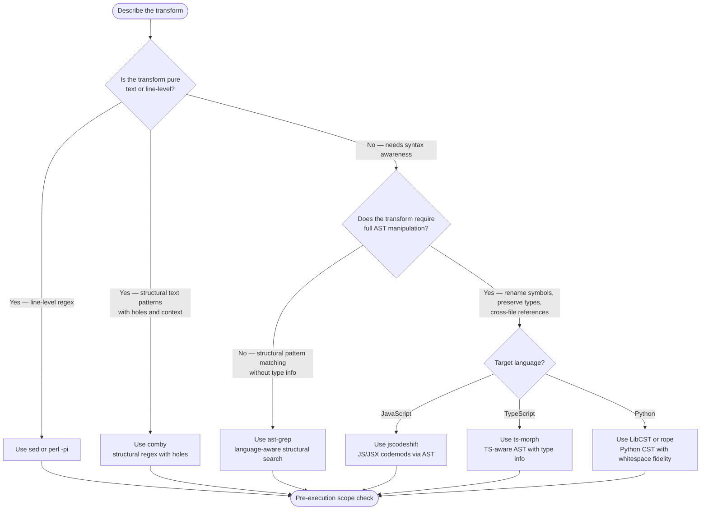

# Codemod Runner

Run deterministic multi-file refactors using the right tool for the job. LLM Edit loops are non-deterministic and unverifiable for bulk changes; codemods are reproducible and idempotency-checkable.

## Tool Selection Flowchart



**Tool summary:**

| Tool | Best for | Language scope |
|---|---|---|
| `sed` / `perl -pi` | Line-level text replacement | Any |
| `comby` | Structural patterns with holes, multi-line context | Any |
| `ast-grep` | Pattern-based structural search without type resolution | JS/TS/Python/Go/Rust/more |
| `jscodeshift` | Full AST rewrites, JS/JSX symbol renames | JavaScript, JSX |
| `ts-morph` | TypeScript-aware refactors with type information | TypeScript |
| `LibCST` / `rope` | Python CST transforms preserving whitespace and comments | Python |

SOURCE: `research/skill-generation-tools/composio-codebase-migrate.md` line 142 (accessed 2026-05-22) — tool catalog (jscodeshift, ts-morph, comby, ast-grep, LibCST). Note: Python LibCST/rope examples in that research source are sparse; do not fabricate API idioms — consult LibCST official docs before implementing.

## Pre-Execution Scope Check

Establish blast radius before running any codemod:

```bash
# Count affected files
rg -l '<pattern>' | wc -l

# Create first batch list (25 files)
rg -l '<pattern>' | head -25 > batch.list

# Inspect the batch before touching it
cat batch.list
```

Process in batches of 25. Review each batch diff before proceeding to the next.

## Per-Batch Execution

```bash
# Run codemod on batch
<codemod-command> $(cat batch.list)

# Review diff
git diff --stat
git diff
```

Commit or stash the batch diff before moving to the next batch.

## Idempotency Check

Run the codemod twice on the same batch. The second run must produce zero diffs:

```bash
# First run (already applied above)
<codemod-command> $(cat batch.list)
git stash   # save first-run result

# Second run on same inputs
git stash pop
<codemod-command> $(cat batch.list)

# Assert idempotency — must be empty
git diff --stat
```

If `git diff --stat` shows changes after the second run, the codemod is not idempotent. Fix the transform before proceeding to additional batches.

## Verification Trend

Track match count across batches. It must decrease monotonically and reach 0:

```bash
# After each batch — count remaining matches
rg '<old-pattern>' | wc -l
```

Record the count after each batch. A non-decreasing count signals the codemod is not working or the pattern is wrong. Reach 0 to confirm completion.

## Tool-Specific Notes

### comby

Structural regex with holes. Install: `brew install comby` or download from [comby.dev](https://comby.dev) (accessed 2026-05-22).

```bash
# Match and rewrite across all .go files
comby 'old_func(:[args])' 'new_func(:[args])' .go -in-place
```

### ast-grep

Language-aware structural search. Install: `cargo install ast-grep` or `npm install -g @ast-grep/cli`.

```bash
# Find all calls to old_func in TypeScript files
ast-grep --lang typescript --pattern 'old_func($$$)' src/
# Rewrite
ast-grep --lang typescript --pattern 'old_func($$$)' --rewrite 'new_func($$$)' src/ --update-all
```

### jscodeshift

JavaScript/JSX AST rewrites. Install: `npm install -g jscodeshift`.

```bash
jscodeshift -t transform.js src/ --extensions=js,jsx
```

### ts-morph

TypeScript-aware AST manipulation. Install: `npm install ts-morph`.

Use as a Node script — ts-morph manipulates the TS compiler API directly, preserving type information across renames.

### LibCST (Python)

Concrete Syntax Tree for Python. Preserves whitespace, comments, and formatting. Install: `pip install libcst`.

Sparse examples exist in the research source cited above. Consult [LibCST official documentation](https://libcst.readthedocs.io/) (accessed 2026-05-22) before writing transforms — do not fabricate API idioms.

SOURCE: `research/skill-generation-tools/composio-codebase-migrate.md` line 142 (accessed 2026-05-22). Python LibCST/rope example coverage in that source is sparse.
