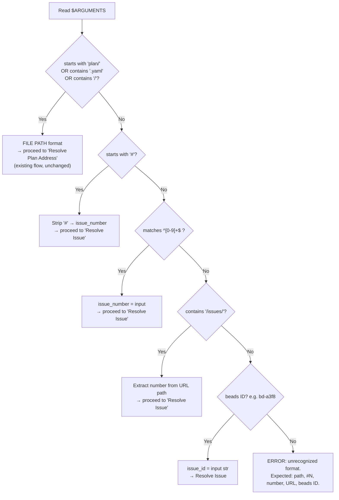
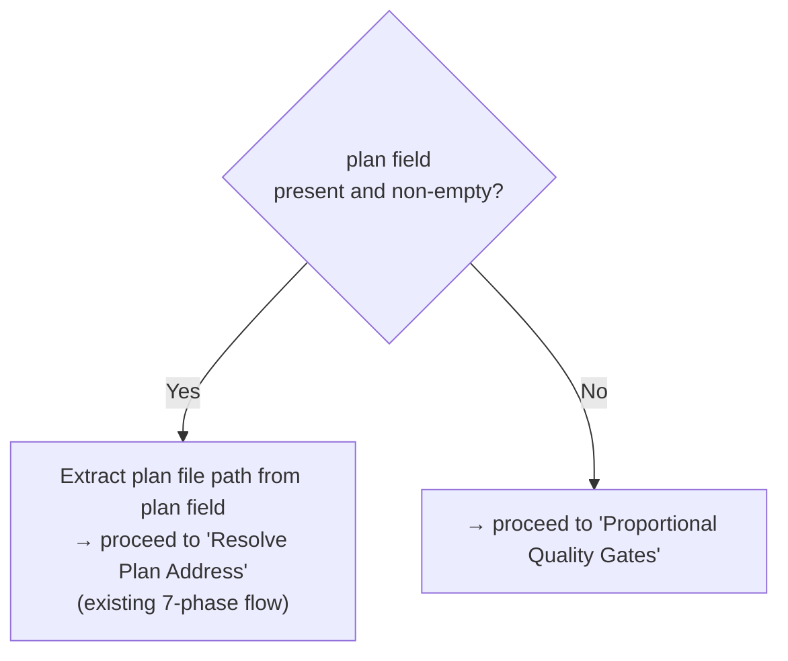
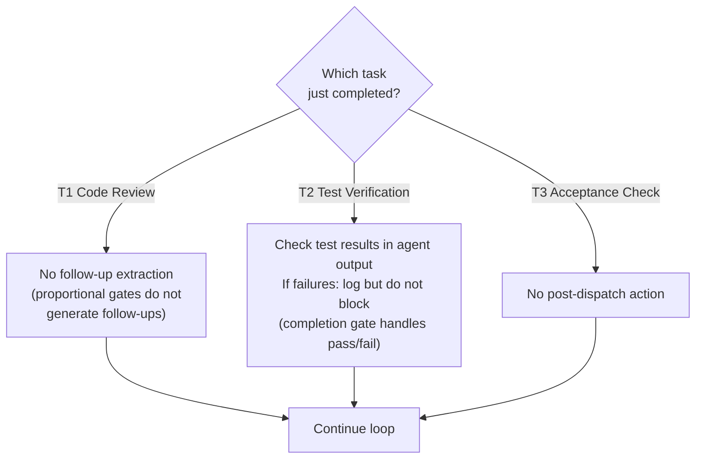
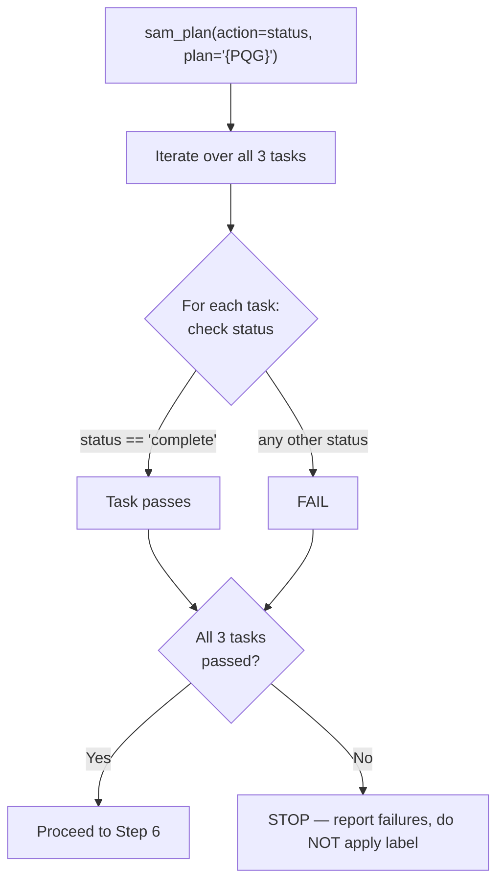
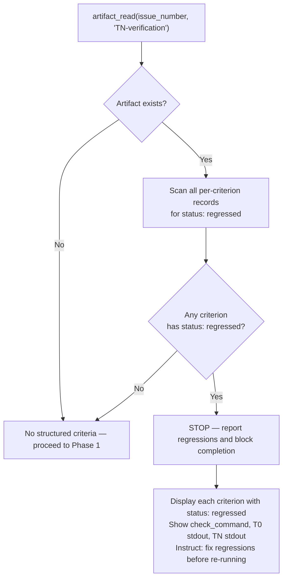
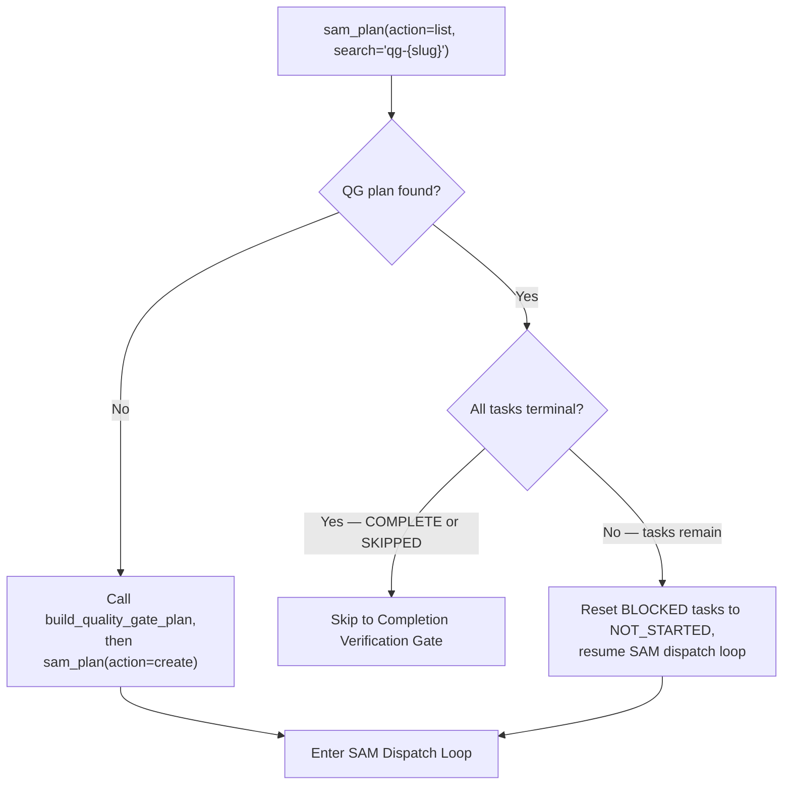
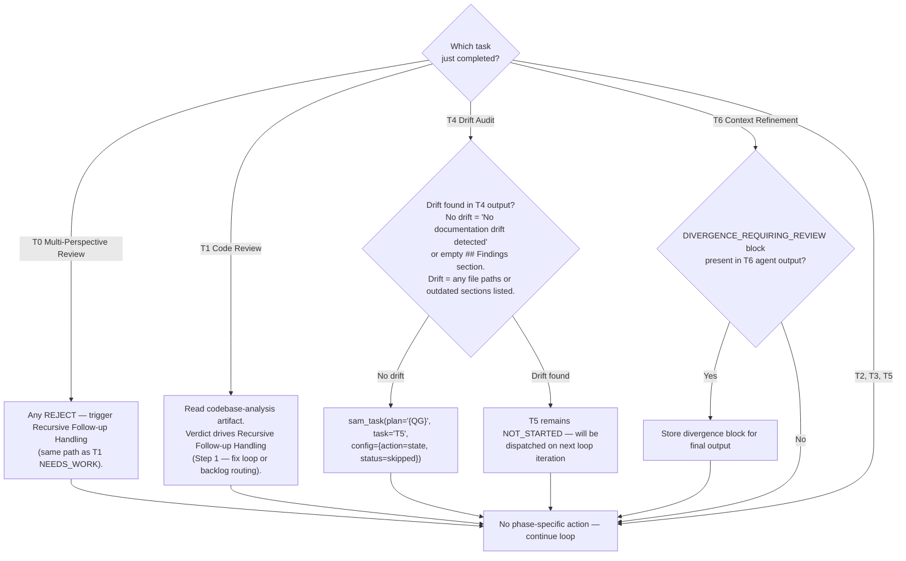
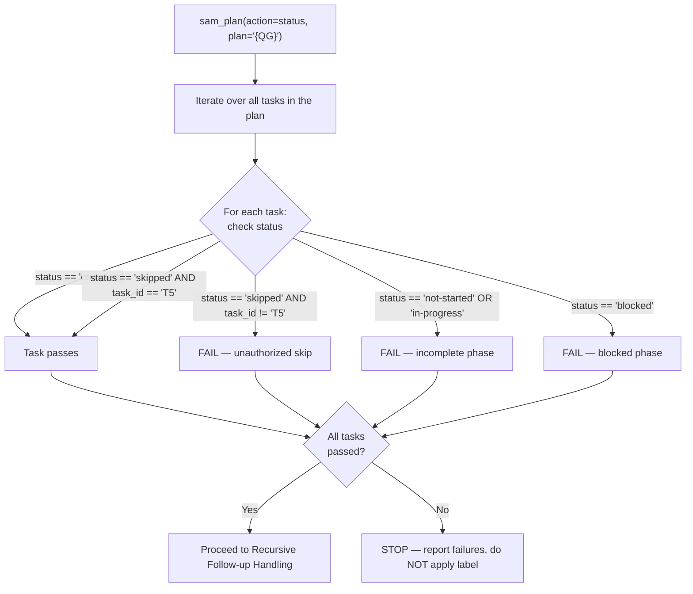
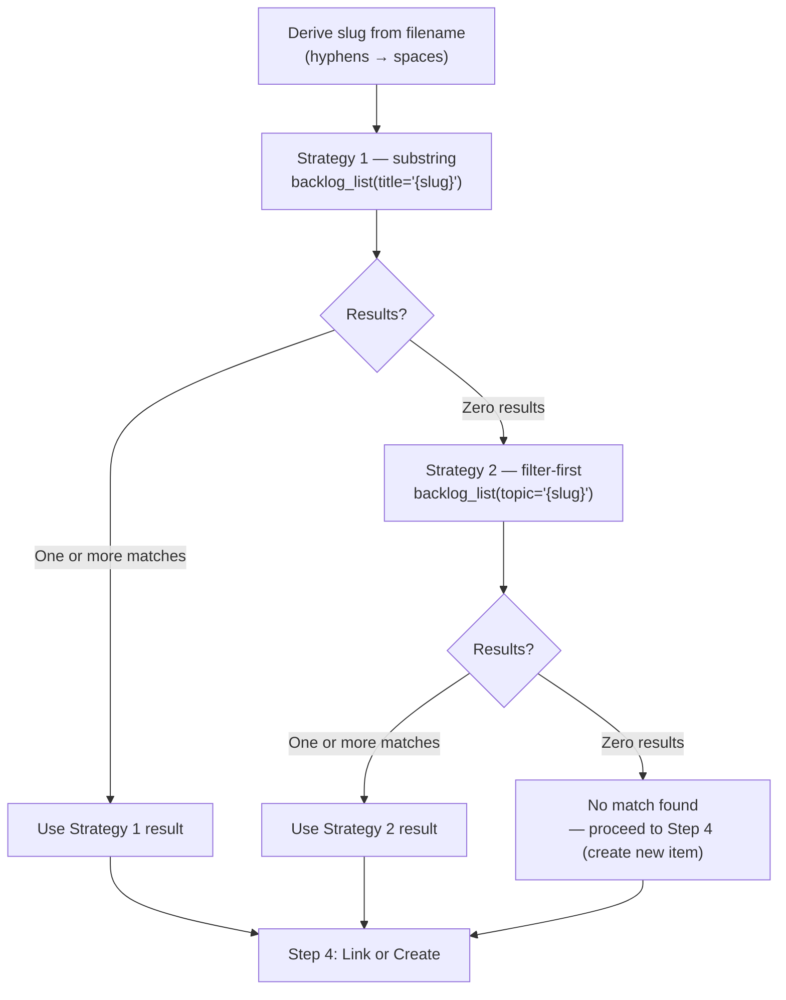
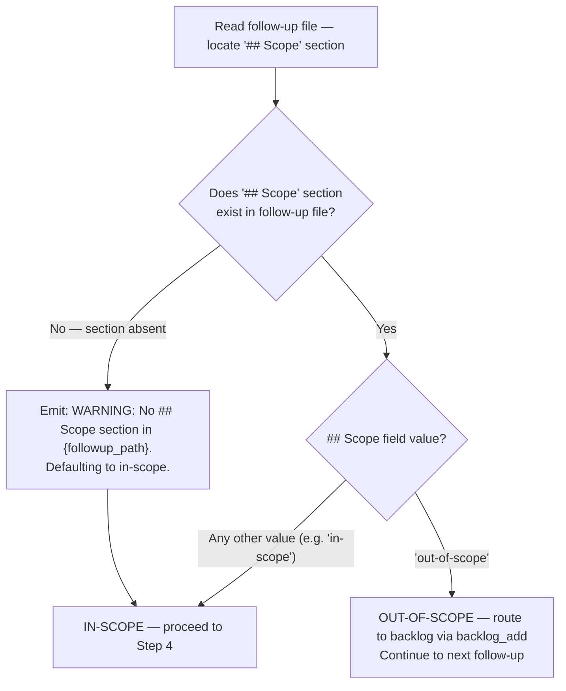

# Complete Implementation (Quality Gates + Recursion)

You MUST validate that the implemented feature meets its goals and quality gates. If follow-up task files are created, route them to backlog items first, then recurse only when the follow-up matches the current scope and priority (see Recursive Follow-up Handling section).


<task_file>
$ARGUMENTS
</task_file>

---

> [!IMPORTANT]
> When provided a process map or Mermaid diagram, treat it as the authoritative procedure. Execute steps in the exact order shown, including branches, decision points, and stop conditions.
> A Mermaid process diagram is an executable instruction set. Follow it exactly as written: respect sequence, conditions, loops, parallel paths, and terminal states. Do not improvise, reorder, or skip steps. If any node is ambiguous or missing required detail, pause and ask a clarifying question before continuing.
> When interacting with a user, report before acting the interpreted path you will follow from the diagram, then execute.

---

## Input Format Detection

Parse `$ARGUMENTS` to determine the input type before proceeding:

The following diagram is the authoritative procedure for Input Format Detection. Execute steps in the exact order shown, including branches, decision points, and stop conditions.



---

## Resolve Issue

Entered when input is `#N`, bare `N`, GitHub URL, or beads ID (e.g. `bd-a3f8`). Skip for file path input.

**Step 1 -- Fetch issue data**:

```text
mcp__plugin_dh_backlog__backlog_view(selector="#{issue_number}")
```

If the response contains an `error` key:

```text
ERROR: Issue #{issue_number} not found. Verify the issue number and try again.
```

Stop.

**Step 2 -- Check for linked plan**:

Read the `plan` field from the response.

The following diagram is the authoritative procedure for Resolve Issue Step 2 linked plan check. Execute steps in the exact order shown, including branches, decision points, and stop conditions.



When auto-resolving to the SAM path, output:

```text
Issue #{issue_number} has linked plan: {plan_path}
Proceeding with full quality gates.
```

**Step 3 -- Extract context for proportional gates**:

From the `backlog_view` response, extract and store:

- `issue_number`: int
- `title`: str
- `body`: str (full issue body text)
- `labels`: list[str]

These values are used by the Proportional Quality Gates section below.

---

## Proportional Quality Gates

Entered only when the issue has no linked plan. Skip this section when input is a file path or when the issue has a linked plan (auto-resolved to SAM path).

**Step 1 -- Discover modified files**:

```bash
git log --all --grep="#${issue_number}" --format=%H
```

For each commit SHA returned:

```bash
git diff-tree --no-commit-id --name-only -r {sha}
```

Deduplicate the file list. If no commits reference the issue number, fall back to:

```bash
git diff --name-only main...HEAD
```

Store the deduplicated file list as `modified_files`.

If `modified_files` is empty after both strategies:

```text
WARNING: No modified files found for issue #{issue_number}.
Code review and test verification will run against the full working tree.
```

**Step 2 -- Extract acceptance criteria from issue body**:

Parse the `body` field for an acceptance criteria section. Search for these markers (case-insensitive, in order):

1. `## Acceptance Criteria` header -- extract all content until next `##` header
2. `**Acceptance Criteria**:` bold marker -- extract all content until next bold marker or `##` header
3. Lines starting with `- [ ]` (unchecked checkboxes) -- collect all such lines

Store as `acceptance_criteria` (string or None). If none found, set to None.

**Step 3 -- Build proportional quality gate plan**:

Call the pure function:

```python
tasks_yaml = build_proportional_quality_gate_plan(
    slug=f"issue-{issue_number}",
    issue=str(issue_number),
    modified_files=modified_files,
    acceptance_criteria=acceptance_criteria,
)
```

Create the SAM plan:

```text
mcp__plugin_dh_sam__sam_create(
    slug="pqg-issue-{issue_number}",
    goal="Proportional quality gate verification for issue #{issue_number}",
    tasks_yaml="{tasks_yaml}",
    issue="{issue_number}"
)
```

The `pqg-` prefix (proportional quality gate) distinguishes from the `qg-` prefix used by full SAM gates. Store the returned plan address as `{PQG}` for use throughout the dispatch loop.

**Step 4 -- SAM dispatch loop**:

Use the same SAM Dispatch Loop as the existing 7-phase flow (see "SAM Dispatch Loop (Phases T0-T6)" section). The loop operates identically — 3 tasks instead of 7 is the only structural difference.

**Phase-specific post-dispatch actions for proportional gates**:

The following diagram is the authoritative procedure for Proportional Quality Gates phase-specific post-dispatch actions. Execute steps in the exact order shown, including branches, decision points, and stop conditions.



**Step 5 -- Completion verification gate**:

After the dispatch loop exits, verify all 3 phases reached terminal status:

```text
mcp__plugin_dh_sam__sam_plan(config={"action": "status"}, plan="{PQG}")
```

All 3 tasks must have `status == 'complete'`. No skip whitelist — all 3 tasks are required.

The following diagram is the authoritative procedure for Proportional Quality Gates completion verification. Execute steps in the exact order shown, including branches, decision points, and stop conditions.



On verification failure:

```text
COMPLETION BLOCKED — Proportional Quality Gate Incomplete

Failed tasks:
  {task_id} ({phase_name}): status={status}
  [repeat for each failing task]

To resume: re-run /complete-implementation #{issue_number}
BLOCKED tasks will be reset to NOT_STARTED automatically.
```

Stop. Do not apply the `status:verified` label.

**Step 6 -- Apply status:verified label**:

On verification success:

```text
mcp__plugin_dh_backlog__backlog_update(selector="#{issue_number}", verified=True)
```

**Beads backend**: No `dh:state:verified` label — skip this call, continue.

On failure (GitHub only), output:

```text
COMPLETION BLOCKED — status:verified label could not be applied.

Error: {error}
Issue: #{issue_number}

Fix the error (check backend credentials and access), then re-run /complete-implementation #{issue_number}.
```

Stop. Do not proceed to the Final Step commit.

**Step 7 -- No recursive follow-up handling**:

The issue-only path does not produce follow-up task files. Skip directly to "Final Step: Commit and Push Remaining Changes", then "Team Shutdown", then "Resolve the Issue".

---

## Resolve Plan Address

Extract the plan address `P{N}` from the task file path:

- `plan/Pb3c4d5e6-integrate-sam-schema.yaml` → plan id `b3c4d5e6` → address `Pb3c4d5e6`
- Strip `plan/P` prefix, take the hex id, format as `P{id}`

Use `P{N}` in all `sam` CLI calls below.

---

## Pre-Phase 1: TN Verification Check

Before invoking Phase 1, check for a TN verification report produced by `tn-verification-gate` (which reads the T0 baseline written by `t0-baseline-capture`).

Extract `{slug}` from the task file path (`plan/P{id}-{slug}.yaml` — strip the `P{id}-` prefix and `.yaml` suffix).

Read the TN-verification artifact via `artifact_read(issue_number={N}, artifact_type="TN-verification")`.

The file contains a list of per-criterion `BookendVerification` records — one per `acceptance-criteria-structured` entry. There is no top-level `verdict` field. Aggregate the verdict by scanning all records: the overall result is FAIL if any record has `status: regressed`; otherwise PASS.

The following diagram is the authoritative procedure for Pre-Phase 1 TN Verification Check. Execute steps in the exact order shown, including branches, decision points, and stop conditions.



If any criterion has `status: regressed`:

1. List each criterion where `status: regressed` with its `check_command`, T0 captured stdout, and TN captured stdout.
2. Output:

```text
COMPLETION BLOCKED — TN Verification Failed

Regressed criteria:
  {criterion-id}: {description}
    command: {check_command}
    T0 result: exit {code}, stdout: {stdout}
    TN result: exit {code}, stdout: {stdout}

Fix the regressions, then re-run /complete-implementation.
```

3. Stop. Do not proceed to Phase 1.

---

## Pre-Phase 1a: Migration Fidelity Sign-Off

Before proceeding to Artifact Discovery, check for migration signals.

Execute the full gate procedure defined in [./references/migration-fidelity-gate.md](./references/migration-fidelity-gate.md).

**Summary of detection signals** (full evaluable criteria in the reference):

- Issue title or body contains: "migrat", "convert format", "replace .md", "format conversion", "move from", "transition from"
- Any task `acceptance_criteria` field contains: "delete", "remove source", "after migration complete", "drop the source"

If no signal found — skip gate, proceed to Artifact Discovery.

If signal found — confirm all four fidelity items from the reference before proceeding. If any unconfirmed, emit `COMPLETION BLOCKED — Migration Fidelity Gate` (format in reference) and stop.

---

## Pre-Phase: Artifact Discovery

When the parent story issue number is known (from the plan's `issue` field or the backlog item), query the artifact manifest to discover all plan artifacts for this feature:

```text
mcp__plugin_dh_backlog__artifact_list(issue_number=N)
```

If the response contains artifacts, pass the manifest to quality gate agents (Phases T0-T6) so they can access plan artifacts via `artifact_read` instead of filesystem paths. This is critical for worktree-isolated agents.

**Fallback**: If `artifact_list` returns an empty manifest or an error, quality gate agents use filesystem path conventions as before. This ensures backward compatibility with issues that predate the artifact manifest system.

---

## Pre-Phase 1b: Process Accumulated Concerns

Execute the full procedure defined in [./references/concerns-processing.md](./references/concerns-processing.md).

**Summary**: Read backlog item → if `## Concerns` has unchecked items, verify each (create backlog item if real; mark unconfirmed if not) → update section → proceed to Quality Gate Plan Creation. If no concerns section, proceed immediately.

---

## Quality Gate Plan Creation

After the pre-phases complete, set up the SAM-enforced quality gate plan.

Extract `{slug}` from the task file path (`plan/P{id}-{slug}.yaml` — strip the `P{id}-` prefix and `.yaml` suffix).

### Step 1: Check for existing QG plan

```text
mcp__plugin_dh_sam__sam_plan(config={"action": "list", "search": "qg-{slug}"})
```

The following diagram is the authoritative procedure for Quality Gate Plan Creation Step 1 check for existing QG plan. Execute steps in the exact order shown, including branches, decision points, and stop conditions.



### Step 2: Create QG plan (if not found)

If no QG plan exists, generate the plan YAML and create it via SAM:

```python
# Call the pure function (from sam_schema.core.quality_gates)
tasks_yaml = build_quality_gate_plan(
    slug="{slug}",
    issue="{issue_number}",       # from plan's issue field, if known
    impl_plan_address="P{N}",     # implementation plan address
)
```

Then create the plan:

```text
mcp__plugin_dh_sam__sam_create(
    slug="qg-{slug}",
    goal="Quality gate enforcement for {slug}",
    tasks_yaml="{tasks_yaml_string}",
    issue="{issue_number}"
)
```

The response contains the QG plan address (e.g., `QG003`). Store it as `{QG}` for use throughout the dispatch loop.

### Step 3: Reset BLOCKED tasks (on re-run)

If the QG plan already exists and has BLOCKED tasks, reset each to NOT_STARTED before entering the dispatch loop:

```text
For each task where status == "blocked":
    mcp__plugin_dh_sam__sam_state(plan="{QG}", task="{task_id}", status="not-started")
```

This allows re-running `complete-implementation` to resume from the blocked phase without re-executing completed phases.

---

## SAM Dispatch Loop (Phases T0-T6)

**Phase task mapping:**

| Task | Phase | Agent |
|------|-------|-------|
| T0 | Multi-Perspective Review | dh:multi-perspective-review (orchestrated) |
| T1 | Code Review | code-reviewer |
| T2 | Feature Verification | feature-verifier |
| T3 | Integration Check | integration-checker |
| T4 | Documentation Drift Audit | doc-drift-auditor |
| T5 | Documentation Update | service-docs-maintainer |
| T6 | Context Refinement | context-refinement |

### Team Setup

Check for an existing implementation team before dispatching QG agents:

- `team_name = "impl-{slug}"` (same team created by `implement-feature`)
- If the team exists (config at `~/.claude/teams/impl-{slug}/config.json`), reuse it for QG agent dispatch
- If no team exists, create one: `TeamCreate(team_name="impl-{slug}")`
- Store `team_name` for use in agent dispatch and the Team Shutdown step below

### Dispatch Loop

Repeat until `sam_plan(action='ready')` returns an empty list:

**1. Get next ready task:**

```text
mcp__plugin_dh_sam__sam_plan(config={"action": "ready"}, plan="{QG}")
```

If the result is empty, exit the loop and proceed to Completion Verification Gate.

**2. Claim the task:**

```text
mcp__plugin_dh_sam__sam_task(plan="{QG}", task="{task_id}", config={"action": "claim"})
```

If `"claimed": false`, stop — another agent is running this phase. Do not re-dispatch.

**3. Dispatch via start-task:**

```text
Skill(skill="start-task", args="plan/{QG}-qg-{slug}.yaml --task {task_id}")
```

Pass `team_name="{team_name}"` when spawning QG agents so they join the existing implementation team.

The SubagentStop hook marks the task COMPLETE after the sub-agent finishes.

**4. Phase-specific post-dispatch actions:**

After each dispatched phase completes, run the phase-specific processing before querying `sam_plan(action='ready')` again:

The following diagram is the authoritative procedure for SAM Dispatch Loop phase-specific post-dispatch actions. Execute steps in the exact order shown, including branches, decision points, and stop conditions.



**Detecting drift in T4 output**: No drift = "No documentation drift detected" or empty `## Findings`. Drift = any file paths or outdated sections listed.

---

## Completion Verification Gate

After the SAM dispatch loop exits, verify all phases reached terminal status before allowing label application.

```text
mcp__plugin_dh_sam__sam_plan(config={"action": "status"}, plan="{QG}")
```

The following diagram is the authoritative procedure for Completion Verification Gate. Execute steps in the exact order shown, including branches, decision points, and stop conditions.



**Skip whitelist**: ONLY T5 (Documentation Update) may have `status: skipped`. Any other task with `status: skipped` is an unauthorized skip — treat as a failure.

**On verification failure**, output:

```text
COMPLETION BLOCKED — Quality Gate Incomplete

Failed tasks:
  {task_id} ({phase_name}): status={status}
  [repeat for each failing task]

To resume: re-run /complete-implementation {task_file_path}
BLOCKED tasks will be reset to NOT_STARTED automatically.
```

Stop. Do not apply the `status:verified` label.

**On verification success**, proceed to Recursive Follow-up Handling.

---

## Post-Phase-6: Surface Divergence Findings

If the T6 (Context Refinement) sub-agent output contained a `DIVERGENCE_REQUIRING_REVIEW` block (collected in the dispatch loop), include in the final output to the human:

```text
Plan artifacts have intent divergences requiring your review.
See: [annotated artifact paths from agent output]
Divergences:
  [list from DIVERGENCE_REQUIRING_REVIEW block]
```

This is informational, not blocking. The human reviews at their discretion.
If absent, no additional output is needed — the feature proceeds normally.

---

## Recursive Follow-up Handling

## Constants

`DH_RECURSIVE_REVIEW_TASK_DEPTH = 5`

Maximum number of recursive review-implement-verify cycles permitted within a single
top-level `/complete-implementation` invocation. When `{recursion_depth}` reaches this
value, Guard 1 fires: all remaining in-scope follow-ups are routed to the backlog and
recursion stops.

Initialization: `{recursion_depth}` is set to `0` at skill invocation. It increments by 1
before each call to `Skill(skill="implement-feature")` in the recursion path. A re-run
of `/complete-implementation` on the same task file starts `{recursion_depth}` at `0`.

After all phases complete, route any follow-up task files created by Phase 1 (code-reviewer) to the backlog before deciding on recursion. This ensures no follow-up file is orphaned when the orchestrator skips recursion.

### Step 1: Detect Follow-up Files

Retrieve the review report registered by `@dh:code-reviewer` during Phase 1:

```text
mcp__plugin_dh_backlog__artifact_read(issue_number={issue_number}, artifact_type="codebase-analysis")
```

Check the `verdict` field in the report:

- `PASS` — no blocking findings; skip the entire routing section (no follow-ups to route)
- `NEEDS-WORK` or `FAIL` — extract the "Required changes (blocking)" section; each blocking
  item becomes a follow-up to route. **When "Required changes (blocking)" is non-empty, run the
  fix loop first (max 3 cycles, `{fix_cycle}`=0):** `sam_plan(action='create', slug="fix-{slug}-blocking-N")`
  one task per entry (`agent: dh:task-worker`); dispatch via `subagent_type="dh:task-worker"`;
  reset T1 to `not-started`; re-dispatch T1; if verdict is `PASS` or blocking entries empty →
  proceed to Step 2; else `fix_cycle += 1`, repeat or BLOCKED at 3. **On BLOCKED** (exhausted
  or fix task `blocked`): report `COMPLETION BLOCKED — Blocking Code Review Findings Not
  Resolved`, do NOT route to backlog, stop, do not apply `status:verified`.

If `artifact_read` returns an error or the artifact is absent, fall back to the SAM MCP search:

```text
mcp__plugin_dh_sam__sam_plan(config={"action": "list", "search": "{slug}-followup"})
```

Where `{slug}` is extracted from the parent task file path (`plan/P{id}-{slug}.yaml` — strip `P{id}-` prefix and `.yaml` suffix).

If both `artifact_read` and the SAM search return empty: skip the entire routing section (no follow-ups to route).

**Error handling**: If the SAM fallback returns plans from a different feature slug, filter results to only include plans matching the parent task file's slug.

### Step 2: Search Backlog by Title Keywords

For each follow-up file, derive a search slug from the filename using this algorithm:

```text
Input:  plan/Pc5d6e7f8-data-validation-followup-1.yaml
Step 1: Strip directory prefix      --> Pc5d6e7f8-data-validation-followup-1.yaml
Step 2: Strip .yaml extension       --> Pc5d6e7f8-data-validation-followup-1
Step 3: Strip P{id}- prefix         --> data-validation-followup-1
Step 4: Strip -followup-{k} suffix  --> data-validation
Step 5: Replace hyphens with spaces --> data validation
Output: "data validation"
```

Search the backlog using a 2-strategy fallback chain. Strategy 3 (LLM semantic match) is
**explicitly excluded** from follow-up routing: follow-up filenames are machine-derived slugs,
not human semantic queries, so LLM semantic selection would have low fidelity against
human-authored backlog titles.

The following diagram is the authoritative procedure for Step 2 backlog search strategy. Execute steps in the exact order shown, including branches, decision points, and stop conditions.



**Strategy 1 — substring via `title=`**

```text
mcp__plugin_dh_backlog__backlog_list(title="{derived_slug}")
```

Parse the JSON output. For each item, check if the derived slug appears (case-insensitive
substring match) in the item's `title` field. If one or more items match, use the first
match as the result and skip Strategy 2.

**Strategy 2 — filter-first via `topic=`**

If Strategy 1 returns zero matches, run:

```text
mcp__plugin_dh_backlog__backlog_list(topic="{derived_slug}")
```

The `topic` parameter performs a case-insensitive substring match against `metadata.topic`.
Follow-up slugs often correspond to the topic area recorded in backlog item metadata, making
this an effective second-pass filter when title substring fails.

If Strategy 2 returns one or more items, use the first match.

If both strategies return zero results, treat as "no match found" and proceed to Step 4.

**Error handling**: If either `mcp__plugin_dh_backlog__backlog_list` call fails, log the error, skip
that strategy, and continue to the next strategy (or to Step 4 as "no match found" if all
strategies fail). If the follow-up filename does not match the expected
`P{id}-{slug}-followup-{k}.yaml` pattern, log a warning and use the full filename (without
directory prefix and `.yaml` extension) as the derived slug.

### Step 3: Classify Follow-up Findings

For each follow-up file, read its `## Scope` field:

- If `## Scope` is absent: default to **in-scope** and emit:
  `WARNING: No ## Scope section in {followup_path}. Defaulting to in-scope.`
- If `## Scope: out-of-scope`: route immediately to backlog via `backlog_add` and
  continue to the next follow-up. Do NOT proceed to Step 4 for this follow-up.

The following diagram is the authoritative procedure for Step 3 Classify Follow-up Findings. Execute steps in the exact order shown, including branches, decision points, and stop conditions.



Out-of-scope backlog_add call pattern:

```text
backlog_add(
    title="{derived_title}",
    body="Quality gate follow-up from #{issue_number}",
    labels=["type:task"],
    source="Quality gate follow-up from #{issue_number} — out-of-scope: {followup_path}"
)
```

Output: `Out-of-scope finding routed to backlog: {title}`

### Step 4: Link or Create Backlog Item

Based on Step 2 result, for each follow-up file:

**Match found** -- attach follow-up as plan to the existing backlog item:

Extract the plan address from the follow-up file path: `plan/P{id}-{slug}-followup-{k}.yaml` → `P{id}`.

```text
mcp__plugin_dh_backlog__backlog_update(selector="{matched_item_title}", plan="P{id}")
```

**No match found** -- create a new backlog item, then attach the follow-up as plan:

```text
Skill(skill: "dh:create-backlog-item", args: "--auto {derived_title}")
```

Then attach the follow-up as the plan (extract plan address first — see above):

```text
mcp__plugin_dh_backlog__backlog_update(selector="{derived_title}", plan="P{id}")
```

**Error handling**:

- If `mcp__plugin_dh_backlog__backlog_update` fails after creation (title mismatch between what `dh:create-backlog-item` produced and what `update` searched for): re-invoke `mcp__plugin_dh_backlog__backlog_list()`, find the most recently added item, and retry `mcp__plugin_dh_backlog__backlog_update` with its exact title. If the retry also fails, log the error and continue to the next follow-up file.
- If `dh:create-backlog-item --auto` logs `[AUTO] STOP -- duplicate detected`: treat this as "match found" -- run `mcp__plugin_dh_backlog__backlog_update` on the duplicate's title to attach the plan.

### Step 5: Recursion Gate

### Guard 1: Depth check

Before evaluating conditions, check the recursion counter:

```text
If {recursion_depth} >= DH_RECURSIVE_REVIEW_TASK_DEPTH (5):

  Output:
  RECURSION DEPTH LIMIT REACHED — Systemic Design Issue Detected
  Follow-up task: {followup_task_file_path}
  Depth: {recursion_depth} (limit: {DH_RECURSIVE_REVIEW_TASK_DEPTH})

  For all remaining in-scope follow-ups (including this one):
    backlog_add(
        title="{derived_title}",
        body="Depth limit exceeded — review cycle stopped at depth {recursion_depth}",
        labels=["type:task"],
        source="Depth limit exceeded on #{issue_number} at depth {recursion_depth}"
    )

  Stop recursion. Proceed to the Apply status:verified Label step.
```

If `{recursion_depth}` < 5: continue to Guard 2.

### Guard 2: RT-ICA BLOCKED check

Read the plan artifact linked to the follow-up's backlog item and search for `BLOCKED-FOR-PLANNING` (present only in the planner-rt-ica artifact, not in implement-feature output).

```text
If the planner-rt-ica artifact for this follow-up contains BLOCKED-FOR-PLANNING:

  Output:
  RECURSION STOPPED — RT-ICA BLOCKED
  Follow-up task: {followup_task_file_path}
  Depth: {recursion_depth}
  Blocking conditions: {blocking_conditions_from_artifact}
  Resume: /dh:work-backlog-item {followup_backlog_item_title}

  Stop for this follow-up. Continue to next follow-up if any remain.
  Do not apply status:verified label for the blocked follow-up.
```

If no BLOCKED-FOR-PLANNING signal: continue to Condition 1 (ADR-3).

**Evaluation order for each in-scope follow-up:**
1. Guard 1: depth check (`{recursion_depth} >= 5` → stop all)
2. Guard 2: RT-ICA BLOCKED check (`BLOCKED-FOR-PLANNING` in plan artifact → stop this follow-up)
3. Condition 1 (ADR-3): slug match
4. Condition 2 (ADR-2): High priority
5. Both Conditions 1 and 2 met → increment depth, recurse
6. Either not met → defer to backlog

For each follow-up file, evaluate two conditions. BOTH must be true for recursion.

**Condition 1 -- Same session scope (ADR-3)**: The follow-up file's slug matches the parent task file's slug. Extract the slug from each filename: strip the `P{id}-` prefix, then strip `-followup-{k}.yaml` for the follow-up or `.yaml` for the parent. Compare the two slugs.

**Condition 2 -- High priority (ADR-2)**: Read the follow-up file content and extract the `## Priority` section. Only `High` qualifies for immediate recursion.

**If BOTH conditions are met** -- recurse immediately:

Increment {recursion_depth} by 1 before invoking implement-feature.

```text
Skill(skill="implement-feature", args="{followup_task_file_path}")
```

Then re-run `complete-implementation` on the follow-up task file.

**If EITHER condition is NOT met** -- defer to backlog:

Log the deferral and output this line to the user:

```text
Follow-up deferred — to resume: /dh:work-backlog-item <title>
```

Where `<title>` is the backlog item title the follow-up was linked to in Step 3.

Do not recurse. The follow-up is tracked in the backlog.

**Error handling**: If the follow-up file has no `## Priority` section, default to `Medium` (defer). Log: `No priority found in {followup_path}, defaulting to Medium (deferred).`

---

## Apply status:verified Label

After all phases and follow-up routing complete, apply the `status:verified` GitHub label to the parent backlog issue.

**Beads backend**: No `dh:state:verified` label — skip this section, continue to Final Step.

### Step 1: Locate the backlog item

Derive the search slug from the task file path (same algorithm as Recursive Follow-up Handling). Search the backlog:

```text
mcp__plugin_dh_backlog__backlog_list(title="{slug}")
```

If zero items match, skip this section — there is no issue to label.

### Step 2: Apply the label

Call:

```text
mcp__plugin_dh_backlog__backlog_update(selector="{matched_item_title}", verified=True)
```

**Error handling**: If the call returns an `error` key, output:

```text
COMPLETION BLOCKED — status:verified label could not be applied.

Error: {error}
Backlog item: {matched_item_title}

Fix the error (check backend credentials and access), then re-run /complete-implementation.
```

Stop. Do not proceed to the Final Step commit.

---

## Final Step: Commit and Push Remaining Changes

Check for uncommitted changes and commit any remaining modifications in a single commit.

```bash
git status
```

**Issue number in commit message**: Before committing, check the backlog item for the current feature slug:

```text
mcp__plugin_dh_backlog__backlog_list(title="{slug}")
```

Check the `issue` field on the matching item. If present, append `Fixes #NNN` to the commit message body (NNN = GitHub integer issue number; omit for beads IDs). If no issue number is found, omit it.

Push after committing; skip if the working tree is clean.

---

## Team Shutdown

After commit+push, shut down all teammates in the implementation team:

1. Read `~/.claude/teams/{team_name}/config.json` to get the members list.
2. For each member name in the `members` array, send:

```text
SendMessage(to="{name}", message={"type": "shutdown_request"})
```

3. Note: broadcast to `"*"` does not support structured shutdown messages — send individually
   to each named member.

---

## Resolve the Issue

**PQG path (issue-only)**: Use `selector="#{issue_number}"`.

**SAM path (plan-linked)**: Use `selector="{matched_item_title}"` from the Apply status:verified Label step. Skip this step if no backlog item was matched in that step.

```text
mcp__plugin_dh_backlog__backlog_resolve(selector="<selector>", summary="Implementation complete — AC verified PASS")
```

On failure: output `COMPLETION BLOCKED — backlog_resolve failed: {error}`. Stop.

---

## Final Handoff Output

Execute the full procedure defined in [./references/final-handoff.md](./references/final-handoff.md).
