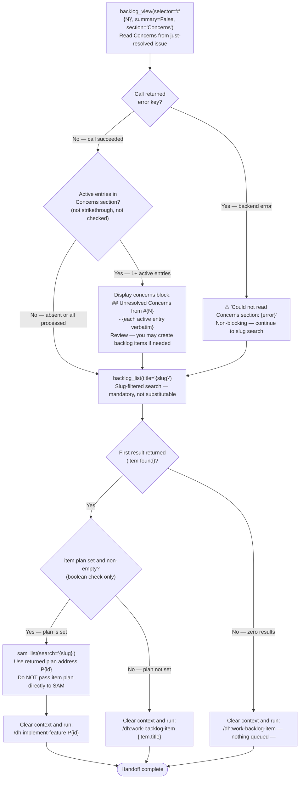

# Final Handoff Output

> [!IMPORTANT]
> When provided a process map or Mermaid diagram, treat it as the authoritative procedure. Execute steps in the exact order shown, including branches, decision points, and stop conditions.
> A Mermaid process diagram is an executable instruction set. Follow it exactly as written: respect sequence, conditions, loops, parallel paths, and terminal states. Do not improvise, reorder, or skip steps. If any node is ambiguous or missing required detail, pause and ask a clarifying question before continuing.
> When interacting with a user, report before acting the interpreted path you will follow from the diagram, then execute.

The following diagram is the authoritative procedure for Final Handoff Output. Execute steps in the exact order shown, including branches, decision points, and stop conditions.

## Concerns Check — Implementation Notes

The first step reads the Concerns section of the just-resolved issue before routing to the next work item.

**Selector source (`#{N}`)**: The resolved issue number is available from the **"Apply status:verified Label" Step 2** of the `complete-implementation` skill — that step calls `backlog_list(title="{slug}")`, finds the matched item, and extracts `issue_number` from the item's `issue` field (e.g., `"#2437"` → `issue_number = 2437`). Use that integer as `#{N}` in the `backlog_view` call below.

**Call signature**:

```text
backlog_view(selector="#{N}", summary=False, section="Concerns")
```

**Active-entry detection**: An entry is active if it is NOT struck-through (`` ~~entry~~ ``) and NOT a checked checkbox (`[x] entry`). Inactive entries were processed during the P6 Concerns verification phase — only active entries are actionable at handoff.

**Display format when active entries exist**:

```text
## Unresolved Concerns from #{N}

- {entry text verbatim}
...

Review these concerns before proceeding. You may choose to create backlog items for any that require follow-on work.
```

The Concerns block is displayed first, followed by a blank line separator, before any slug-search output.

**Error handling**: If `backlog_view` returns an `error` key, output `⚠ Could not read Concerns section: {error}` and continue to the slug search. The Concerns check is advisory — backend errors must not block Final Handoff.

**`section=` caveat**: The `section=` parameter has no effect on GitHub-only items with a raw body — the full body may be returned. When this occurs, scan the response body for a `## Concerns` heading and extract the list items beneath it. Apply active-entry detection to those items only.


