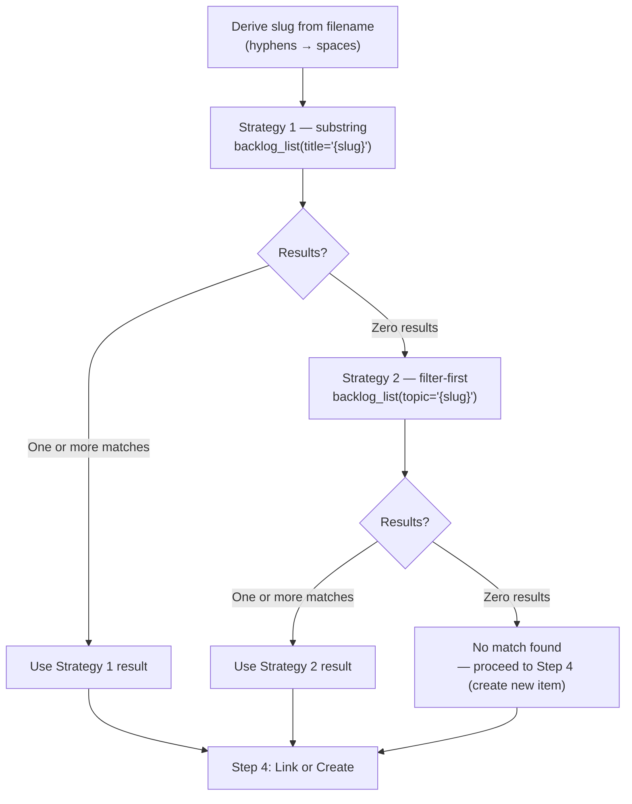
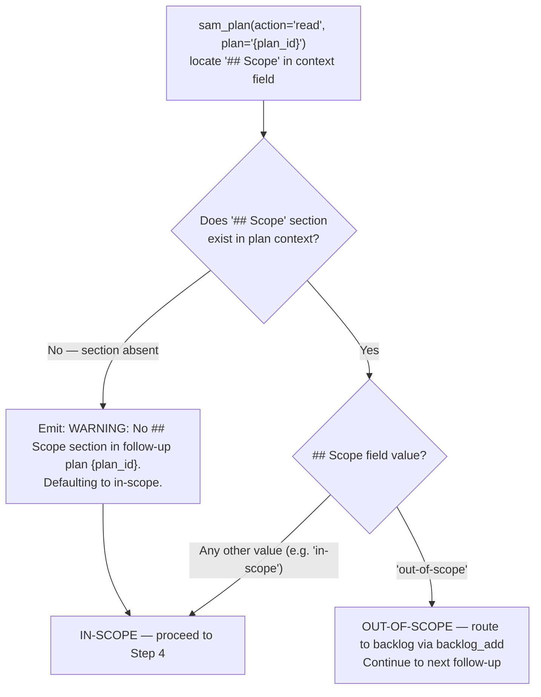

# Recursive Follow-up Handling: Steps 2–5

After Step 1 (Detect Follow-up Files) confirms follow-ups exist, execute these steps in order.

### Step 2: Search Backlog by Title Keywords

For each follow-up plan, derive a search slug from the plan's `feature` field returned by `sam_plan(action='list')`:

```text
Input:  feature = "data-validation-followup-1"   (from sam_plan list result)
Step 1: Strip -followup-{k} suffix  --> data-validation
Step 2: Replace hyphens with spaces --> data validation
Output: "data validation"
```

Search the backlog using a 2-strategy fallback chain. Strategy 3 (LLM semantic match) is
**explicitly excluded** from follow-up routing: follow-up filenames are machine-derived slugs,
not human semantic queries, so LLM semantic selection would have low fidelity against
human-authored backlog titles.

The following diagram is the authoritative procedure for Step 2 backlog search strategy. Execute steps in the exact order shown, including branches, decision points, and stop conditions.



**Strategy 1 — substring via `title=`**

```text
mcp__plugin_dh_backlog__backlog_list(title="{derived_slug}")
```

Parse the JSON output. For each item, check if the derived slug appears (case-insensitive
substring match) in the item's `title` field. If one or more items match, use the first
match as the result and skip Strategy 2.

**Strategy 2 — filter-first via `topic=`**

If Strategy 1 returns zero matches, run:

```text
mcp__plugin_dh_backlog__backlog_list(topic="{derived_slug}")
```

The `topic` parameter performs a case-insensitive substring match against `metadata.topic`.
Follow-up slugs often correspond to the topic area recorded in backlog item metadata, making
this an effective second-pass filter when title substring fails.

If Strategy 2 returns one or more items, use the first match.

If both strategies return zero results, treat as "no match found" and proceed to Step 4.

**Error handling**: If either `mcp__plugin_dh_backlog__backlog_list` call fails, log the error, skip
that strategy, and continue to the next strategy (or to Step 4 as "no match found" if all
strategies fail). If the follow-up plan's `feature` field does not match the expected
`{slug}-followup-{k}` pattern, log a warning and use the full `feature` value (with hyphens replaced by spaces) as the derived slug.

### Step 3: Classify Follow-up Findings

For each follow-up plan, read its `context` field via `sam_plan(action='read', plan='{plan_id}')` and check for a `## Scope` section:

- If `## Scope` is absent: default to **in-scope** and emit:
  `WARNING: No ## Scope section in follow-up plan {plan_id}. Defaulting to in-scope.`
- If `## Scope: out-of-scope`: route immediately to backlog via `backlog_add` and
  continue to the next follow-up. Do NOT proceed to Step 4 for this follow-up.

The following diagram is the authoritative procedure for Step 3 Classify Follow-up Findings. Execute steps in the exact order shown, including branches, decision points, and stop conditions.



Out-of-scope backlog_add call pattern:

```text
backlog_add(
    title="{derived_title}",
    body="Quality gate follow-up from #{issue_number}",
    labels=["type:task"],
    source="Quality gate follow-up from #{issue_number} — out-of-scope: plan {plan_id}"
)
```

Output: `Out-of-scope finding routed to backlog: {title}`

### Step 4: Link or Create Backlog Item

Based on Step 2 result, for each follow-up file:

**Match found** -- attach follow-up as plan to the existing backlog item using the plan ID from the `sam_plan(action='list')` result in Step 1:

```text
mcp__plugin_dh_backlog__backlog_update(selector="{matched_item_title}", plan="{plan_id}")
```

**No match found** -- create a new backlog item, then attach the follow-up as plan:

```text
Skill(skill: "dh:create-backlog-item", args: "--auto {derived_title}")
```

Then attach the follow-up plan using the plan ID from Step 1:

```text
mcp__plugin_dh_backlog__backlog_update(selector="{derived_title}", plan="{plan_id}")
```

**Error handling**:

- If `mcp__plugin_dh_backlog__backlog_update` fails after creation (title mismatch between what `dh:create-backlog-item` produced and what `update` searched for): re-invoke `mcp__plugin_dh_backlog__backlog_list()`, find the most recently added item, and retry `mcp__plugin_dh_backlog__backlog_update` with its exact title. If the retry also fails, log the error and continue to the next follow-up file.
- If `dh:create-backlog-item --auto` logs `[AUTO] STOP -- duplicate detected`: treat this as "match found" -- run `mcp__plugin_dh_backlog__backlog_update` on the duplicate's title to attach the plan.

### Step 5: Recursion Gate

### Guard 1: Depth check

Before evaluating conditions, check the recursion counter:

```text
If {recursion_depth} >= DH_RECURSIVE_REVIEW_TASK_DEPTH (5):

  Output:
  RECURSION DEPTH LIMIT REACHED — Systemic Design Issue Detected
  Follow-up task: {plan_id}
  Depth: {recursion_depth} (limit: {DH_RECURSIVE_REVIEW_TASK_DEPTH})

  For all remaining in-scope follow-ups (including this one):
    backlog_add(
        title="{derived_title}",
        body="Depth limit exceeded — review cycle stopped at depth {recursion_depth}",
        labels=["type:task"],
        source="Depth limit exceeded on #{issue_number} at depth {recursion_depth}"
    )

  Stop recursion. Proceed to the Apply status:verified Label step.
```

If `{recursion_depth}` < 5: continue to Guard 2.

### Guard 2: RT-ICA BLOCKED check

Read the plan artifact linked to the follow-up's backlog item and search for `BLOCKED-FOR-PLANNING` (present only in the planner-rt-ica artifact, not in implement-feature output).

```text
If the planner-rt-ica artifact for this follow-up contains BLOCKED-FOR-PLANNING:

  Output:
  RECURSION STOPPED — RT-ICA BLOCKED
  Follow-up task: {plan_id}
  Depth: {recursion_depth}
  Blocking conditions: {blocking_conditions_from_artifact}
  Resume: /dh:work-backlog-item {followup_backlog_item_title}

  Stop for this follow-up. Continue to next follow-up if any remain.
  Do not apply status:verified label for the blocked follow-up.
```

If no BLOCKED-FOR-PLANNING signal: continue to Condition 1 (ADR-3).

**Evaluation order for each in-scope follow-up:**
1. Guard 1: depth check (`{recursion_depth} >= 5` → stop all)
2. Guard 2: RT-ICA BLOCKED check (`BLOCKED-FOR-PLANNING` in plan artifact → stop this follow-up)
3. Condition 1 (ADR-3): slug match
4. Condition 2 (ADR-2): High priority
5. Both Conditions 1 and 2 met → increment depth, recurse
6. Either not met → defer to backlog

For each follow-up file, evaluate two conditions. BOTH must be true for recursion.

**Condition 1 -- Same session scope (ADR-3)**: The follow-up plan's slug matches the parent plan's slug. Read the follow-up plan's `feature` field via `sam_plan(action='read', plan='{plan_id}')`: strip the `-followup-{k}` suffix. Compare against the parent plan's `feature` field (already known from the parent plan ID passed to complete-implementation). Slugs must match.

**Condition 2 -- High priority (ADR-2)**: Read the follow-up plan's `context` field via `sam_plan(action='read', plan='{plan_id}')` and extract the `## Priority` section. Only `High` qualifies for immediate recursion.

**If BOTH conditions are met** -- recurse immediately:

Increment {recursion_depth} by 1 before invoking implement-feature.

```text
Skill(skill="implement-feature", args="{plan_id}")
```

Then re-run `complete-implementation` on the follow-up plan ID.

**If EITHER condition is NOT met** -- defer to backlog:

Log the deferral and output this line to the user:

```text
Follow-up deferred — to resume: /dh:work-backlog-item <title>
```

Where `<title>` is the backlog item title the follow-up was linked to in Step 3.

Do not recurse. The follow-up is tracked in the backlog.

**Error handling**: If the follow-up plan has no `## Priority` section in its context, default to `Medium` (defer). Log: `No priority found in follow-up plan {plan_id}, defaulting to Medium (deferred).`
