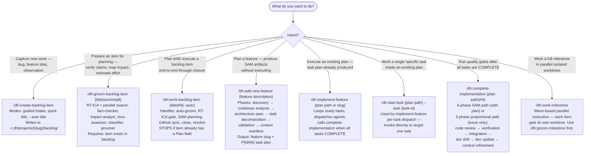
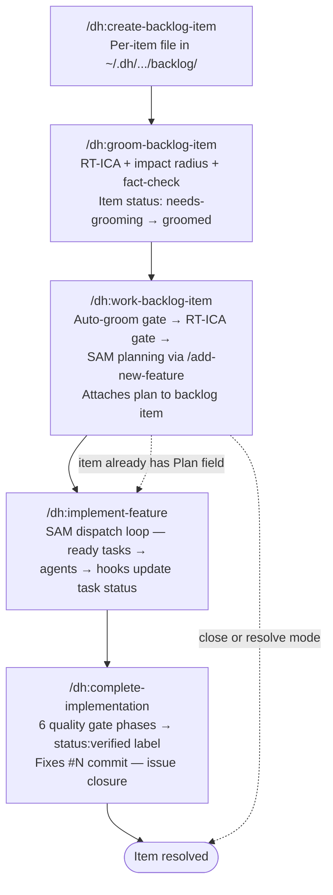

# Development Harness — Plugin Overview and Skill Router

This skill routes to the correct entry point for the development lifecycle. Read it to decide which skill to invoke — not to execute work.

## SAM Workflow Pipeline

```text
/add-new-feature  ──>  /implement-feature  ──>  /complete-implementation
   (planning)            (execution loop)         (quality gates)
```

---

## What This Plugin Provides

The development-harness plugin implements the structured development lifecycle for tracked backlog items. It spans capture through verified closure using a chain of skills backed by GitHub Issues as the source of truth and `~/.dh/projects/{slug}/` as the local state directory.

**Skills available:** `/dh:create-backlog-item`, `/dh:groom-backlog-item`, `/dh:work-backlog-item`, `/dh:add-new-feature`, `/dh:implement-feature`, `/dh:complete-implementation`, `/dh:work-milestone`

Plugin-level source copies exist at `plugins/development-harness/skills/` for each skill.

---

## Skill Router — "I want to do X"



---

## Lifecycle — Creation to Verified Closure



**Key invariants derived from the skill sources:**

- `/dh:work-backlog-item` stops immediately when the item already has a `Plan` field — use `/dh:implement-feature` instead
- `/dh:work-backlog-item` stops at the RT-ICA gate when MISSING conditions remain unresolved
- Task-level commits produced during `/dh:implement-feature` must NOT include `Fixes #N` — that trailer is reserved for the final commit in `/dh:complete-implementation`
- The `status:verified` label applied by `/dh:complete-implementation` is a prerequisite for `/dh:work-backlog-item resolve`

---

## Quick Decision Reference

| Situation | Skill |
|---|---|
| Item does not exist yet | `/dh:create-backlog-item` |
| Item exists, not yet groomed | `/dh:groom-backlog-item {title}` |
| Item is groomed, no plan yet | `/dh:work-backlog-item {title}` |
| Item has a Plan field | `/dh:implement-feature {plan path or slug}` |
| Plan is executing, one task needs focus | `/dh:start-task {plan} --task {id}` |
| All tasks complete, run quality gates | `/dh:complete-implementation {plan path}` |
| Issue number, no plan | `/dh:complete-implementation #{N}` (proportional gates) |
| Groomed item, skip to planning directly | `/dh:add-new-feature {description}` then `/dh:implement-feature` |
| Full milestone in parallel worktrees | `/dh:groom-milestone` then `/dh:work-milestone` |
| Dismiss without completing | `/dh:work-backlog-item close {title}` |
| Mark completed with evidence | `/dh:work-backlog-item resolve {title}` |
