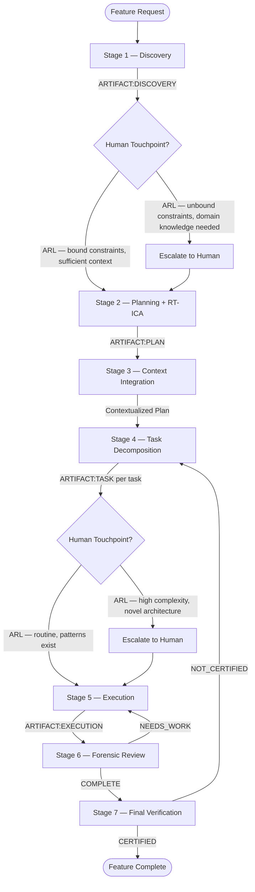

# Default Development Flow

The SAM 7-stage pipeline with ARL touchpoint gates. This is the default flow used when a language plugin does not declare a custom process flow override.

---

## Pipeline Overview

---

## Stage Descriptions

### S1 — Discovery

**Purpose:** Understand the feature request, the existing codebase, and the constraints.

**Inputs:**

- Feature request from user (natural language or structured spec)
- Access to project codebase

**Activities:**

- Parse and clarify the feature request
- Scan project structure (source layout, test layout, config files)
- Identify integration points with existing code
- Detect language and resolve specialist roles via manifest
- Identify constraints (performance, compatibility, dependencies)

**Output:** `ARTIFACT:DISCOVERY({feature-slug})` — A discovery document capturing requirements, codebase context, constraints, and resolved role assignments.

**Skill:** `/dh:discovery`

---

### S2 — Planning + RT-ICA

**Purpose:** Generate a development plan with information completeness analysis.

**Inputs:**

- Discovery artifact from S1
- RT-ICA assessment of information completeness

**Activities:**

- Run RT-ICA pre-pass to identify missing inputs, partial information, and assumptions
- Generate plan with dependency graph and task skeletons
- Mark tasks that depend on missing information with explicit unblock paths
- Define acceptance criteria for each planned task
- Identify quality gates to run at each stage

**Output:** `ARTIFACT:PLAN({feature-slug})` — A plan document with task graph, acceptance criteria, quality gates, and RT-ICA gap analysis.

**Skill:** `/dh:planning`

---

### S3 — Context Integration

**Purpose:** Validate the plan against the actual codebase state.

**Inputs:**

- Plan artifact from S2
- Current codebase state

**Activities:**

- Verify that files referenced in the plan exist and have expected structure
- Check that integration points identified in S1 are still valid
- Validate that planned API changes are compatible with existing consumers
- Confirm dependency versions and availability
- Update plan with codebase-verified context

**Output:** Contextualized plan (amended S2 artifact with codebase validation notes).

**Skill:** `/dh:context-integration`

---

### S4 — Task Decomposition

**Purpose:** Break the plan into individually executable task files.

**Inputs:**

- Contextualized plan from S3

**Activities:**

- Decompose plan into discrete tasks, each with clear scope
- Write each task as a standalone file with inputs, acceptance criteria, and agent assignment
- Map task dependencies and identify parallelization opportunities
- Assign each task to the appropriate specialist agent (from manifest or fallback)

**Output:** `ARTIFACT:TASK({task-id})` per task — Task plan registered via `sam_create`; access via `sam_read` / `sam_list`.

**Skill:** `/dh:task-decomposition`

---

### S5 — Execution

**Purpose:** Implement each task using language-appropriate specialists.

**Inputs:**

- Task artifact(s) from S4
- Resolved agent assignments

**Activities:**

- Delegate each task to its assigned specialist agent
- Agent implements the task following its acceptance criteria
- Run quality gates after implementation (format, lint, typecheck, test)
- Record implementation decisions and any deviations from plan

**Output:** `ARTIFACT:EXECUTION({task-id})` — Execution report per task documenting what was done, quality gate results, and any deviations.

**Skill:** `/dh:execution`

---

### S6 — Forensic Review

**Purpose:** Verify each task was completed correctly against its acceptance criteria.

**Inputs:**

- Task artifacts from S4 (acceptance criteria)
- Execution artifacts from S5 (what was done)

**Activities:**

- Compare implementation against each acceptance criterion
- Run quality gates if not already passed
- Check for regressions in existing functionality
- Verify cross-task dependencies are satisfied

**Output verdicts:**

- `COMPLETE` — All acceptance criteria met, quality gates passed
- `NEEDS_WORK` — Specific criteria failed, routes back to S5 with failure report

**Loop limit:** 3 NEEDS_WORK iterations per task before human escalation.

**Skill:** `/dh:forensic-review`

---

### S7 — Final Verification

**Purpose:** Certify the feature meets the original requirements from S1.

**Inputs:**

- Discovery artifact from S1 (original requirements)
- All execution and review artifacts from S5-S6

**Activities:**

- Verify each original requirement is satisfied by implemented tasks
- Run full quality gate suite (not per-task, but whole-feature)
- Check integration points function correctly
- Verify no regressions in existing functionality
- Generate certification report

**Output verdicts:**

- `CERTIFIED` — Feature complete, all requirements met
- `NOT_CERTIFIED` — Requirements gaps identified, routes back to S4 for corrective tasks

**Loop limit:** 2 NOT_CERTIFIED iterations before human escalation.

**Skill:** `/dh:final-verification`

---

## ARL Touchpoint Gates

Two explicit human touchpoint gates exist in the default flow:

**Gate 1 — Between S1 and S2:**

- Triggered when discovery reveals unbound constraints or domain knowledge gaps
- Skipped when all constraints are bound and sufficient context exists in the codebase

**Gate 2 — Between S4 and S5:**

- Triggered when task decomposition reveals high complexity or novel architecture
- Skipped when tasks follow routine patterns with existing codebase precedent

Additional escalation points exist within stages (e.g., NEEDS_WORK loop limits, NOT_CERTIFIED loop limits) but these are not pre-scheduled gates — they trigger on failure conditions.

---

## Artifact Naming Conventions

**Pattern:** `{stage-prefix}-{scope-or-id}.md`

**Stage prefixes:**

- `discovery` — S1
- `plan` — S2
- `context` — S3 (amends S2 artifact)
- `task` — S4
- `execution` — S5
- `review` — S6
- `verification` — S7

**Cross-reference tokens:** Each artifact includes `ARTIFACT:{TYPE}({ID})` tokens linking to predecessor and successor artifacts.

Full naming conventions in [./artifact-conventions.md](./artifact-conventions.md).

---

## Flow Override

A language plugin can replace this entire flow by declaring a `Process Flow Override` section in its language manifest. The override must:

1. Be a valid mermaid flowchart
2. Produce artifacts compatible with the naming conventions
3. Include at least one human touchpoint gate
4. End with a verification stage that produces a CERTIFIED/NOT_CERTIFIED verdict

When a flow override is present, the harness loads the custom flow instead of this default. All other harness features (role resolution, artifact management, touchpoint analysis) still apply.

---

## Sources

- SAM methodology: <https://github.com/bitflight-devops/stateless-agent-methodology>
- ARL human touchpoint model: [./human-touchpoint-model.md](./human-touchpoint-model.md)
