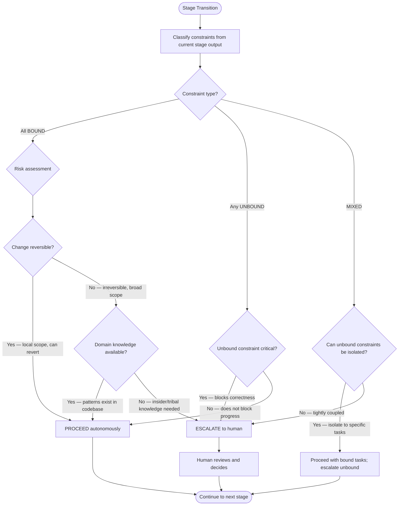
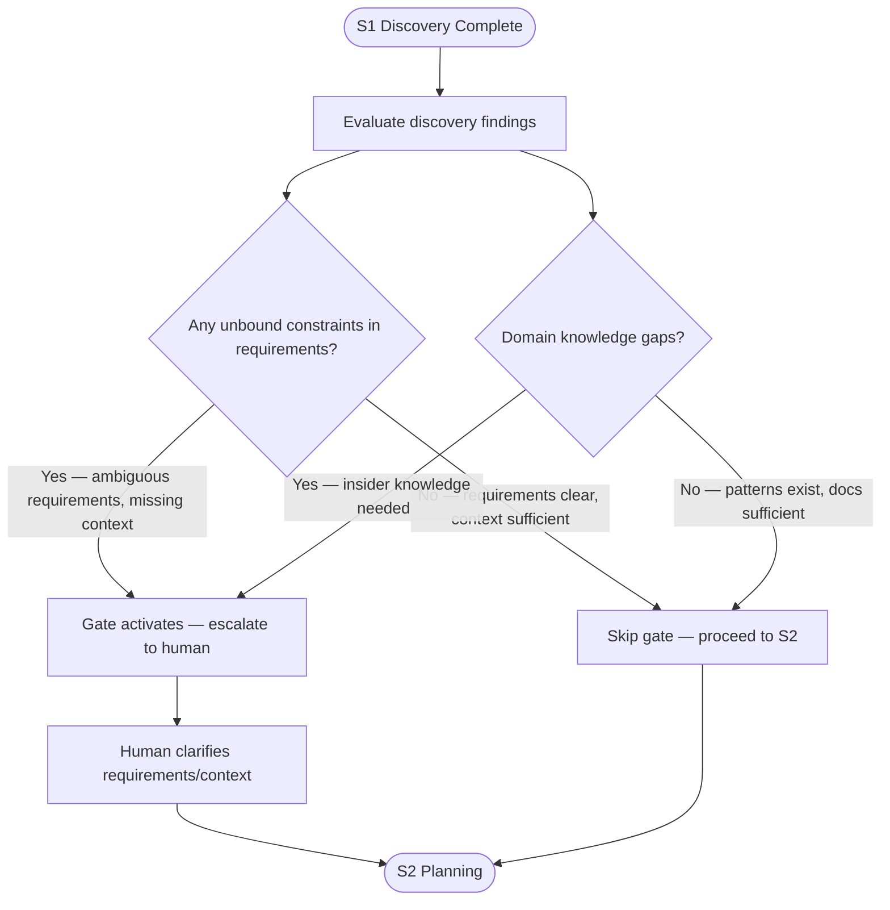
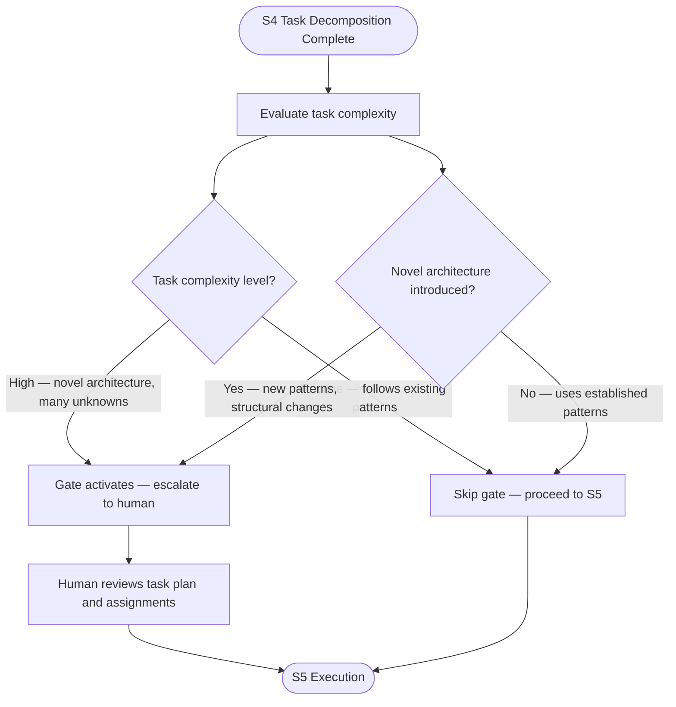

# Human Touchpoint Model

ARL-derived escalation decision model for determining when the development harness should pause for human review versus proceeding autonomously.

---

## Principle

Not every stage transition requires human approval. The harness uses constraint analysis to make escalation decisions deterministically. This model replaces arbitrary "review every plan" checkpoints with condition-based gates that escalate only when the agent cannot safely proceed.

---

## Escalation Decision Flowchart

---

## Constraint Types

### Bound Constraints

Constraints where all necessary information is available and deterministic.

**Indicators:**

- Acceptance criteria are specific and testable
- Integration points are documented in the codebase
- Patterns exist in existing code to follow
- Dependencies are versioned and available
- No ambiguous requirements remain

**Action:** Proceed autonomously.

### Unbound Constraints

Constraints where information is missing, ambiguous, or requires external knowledge.

**Indicators:**

- Requirements contain undefined terms or vague language
- No existing pattern in the codebase to follow
- Business logic requires domain expertise not in documentation
- Trade-offs exist that reflect organizational priorities (not technical ones)
- External system behavior is undocumented or untestable

**Action:** Escalate to human for the specific constraint. If the unbound constraint can be isolated to a specific task, other tasks may proceed.

### Mixed Constraints

Some constraints are bound, others are unbound.

**Decision:** Determine if the unbound constraints can be isolated.

- **Isolatable** — Proceed with bound tasks. Mark unbound tasks as blocked. Human unblocks specific tasks.
- **Coupled** — Unbound constraints affect the bound ones. Escalate the entire stage output.

---

## Risk Assessment

When all constraints are bound, assess the risk level of proceeding.

### Low Risk (proceed autonomously)

- Changes are **reversible** (can be reverted with git, undo, or redeployment)
- Changes have **local scope** (affect one module, one file, one feature)
- Changes follow **existing patterns** (not introducing novel architecture)
- Changes have **test coverage** (existing tests validate the approach)

### High Risk (consider escalation)

- Changes are **irreversible** (database migrations, API contract changes, published releases)
- Changes have **broad scope** (affect multiple modules, cross-cutting concerns)
- Changes introduce **novel architecture** (new patterns not seen in the codebase)
- Changes affect **external contracts** (API signatures consumed by other services)

High risk with available domain knowledge (patterns exist) proceeds. High risk without domain knowledge escalates.

---

## Domain Knowledge Assessment

When risk is high but constraints are bound, check if domain knowledge is available.

### Available in Context

- Codebase has examples of similar changes
- Documentation explains the architectural decision
- Test suite covers the relevant behavior
- Configuration files declare the expected patterns

**Action:** Proceed — the agent has sufficient information.

### Insider/Tribal Knowledge Needed

- The decision depends on organizational priorities not documented anywhere
- The change affects workflows only described in team conversations
- Historical context (why something was built a certain way) is required
- Stakeholder preferences influence the approach

**Action:** Escalate — the agent cannot safely make this decision.

---

## Pre-Scheduled Gates

The default pipeline has two pre-scheduled touchpoint gates:

**Gate 1 — After S1 Discovery, before S2 Planning:**

- Triggered when: unbound constraints in requirements, domain knowledge gaps
- Skipped when: all constraints bound, sufficient context

**Gate 2 — After S4 Task Decomposition, before S5 Execution:**

- Triggered when: high complexity, novel architecture
- Skipped when: routine patterns, existing codebase precedent

---

## Dynamic Escalation Points

Beyond pre-scheduled gates, the harness escalates on these conditions:

- **NEEDS_WORK loop limit** — 3 iterations in S6 Forensic Review without resolution
- **NOT_CERTIFIED loop limit** — 2 iterations in S7 Final Verification without resolution
- **Agent failure** — A specialist agent fails to produce an artifact (timeout, error, empty output)
- **Quality gate cascade failure** — All quality gates fail simultaneously (indicates fundamental issue)
- **Contradiction detected** — S3 Context Integration finds the plan contradicts codebase state and cannot reconcile

---

## Escalation Format

When escalating, the harness presents:

1. **What stage** produced the escalation
2. **What triggered** the escalation (specific constraint, risk factor, or loop limit)
3. **What the agent knows** (bound constraints, available context)
4. **What the agent does not know** (unbound constraints, missing information)
5. **Decision options** — concrete choices the human can make to unblock

The harness does NOT present vague requests like "please review." It presents specific decision forks.

---

## Sources

- ARL skill: `plugins/plugin-creator/skills/arl/`
- ARL research: `plugins/plugin-creator/skills/arl/references/`
- Default development flow: [./default-development-flow.md](./default-development-flow.md)
