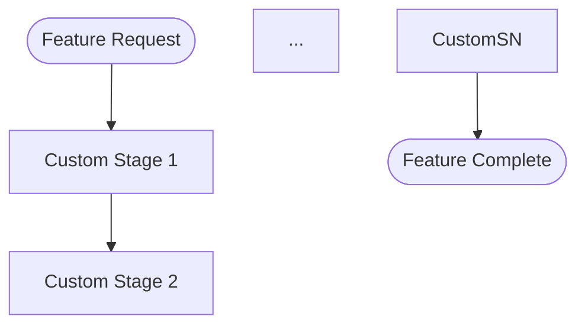

# Language Manifest Schema

The schema for language plugin manifests that compose with the development harness. Language plugin authors create a `references/language-manifest.md` file in their plugin's skill directory to declare specialist agents, quality gates, and project detection rules.

---

## Sections

A language manifest contains four required sections and one optional section.

### 1. Role Fulfillment (Required)

Maps the harness's abstract roles to plugin-provided agents or skills.

**Format:**

```markdown
## Role Fulfillment

- architect: @{plugin}:{agent-name}
- test-designer: @{plugin}:{agent-name}
- code-reviewer: @{plugin}:{agent-name}
- design-spec: @{plugin}:{agent-name}
- linting: /{plugin}:{skill-name}
```

**Rules:**

- Agents use `@plugin:agent-name` syntax
- Skills use `/plugin:skill-name` syntax
- Omitted roles fall back to general-purpose agent
- All five roles should be declared for full specialization
- Roles can point to the same agent if one agent covers multiple responsibilities

---

### 2. Quality Gates (Required)

Declares the commands the harness runs at quality checkpoints.

**Format:**

```markdown
## Quality Gates

- format: `{format command} {files}`
- lint: `{lint command} {files}`
- typecheck: `{typecheck command} {files}`
- test: `{test command}`
- standards: /{plugin}:{standards-skill}
```

**Rules:**

- Commands use backtick-wrapped syntax
- The `{files}` placeholder is replaced with the actual files being checked
- The `test` gate does not take a `{files}` placeholder (runs entire test suite)
- The `standards` gate is optional and references a skill for language-specific standards enforcement
- Commands must be runnable from the project root directory

---

### 3. Project Detection (Required)

Declares how the harness identifies this language in a project.

**Format:**

```markdown
## Project Detection

- markers: {comma-separated list of config files}
- source-patterns: {comma-separated glob patterns for source files}
- test-patterns: {comma-separated glob patterns for test files}
```

**Rules:**

- Markers are filenames (not paths) that identify the language when found in project root
- Source patterns use standard glob syntax without quotes
- Test patterns identify test files for coverage analysis
- At least one marker must be declared

---

### 4. Process Flow Override (Optional)

Replaces the default SAM pipeline with a language-specific flow.

**Format:**

```markdown
## Process Flow Override

(none — uses default harness flow)
```

Or, to declare a custom flow:

````markdown
## Process Flow Override


````

**Rules:**

- Must be a valid mermaid flowchart if declared
- Must produce artifacts compatible with standard naming conventions
- Must include at least one human touchpoint gate
- Must end with a verification stage producing CERTIFIED/NOT_CERTIFIED verdict
- Write `(none — uses default harness flow)` to explicitly use the default

---

## Complete Example — Python

```markdown
# Language Manifest: Python

## Role Fulfillment

- architect: @python3-development:python-architect
- test-designer: @python3-development:python-test-designer
- code-reviewer: @python3-development:python-code-reviewer
- design-spec: @python3-development:python-design-spec
- linting: /python3-development:stinkysnake

## Quality Gates

- format: `uv run ruff format {files}`
- lint: `uv run ruff check {files}`
- typecheck: `uv run mypy {files}`
- test: `uv run pytest tests/ --tb=short`
- standards: /python3-development:modernpython

## Project Detection

- markers: pyproject.toml, setup.py, setup.cfg
- source-patterns: src/**/*.py, **/*.py
- test-patterns: tests/**/*.py, test_*.py, *_test.py

## Process Flow Override

(none — uses default harness flow)
```

---

## Skeleton Example — TypeScript

```markdown
# Language Manifest: TypeScript

## Role Fulfillment

- architect: @typescript-development:ts-architect
- test-designer: @typescript-development:ts-test-designer
- code-reviewer: @typescript-development:ts-code-reviewer
- design-spec: @typescript-development:ts-design-spec
- linting: /typescript-development:ts-lint

## Quality Gates

- format: `npx prettier --check {files}`
- lint: `npx eslint {files}`
- typecheck: `npx tsc --noEmit`
- test: `npx vitest run`
- standards: /typescript-development:ts-standards

## Project Detection

- markers: package.json, tsconfig.json
- source-patterns: src/**/*.ts, src/**/*.tsx
- test-patterns: tests/**/*.test.ts, **/*.spec.ts

## Process Flow Override

(none — uses default harness flow)
```

---

## Skeleton Example — Rust

```markdown
# Language Manifest: Rust

## Role Fulfillment

- architect: @rust-development:rust-architect
- test-designer: @rust-development:rust-test-designer
- code-reviewer: @rust-development:rust-code-reviewer
- design-spec: @rust-development:rust-design-spec
- linting: /rust-development:rust-lint

## Quality Gates

- format: `cargo fmt -- --check`
- lint: `cargo clippy -- -D warnings`
- typecheck: `cargo check`
- test: `cargo test`

## Project Detection

- markers: Cargo.toml
- source-patterns: src/**/*.rs
- test-patterns: tests/**/*.rs

## Process Flow Override

(none — uses default harness flow)
```

---

## Validation Rules

When the harness loads a manifest, it validates:

1. **Structure** — All required sections present (Role Fulfillment, Quality Gates, Project Detection)
2. **Role syntax** — Agent references use `@plugin:agent` format; skill references use `/plugin:skill` format
3. **Gate commands** — Each command is backtick-wrapped and contains a recognizable command
4. **Markers** — At least one detection marker is declared
5. **Flow override** — If present, is valid mermaid syntax (parsed but not executed during validation)

Validation failures produce warnings but do not block the pipeline. The harness falls back to general-purpose for any section that fails validation.

---

## Sources

- Role resolution protocol: [./role-resolution-protocol.md](./role-resolution-protocol.md)
- Language manifest template: [../../templates/language-manifest-template.md](../../templates/language-manifest-template.md)
