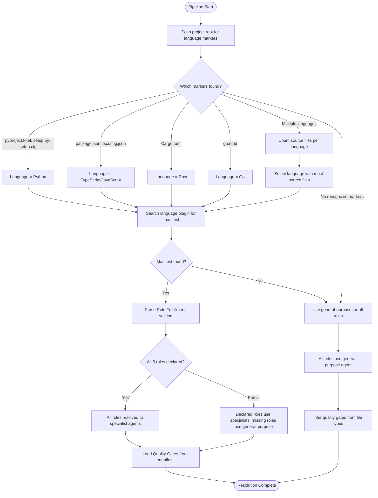

# Role Resolution Protocol

How the development harness resolves abstract roles to concrete agents at runtime.

---

## Overview

The harness defines abstract roles (architect, test-designer, code-reviewer, design-spec, linting). Language plugins provide manifests that map these roles to their specialist agents. At pipeline start, the harness detects the project language, finds the matching manifest, and resolves all roles before S1 begins.

**Layer 0 gates apply before role resolution.** RT-ICA, human touchpoint model, artifact conventions, and verification protocol are enforced before the harness resolves language-specific roles. See [.claude/docs/sdlc-layers/layer-0/](../../../../.claude/docs/sdlc-layers/layer-0/).

---

## Resolution Process

---

## Step 1 — Detect Project Language

Scan the project root directory for configuration files that identify the language.

**Detection markers by language:**

- **Python** — `pyproject.toml`, `setup.py`, `setup.cfg`, `requirements.txt`, `Pipfile`
- **TypeScript/JavaScript** — `package.json`, `tsconfig.json`, `deno.json`
- **Rust** — `Cargo.toml`
- **Go** — `go.mod`
- **Java** — `pom.xml`, `build.gradle`, `build.gradle.kts`
- **C/C++** — `CMakeLists.txt`, `Makefile`, `meson.build`

**Multi-language disambiguation:** When multiple language markers are found, count source files matching each language's source patterns. The language with the most source files becomes the primary language. Secondary languages are noted but do not influence role resolution.

---

## Step 2 — Find Language Manifest

Search installed language plugins for a manifest file.

**Search locations (in order):**

1. Active plugins matching the detected language name (e.g., `python3-development` for Python)
2. Any active plugin containing `references/language-manifest.md`
3. Project-local `.claude/language-manifest.md` (allows per-project overrides)

**Manifest file:** `references/language-manifest.md` within the language plugin's skill directory.

The manifest schema is documented in [./language-manifest-schema.md](./language-manifest-schema.md).

---

## Step 3 — Resolve Roles

Parse the manifest's Role Fulfillment section and map each abstract role to a concrete agent or skill.

**Abstract roles:**

- **architect** — Responsible for design decisions, interface definitions, module structure. Consulted during S2 (Planning) and S4 (Task Decomposition).
- **test-designer** — Responsible for test strategy, test case generation, coverage analysis. Consulted during S4 (Task Decomposition) and S5 (Execution).
- **code-reviewer** — Responsible for code quality review, pattern compliance, idiom enforcement. Consulted during S6 (Forensic Review).
- **design-spec** — Responsible for design specification documents and architectural decision records. Consulted during S2 (Planning).
- **linting** — Responsible for code formatting and linting orchestration. Consulted during S5 (Execution) quality gates.

**Resolution rules:**

- If the manifest declares a role, use the declared agent/skill
- If the manifest omits a role, fall back to the general-purpose agent for that role
- If no manifest exists at all, use general-purpose for every role

**Agent reference format in manifests:**

- Agents use `@{plugin}:{agent-name}` syntax (e.g., `@python3-development:python-architect`)
- Skills use `/{plugin}:{skill-name}` syntax (e.g., `/python3-development:stinkysnake`)

---

## Step 4 — Load Quality Gates

Parse the manifest's Quality Gates section to determine which commands to run for each gate type.

**Gate types:**

- **format** — Code formatting check/fix (e.g., `uv run ruff format {files}`)
- **lint** — Static analysis (e.g., `uv run ruff check {files}`)
- **typecheck** — Type checking (e.g., `uv run mypy {files}`)
- **test** — Test execution (e.g., `uv run pytest tests/`)
- **standards** — Language-specific standards skill (e.g., `/python3-development:stinkysnake`)

**Fallback gates (no manifest):**

When no manifest provides quality gate commands, the harness infers gates from detected file types:

- `.py` files detected — `ruff format`, `ruff check`, `mypy`, `pytest`
- `.ts`/`.js` files detected — `prettier`, `eslint`, `tsc`, `jest` or `vitest`
- `.rs` files detected — `cargo fmt`, `cargo clippy`, `cargo test`
- `.go` files detected — `gofmt`, `go vet`, `go test`

---

## Step 5 — Check for Flow Override

After resolving roles and gates, check if the manifest declares a Process Flow Override.

- If declared, load the custom flow and use it instead of the default SAM pipeline
- If not declared, use the default flow from [./default-development-flow.md](./default-development-flow.md)
- Custom flows must still produce artifacts with standard naming conventions

---

## Error Handling

**Language detection failure:** If no language markers are found at all, log a warning and proceed with general-purpose fallback. The harness does not block on detection failure.

**Manifest parse failure:** If a manifest exists but cannot be parsed (malformed markdown, missing sections), log the specific parse error, fall back to general-purpose for all roles, and note the parse failure in the S1 discovery artifact.

**Agent not found:** If a manifest references an agent that is not installed, log a warning, fall back to dh:task-worker for that specific role, and note the resolution failure in the S1 discovery artifact.

---

## Sources

- Language manifest schema: [./language-manifest-schema.md](./language-manifest-schema.md)
- Default development flow: [./default-development-flow.md](./default-development-flow.md)
- Language manifest template: [../../templates/language-manifest-template.md](../../templates/language-manifest-template.md)
