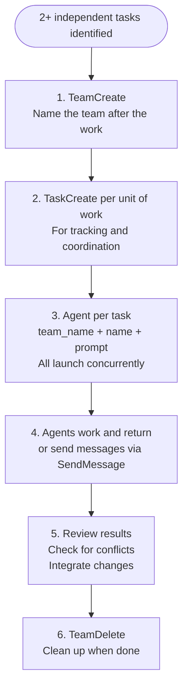

# Dispatch Parallel Agents

Teams are the standard mechanism for parallel work. When you have 2+ independent tasks, dispatch one agent per problem domain via TeamCreate. This keeps your context window clean and gets results faster.

For the full delegation quality framework — verification flowchart, ecosystem context rules, anti-pattern taxonomy — activate the `/agent-orchestration:agent-orchestration` skill.

## The Pattern



## Step 1 — Create the Team

```text
TeamCreate(team_name="descriptive-session-name")
```

One team per parallel session. Name it after what you're doing.

## Step 2 — Create Tasks for Tracking

```text
TaskCreate(subject="Fix auth module failures")
TaskCreate(subject="Fix database connection tests")
TaskCreate(subject="Fix API validation errors")
```

Tasks give you and the team visibility into what's being worked on.

## Step 3 — Spawn Agents as Teammates

```text
Agent(
  team_name="debug-session",
  name="auth-fixer",
  prompt="Your ROLE_TYPE is sub-agent.

OBSERVATIONS:
- 3 tests failing in src/auth/auth.test.ts
- Error: 'token expired' thrown before validation completes
- Verbatim error output: {paste exact errors}

DEFINITION OF SUCCESS:
- All 3 tests in auth.test.ts pass
- No new test failures introduced
- Return: summary of root cause and changes made

CONTEXT:
- Location: src/auth/
- Scope: auth module only — do not modify other modules
- Skills to load: Skill(skill='python3-development')"
)
```

All agents in the same team launch concurrently.

## Agent Prompt Structure

Every agent prompt uses four canonical sections from the delegation template:

**OBSERVATIONS** — what you observed, not what you think is wrong. Verbatim error messages, file paths, command output already in your context. Use "observed", "measured", "reported" language only. This enables agents to apply the scientific method — forming their own hypotheses from facts rather than inheriting your guesses.

**DEFINITION OF SUCCESS** — measurable outcome. What does DONE look like? Include verification method.

**CONTEXT** — where to look, what's in scope, what constraints exist. File paths you already know.

**ECOSYSTEM CONTEXT** — session-specific facts the agent cannot find in CLAUDE.md: authenticated CLIs, session-specific access, non-obvious doc locations. Omit if nothing session-specific applies.

### What NOT to include

- Pre-gathered data the agent will collect itself (anti-pattern: running `ruff check` then pasting 244 errors)
- Prescriptions for HOW to implement ("use sed to edit line 42")
- Assumptions stated as facts ("the bug is in the parser") — state these as "Hypothesis to verify:"
- Tool dictation ("use the MCP GitHub tool to fetch logs")

The agent is a specialist with full tool access and an empty context window. Describe the ecosystem and the goal — let the agent determine the approach.

## Pre-Send Verification (5 Checks)

Before launching agents, verify each prompt:

1. Uses observational language only — no "I think", "probably", "likely", "seems"
2. Defines WHAT must work, not HOW to implement it
3. Contains no pre-gathered data you collected by running commands now
4. References file paths rather than transcribing file contents inline
5. Describes the ecosystem — does not name a specific tool to use

For the full verification flowchart with per-check remediation steps, activate `/agent-orchestration:agent-orchestration`.

## Step 4 — Wait for Results

Agents send messages when they complete or go idle. Do not poll. Work on other tasks or coordinate based on incoming messages.

If an agent needs guidance, it sends a message via SendMessage. Respond via SendMessage back.

## Step 5 — Review and Integrate

When all agents return:

1. Read each agent's summary
2. Check for conflicts — did two agents edit the same file?
3. Run verification (test suite, linter, build)
4. Integrate all changes

## Step 6 — Clean Up

```text
TeamDelete()
```

Shut down teammates first via SendMessage shutdown requests, then delete the team.

## When to Dispatch

**Dispatch when:**

- 2+ test files failing with different root causes
- Multiple subsystems to modify independently
- Parallel reviews (security, performance, coverage)
- Research tasks that don't depend on each other
- Grooming multiple backlog items
- Any work where each unit can proceed without waiting on others

**Don't dispatch when:**

- Failures are related — fixing one fixes others
- Tasks share state — agents would edit the same files
- You don't know what's broken yet — explore first, then dispatch
- Sequential dependency — task B needs task A's output

## Common Mistakes

**Too broad** — "Fix all the tests" gives the agent no focus. Scope to one file, one module, one subsystem.

**No observations** — "Fix the race condition" without error messages or file locations. Paste what you observed.

**Pre-gathering** — Reading files and running diagnostics before delegating. The agent does this — you save context by not doing it.

**Assumption cascade** — "I think the issue is X, which probably means Y, so likely Z needs fixing." Each unverified assumption compounds. Replace with observed symptoms and let the agent investigate.

**Prescribing solutions** — "Replace lines 127-138 with a helper function." Describe the problem and success criteria. The agent determines the approach.

**No output format** — "Fix it" gives you no way to verify. Ask for a summary of root cause and changes.

## Example — Debugging 6 Failures

```text
TeamCreate(team_name="debug-6-failures")

TaskCreate(subject="Fix abort test failures")
TaskCreate(subject="Fix batch completion failures")
TaskCreate(subject="Fix race condition failures")

Agent(team_name="debug-6-failures", name="abort-fixer",
  prompt="Your ROLE_TYPE is sub-agent.
  OBSERVATIONS: 3 failures in agent-tool-abort.test.ts — timing issues.
  {paste verbatim error output}
  DEFINITION OF SUCCESS: All 3 tests pass. Return summary of root cause and fix.")

Agent(team_name="debug-6-failures", name="batch-fixer",
  prompt="Your ROLE_TYPE is sub-agent.
  OBSERVATIONS: 2 failures in batch-completion.test.ts — tools not executing.
  {paste verbatim error output}
  DEFINITION OF SUCCESS: All 2 tests pass. Return summary of root cause and fix.")

Agent(team_name="debug-6-failures", name="race-fixer",
  prompt="Your ROLE_TYPE is sub-agent.
  OBSERVATIONS: 1 failure in tool-approval-race.test.ts — execution count = 0.
  {paste verbatim error output}
  DEFINITION OF SUCCESS: Test passes. Return summary of root cause and fix.")
```

Three problems solved in the time of one. Zero conflicts between agent changes.
