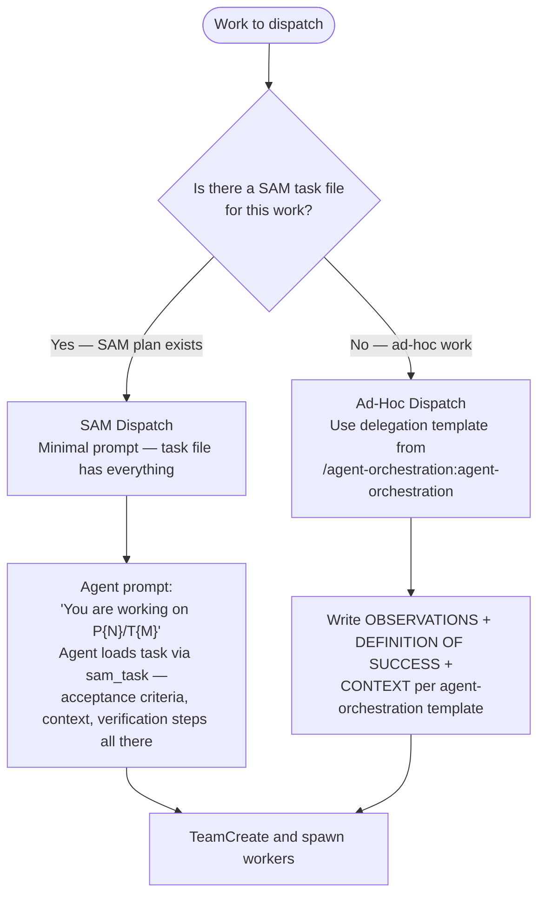
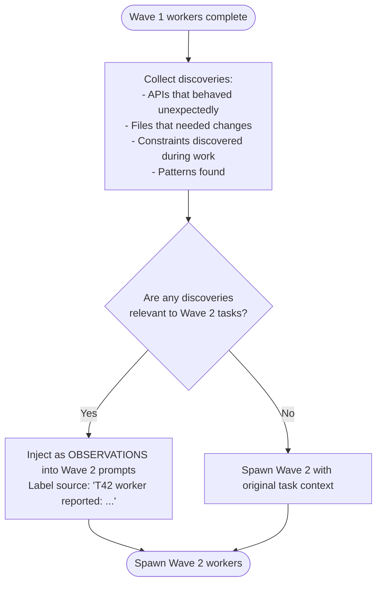
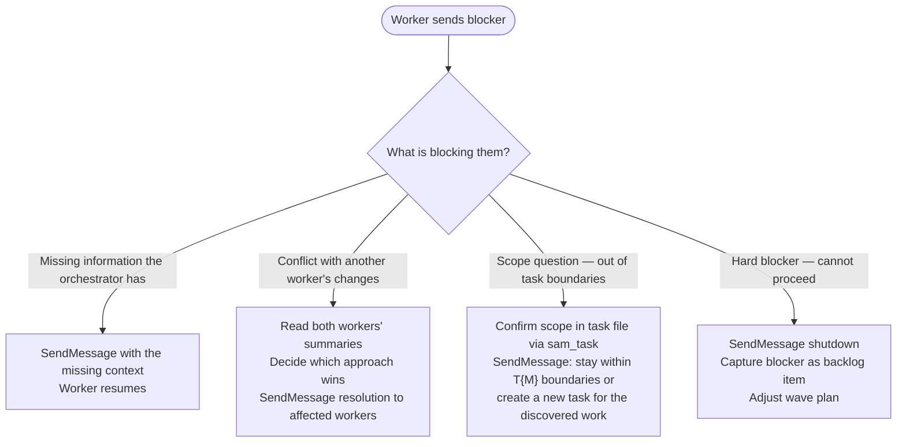

# Dispatch — Orchestrator as Manager

The orchestrator's job is experience sharing and team health, not prompt engineering.
Workers are specialists. Trust them. Relay what they learn. Unblock them when stuck. Synthesize what they produce.

For the delegation prompt template and pre-send verification, activate the `/agent-orchestration:agent-orchestration` skill.

## Two Dispatch Modes



## Manager Responsibilities

### 1 — Set Up the Team

```text
TeamCreate(team_name="feature-slug-wave-1")
```

Name the team after the work and wave number. One team per parallel wave.

**Fetch-once rule**: Before spawning any workers, call `backlog_view` **once per issue** that will be worked in this session. Store each result in context keyed by issue number. Do NOT call `backlog_view` again for any issue already fetched — use the stored data for all wave iterations, prompt construction, and relay building. If a `backlog_update` changes an item's state mid-session, replace the cached value with a single new `backlog_view` call for that issue only.

### 2 — Spawn Workers

Each worker gets exactly the context needed — no more.

**SAM dispatch (task file is the delegation):**

```text
Agent(
  team_name="feature-slug-wave-1",
  name="T42-worker",
  prompt="Your ROLE_TYPE is sub-agent. You are working on Pf1a2b3c4/T42."
)
```

The agent calls `sam_task` to load the task. All acceptance criteria, verification steps, and context live in the task file.

**Ad-hoc dispatch:** follow the delegation template from `/agent-orchestration:agent-orchestration` — OBSERVATIONS, DEFINITION OF SUCCESS, CONTEXT.

### 3 — Relay Discoveries Between Waves

Workers learn things during execution. Relay those discoveries to the next wave — this is experience sharing.



Workers report what they observed — relay facts, not interpretations, to the next wave.

### 4 — Handle Blockers

When a worker sends a blocker message:



### 5 — Synthesize Results

When all workers return:

1. Read each agent summary — check STATUS: DONE or STATUS: BLOCKED
2. Identify conflicts — two workers edited the same file or made incompatible changes
3. Run verification (tests, linter) across the full changeset
4. Relay synthesis findings to user or feed into next wave

File pointer pattern: instruct workers to write findings to `~/.dh/projects/{slug}/reports/` (resolved via `dh_paths.reports_dir()`) and return the path. Read reports, not inline summaries, to keep orchestrator context lean.

### 6 — Clean Up

```text
TeamDelete()
```

Shut workers down via SendMessage before deleting the team.

## When to Dispatch

**Dispatch when:**

- 2+ tasks that can run without waiting on each other
- Parallel reviews (security, performance, coverage)
- Multiple SAM tasks in the same wave (check `sam_plan`)
- Research tracks that don't depend on each other

**Explore first, then dispatch when:**

- The root cause is unknown — dispatching with wrong diagnosis wastes workers
- Tasks share state — workers would conflict on the same files

## Common Mistakes

**Micromanaging** — "Use sed to edit line 42, then grep to verify." Workers are specialists. Describe what success looks like; let them determine how.

**No discovery relay** — Wave 2 workers miss context Wave 1 workers discovered. Always check if Wave 1 output changes what Wave 2 needs to know.

**Ignoring blocker messages** — Workers go idle waiting for a response. Check messages between waves.

**Pre-gathering data** — Running diagnostics before delegating wastes orchestrator context. Workers gather their own data.
