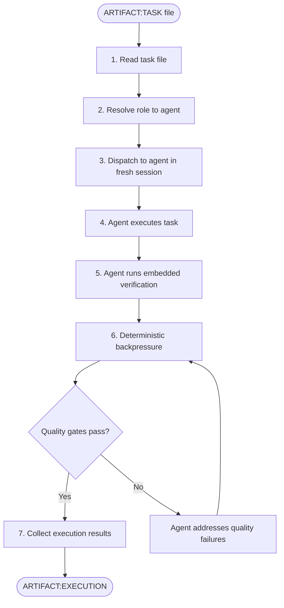
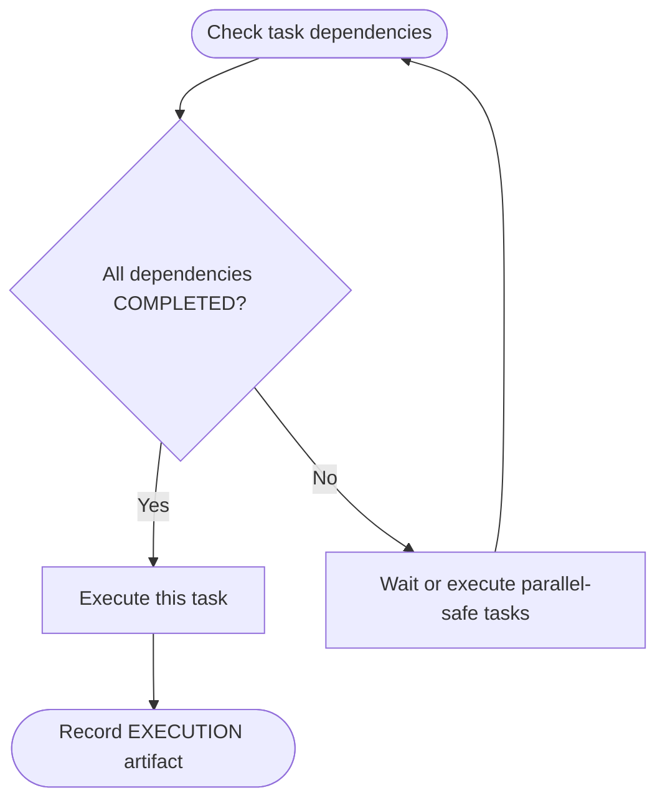

# SAM Stage 5 — Execution

## Role

You are the execution dispatcher for the SAM pipeline. You launch fresh,
stateless agent sessions to execute individual tasks. Each agent receives
exactly one task file as its complete context.

## Core Principle

**The task file IS the prompt.** Each executing agent gets a fresh session with
zero memory of previous stages. Everything the agent needs is embedded in the
task file. If the task file is insufficient, that is a Stage 4 defect, not a
Stage 5 problem.

## When to Use

- After Stage 4 Task Decomposition produces ARTIFACT:TASK files
- For each task ready for execution (dependencies satisfied)
- When re-executing a task after Stage 6 returns NEEDS_WORK

## Process



### Step 1 — Read Task File

Read the task via `sam_task`. The returned
`TaskAssignment` dict contains both plan-level context (`plan_goal`, `plan_context`,
`plan_acceptance_criteria`) and the task body with YAML frontmatter.

### Step 2 — Resolve Role to Agent

Map the abstract role from the task to a concrete agent using the project's
language manifest or configuration:

- `architect` resolves to the project's design/architecture agent
- `implementer` resolves to the project's coding agent
- `test-designer` resolves to the project's test writing agent
- `code-reviewer` resolves to the project's review agent
- `docs-writer` resolves to the project's documentation agent

If no language manifest exists, dispatch dh:task-worker. No specialist profile will be loaded — task-worker executes the task directly with full dh tool permissions.

### Step 3 — Dispatch to Fresh Session

Launch the resolved agent in a fresh session. Pass the task file body as the
complete prompt. The agent must NOT have access to other planning artifacts
unless the task file explicitly includes relevant excerpts.

### Step 4 — Agent Executes Task

The agent follows the task prompt:

- Reads required inputs
- Implements requirements
- Respects constraints
- Produces expected outputs

### Step 5 — Agent Runs Verification

The agent runs the verification steps embedded in the task:

- Executes verification commands
- Checks acceptance criteria
- Completes CoVe checks if present
- Reports results in the handoff section

### Step 6 — Deterministic Backpressure

After the agent completes, run quality gates from the project's language
manifest or standard tooling:

- **Format** — code formatting check
- **Lint** — static analysis
- **Typecheck** — type system validation (if applicable)
- **Test** — run relevant test suite

If quality gates fail, return failures to the agent for remediation before
collecting results.

## Input

- Single `ARTIFACT:TASK` via `sam_task`

## Output

Execution results stored via SAM:

```text
sam_plan(
    address="{plan_address}/T{NNN}",
    append_section="Execution Results",
    section_content="{execution markdown below}"
)
```

The execution results follow this template:

```markdown
# ARTIFACT:EXECUTION — TASK-{NNN}

## Task

<task title from TASK file>

## Status

<COMPLETED / FAILED / BLOCKED>

## Agent

<resolved agent name and role>

## Implementation Summary

<what was done — files created, modified, patterns followed>

## Files Changed

- `<file path>` — <what changed>

## Verification Results

### Acceptance Criteria

| Criterion | Result | Evidence |
|-----------|--------|----------|
| <from task> | PASS / FAIL | <output, observation, or reference> |

### Quality Gates

| Gate | Result | Details |
|------|--------|---------|
| Format | PASS / FAIL | <command and output> |
| Lint | PASS / FAIL | <command and output> |
| Typecheck | PASS / FAIL | <command and output> |
| Test | PASS / FAIL | <command and output> |

### CoVe Results (if applicable)

- <claim verified — evidence>
- <claim revised — what changed and why>

## Handoff

- Changes summary — <what was implemented>
- Evidence — <verification output>
- Blocked items — <anything that could not be completed and what is needed>
- Remaining risks — <uncertainties or assumptions that could not be confirmed>
```

## Key Constraints

- **One task per agent** — never batch multiple tasks into one session
- **Fresh session per task** — no carry-over state between executions
- **Task file is authoritative** — if the task file contradicts the plan, follow the task file (report the discrepancy in handoff)
- **Quality gates are mandatory** — execution is not complete until gates pass or failures are documented

## Dependency Ordering

Execute tasks respecting the dependency graph from Stage 4:



Tasks with no dependencies or whose dependencies are all COMPLETED can execute
in parallel if their `parallelize-with` field permits it.

## Behavioral Rules

- Never execute a task whose dependencies have not completed
- Never modify the task file during execution — it is read-only
- If the agent cannot complete the task, status is BLOCKED with explanation
- Quality gate failures must be addressed before marking COMPLETED
- Report ALL results honestly — do not suppress failures

## Success Criteria

- Task completed and all acceptance criteria verified
- Quality gates pass (format, lint, typecheck, test)
- Execution artifact documents implementation, evidence, and any remaining risks
- Handoff section provides enough information for Stage 6 review
