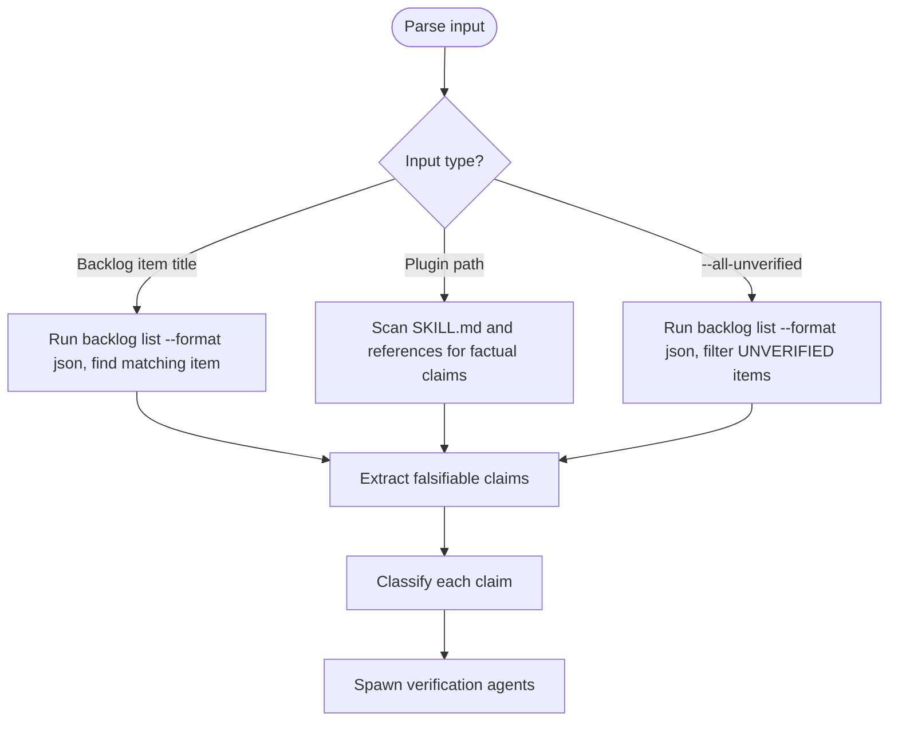
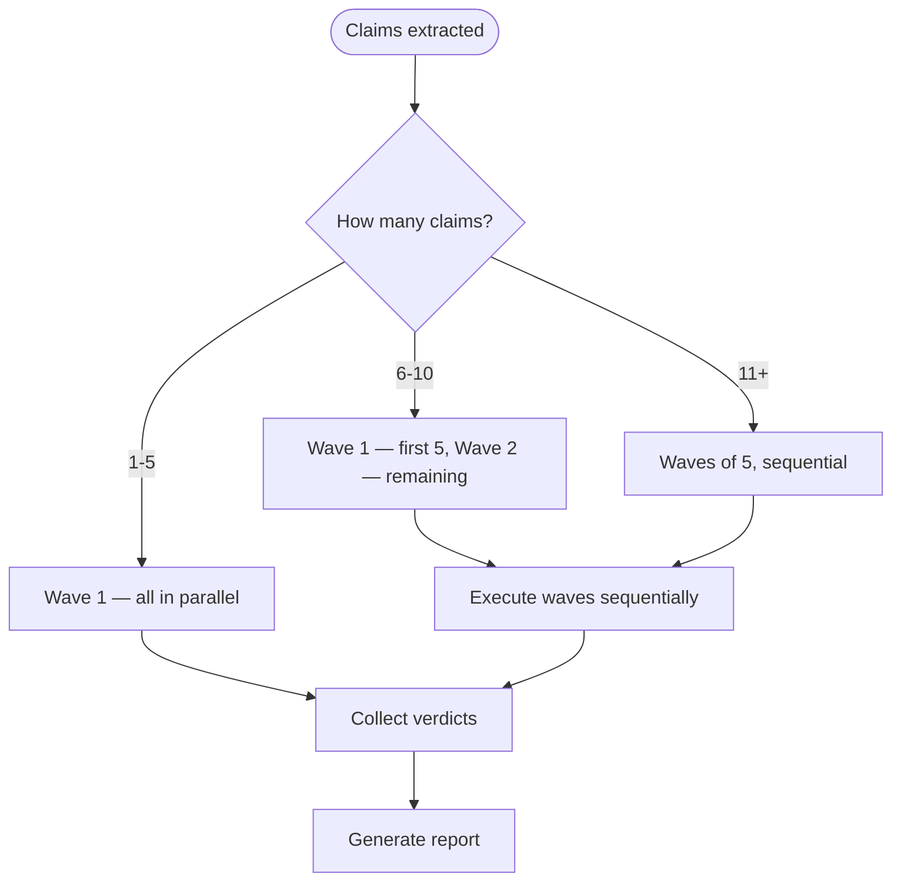

# Fact Check — Primary Source Claim Verification

Verify factual claims against primary sources using web lookups. Training data recall is NOT evidence.

---

## When to Use

- Backlog items marked `UNVERIFIED`
- Plugin documentation with uncited claims about tools, APIs, CLI flags
- Skills that reference specific software behavior without citation
- After code review agents flag potential fabrication

## When NOT to Use

- Structural findings (broken links, missing files, malformed YAML) — those are filesystem checks, not fact checks
- Code logic bugs — use `/dh:find-cause` instead
- Research on new tools — use `/research-curator` instead

---

## Evidence Rules

<evidence_rules>

Adapted from the `find-cause` evidence chain protocol.

**Valid evidence** (one of these MUST support each verdict):

1. **WebFetch output** — content retrieved from an official documentation URL
2. **WebSearch result** — search results linking to authoritative sources
3. **Command output** — `npx <tool> --help`, `gh api`, or similar CLI output
4. **Repository source code** — file content from the tool's GitHub repo via `gh` or clone
5. **MCP tool output** — `mcp__Ref`, `mcp__exa` results with URLs

**NOT valid evidence** (these MUST NOT support verdicts):

- Training data recall ("I know this from my training")
- Inference from absence ("the docs don't mention it, so it doesn't exist")
- Reasoning from analogy ("tool X works this way, so tool Y does too")
- Documentation that describes intent without observed behavior
- Another AI's claim without primary source backing

</evidence_rules>

---

## Claim Extraction

Parse the input to extract discrete, falsifiable claims:



### Claim Classification

For each claim, determine:

1. **Claim text** — the specific assertion
2. **Primary source** — where to check (official docs URL, GitHub repo, CLI help)
3. **Verification method** — WebFetch URL, run CLI command, search GitHub issues
4. **Falsifiability** — what would disprove this claim?

---

## Verification Agent Spawning

Spawn `@fact-checker` agents in parallel waves of 5.

Each agent receives:

```text
CLAIM: {exact claim text}
SOURCE_FILE: {file containing the claim, with line numbers}
PRIMARY_SOURCE: {URL or command to check against}
VERIFICATION_METHOD: {WebFetch | WebSearch | CLI command | gh API}
FALSIFICATION_CRITERIA: {what would disprove this}
```

### Wave Execution



---

## Verdict Format

Each agent returns a structured verdict:

```text
CLAIM: {the claim being checked}
VERDICT: VERIFIED | REFUTED | INCONCLUSIVE
EVIDENCE:
  - Source: {URL or command}
  - Retrieved: {date}
  - Content: {relevant excerpt from primary source}
EXPLANATION: {how the evidence supports the verdict}
CITATION: {formatted citation for backlog/docs update}
```

### Verdict Criteria

- **VERIFIED** — primary source confirms the claim. Evidence excerpt matches.
- **REFUTED** — primary source contradicts the claim. Evidence excerpt shows the discrepancy.
- **INCONCLUSIVE** — primary source could not be reached, does not address the claim, or is ambiguous. State what additional step would resolve it.

---

## Chain of Verification (CoVe) Requirement

Each agent MUST apply CoVe before finalizing:

1. **Initial lookup** — fetch primary source, form initial verdict
2. **Verification questions** — generate 2-3 questions that could falsify the initial verdict
3. **Independent check** — answer each verification question using a different source or method
4. **Final verdict** — confirm or revise based on cross-checking

This prevents the agent from confirming its own bias in a single lookup.

---

## Report Format

After all waves complete:

```markdown
# Fact Check Report

**Date**: {YYYY-MM-DD}
**Scope**: {backlog item title | plugin path | all-unverified}
**Claims checked**: {N}

## Summary

| Verdict | Count |
|---------|-------|
| VERIFIED | {N} |
| REFUTED | {N} |
| INCONCLUSIVE | {N} |

## Verdicts

### Claim 1: {claim text}

**Verdict**: {VERIFIED|REFUTED|INCONCLUSIVE}
**Source**: {primary source URL}
**Evidence**: {excerpt}
**Citation**: {formatted citation}

### Claim 2: ...

## Backlog Updates

{For each REFUTED or VERIFIED claim, the specific edit to make to the per-item file}
```

---

## Post-Actions

1. **Update backlog** — for VERIFIED/REFUTED claims, update the backlog item's Status field in the per-item file
2. **Lint** — `uv run prek run --files .claude/backlog/`
3. **Commit** — `git add .claude/backlog/ && git commit -m "docs(backlog): fact-check {N} claims ({date})"`

For INCONCLUSIVE claims, add a note to the backlog item describing what additional verification is needed.

---

## References

- Evidence chain protocol: use the /dh:find-cause skill
- Wave spawning pattern: use the /research-curator skill
- Anti-hallucination checkpoint: use the /skill-research-process skill
- Chain of Verification: use the /cove-prompt-design skill
- Verification agent: [@dh:fact-checker](../../agents/fact-checker.md)
