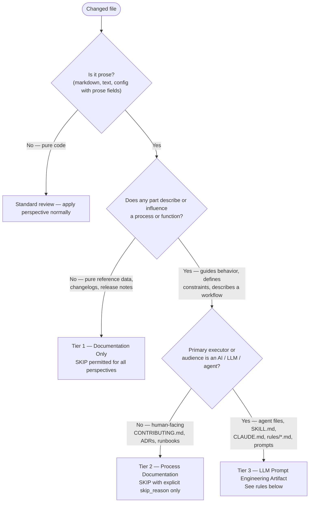

# File Classification for Review

**Invoke before deciding SKIP on any prose file.** Three tiers determine which SKIP rules apply.

## Tier Decision

## Tier Rules

**Tier 1 — Documentation Only**

Changelogs, release notes, README sections describing completed features. SKIP is valid for
all perspectives with no applicable checks.

**Tier 2 — Process Documentation**

`CONTRIBUTING.md`, ADRs, runbooks, README workflow sections. These are behavioral contracts
for human contributors. SKIP is permitted only with an explicit `skip_reason` explaining why
the change has no impact in this reviewer's scope.

**Tier 3 — LLM Prompt Engineering Artifacts**

The markdown content IS the executable. These files are the product, not descriptions of it.

Tier 3 file patterns:

- `agents/*.md` — plugin agent instruction files
- `skills/*/SKILL.md` — skill instruction files
- `skills/*/references/**` — skill reference files (any depth)
- `CLAUDE.md` — session instruction files
- `.claude/rules/*.md` — scoped behavioral rules

Per-perspective SKIP rules for Tier 3:

| Perspective | SKIP | Required check |
|---|---|---|
| Security | **PROHIBITED** | Prompt injection surfaces — see §2.5.1 in `verdict-schema.md` |
| Quality | **PROHIBITED** | Behavioral correctness: contradictions, ambiguous constraints, missing edge cases |
| Performance | Permitted | No applicable performance check |
| Accessibility | Permitted | No applicable accessibility check |

For the full classification rule definition and the prompt injection surface checklist
(`§2.5.1`), read:
[verdict-schema.md §2.5](../multi-perspective-review/references/verdict-schema.md)
