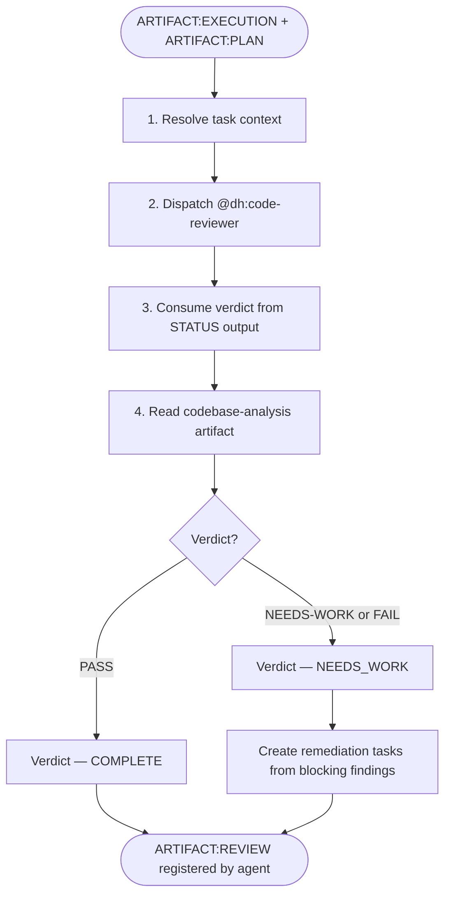
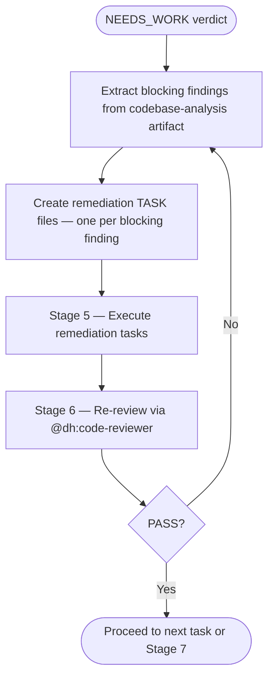

# SAM Stage 6 — Forensic Review

## Role

SAM Stage 6 delegates the concrete review work to `@dh:code-reviewer`. This skill is the
orchestration wrapper: it resolves the task context, dispatches the agent, and maps its
structured output back to the SAM pipeline verdict.

Producer and reviewer must always be different agents — never invoke this skill from the
same agent that executed the task.

## Core Principle

**AI cannot reliably self-evaluate.** The agent that wrote the code cannot
objectively assess its own work. Forensic review uses a separate agent with
fresh context to verify claims against observable evidence.

## When to Use

- After Stage 5 Execution produces ARTIFACT:EXECUTION
- For each completed task before marking it as done
- When re-reviewing after a NEEDS_WORK remediation cycle

## Process



### Step 1 — Resolve Task Context

Read the task via MCP:

```text
sam_task(plan="{plan_id}", task="{task_id}", config={"action": "read"})
```

Extract:

- `task_file_path` — the path to the task YAML file (e.g., `plan/P{id}-{slug}.yaml`)
- `issue_number` — required for artifact registration; if absent, BLOCK immediately
- `expected_outputs` — the implementation files produced by Stage 5 (listed in the task's
  "Files Changed" or "Expected Outputs" section)
- `acceptance_criteria` — the explicit success conditions to verify

### Step 2 — Dispatch @dh:code-reviewer

Delegate the concrete S6 review work with subagent_type="dh:code-reviewer".

Context to include in the prompt:

- `task_file_path` — path to the SAM task file
- `implementation_files` — the files from the task's Expected Outputs
- `issue_number` — required for `artifact_register` inside the agent

```text
Task is S6 forensic review with subagent_type="dh:code-reviewer"
Context: task_file_path={task_file_path}, issue_number={issue_number},
  implementation_files={expected_outputs}
Output: STATUS block containing Verdict (PASS / FAIL / NEEDS-WORK) and ARTIFACTS
  section confirming codebase-analysis artifact registered on issue #{issue_number}
```

The agent independently reads the task, detects the stack, verifies acceptance criteria,
applies universal and stack-specific quality dimensions, and registers the review report
as a `codebase-analysis` artifact via `artifact_register`.

### Step 3 — Consume Verdict

Parse the agent's STATUS output:

- `Verdict: PASS` → map to SAM verdict COMPLETE
- `Verdict: NEEDS-WORK` or `Verdict: FAIL` → map to SAM verdict NEEDS_WORK

If the agent returns STATUS: BLOCKED, propagate the block upstream with the agent's
NEEDED section as the reason.

### Step 4 — Read codebase-analysis Artifact

Retrieve the registered review report:

```text
artifact_read(issue_number={issue_number}, artifact_type="codebase-analysis")
```

Use this to populate the SAM task's Review Results section and to extract blocking findings
for remediation task creation.

Append review results to the task:

```text
sam_task(
  plan="{plan_id}",
  task="{task_id}",
  config={"action": "update", "append_section": "Review Results", "section_content": "{artifact_content}"}
)
```

## Input

- `ARTIFACT:EXECUTION` + `ARTIFACT:TASK` via `sam_task(plan="{plan_id}", task="{task_id}", config={"action": "read"})`
- `issue_number` — must be present; used by `@dh:code-reviewer` for `artifact_register` and
  by this skill for `artifact_read`

## NEEDS_WORK Remediation Loop

When the verdict is NEEDS_WORK or FAIL, extract blocking findings from the
`codebase-analysis` artifact's "Required changes (blocking)" or "Blocking" section.



Remediation tasks follow the same CLEAR format as original tasks. They:

- Reference the specific blocking finding (file:line from the codebase-analysis artifact)
- Define acceptance criteria that directly resolve the blocking finding

## Behavioral Rules

- Never review your own execution — producer and reviewer must differ
- Verdict is sourced from `@dh:code-reviewer` STATUS output — do not invent it
- Blocking findings for remediation come from the `codebase-analysis` artifact — do not
  invent them from the agent's STATUS summary
- Do not add new requirements — review against the ORIGINAL acceptance criteria only
- Verification Gap findings are always BLOCKING (see `@dh:code-reviewer` agent for the
  full classification rule)

## Success Criteria

- `@dh:code-reviewer` returns STATUS: DONE with a PASS, FAIL, or NEEDS-WORK verdict
- `codebase-analysis` artifact is registered on issue #{issue_number}
- Review Results appended to the SAM task via `sam_task(action='update')`
- Blocking findings (if any) have concrete remediation tasks created
