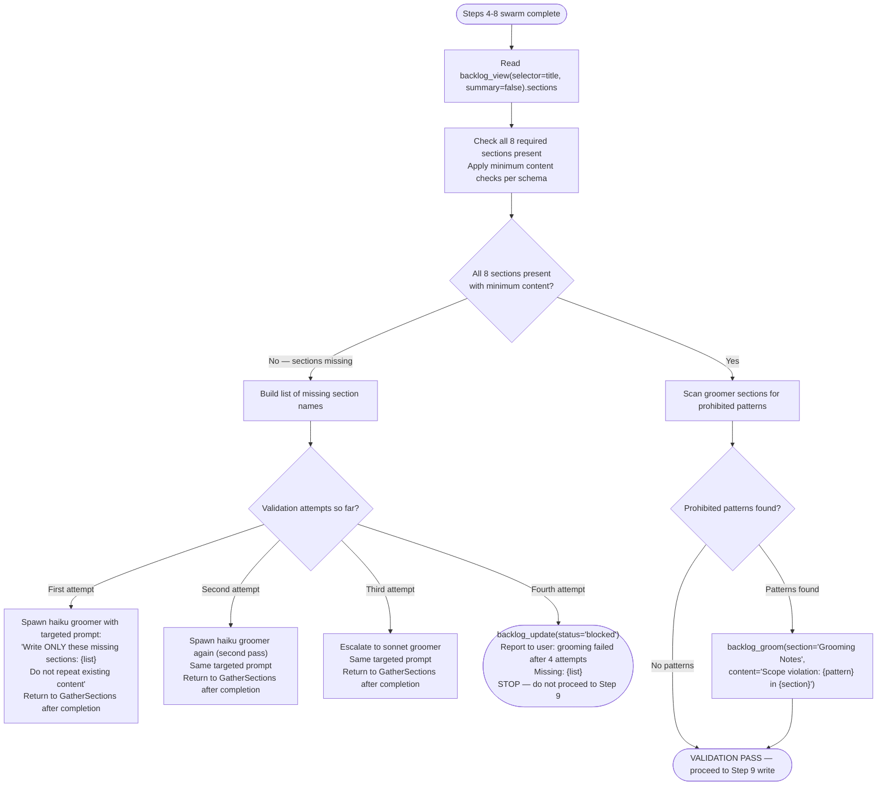

# Groomer Output Validation

Pre-write validation gate (Step 8.7) — verifies groomer agent output contains all required
sections with minimum content before writing to the canonical item file.

SOURCE: Architect spec Issue #398, Section 7 (Groomer Output Validation AC3)

---

## Required Section Schema

All 8 sections must be present in the groomer output with minimum content. Section
names are exact string matches against `backlog_view(selector=title, summary=false).sections`.

| Section | Required | Minimum content |
|---|---|---|
| `RT-ICA` | Required | Contains `Decision: APPROVED` or `Decision: BLOCKED` and `Date: YYYY-MM-DD` |
| `Impact Radius` | Required | Contains at least one entry under `Systems Inventory` |
| `Fact-Check` | Required | Contains at least one claim with `verdict:` field |
| `Acceptance Criteria` | Required | Non-empty — at least one criterion listed |
| `Reproducibility` | Required | Non-empty — may be "N/A for feature items" but must be present |
| `Issue Classification` | Required | Contains `Type:` field with valid type value |
| `Priority` | Required | Contains `Effort:` field |

## Optional Sections (Not Validated for Presence)

These sections are permitted but not required during validation:
`Root-Cause Analysis`, `Impact`, `Benefits`, `Expected Behavior`, `Files`, `Resources`,
`Dependencies`, `Scope`, `Decision`

---

## Scope Boundary Check

After presence check passes, scan groomer-produced sections for implementation-prescriptive
language. Apply these prohibited patterns (regex) to all sections except `Issue Classification`
and `Root-Cause Analysis`:

```text
use \w+ framework
implement \w+ using
architecture:
the solution (should|will|must) (use|implement|call)
```

**Exemption**: `Issue Classification` and `Root-Cause Analysis` may describe the problem in
implementation terms — classification of the problem is not the same as prescribing the solution.

**Scope violations do NOT block the write.** Violations are logged as notes via:

```text
backlog_groom(section="Grooming Notes", content="Scope violation: {pattern} in {section}")
```

---

## Validation Procedure (Step 8.7 — Pre-Write Validation Gate)

Located between end of Steps 4–8 swarm and the `backlog_groom(mark_groomed=True)` call in Step 9.



### Retry Model

Escalation follows design decision D3 (haiku → haiku retry → sonnet → blocked):

1. **First attempt** — haiku groomer, targeted prompt listing missing sections only
2. **Second attempt** — haiku groomer, same targeted prompt (second pass often resolves first-attempt gaps)
3. **Third attempt** — sonnet groomer, same targeted prompt
4. **Blocked** — `backlog_update(status='blocked')`, report to user, do not call `backlog_groom(mark_groomed=True)`

No graceful degradation. `blocked` is an explicit terminal state, not a fallback.

### Placement in groom-backlog-item Workflow

The SKILL.md workflow Mermaid diagram node sequence changes from:

```text
S48 to S85 to FinalDecision
```

to:

```text
S48 to S85 to FinalDecision(APPROVED path) to S87 to S9
```

Where S87 is: "Step 8.7 — Groomer Output Validation — Load references/groomer-output-validation.md"

Full procedure lives here. The SKILL.md diagram shows the S87 node; this file contains the detail.
