# Groom Milestone

Prepare a GitHub milestone for parallel execution by `/work-milestone`.

## Outcome

All items in the milestone are groomed, dependency-analyzed, and conflict-grouped — producing a dispatch plan that `/work-milestone` can execute without further human input except blocker resolution.

## Entry Conditions

- Milestone number provided as first argument
- Milestone exists on GitHub with state=open
- At least one item assigned to the milestone (via `/group-items-to-milestone`)
- Backlog MCP server responding

## Exit Conditions

- Every item in the milestone has `groomed: true`
- A priority-ordered list with wave assignments is produced
- A dependency graph (item-to-item) is produced with conflict groups identified
- Any items recommended for splitting have been split (user-approved)
- Any items recommended for addition have been added (user-approved)
- Dispatch plan file written at `plan/milestone-{N}-dispatch.yaml`

## Workflow

```mermaid
flowchart TD
    Start(["Input: milestone number"]) --> Load["Step 1: Load Milestone<br>Action: backlog_list_issues(milestone=N)<br>Output: list of items with groomed status"]

    Load --> Assess["Step 2: Assess Milestone Scope<br>Action: For each item, read title + description + labels<br>Output: scope summary — what the milestone covers"]

    Assess --> GapCheck{"Step 3: Gap Analysis<br>Areas the milestone should cover<br>but no item addresses?<br>Observable: compare milestone title/description<br>against item titles and descriptions"}

    GapCheck -->|"Gaps found"| ProposeAdd["Step 3a: Propose Additions<br>Action: Present gaps to user with<br>suggested new items or existing<br>backlog items to associate<br>Output: user decision per gap"]
    GapCheck -->|"No gaps"| GroomGate

    ProposeAdd --> AddItems["Step 3b: Execute Additions<br>Action: create-backlog-item or<br>backlog_update to assign milestone<br>Output: updated milestone item list"]
    AddItems --> GroomGate

    GroomGate{"Step 4: Groom Check<br>Any items with groomed=false?<br>Observable: groomed field in<br>backlog_list_issues response"}

    GroomGate -->|"Ungroomed items exist"| BatchGroom["Step 4a: Batch Groom via Kage-Bunshin<br>Actor: Parallel kage-bunshin sessions (not TeamCreate)<br>Action: For each ungroomed item, spawn:<br>claude -p --model sonnet --permission-mode auto<br>--output-format json --no-session-persistence<br>'Load /dh:groom-backlog-item {title}'<br>All sessions run in same directory (no worktree —<br>grooming writes go through backlog MCP, not filesystem).<br>Wait for all PIDs to exit."]
    GroomGate -->|"All groomed"| DepAnalysis

    BatchGroom --> GroomResults{"Step 4b: Check Groom Results<br>Read each /tmp/kb-groom-{issue}.json<br>Any sessions failed?"}
    GroomResults -->|"All succeeded"| DepAnalysis
    GroomResults -->|"Some failed"| GroomFix{"Fixable without<br>user direction?"}
    GroomFix -->|"Yes"| GroomRetry["Re-spawn failed items only"]
    GroomRetry --> GroomResults
    GroomFix -->|"No"| GroomEscalate["Report to user:<br>item, error, what was attempted"]
    GroomEscalate --> GroomUserQ{"User says?"}
    GroomUserQ -->|"Skip items"| DepAnalysis
    GroomUserQ -->|"Abort"| Abort(["ABORT — user decision"])

    DepAnalysis["Step 5: Dependency Analysis<br>Action: Read Impact Radius from each groomed item.<br>Compare file lists across all items to find overlaps.<br>Output: dependency graph — which items<br>touch overlapping files/modules"]

    DepAnalysis --> ConflictGroup["Step 6: Conflict Grouping<br>Action: Items with file overlap form a conflict group.<br>Items in the same conflict group MUST execute sequentially.<br>Items in different groups or with no overlap execute in parallel.<br>Output: conflict groups list"]

    ConflictGroup --> SplitCheck{"Step 7: Split Assessment<br>Any single item spanning multiple<br>independent plugins or repo areas?<br>Observable: item's Impact Radius<br>lists files in 2+ unrelated directories"}

    SplitCheck -->|"Splittable items found"| ProposeSplit["Step 7a: Propose Splits<br>Action: Present split recommendations<br>to user with rationale per item<br>Output: user decision per split"]
    SplitCheck -->|"No splits needed"| Prioritize

    ProposeSplit --> ExecSplit["Step 7b: Execute Splits<br>Action: Create new backlog items for each split piece.<br>Assign to this milestone. Close original if fully decomposed.<br>Output: updated item list"]
    ExecSplit --> DepAnalysis

    Prioritize["Step 8: Priority Ordering<br>Action: Order items by:<br>1. Dependency constraints (blocked-by first)<br>2. Priority label (P0 > P1 > P2)<br>3. Conflict group (parallel-safe first)<br>Output: ordered list with wave assignments"]

    Prioritize --> WavePlan["Step 9: Build Dispatch Plan<br>Action: Assign items to waves.<br>Wave 1: all items with no dependencies and no conflict group overlap.<br>Wave 2: items unblocked after Wave 1. Continue until all items assigned.<br>Verify wave ordering and dependency references.<br>Construct DispatchPlan object from wave assignments.<br>Call dispatch_create_plan(milestone_number=N, plan=dispatch_plan) to persist plan atomically.<br>For re-grooming a stale plan, pass overwrite=True.<br>Call dispatch_wave_start per wave to register state.<br>Output: plan/milestone-{N}-dispatch.yaml"]

    WavePlan --> Report["Step 10: Report<br>Output: milestone summary with wave assignments,<br>conflict groups, estimated parallelism per wave,<br>and next command: /work-milestone {N}"]

    Report --> Done(["Exit: Dispatch plan ready"])
```

## MCP Tools Used

- `backlog_list_issues(milestone=N)` — load milestone items and groomed status
- `backlog_view(selector)` — read individual item Impact Radius and metadata
- `backlog_groom(selector)` — trigger grooming for ungroomed items
- `backlog_update(selector, ...)` — assign milestone, update item fields

## MCP Tools — Dispatch (Backlog Server)

The backlog MCP server exposes these dispatch tools used at plan-write time:

- `dispatch_create_plan(milestone_number, plan, overwrite, validate, issue)` — Step 9: validates and persists the dispatch plan atomically; `plan` is a typed DispatchPlan object; use overwrite=True when re-grooming a stale plan
- `dispatch_wave_start(milestone, wave_num, items)` — Step 9: registers each wave in the dispatch state database; call after dispatch_create_plan to initialise wave state
- `dispatch_wave_status(milestone, wave_num)` — available after `/work-milestone` launches; returns item-level progress with stale PID detection

The dispatch plan is persisted via the `dispatch_create_plan` MCP tool, which validates the DispatchPlan object against the schema and writes atomically. The DispatchPlan schema is defined in [./references/dispatch-plan-schema.md](./references/dispatch-plan-schema.md). The conflict analysis and wave assignment logic (Steps 5–9) runs in-session — it does not call external module functions.

## Error Handling

- Milestone not found or closed: report and stop — do not create a dispatch plan for a closed milestone
- Backlog MCP unavailable: emit PROCESS ERROR format with exact error text; do not proceed
- No items in milestone: report, suggest running `/group-items-to-milestone` first
- Grooming agent fails for an item: log the error, continue grooming remaining items, report all failures at the end
- Impact Radius missing after grooming: re-trigger groom for that item once; if still missing, flag as BLOCKED in the report
- Wave ordering or dependency reference errors found during plan build: fix before writing the plan file and calling `dispatch_wave_start`

## Backend Requirements

**GitHub backend only.** The GitHub milestone is the organizing primitive for this skill.
All milestone lookup (`backlog_list_issues(milestone=N)`), wave registration, and dispatch plan
storage assume GitHub Issues as the source of truth.

**Beads backend**: GitHub milestones are not available in beads repos. Do not run this skill
against a beads-backed project. The beads equivalent of wave membership is the `dh:wave:<N>`
label, managed by the Beads Dispatch Adapter during `/work-milestone` execution. Use the
dispatch adapter tooling directly rather than this skill.

**Other non-GitHub backends**: Behavior is undefined. Report `PROCESS ERROR — groom-milestone
requires GitHub backend` and stop if backlog MCP reports a non-GitHub backend.
