# Groom Milestone

Prepare a GitHub milestone for parallel execution by `/work-milestone`.

## Outcome

All items in the milestone are groomed, dependency-analyzed, and conflict-grouped — producing a dispatch plan that `/work-milestone` can execute without further human input except blocker resolution.

## Entry Conditions

- Milestone number provided as first argument
- Milestone exists on GitHub with state=open
- At least one item assigned to the milestone (via `/group-items-to-milestone`)
- Backlog MCP server responding

## Exit Conditions

- Every item in the milestone has `groomed: true`
- A dependency graph (item-to-item) is produced with conflict groups identified
- Any items recommended for splitting have been split (user-approved)
- Any items recommended for addition have been added (user-approved)
- Dispatch plan file written at `plan/milestone-{N}-dispatch.yaml`

## Workflow

```mermaid
flowchart TD
    Start(["Input: milestone number"]) --> Load["Step 1: Load Milestone<br>Action: backlog_list_issues(milestone=N)<br>Output: list of items with groomed status"]

    Load --> Assess["Step 2: Assess Milestone Scope<br>Action: For each item, read title + description + labels<br>Output: scope summary — what the milestone covers"]

    Assess --> GapCheck{"Step 3: Gap Analysis<br>Areas the milestone should cover<br>but no item addresses?<br>Observable: compare milestone title/description<br>against item titles and descriptions"}

    GapCheck -->|"Gaps found"| ProposeAdd["Step 3a: Propose Additions<br>Action: Present gaps to user with<br>suggested new items or existing<br>backlog items to associate<br>Output: user decision per gap"]
    GapCheck -->|"No gaps"| GroomGate

    ProposeAdd --> AddItems["Step 3b: Execute Additions<br>Action: create-backlog-item or<br>backlog_update to assign milestone<br>Output: updated milestone item list"]
    AddItems --> GroomGate

    GroomGate{"Step 4: Groom Check<br>Any items with groomed=false?<br>Observable: groomed field in<br>backlog_list_issues response"}

    GroomGate -->|"Ungroomed items exist"| BatchGroom["Step 4a: Batch Groom<br>Actor: Parallel grooming agents<br>Action: For each ungroomed item,<br>invoke /groom-backlog-item {title}<br>Concurrency: up to 3 parallel agents<br>Output: all items groomed with<br>Impact Radius populated"]
    GroomGate -->|"All groomed"| DepAnalysis

    BatchGroom --> DepAnalysis["Step 5: Dependency Analysis<br>Action: Read Impact Radius from each groomed item.<br>Call analyze_impact_radius_conflicts() from dispatch_schema.<br>Output: dependency graph — which items<br>touch overlapping files/modules"]

    DepAnalysis --> ConflictGroup["Step 6: Conflict Grouping<br>Action: Items with file overlap form a conflict group.<br>Items in the same conflict group MUST execute sequentially.<br>Items in different groups or with no overlap execute in parallel.<br>Output: conflict groups list"]

    ConflictGroup --> SplitCheck{"Step 7: Split Assessment<br>Any single item spanning multiple<br>independent plugins or repo areas?<br>Observable: item's Impact Radius<br>lists files in 2+ unrelated directories"}

    SplitCheck -->|"Splittable items found"| ProposeSplit["Step 7a: Propose Splits<br>Action: Present split recommendations<br>to user with rationale per item<br>Output: user decision per split"]
    SplitCheck -->|"No splits needed"| Prioritize

    ProposeSplit --> ExecSplit["Step 7b: Execute Splits<br>Action: Create new backlog items for each split piece.<br>Assign to this milestone. Close original if fully decomposed.<br>Output: updated item list"]
    ExecSplit --> DepAnalysis

    Prioritize["Step 8: Priority Ordering<br>Action: Order items by:<br>1. Dependency constraints (blocked-by first)<br>2. Priority label (P0 > P1 > P2)<br>3. Conflict group (parallel-safe first)<br>Output: ordered list with wave assignments"]

    Prioritize --> WavePlan["Step 9: Build Dispatch Plan<br>Action: Assign items to waves via write_dispatch_plan().<br>Wave 1: all items with no dependencies and no conflict group overlap.<br>Wave 2: items unblocked after Wave 1. Continue until all items assigned.<br>Run validate_plan_integrity() before writing.<br>Output: plan/milestone-{N}-dispatch.yaml"]

    WavePlan --> Report["Step 10: Report<br>Output: milestone summary with wave assignments,<br>conflict groups, estimated parallelism per wave,<br>and next command: /work-milestone {N}"]

    Report --> Done(["Exit: Dispatch plan ready"])
```

## MCP Tools Used

- `backlog_list_issues(milestone=N)` — load milestone items and groomed status
- `backlog_view(selector)` — read individual item Impact Radius and metadata
- `backlog_groom(selector)` — trigger grooming for ungroomed items
- `backlog_update(selector, ...)` — assign milestone, update item fields

## Modules Used

The `dispatch_schema` module provides three functions called directly in this workflow:

- `analyze_impact_radius_conflicts(items)` — Step 5: compares Impact Radius file lists across all items; returns overlap matrix and conflict group assignments
- `write_dispatch_plan(milestone, conflict_groups, waves, quality_gates)` — Step 9: serializes the plan to `plan/milestone-{N}-dispatch.yaml`
- `validate_plan_integrity(plan)` — Step 9: verifies wave ordering, dependency references, and conflict group consistency before writing

For the full YAML schema and field definitions, see [./references/dispatch-plan-schema.md](./references/dispatch-plan-schema.md).

## Error Handling

- Milestone not found or closed: report and stop — do not create a dispatch plan for a closed milestone
- Backlog MCP unavailable: emit PROCESS ERROR format with exact error text; do not proceed
- No items in milestone: report, suggest running `/group-items-to-milestone` first
- Grooming agent fails for an item: log the error, continue grooming remaining items, report all failures at the end
- Impact Radius missing after grooming: re-trigger groom for that item once; if still missing, flag as BLOCKED in the report
- `validate_plan_integrity()` returns errors: fix ordering or dependency references before writing the plan file
