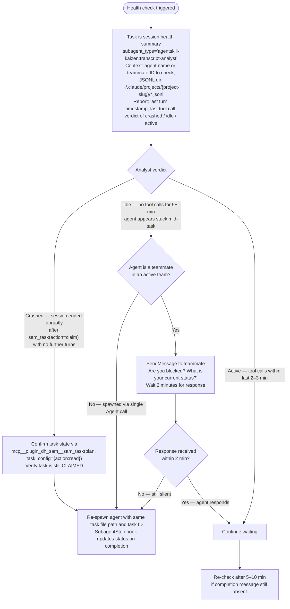

# Implement Feature (SAM Workflow Execution)

As you review code, update your agent memory with patterns, conventions, and recurring issues you discover.

This workflow continues from `add-new-feature`. It executes tasks from a SAM task file until complete (or blocked).

<feature_input>$ARGUMENTS</feature_input>

---

**MCP server availability**: This skill uses both `mcp__plugin_dh_backlog__*` and `mcp__plugin_dh_sam__*` tools. Both servers take 10–30 seconds to initialize after a session restart. If either is unavailable or `ToolSearch` reports "still connecting", follow [mcp-connection-check.md](../backlog/references/mcp-connection-check.md) before proceeding.

## Resolve Task File

Rules:

- If `<feature_input/>` ends with `.md`, treat it as the task file path and extract the plan address `P{N}` from the filename (e.g., `plan/tasks-3-integrate-sam-schema.md` → `P3`).
- Otherwise, treat it as a feature slug (or partial slug) and resolve plan address via `sam_plan`:

```text
mcp__plugin_dh_sam__sam_plan(config={"action": "status"}, plan="<feature_input/>")
```

---

## Progress Loop

1. Query status:

```text
mcp__plugin_dh_sam__sam_plan(config={"action": "status"}, plan="P{N}")
```

After receiving the status response, extract and store the autonomy mode:

`autonomy_mode = status["autonomy"]`

This value governs gate behavior throughout the remainder of the Progress Loop for this plan.
Pre-existing plans that omit the `autonomy` field return `"full_auto"` (the Pydantic default),
so no gate fires and the loop behaves identically to the previous behavior.

2. If tasks remain, query ready tasks **once** and store the result as the current batch:

If parent story issue number is known, prefer the MCP tool:

```text
backlog_get_ready_sam_tasks(parent_issue_number=N)
Output shape: {"feature": "...", "ready_tasks": [...], "count": N}
Falls back to local cache if GitHub unavailable.
```

If parent issue number is unknown, use the SAM MCP tool:

```text
mcp__plugin_dh_sam__sam_plan(config={"action": "ready"}, plan="P{N}")
```

> **Call `sam_plan(action='ready')` (or `backlog_get_ready_sam_tasks`) ONCE per batch.** Store the returned
> task list. Loop over the stored list — do NOT call `sam_plan(action='ready')` again within the loop.
> After all tasks in the current batch are dispatched and completed, use
> `mcp__plugin_dh_sam__sam_plan(config={"action": "status"}, plan="P{N}")` to check whether more tasks remain.
> Only call `sam_plan(action='ready')` again when the previous batch is fully dispatched and you need the
> next batch of ready tasks.

3. Dispatch based on `autonomy_mode`:

If `autonomy_mode == "per_task"`:

Process tasks from the ready list one at a time:

- Dispatch task N via a single `Agent` call (not `TeamCreate`).
- Complete steps 4, 4a, 4b for task N.
- Present the per-task gate (after step 4b, described below) before dispatching task N+1.

Else (`autonomy_mode` is `"full_auto"` or `"checkpoint"`):

When multiple tasks are simultaneously ready (non-zero `count` with 2+ tasks in the ready list), dispatch them in parallel using `TeamCreate`:

```text
TeamCreate(team_name: "impl-{slug}")
```

The team name follows the pattern `impl-{slug}` where `{slug}` is the feature slug derived
from the task file path. This team name is reused by `complete-implementation` for QG agent
dispatch and is shut down in the Final Step of that skill.

Spawn one teammate per ready task. When only one task is ready, a single Agent call is acceptable. `TeamCreate` is the standard parallel dispatch mechanism — use it whenever 2+ tasks are ready at the same time.

For each task being dispatched:

- Always dispatch `dh:task-worker` as the `subagent_type`. The `agent:` field in the task YAML is NOT a routing directive for the orchestrator — it is read internally by `task-worker` via the SAM MCP (`sam_task` action) and passed to `profile_load` to specialize `task-worker`'s behavior. The orchestrator passes only the task reference (plan address + task ID).
- Check the task's `skills` list from the ready-tasks JSON output.
- If `skills` is non-empty, include skill-loading instructions in the delegation prompt:

```text
Before starting work, load these skills: {comma-separated skill names}.
For each skill, call: Skill(skill="{skill-name}")
```

- If `skills` is empty or missing, do not add skill-loading instructions (backward compatible).
- Launch `dh:task-worker` with a prompt that invokes `start-task`:

```text
Skill(skill="start-task", args="{task_file_path} --task {task_id}")
```

> **Note**: Task-level skills are additive to agent-level skills. If the agent definition
> already declares skills via its frontmatter, task-level skills supplement them (they do not
> replace agent-level skills). Loading the same skill twice is a no-op.

### Agent Health Check (While Waiting)

After dispatching a batch, the orchestrator waits for completion messages. Trigger a health check when any of these occur:

- No message received from any dispatched agent after ~10 minutes of silence
- User asks about agent status
- `git log` shows no new commits when implementation work should be in progress

**Never read JSONL session files directly in the orchestrator context.** Session files can exceed 40K tokens. Always delegate to `agentskill-kaizen:transcript-analyst` with an empty context window.

Session JSONL files are at `~/.claude/projects/{project-slug}/*.jsonl`, filterable by `agentId` field. The `{project-slug}` is the absolute project path with `/` replaced by `-` (e.g. `/home/user/repos/myproject` → `-home-user-repos-myproject`).



4. After each agent returns, check its output for a `<concerns>` block. If present, append each concern to the backlog item as a checklist entry:

```text
mcp__plugin_dh_backlog__backlog_groom(
    selector="#{issue}",
    section="Concerns",
    content="- [ ] {concern text} (reported by {agent_name} on {task_id})",
    append=True
)
```

Concerns accumulate across all task agents. They feed into the validation stage in `/complete-implementation` — each verified concern becomes a new backlog item.

4a. If a parent issue number is known, attempt contract verification against the architect spec:

```text
mcp__plugin_dh_backlog__artifact_read(issue_number=N, artifact_type="architect")
```

If `artifact_read` returns content (architect spec exists), resolve the files modified by the just-completed task:

```bash
git diff --name-only HEAD~1..HEAD
```

Then spawn the contract-verification agent:

```text
Agent(
    subagent_type="dh:contract-verification",
    prompt="""
Verify the just-completed task against the architect spec.

Task ID: {task_id}
Plan: {plan_address}
Architect spec: {architect_spec_content_or_path}
Modified files:
{modified_files_list}

Read the architect spec's Component Design and Type System Design sections.
For each modified file, grep for function/class definitions and extract actual signatures.
Compare against the contracts defined in the spec.
Report mismatches in a <concerns> block with severity CONTRACT VIOLATION (signature mismatch)
or CONTRACT GAP (spec defines contract but implementation is silent).
If no mismatches are found, return an empty response with no <concerns> block.
"""
)
```

If the contract-verification agent returns a `<concerns>` block, append each concern to the backlog item with a `CONTRACT:` prefix:

```text
mcp__plugin_dh_backlog__backlog_groom(
    selector="#{issue}",
    section="Concerns",
    content="- [ ] CONTRACT: {concern text} (reported by contract-verification on {task_id})",
    append=True
)
```

If `artifact_read` fails or returns no content (no architect spec for this issue), skip step 4a entirely. Proportional quality gate items without an architect spec automatically skip this step with zero overhead.

4b. Shut down the completed teammate

After concerns and contract verification are handled for a task, send a shutdown request to the agent if it was dispatched as a teammate via `TeamCreate`:

```text
SendMessage(to="{teammate_name}", message={"type": "shutdown_request"})
```

This terminates the teammate immediately rather than leaving it idle. Idle teammates emit periodic notifications and hold resources without contributing further work.

**Skip when**: the agent was dispatched via a single `Agent` call (not `TeamCreate`) — subagents terminate automatically when their prompt completes.

**Per-task Confirmation Gate** (active when `autonomy_mode == "per_task"` only):

After task N completes (steps 4 through 4b finished), before dispatching task N+1:

1. Display a compact task result summary:
   - Task ID and title
   - Completion status (complete / error)
   - Any concerns raised (from the concerns block check in step 4)

2. Present a confirmation prompt to the user. The exact wording is implementation-defined;
   examples include "Ready to dispatch the next task? (yes/no)" or a numbered menu
   of options. The prompt must make clear which task will be dispatched next (task ID and title).

3. Await explicit user confirmation before proceeding.
   - If confirmed: dispatch the next task from the stored batch (or query the next batch if the batch is exhausted).
   - If declined or cancelled: stop the Progress Loop. Report the current plan state via
     `mcp__plugin_dh_sam__sam_plan(config={"action": "status"}, plan="P{N}")` and exit.

Skip this gate when `autonomy_mode` is `"full_auto"` or `"checkpoint"`.

5. After all tasks in the current batch complete, call `mcp__plugin_dh_sam__sam_plan(config={"action": "status"}, plan="P{N}")` to
   check plan progress. If tasks remain, return to step 2 to fetch the next batch of ready
   tasks. Do NOT call `sam_plan(action='ready')` again until the previous batch is fully dispatched.

**5a. Wave-Completion Confirmation Gate** (active when `autonomy_mode == "checkpoint"` only):

After all tasks in the current batch complete and `sam_plan(action='status')` confirms that
tasks remain (step 5 result: tasks remaining > 0):

1. Display a compact wave-completion summary:
   - Number of tasks completed in this wave
   - Current plan completion percentage (from `status["completion_pct"]`)
   - Number of tasks remaining
   - Next ready tasks (from `status["ready_tasks"]` list — task IDs only)

2. Present a confirmation prompt to the user. The exact wording is implementation-defined;
   examples include "Wave complete. Proceed with the next wave? (yes/no)".

3. Await explicit user confirmation before calling `sam_plan(action='ready')` again.
   - If confirmed: proceed to step 2 to fetch the next batch.
   - If declined or cancelled: stop the Progress Loop. Report the current plan state
     and exit. The plan remains in its current state and can be resumed later.

Skip this gate when `autonomy_mode` is `"full_auto"` or `"per_task"`.

Note: under `"per_task"`, per-task gates already fire for each task; no additional wave gate is needed.

> **Hook behavior on SubagentStop**: When a sub-agent finishes, `task_status_hook.py` marks
> the task complete in the local task file. After marking the task complete locally, the hook
> calls `backlog_core.gh_client.update_task_status()` to sync the completion to the GitHub
> sub-issue (if `github_issue` field is set in the task YAML). GitHub sync failure does not
> affect the hook exit code.

---

## Bookend Task Ordering

When the plan contains `acceptance-criteria-structured` entries, `swarm-task-planner` generates T0 and TN bookend tasks. No special handling is needed in this loop — existing readiness logic dispatches them in the correct order automatically:

- **T0** has `priority: 1` and `dependencies: []`, so it is the first ready task and dispatches before any implementation task.
- **TN** has `dependencies: [all non-bookend task IDs]`, so it becomes ready only after all implementation tasks complete and dispatches last.

T0 runs agent `t0-baseline-capture`. TN runs agent `tn-verification-gate`. Both agents register their results as artifacts via `artifact_register` (types `T0-baseline` and `TN-verification`). These artifacts are read by `/complete-implementation` in its pre-Phase 1 check via `artifact_read`.

### Bookend Artifact Registration

When the parent story issue number is known, include `artifact_register` instructions in each bookend task's delegation prompt so the bookend artifacts are registered in the issue's artifact manifest:

**T0 delegation prompt addition:**

```text
After writing plan/T0-baseline-{slug}.yaml, register it:
  mcp__plugin_dh_backlog__artifact_register(issue_number=N, artifact_type="T0-baseline", path="plan/T0-baseline-{slug}.yaml", agent="t0-baseline-capture")
```

**TN delegation prompt addition:**

```text
After writing plan/TN-verification-{slug}.yaml, register it:
  mcp__plugin_dh_backlog__artifact_register(issue_number=N, artifact_type="TN-verification", path="plan/TN-verification-{slug}.yaml", agent="tn-verification-gate")
```

If the issue number is not known, skip registration. The artifacts remain discoverable via filesystem conventions.

---

## Variant: Worktree Isolation

**Worktree isolation variant**: For milestone-scoped execution where each item gets its own worktree, use `/work-milestone` instead. See [work-milestone SKILL.md](../work-milestone/SKILL.md).

---

## Completion Gate

When all tasks show `COMPLETE`, invoke:

```text
Skill(skill="complete-implementation", args="{task_file_path}")
```
