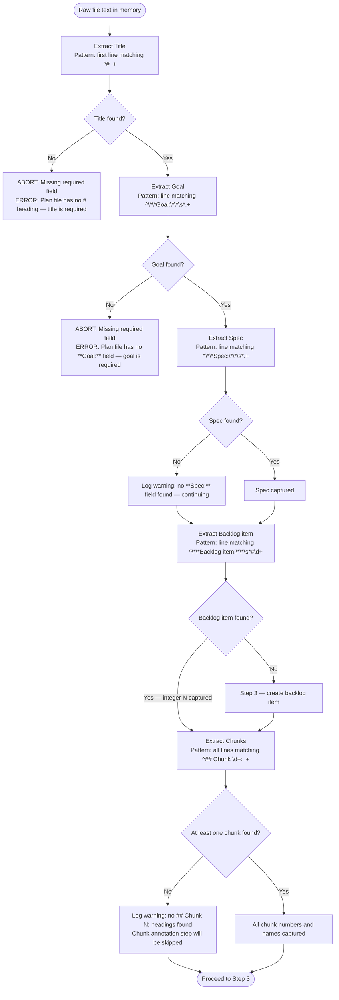
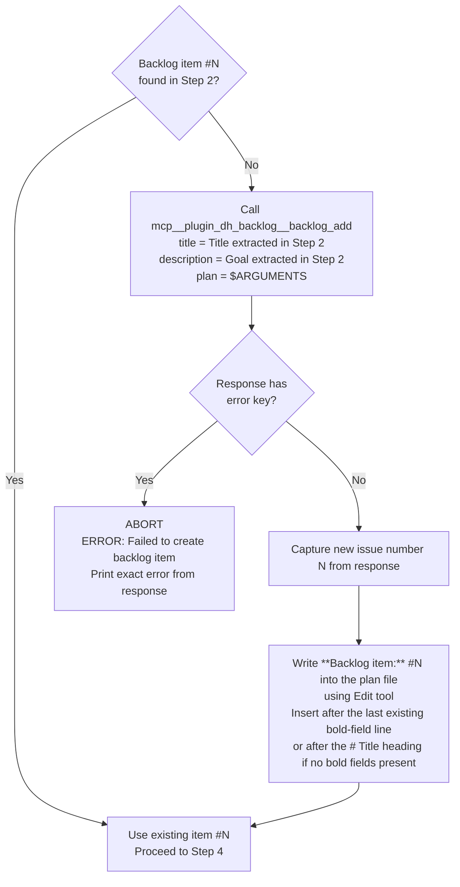
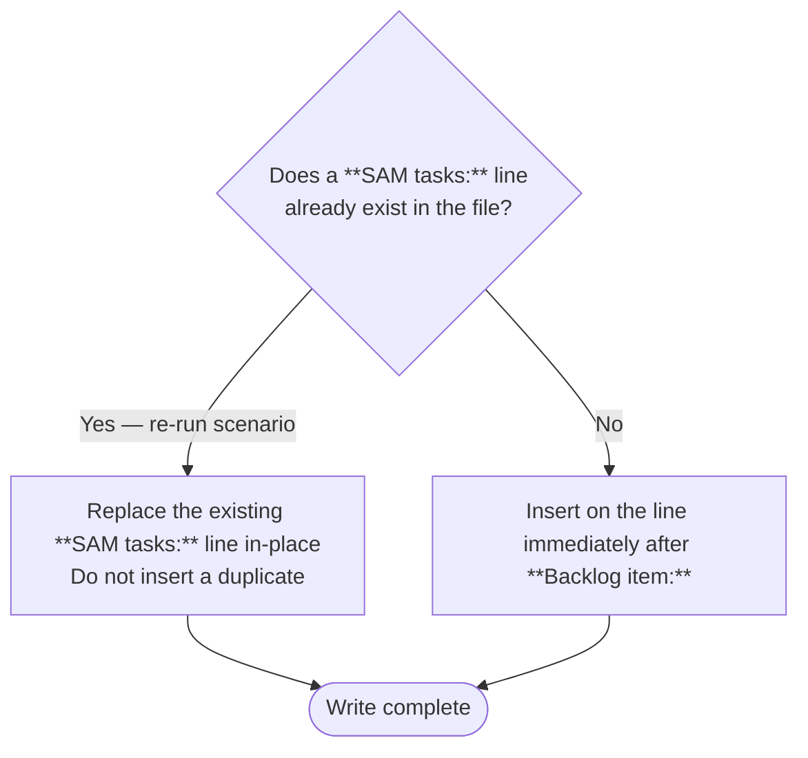

# /dh:interop — Superpowers Plan Interop Adapter

Routes a Superpowers plan file through the `/work-backlog-item` pipeline to produce a SAM task
file, then writes back-references into the original plan. Does not re-implement any pipeline
logic — delegates entirely to `/work-backlog-item`.

The plan file path is provided as `$ARGUMENTS`.

Invocation: `/dh:interop <path-to-plan-file>`

SOURCE: plan/architect-dh-phase2-interop-adapter.md (historical plan artifact, archived to `~/.dh/projects/{project-slug}/plan/`)

---

## Step 1 — Validate the argument

If `$ARGUMENTS` is empty, abort immediately:

```text
ERROR: `/dh:interop` requires a path to a Superpowers plan file.
Usage: `/dh:interop docs/superpowers/plans/YYYY-MM-DD-slug.md`
```

Use the Read tool to open the file at the path given in `$ARGUMENTS`. If the file does not
exist or cannot be read, abort:

```text
ERROR: Cannot read plan file: {path}
```

Make no changes to the file or backlog before this check passes.

---

## Step 2 — Extract fields from the plan file

Extract the following fields by exact pattern match against the raw file text. No inference.



Field extraction rules:

- **Title**: first line matching `^# (.+)$` — capture the text after `#`
- **Goal**: line matching `^\*\*Goal:\*\*\s*(.+)$` — capture remainder of the line
- **Spec**: line matching `^\*\*Spec:\*\*\s*(.+)$` — capture remainder of the line (may be a
  file path or URL)
- **Backlog item**: line matching `^\*\*Backlog item:\*\*\s*#(\d+)$` — capture the integer N
- **Chunks**: all lines matching `^## Chunk (\d+): (.+)$` — capture chunk number and name for
  each heading

Abort conditions (make no changes before aborting):

- Title absent: `ERROR: Plan file has no # heading — title is required to name the backlog item`
- Goal absent: `ERROR: Plan file has no **Goal:** field — goal is required as backlog item description`

---

## Step 3 — Ensure a backlog item exists



When writing the backlog item reference into the plan file, use the Edit tool to insert:

```markdown
**Backlog item:** #N
```

Position: immediately after the last existing `**Field:**` line in the header block, or after
the `# Title` heading if no bold fields are present.

---

## Step 4 — Invoke /work-backlog-item

Invoke the `/work-backlog-item` skill using the Skill tool with the backlog item number:

```text
Skill(skill="work-backlog-item", args="#N")
```

Include the Superpowers plan file path as additional context in the invocation prompt so the
pipeline can read the plan's Goal, Spec, and Chunks when producing the SAM task file. Pass the
plan file path as a note in the prompt (e.g., "Plan file for context: {plan-file-path}") — the
`work-backlog-item` skill does not accept a second positional argument, so the path is passed
as contextual prose in the delegation prompt, not as an arg.

This step runs: groom → RT-ICA → SAM planning and produces a SAM task plan. The plan address is returned in the `/work-backlog-item` output.

Wait for `/work-backlog-item` to complete. The plan address it produces is required for Steps
5 and 6.

---

## Step 5 — Capture the plan address

After `/work-backlog-item` completes, identify the plan address it produced. The plan address is included in the `/work-backlog-item` output (e.g., `Pc7d8e9f0` or `tasks-N-slug`).

If the plan address is not stated in the output, use `sam_list` via MCP to find the plan whose slug matches the backlog item title:

```text
mcp__plugin_dh_sam__sam_plan(config={"action": "list"})
```

If no matching plan exists, abort:

```text
ERROR: /work-backlog-item did not produce a task plan. Cannot write back-references.
```

Record the plan address for use in Steps 6 and 7.

---

## Step 6 — Write the SAM tasks back-reference

Read the current content of the plan file. Locate the `**Backlog item:**` line.



The exact text to write (substituting the real plan address):

```markdown
**SAM tasks:** {plan-address}
```

Where `{plan-address}` is the plan identifier returned in Step 5 (e.g., `Pc7d8e9f0` or `tasks-N-slug`). The address is resolved by MCP tools — do not construct filesystem paths.

Use the Edit tool to make this change. Do not rewrite the file.

---

## Step 7 — Write chunk annotations

If no chunks were found in Step 2 (warning was logged), skip this step entirely.

For each `## Chunk N:` heading captured in Step 2:

```mermaid
flowchart TD
    ForEach([For each Chunk N captured]) --> HasTask{Does chunk number N<br>have a corresponding SAM task T{N}?}
    HasTask -->|No — chunk count exceeds task count| Skip[Skip this chunk — no annotation]
    HasTask -->|Yes| CheckExisting{Does the line immediately<br>following this heading already<br>contain a SAM annotation comment?}
    CheckExisting -->|Yes — re-run scenario| ReplaceAnnotation["Replace existing annotation in-place<br><!-- SAM: T{N} in {plan-address} -->"]
    CheckExisting -->|No| InsertAnnotation["Insert on the line immediately<br>after the ## Chunk N: heading<br><!-- SAM: T{N} in {plan-address} -->"]
    ReplaceAnnotation --> Next([Next chunk])
    InsertAnnotation --> Next
    Skip --> Next
```

Annotation format — substitute the real chunk number and plan address from Step 5:

```markdown
<!-- SAM: T3 in {plan-address} -->
```

The task number `T{N}` matches the chunk number `N` by position. Chunk 1 → T1, chunk 2 → T2.
If chunk count exceeds SAM task count, annotate only the chunks that have a corresponding task
number. Unmatched chunks receive no annotation.

Use the Edit tool for each annotation. Do not rewrite the file.

---

## Idempotency rules

Running `/dh:interop` on the same plan file a second time must produce identical output to the
first run — no duplicates, no data loss.

- `**SAM tasks:**` line: if it already exists, replace in-place. Never insert a second line.
- Chunk annotations: if the comment already exists on the line immediately after a `## Chunk N:`
  heading, replace in-place. Never insert a duplicate.
- `**Backlog item:**` line: if it already exists, use the existing number. Never create a second
  backlog item.

---

## Abort conditions summary

Stop immediately and make no further changes when:

- `$ARGUMENTS` is empty
- The file at `$ARGUMENTS` cannot be read
- Title (`#` heading) is absent from the plan file
- Goal (`**Goal:**` field) is absent from the plan file
- `mcp__plugin_dh_backlog__backlog_add` returns an error response
- `/work-backlog-item` completes without producing a task file

All abort messages are prefixed with `ERROR:` and printed to the user before stopping.

---

## Example invocations

```text
/dh:interop docs/superpowers/plans/2026-03-11-oauth-token-refresh.md
/dh:interop docs/superpowers/plans/2026-02-28-manifest-discovery.md
```
