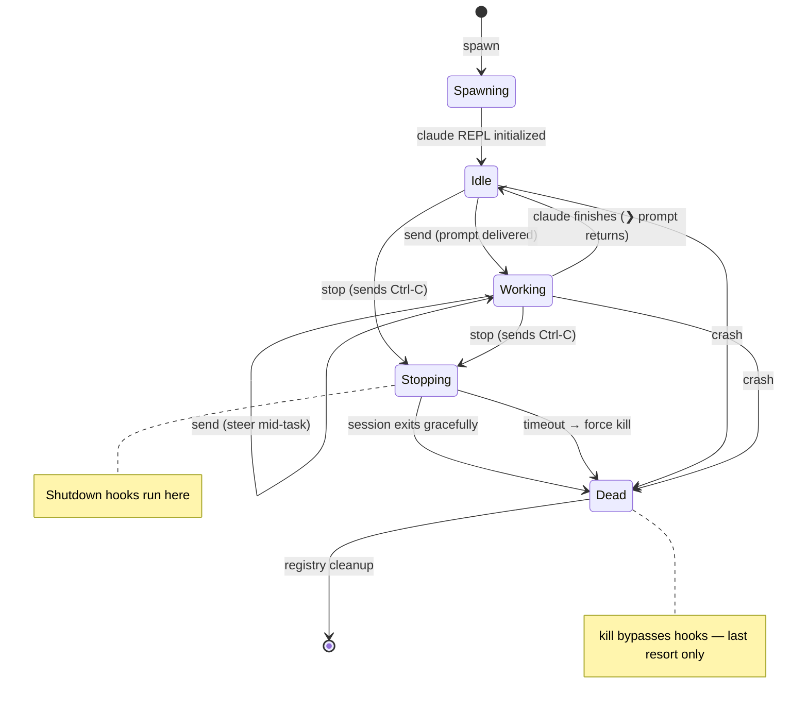
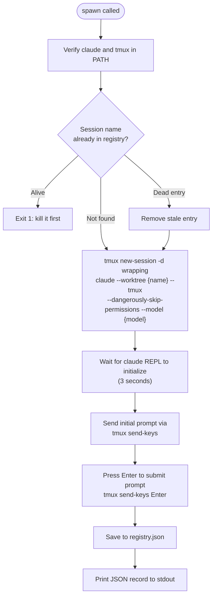
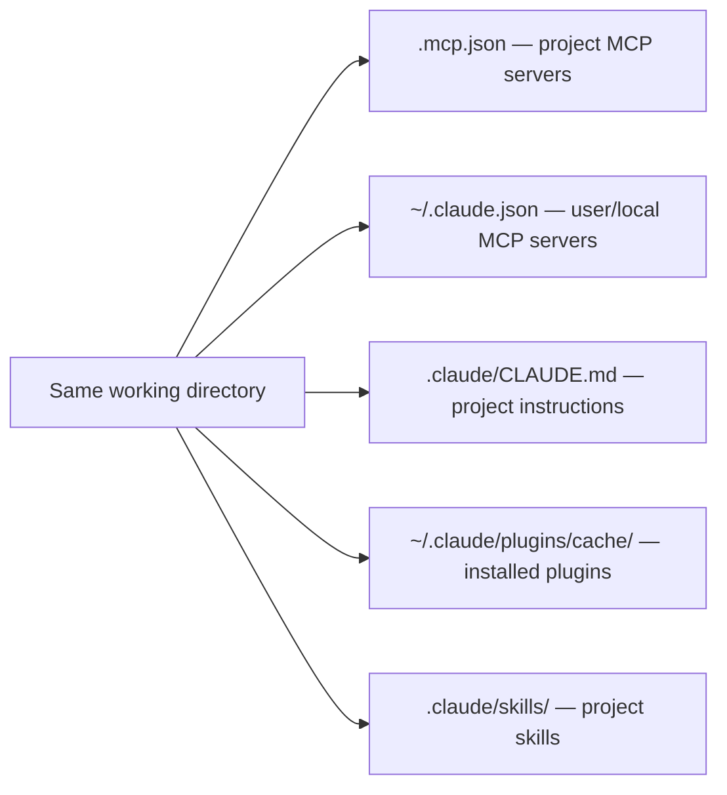
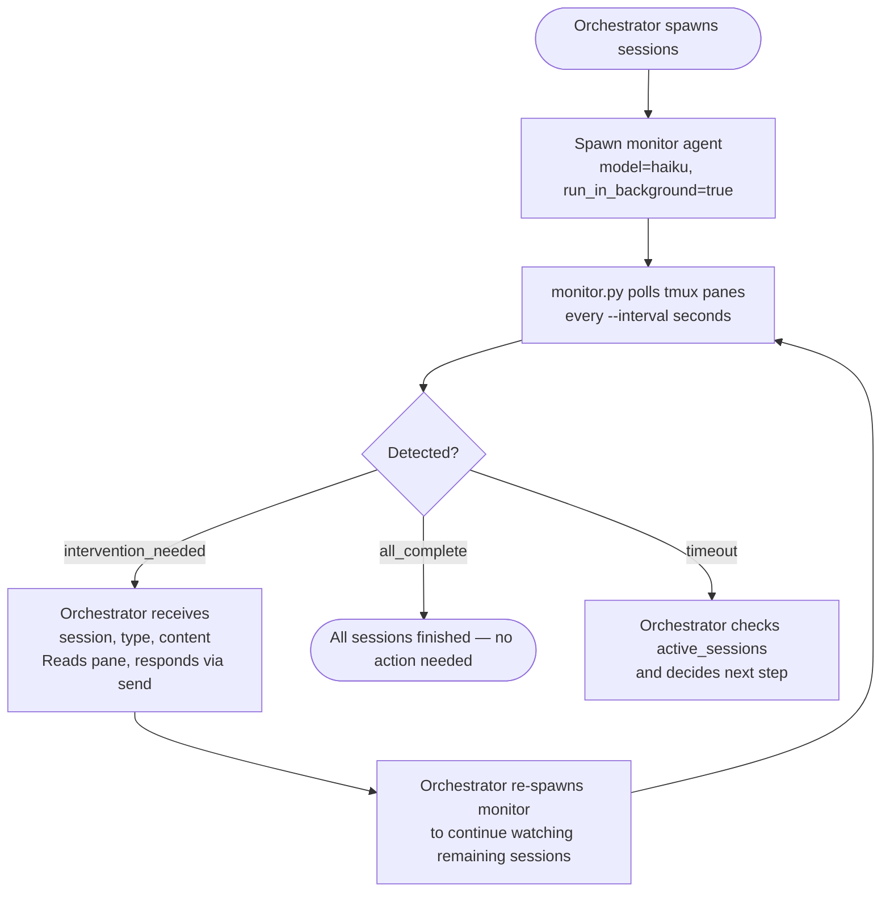

# Kage Bunshin — Persistent Peer Claude Sessions

Spawn independent interactive `claude` CLI sessions in tmux with full bidirectional communication. The orchestrator can send messages, read responses, monitor status, and steer work mid-flight via `tmux send-keys` and `tmux capture-pane`.

This is NOT a subagent or teammate — it is an independent CLI process with its own context window, inheriting all MCP servers, skills, plugins, and agents from the project directory.

## Session Manager Script

All operations go through `${CLAUDE_SKILL_DIR}/scripts/spawn.py`:

```text
spawn.py --session-id ID spawn  --name X [--model MODEL] [--max-budget N] "prompt"
spawn.py --session-id ID send   --name X "message"
spawn.py --session-id ID read   --name X
spawn.py --session-id ID status --name X
spawn.py --session-id ID list
spawn.py --session-id ID stop   --name X     # graceful shutdown (Ctrl-C + wait)
spawn.py --session-id ID kill   --name X     # force kill (last resort)
```

The `--session-id` isolates each orchestrator's registry. Generate a UUID once per fleet and pass it on every call. Without it, defaults to `"default"`. Can also be set via `KB_SESSION_ID` environment variable.

## Quick Start

```bash
SPAWN="${CLAUDE_SKILL_DIR}/scripts/spawn.py"
SID=$(uuidgen)  # one UUID per fleet — isolates this orchestrator's registry

# 1. Spawn a session (interactive claude in tmux + worktree)
$SPAWN --session-id $SID spawn --name worker-42 --model haiku \
  "Load /dh:work-backlog-item #42. Execute the full work flow."

# 2. Check on it
$SPAWN --session-id $SID status --name worker-42

# 3. Read what's on screen
$SPAWN --session-id $SID read --name worker-42

# 4. Steer mid-flight
$SPAWN --session-id $SID send --name worker-42 \
  "Stop current work. Prioritize the auth module instead."

# 5. Graceful shutdown when done
$SPAWN --session-id $SID stop --name worker-42
```

## Session Lifecycle



**State detection via `read`:** The `❯` prompt at the last line of `capture-pane` output indicates Idle state. Absence of `❯` indicates Working state.

**Shutdown:** Use `stop` for graceful shutdown (Ctrl-C → poll for exit → fallback to force kill after 30s timeout). Use `kill` only for hung/unresponsive sessions — it bypasses shutdown hooks.

## How It Works



The claude CLI's built-in `--worktree` creates a git worktree at `.claude/worktrees/{name}`. The built-in `--tmux` creates a tmux session named `{repo}_worktree-{name}`. The script wraps the launch in `tmux new-session -d` to provide the TTY that `--tmux` requires in headless environments.

**Verify prompt submission after spawn.** The script sends the initial prompt with Enter via `tmux send-keys`, but the REPL may not be fully initialized when the prompt arrives (race condition with the 3-second wait). After spawning, always verify the session started processing by reading the output within 10-15 seconds. If the REPL still shows the pasted prompt with a `❯` cursor and no activity, the Enter was swallowed — resend it:

```bash
tmux send-keys -t {tmux_session} Enter
```

The same applies to `send` — after sending a message, check within a few seconds that processing began.

**Permission prompts use cursor selection, not text input.** When the session shows a numbered menu (e.g., "1. Yes / 2. No"), send `Enter` to accept the highlighted option or arrow keys to change selection. Do NOT send "1" or "2" as text — the REPL uses a cursor-based selection widget.

## Subcommand Reference

### spawn

Launch a new persistent interactive claude session in tmux.

```bash
$SPAWN spawn --name my-session --model haiku "Your initial prompt"
$SPAWN spawn --name my-session --max-budget 5.00 "Your prompt"
```

**Flags:**

- `--name` — Session name (auto-derived from first 30 chars of prompt if omitted)
- `--model` — Model for the spawned session (default: sonnet)
- `--max-budget` — Maximum USD spend cap

**Output** (JSON to stdout):

```json
{
  "name": "worker-42",
  "tmux_session": "claude_skills_worktree-worker-42",
  "model": "haiku",
  "spawned_at": "2026-03-22T01:30:00+00:00",
  "worktree": true
}
```

Every session gets its own git worktree via the built-in `--worktree` flag. Configure `worktree.symlinkDirectories` in project settings to share `.venv`, `node_modules`, etc. across worktrees.

### send

Send a message to a running session via `tmux send-keys`.

```bash
$SPAWN send --name worker-42 "Check the test results and report back"
```

Types the message into the session's interactive REPL as if a human typed it. The session processes it as a new conversation turn. Use this to steer, redirect, or provide additional context.

### read

Read the current screen content from a session via `tmux capture-pane`.

```bash
$SPAWN read --name worker-42
```

Captures the last 200 lines of the tmux pane output. Shows the rendered conversation including prompts, responses, and tool use.

### status

Check session health.

```bash
$SPAWN status --name worker-42
```

Reports whether the tmux session is alive, the model, age, and tmux session name.

### list

List all registered sessions with live/dead status.

```bash
$SPAWN list
```

Prints a columnar table: NAME, MODEL, STATUS (alive/dead), AGE, TMUX_SESSION.

### stop

Graceful shutdown — sends Ctrl-C, waits for the session to exit, cleans up registry.

```bash
$SPAWN stop --name worker-42
```

Sends `C-c` to the claude REPL, then polls for up to 30 seconds. If the session exits within the timeout, shutdown hooks run and the session is persisted. If the timeout is exceeded, falls back to force kill.

Output: `{"status": "stopped", "name": "worker-42", "forced": false}`

A `TaskCompleted` hook automatically reminds the orchestrator to stop any sessions that outlive their tasks.

### kill

Force-kill a session — last resort for hung/unresponsive sessions.

```bash
$SPAWN kill --name worker-42
```

Calls `tmux kill-session` directly. Bypasses shutdown hooks and session persistence. Use only when `stop` fails or the session is unresponsive.

## Session State

The registry is stored at `~/.dh/projects/{slug}/kage-bunshin/registry.json`. The `{slug}` is derived from the git repo root path by replacing `/` with `-` (leading hyphen is intentional). Override the base directory with `DH_STATE_HOME` environment variable.

## Capability Inheritance

A spawned session inherits identical capabilities when launched from the same working directory:



Flags that break inheritance — do not use:

- `--bare` — strips auto-discovery of CLAUDE.md, hooks, plugins, MCP
- `--strict-mcp-config` — overrides inherited MCP servers
- `--disable-slash-commands` — removes skill access

## Worktree Settings

Configure these in your project or user settings to share heavy directories across worktrees:

```json
{
  "worktree.symlinkDirectories": [".venv", "node_modules", ".cache"]
}
```

## Parallel Fleet Management

Spawn and control multiple coordinators simultaneously. Each returns immediately.

```bash
SPAWN="${CLAUDE_SKILL_DIR}/scripts/spawn.py"
SID=$(uuidgen)
ITEMS=(10 11 12 13 14 15 16 17 18 19)

# Spawn all coordinators
for ITEM in "${ITEMS[@]}"; do
  $SPAWN --session-id $SID spawn --name "coord-${ITEM}" --model haiku \
    "Load /dh:work-backlog-item #${ITEM}. Execute the full work flow."
done

# Dashboard
$SPAWN --session-id $SID list

# Steer one mid-flight
$SPAWN --session-id $SID send --name coord-14 \
  "Deprioritize the UI work. Focus on the API contract first."

# Read what a coordinator is showing
$SPAWN --session-id $SID read --name coord-12

# Shut down the fleet
for ITEM in "${ITEMS[@]}"; do
  $SPAWN --session-id $SID stop --name "coord-${ITEM}"
done
```

### Model Selection

The `--model` flag controls the spawned session's orchestrator model. Each sub-agent spawned inside the session uses its own model per its agent frontmatter definition.

Use `--model haiku` for coordinator sessions that dispatch work to sub-agents — haiku is fast and cheap as an orchestrator. Use `--model sonnet` for sessions doing technical implementation work.

## Milestone Dispatch Patterns

Used by `/groom-milestone` and `/work-milestone` to spawn parallel kage-bunshin workers.

### Groom Dispatch

```bash
SPAWN="${CLAUDE_SKILL_DIR}/scripts/spawn.py"
SID=$(uuidgen)

for ISSUE in "${UNGROOMED_ISSUES[@]}"; do
  $SPAWN --session-id $SID spawn --name "groom-${ISSUE}" --model haiku \
    "Load /dh:groom-backlog-item #${ISSUE}. Execute the full grooming flow."
done

$SPAWN --session-id $SID list
$SPAWN --session-id $SID read --name "groom-42"
```

### Work Dispatch

```bash
SPAWN="${CLAUDE_SKILL_DIR}/scripts/spawn.py"
SID=$(uuidgen)

for ISSUE in "${WAVE_ISSUES[@]}"; do
  $SPAWN --session-id $SID spawn --name "work-${ISSUE}" --model haiku \
    "Load /dh:work-backlog-item #${ISSUE}. Execute the full work flow."
done

$SPAWN --session-id $SID list

# Steer if needed
$SPAWN --session-id $SID send --name "work-42" \
  "The auth module has a dependency on #43. Coordinate accordingly."

# Clean up after wave
for ISSUE in "${WAVE_ISSUES[@]}"; do
  $SPAWN --session-id $SID stop --name "work-${ISSUE}"
done
```

## Monitoring spawned sessions

After spawning one or more sessions, the orchestrator SHOULD spawn a background Haiku subagent to watch for interactive states that require a response — permission approvals, Y/n prompts, and `AskUserQuestion` events. Without a monitor, these states block the child session silently until the orchestrator happens to `read` the pane.

The monitor is `plugins/development-harness/skills/kage-bunshin/scripts/monitor.py`. It polls all sessions registered under the given `--session-id`, exits as soon as it finds an intervention or all sessions finish, and emits a single JSON object to stdout.

### Spawning the monitor agent

Spawn it with `model: "haiku"` and `run_in_background: true` via the Agent tool:

```text
Task — model: haiku, run_in_background: true

Prompt:
  Run: uv run plugins/development-harness/skills/kage-bunshin/scripts/monitor.py \
         --session-id <SID> --interval 5

  Wait for the script to exit and read its JSON output.

  If status == "intervention_needed": return the session name, type, and content.
  If status == "all_complete" or "timeout": return that status and the active_sessions list (if present).
  If status == "error": return the error message.
```

Replace `<SID>` with the same UUID passed to `spawn.py`.

### Monitoring lifecycle



The monitor exits immediately on first detection — it does not continue watching after reporting. Re-spawn it after handling an intervention to resume coverage.

### CLI flags

- `--session-id ID` (required) — resolves `registry-<ID>.json`; must match the `--session-id` used with `spawn.py`
- `--state-dir PATH` — base state directory; defaults to `~/.dh/projects/<git-slug>/`; override via `DH_STATE_HOME` env var
- `--interval SECONDS` — seconds between polls; default 5
- `--timeout SECONDS` — maximum seconds before emitting `timeout`; default 300

### JSON output statuses

- `{"status": "intervention_needed", "session": "<tmux-session-name>", "type": "<type>", "content": "<last 10 pane lines>"}` — a session needs a response; `type` is one of `permission_approval`, `yes_no_prompt`, or `question`
- `{"status": "all_complete"}` — all registered sessions have exited
- `{"status": "timeout", "active_sessions": ["<name>", ...]}` — timeout elapsed; sessions listed are still running
- `{"status": "error", "message": "<description>"}` — fatal error (registry missing, git not available); exit code 1

## Reference

See [./references/stream-json-protocol.md](./references/stream-json-protocol.md) for the stream-json output event type catalog and raw experiment data from earlier protocol exploration.
