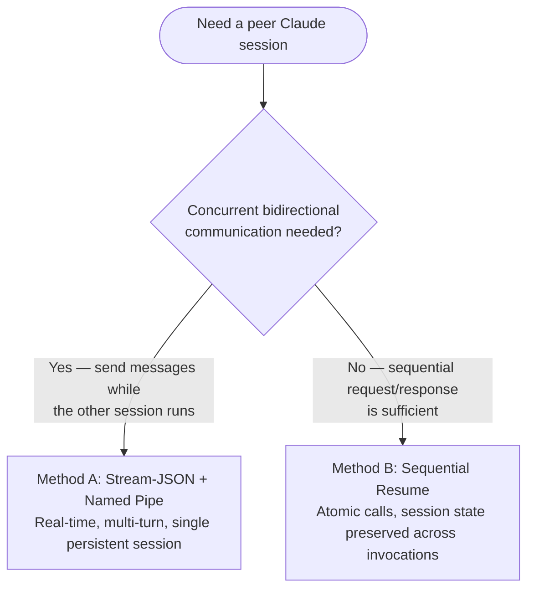
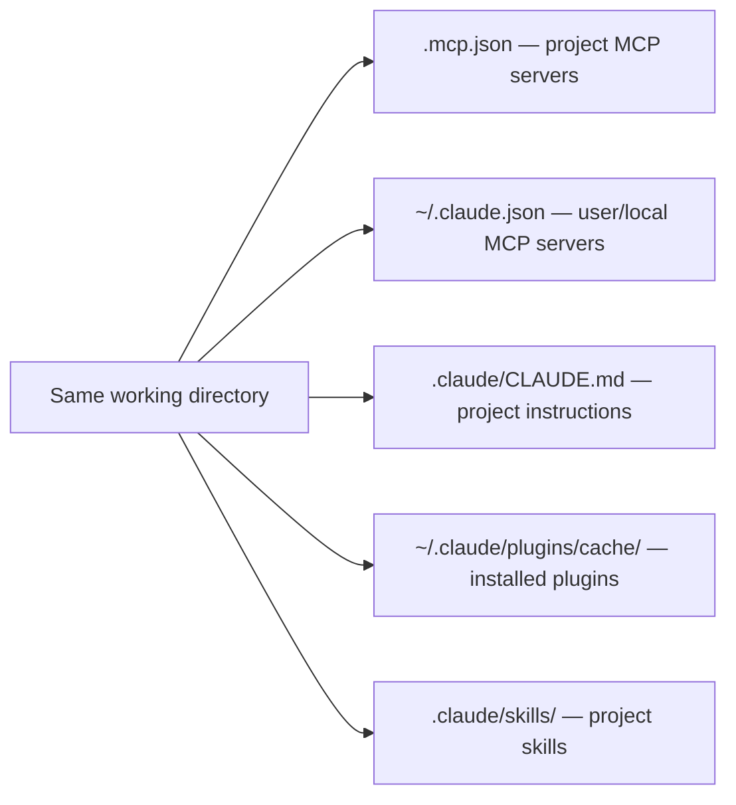
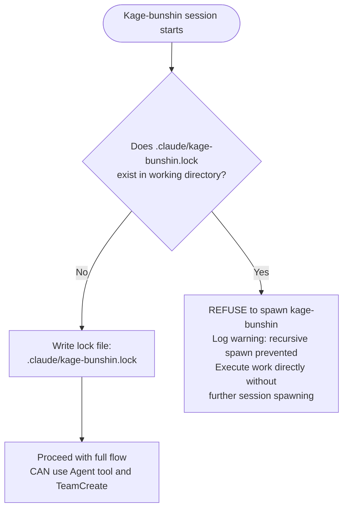

# Kage Bunshin — Spawn Peer Claude CLI Sessions

Spawn a separate `claude` CLI process with identical capabilities (MCP servers, skills, plugins, agents) and communicate with it via a shared channel. This is NOT a subagent or teammate — it is an independent CLI process.

## Spawn Script

Use `scripts/spawn.py` to handle worktree creation, `.venv`/`node_modules` symlinking, lock file writing, and process launch in one command:

```bash
# Spawn in current directory (no worktree)
./scripts/spawn.py "Load /dh:groom-backlog-item #42"

# Spawn in an isolated worktree
./scripts/spawn.py --worktree --branch main \
  --name "work-item-42" --model sonnet \
  "Load /dh:work-backlog-item #42. Execute the full work flow."

# With budget cap
./scripts/spawn.py --worktree --max-budget 5.00 \
  "Load /dh:work-backlog-item #42"
```

Output (JSON to stdout — parse with jq or python):

```json
{
  "pid": 12345,
  "name": "work-item-42",
  "worktree": "/path/to/.worktrees/kb-work-item-42",
  "result_file": "/tmp/kage-bunshin/work-item-42-result.json",
  "error_file": "/tmp/kage-bunshin/work-item-42-err.log",
  "model": "sonnet",
  "lock_file": "/path/to/.worktrees/kb-work-item-42/.claude/kage-bunshin.lock"
}
```

The script exits immediately after spawning. The caller manages PIDs and reads result files.

**What the script handles automatically with `--worktree`:**

- `git worktree add .worktrees/kb-{name}` from the specified branch
- Symlinks `.venv` → repo root `.venv` (avoids duplicating the virtualenv)
- Symlinks `node_modules` → repo root `node_modules`
- Writes `.claude/kage-bunshin.lock` with session metadata
- Launches `claude -p` with `cwd` set to the worktree

## When to Use Each Method



## Method A: Stream-JSON over Named Pipe (Primary)

Bidirectional, multi-turn, real-time communication with a persistent Claude session.

### Setup

```bash
# 1. Create named pipe and output file
mkfifo /tmp/claude-channel.fifo
touch /tmp/claude-output.jsonl

# 2. Launch Claude in tmux with stream-json I/O
tmux new-session -d -s claude-peer \
  "claude -p \
    --input-format stream-json \
    --output-format stream-json \
    --permission-mode auto \
    --verbose \
    < /tmp/claude-channel.fifo \
    > /tmp/claude-output.jsonl \
    2>/tmp/claude-peer-err.log"
```

### Send Messages

Each message is a single-line JSON object written to the FIFO:

```bash
echo '{"type":"user","message":{"role":"user","content":"Your prompt here"}}' > /tmp/claude-channel.fifo
```

The FIFO blocks the writer until the reader consumes the data. Use a background subshell when sending multiple messages with delays:

```bash
(
  echo '{"type":"user","message":{"role":"user","content":"First message"}}';
  sleep 30;
  echo '{"type":"user","message":{"role":"user","content":"Second message"}}';
  sleep 30;
) > /tmp/claude-channel.fifo &
```

### Read Responses

Responses are NDJSON in `/tmp/claude-output.jsonl`. Extract the assistant's text:

```bash
# Latest assistant message
grep '"type":"assistant"' /tmp/claude-output.jsonl | tail -1 | \
  python3 -c "import sys,json; d=json.load(sys.stdin); print(d['message']['content'][0]['text'])"

# Latest result event
grep '"type":"result"' /tmp/claude-output.jsonl | tail -1 | \
  python3 -c "import sys,json; d=json.load(sys.stdin); print(d.get('result',''))"
```

### Cleanup

```bash
tmux kill-session -t claude-peer 2>/dev/null
rm -f /tmp/claude-channel.fifo /tmp/claude-output.jsonl /tmp/claude-peer-err.log
```

### Verified Behavior (Experiment 2026-03-22)

- The spawned session inherits all MCP servers, skills, plugins, and agents from the project directory
- The `init` system event enumerates every available tool, MCP server, skill, and agent
- Multi-turn works: multiple sequential messages on the same FIFO produce separate responses within one session
- The `-p` flag with `--input-format stream-json` keeps stdin open across multiple messages — it does NOT exit after the first response
- Session ID is in every output event (`.session_id` field)

## Method B: Sequential Resume (Fallback)

Each interaction is a separate `claude -p` invocation that resumes the same session.

### Usage

```bash
# 1. Generate a session UUID
SESSION_UUID=$(uuidgen)

# 2. First call — establishes the session
claude -p "Your first prompt" \
  --session-id "$SESSION_UUID" \
  --output-format json \
  --permission-mode auto 2>/dev/null | \
  python3 -c "import sys,json; print(json.load(sys.stdin)['result'])"

# 3. Subsequent calls — resume the session with full conversation memory
claude -p "Your follow-up prompt" \
  --resume "$SESSION_UUID" \
  --output-format json \
  --permission-mode auto 2>/dev/null | \
  python3 -c "import sys,json; print(json.load(sys.stdin)['result'])"
```

### Verified Behavior (Experiment 2026-03-22)

- Session state persists across invocations — the resumed session remembers prior conversation
- Tested: set secret word "TANGERINE" in first call, recalled correctly in resumed second call
- Each call blocks until the response is complete
- Not concurrent — only one call runs at a time

## Capability Inheritance

A spawned session inherits identical capabilities when launched from the same working directory:



Flags that break inheritance — do not use:

- `--bare` — strips auto-discovery of CLAUDE.md, hooks, plugins, MCP
- `--strict-mcp-config` — overrides inherited MCP servers
- `--disable-slash-commands` — removes skill access

## Useful Flags for Spawned Sessions

```text
--permission-mode auto        Skip permission prompts (required for unattended operation)
--model sonnet                Override model selection
--name "my-peer"              Name the session for later --resume by name
--append-system-prompt "..."  Add custom instructions to the spawned session
--allowedTools "Read,Grep"    Restrict available tools
--max-turns 10                Limit agentic turns (prevents runaway)
--max-budget-usd 1.00         Spending cap
--no-session-persistence      Do not save session to disk
--verbose                     Include tool use events in stream-json output
--include-partial-messages    Include token-by-token streaming events
```

## Input Message Schema

```json
{
  "type": "user",
  "message": {
    "role": "user",
    "content": "Plain text prompt"
  }
}
```

Multi-modal content (images):

```json
{
  "type": "user",
  "message": {
    "role": "user",
    "content": [
      {"type": "text", "text": "Describe this image"},
      {
        "type": "image",
        "source": {
          "type": "base64",
          "media_type": "image/png",
          "data": "<base64-data>"
        }
      }
    ]
  }
}
```

## Structured Output

Force JSON schema validation on the spawned session's response:

```bash
claude -p "List 3 fruits" \
  --output-format json \
  --json-schema '{"type":"object","properties":{"fruits":{"type":"array","items":{"type":"string"}}},"required":["fruits"]}' \
  --permission-mode auto 2>/dev/null
```

## Lock File Protocol

Prevent recursive kage-bunshin spawning. A spawned session that itself tries to spawn kage-bunshins would create infinite recursion.



Lock file is per-worktree (each worktree has its own `.claude/` directory). The parent orchestrator's working directory does NOT have a lock file — only spawned sessions write one.

Lock file contents:

```json
{
  "session_id": "uuid",
  "parent_pid": 12345,
  "spawned_at": "2026-03-22T01:30:00Z",
  "item": "#42 — feature title",
  "model": "sonnet"
}
```

## Milestone Dispatch Pattern

Used by `/groom-milestone` and `/work-milestone` to spawn parallel kage-bunshin workers.

### Groom Dispatch (no worktree)

Groom sessions run in the same project directory — grooming is read-heavy and writes go through the backlog MCP server (GitHub Issues are the source of truth), so no filesystem isolation is needed.

```bash
SPAWN="./scripts/spawn.py"
PIDS=()

# Spawn one kage-bunshin per ungroomed item
for ISSUE in "${UNGROOMED_ISSUES[@]}"; do
  OUTPUT=$($SPAWN --no-session-persistence \
    --name "groom-${ISSUE}" \
    --model sonnet \
    "Load /dh:groom-backlog-item #${ISSUE}. Execute the full grooming flow.")
  PIDS+=($(echo "$OUTPUT" | python3 -c "import sys,json; print(json.load(sys.stdin)['pid'])"))
done

# Wait for all groom sessions
for PID in "${PIDS[@]}"; do
  wait "$PID"
done
```

### Work Dispatch (with worktree)

Work sessions run in isolated git worktrees — each session modifies code and commits. The spawn script handles worktree creation, `.venv`/`node_modules` symlinking, and lock file writing.

```bash
SPAWN="./scripts/spawn.py"
PIDS=()
SPAWN_INFO=()

# Spawn one kage-bunshin per wave item
for ISSUE in "${WAVE_ISSUES[@]}"; do
  OUTPUT=$($SPAWN --worktree \
    --branch "${INTEGRATION_BRANCH}" \
    --name "work-item-${ISSUE}" \
    --model sonnet \
    "Load /dh:work-backlog-item #${ISSUE}. Execute the full work flow. \
     You are in a worktree on integration branch ${INTEGRATION_BRANCH}. \
     Use MCP tools for plan artifact discovery.")
  PIDS+=($(echo "$OUTPUT" | python3 -c "import sys,json; print(json.load(sys.stdin)['pid'])"))
  SPAWN_INFO+=("$OUTPUT")
done
```

### Monitoring Completion

Read the result JSON after each PID exits:

```bash
for i in "${!PIDS[@]}"; do
  wait "${PIDS[$i]}"
  EXIT_CODE=$?
  INFO="${SPAWN_INFO[$i]}"
  RESULT_FILE=$(echo "$INFO" | python3 -c "import sys,json; print(json.load(sys.stdin)['result_file'])")

  if [ $EXIT_CODE -eq 0 ] && [ -s "$RESULT_FILE" ]; then
    echo "Item: $(python3 -c "import sys,json; d=json.load(sys.stdin); print(d.get('result','')[:200])" < "$RESULT_FILE")"
  else
    ERROR_FILE=$(echo "$INFO" | python3 -c "import sys,json; print(json.load(sys.stdin)['error_file'])")
    echo "FAILED (exit ${EXIT_CODE}): $(cat "$ERROR_FILE" | tail -5)"
  fi
done
```

### Model Selection

The `--model` flag controls the spawned session's orchestrator model only. Each sub-agent spawned inside the session uses its own model per its agent frontmatter definition.

Recommended: `--model sonnet` for spawned sessions. Haiku viability as orchestrator model is an open experiment (untested for orchestrating `/work-backlog-item` flows that involve skill loading, agent spawning, and result interpretation).

## Reference

See [./references/stream-json-protocol.md](./references/stream-json-protocol.md) for the output event type catalog and raw experiment data.
