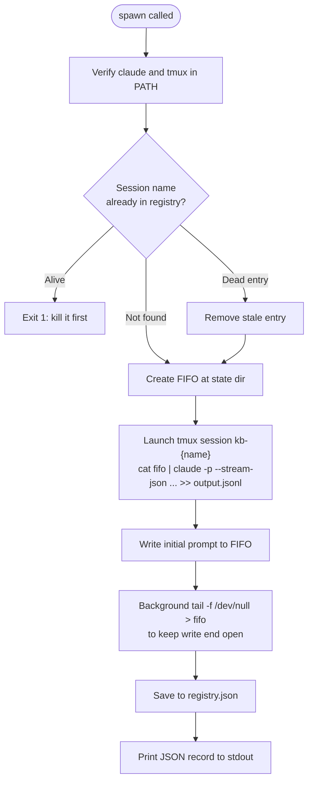
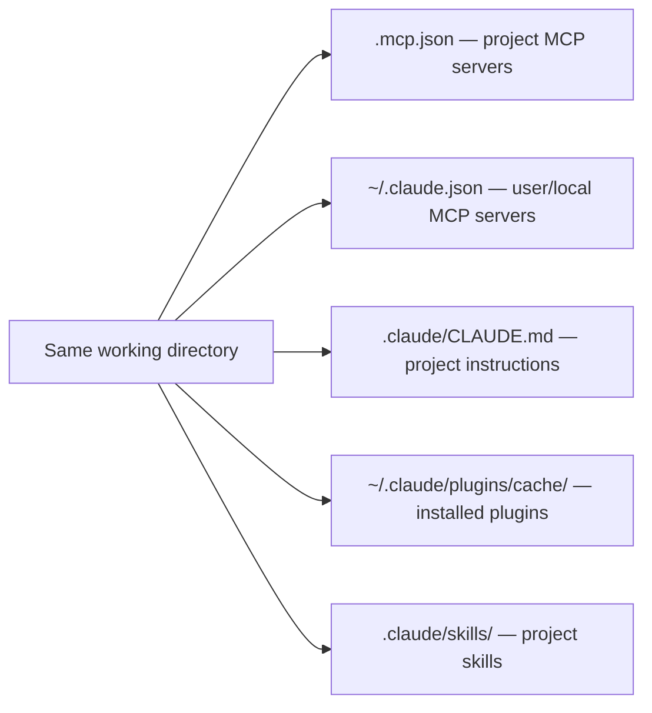

# Kage Bunshin — Persistent Peer Claude Sessions

Spawn independent `claude` CLI processes with full bidirectional communication. Each session runs in tmux with stream-json I/O, allowing the orchestrator to send messages, read responses, monitor status, and steer work mid-flight.

This is NOT a subagent or teammate — it is an independent CLI process with its own context window, inheriting all MCP servers, skills, plugins, and agents from the project directory.

## Session Manager Script

All operations go through `${CLAUDE_SKILL_DIR}/scripts/spawn.py`:

```text
spawn.py spawn  --name X [--worktree] [--model MODEL] [--max-budget N] "prompt"
spawn.py send   --name X "message"
spawn.py read   --name X [--wait SECONDS] [--follow]
spawn.py status --name X
spawn.py list
spawn.py kill   --name X
```

## Quick Start

```bash
SPAWN="${CLAUDE_SKILL_DIR}/scripts/spawn.py"

# 1. Spawn a session
$SPAWN spawn --name worker-42 --model haiku \
  "Load /dh:work-backlog-item #42. Execute the full work flow."

# 2. Check on it
$SPAWN status --name worker-42

# 3. Read latest response (poll up to 60s if nothing yet)
$SPAWN read --name worker-42 --wait 60

# 4. Steer mid-flight
$SPAWN send --name worker-42 \
  "Stop current work. Prioritize the auth module instead."

# 5. Monitor in real-time
$SPAWN read --name worker-42 --follow

# 6. Clean up when done
$SPAWN kill --name worker-42
```

## Subcommand Reference

### spawn

Launch a new persistent claude session inside a tmux window.

```bash
$SPAWN spawn --name my-session --model haiku "Your initial prompt"
$SPAWN spawn --name my-session --worktree --max-budget 5.00 "Your prompt"
```



**Flags:**

- `--name` — Session name (auto-derived from first 30 chars of prompt if omitted)
- `--worktree` — Uses claude's built-in `--worktree` flag for git worktree isolation
- `--model` — Model for the spawned session (default: sonnet)
- `--max-budget` — Maximum USD spend cap

**Output** (JSON to stdout):

```json
{
  "name": "worker-42",
  "tmux_session": "kb-worker-42",
  "model": "sonnet",
  "spawned_at": "2026-03-22T01:30:00+00:00",
  "worktree": false,
  "fifo_path": "~/.dh/projects/{slug}/kage-bunshin/worker-42-input.fifo",
  "output_path": "~/.dh/projects/{slug}/kage-bunshin/worker-42-output.jsonl",
  "error_path": "~/.dh/projects/{slug}/kage-bunshin/worker-42-err.log"
}
```

**What --worktree does:** Passes `--worktree {name}` to the claude CLI, which uses the built-in worktree system. Configure `worktree.symlinkDirectories` in project settings to symlink `.venv`, `node_modules`, etc. — the script does not handle symlinking manually.

### send

Send a message to a running session via its input FIFO.

```bash
$SPAWN send --name worker-42 "Check the test results and report back"
```

The message is written as a stream-json user message. The session processes it as a new conversation turn. Use this to steer, redirect, or provide additional context to a running session.

### read

Read responses from a session's output JSONL file.

```bash
# Latest response
$SPAWN read --name worker-42

# Poll for up to 60 seconds if no response yet
$SPAWN read --name worker-42 --wait 60

# Tail continuously (Ctrl-C to stop)
$SPAWN read --name worker-42 --follow
```

Extracts assistant message text and result events from the stream-json output. Result events include cost, turn count, and session metadata.

### status

Check session health and progress.

```bash
$SPAWN status --name worker-42
```

Output (JSON):

```json
{
  "name": "worker-42",
  "alive": true,
  "model": "sonnet",
  "spawned_at": "2026-03-22T01:30:00+00:00",
  "age": "15m",
  "worktree": false,
  "tmux_session": "kb-worker-42",
  "cost_usd": 0.42,
  "turns": 8
}
```

### list

List all registered sessions with live/dead status.

```bash
$SPAWN list
```

Prints a columnar table: NAME, MODEL, STATUS (alive/dead), AGE, WORKTREE.

### kill

Terminate a session and clean up.

```bash
$SPAWN kill --name worker-42
```

Kills the tmux session, removes the FIFO, and updates the registry. Output and error logs are preserved for post-mortem review.

## Session State Directory

All session state is stored under `~/.dh/projects/{slug}/kage-bunshin/`:

```text
~/.dh/projects/{slug}/kage-bunshin/
├── registry.json              # all active sessions
├── {name}-input.fifo          # named pipe for sending messages
├── {name}-output.jsonl        # stream-json responses
└── {name}-err.log             # stderr
```

The `{slug}` is derived from the git repo root path by replacing `/` with `-` (leading hyphen is intentional). Override the base directory with `DH_STATE_HOME` environment variable.

## Capability Inheritance

A spawned session inherits identical capabilities when launched from the same working directory:



Flags that break inheritance — do not use:

- `--bare` — strips auto-discovery of CLAUDE.md, hooks, plugins, MCP
- `--strict-mcp-config` — overrides inherited MCP servers
- `--disable-slash-commands` — removes skill access

## Worktree Settings

When using `--worktree`, configure these in your project or user settings to avoid duplicating heavy directories:

```json
{
  "worktree.symlinkDirectories": [".venv", "node_modules", ".cache"]
}
```

This replaces the manual symlinking that the old script did. The built-in `--worktree` flag handles git worktree creation and cleanup automatically.

## Milestone Dispatch Patterns

Used by `/groom-milestone` and `/work-milestone` to spawn parallel kage-bunshin workers.

### Groom Dispatch (no worktree)

Groom sessions run in the same project directory — grooming is read-heavy and writes go through the backlog MCP server (GitHub Issues are the source of truth), so no filesystem isolation is needed.

```bash
SPAWN="${CLAUDE_SKILL_DIR}/scripts/spawn.py"

# Spawn one kage-bunshin per ungroomed item
for ISSUE in "${UNGROOMED_ISSUES[@]}"; do
  $SPAWN spawn --name "groom-${ISSUE}" --model haiku \
    "Load /dh:groom-backlog-item #${ISSUE}. Execute the full grooming flow."
done

# Monitor all sessions
$SPAWN list

# Check specific session
$SPAWN status --name "groom-42"

# Read response when ready
$SPAWN read --name "groom-42" --wait 120
```

### Work Dispatch (with worktree)

Work sessions run in isolated git worktrees — each session modifies code and commits.

```bash
SPAWN="${CLAUDE_SKILL_DIR}/scripts/spawn.py"

# Spawn one kage-bunshin per wave item in isolated worktrees
for ISSUE in "${WAVE_ISSUES[@]}"; do
  $SPAWN spawn --worktree \
    --name "work-item-${ISSUE}" \
    --model haiku \
    "Load /dh:work-backlog-item #${ISSUE}. Execute the full work flow. \
     Use MCP tools for plan artifact discovery."
done

# Monitor progress across all sessions
$SPAWN list

# Steer a session if needed
$SPAWN send --name "work-item-42" \
  "The auth module has a dependency on #43. Wait for it to complete before proceeding."

# Read results
for ISSUE in "${WAVE_ISSUES[@]}"; do
  $SPAWN read --name "work-item-${ISSUE}" --wait 300
done

# Clean up after wave completes
for ISSUE in "${WAVE_ISSUES[@]}"; do
  $SPAWN kill --name "work-item-${ISSUE}"
done
```

### Model Selection

The `--model` flag controls the spawned session's orchestrator model. Each sub-agent spawned inside the session uses its own model per its agent frontmatter definition.

Use `--model haiku` for coordinator sessions that dispatch work to sub-agents — haiku is fast and cheap as an orchestrator. The sub-agents inside each session run on their own models regardless.

## Parallel Fleet Management

Spawn and control 10-20 coordinators simultaneously. Each returns immediately — no blocking.

```bash
SPAWN="${CLAUDE_SKILL_DIR}/scripts/spawn.py"
ITEMS=(10 11 12 13 14 15 16 17 18 19 20 21 22 23 24)

# Spawn all coordinators at once
for ITEM in "${ITEMS[@]}"; do
  $SPAWN spawn --name "coord-${ITEM}" --model haiku \
    "Load /dh:work-backlog-item #${ITEM}. Execute the full work flow."
done

# Dashboard — see everything at a glance
$SPAWN list

# Poll a specific coordinator
$SPAWN status --name coord-12

# Redirect a coordinator mid-flight
$SPAWN send --name coord-14 \
  "Deprioritize the UI work. Focus on the API contract first."

# Read what a coordinator produced
$SPAWN read --name coord-12 --wait 60

# Monitor one in real-time
$SPAWN read --name coord-15 --follow

# Shut down the fleet
for ITEM in "${ITEMS[@]}"; do
  $SPAWN kill --name "coord-${ITEM}"
done
```

### Fleet with Worktree Isolation

When each coordinator modifies code, isolate them in worktrees:

```bash
for ITEM in "${ITEMS[@]}"; do
  $SPAWN spawn --worktree --name "work-${ITEM}" --model haiku \
    "Load /dh:work-backlog-item #${ITEM}. Execute the full work flow."
done
```

Each coordinator gets its own git worktree via the built-in `--worktree` flag. Configure `worktree.symlinkDirectories` in settings to share `.venv` and `node_modules` across worktrees.

## Reference

See [./references/stream-json-protocol.md](./references/stream-json-protocol.md) for the output event type catalog and raw experiment data.
