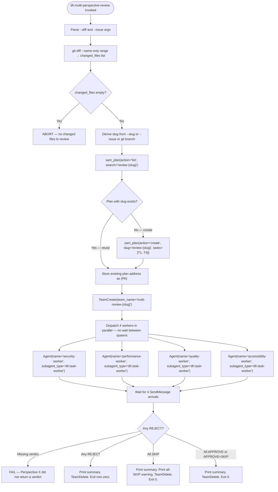

# Multi-Perspective Review

## Role

Orchestrates four independent perspective reviewers in parallel against a diff. Each reviewer
specialises in a single dimension: Security, Performance, Quality, or Accessibility. The skill
creates an ephemeral SAM plan, dispatches four `dh:task-worker` teammates via `TeamCreate`,
collects structured verdict blocks via `SendMessage`, applies the gate logic, and prints one
canonical summary line per perspective.

This skill does NOT replace language-scoped code review (`dh:forensic-review`). It runs
alongside it as an orthogonal quality signal. It is an upstream dependency of #1430
(confidence-gate consolidation), which will replace the stub gate logic in Step 6 without
changing the caller interface.

## Argument Parsing

| Argument | Type | Description |
|----------|------|-------------|
| `--diff <git-range>` | **required** | Git range passed to `git diff --name-only`. Examples: `HEAD~1..HEAD`, `main..feature-branch`, `abc123..def456`. |
| `--issue <N>` | optional | GitHub issue number used for artifact registration and ephemeral plan linkage. |
| `--slug <str>` | optional | Explicit slug override. When omitted, derived from `--issue` or current git branch. |

Parse arguments from the invocation arguments string. Abort with usage message if `--diff` is
absent.

---

## Step 1: Resolve Changed Files

Run:

```bash
git diff --name-only <git-range>
```

Split stdout by newline. Trim empty lines. This is the `changed_files` list.

**Abort condition:** If `changed_files` is empty, print the following and stop:

```text
ERROR: No changed files found for diff range <git-range>. Nothing to review.
```

Do not create a team or a plan when `changed_files` is empty.

---

## Step 2: Derive Slug

Derive the review slug using the first matching rule:

1. `--slug` argument is provided → use its value directly
2. `--issue <N>` argument is provided → `review-{N}` (e.g., `review-2181`)
3. Neither provided → read current git branch name via `git rev-parse --abbrev-ref HEAD` and
   use `review-{branch-name}` (sanitize branch name: replace `/` with `-`)

The derived slug is used in the ephemeral plan slug, the team name, and log messages.

---

## Step 3: Create Ephemeral Review Plan (check-or-create)

**CRITICAL: check-or-create semantics are mandatory.** Do NOT call `sam_plan(action='create')`
blindly — this causes ephemeral plan accumulation and slug-collision duplicates on repeated runs.

### 3a: Check for Existing Plan

Call:

```text
mcp__plugin_dh_sam__sam_plan(config={"action": "list", "search": "review-{slug}"})
```

Inspect the returned `plans` array. If any plan has `feature` equal to `review-{slug}`:

- Use its plan address as `{PA}` (e.g., `P8a3f1b29`)
- Skip step 3b — do not create a new plan

If no matching plan is found, proceed to step 3b.

### 3b: Create the Ephemeral Plan

Build the changed-files body block:

```text
Changed files:
{each file on its own line}
```

Call `sam_plan(action='create')` with the four review tasks. All four tasks have
`dependencies: []` — they are independent and run in parallel.

```text
mcp__plugin_dh_sam__sam_plan(
  config={
    "action": "create",
    "slug": "review-{slug}",
    "goal": "Multi-perspective review for {slug}",
    "issue": <issue_number_or_omit_if_absent>,
    "tasks": [
      {
        "id": "T1",
        "title": "Security Review",
        "agent": "reviewer-security",
        "status": "not-started",
        "dependencies": [],
        "priority": 1,
        "complexity": "medium",
        "body": "## Security Review\nChanged files:\n{newline-separated changed_files list}\nReview each file through the security perspective lens.\nReturn structured verdict per verdict-schema.md."
      },
      {
        "id": "T2",
        "title": "Performance Review",
        "agent": "reviewer-performance",
        "status": "not-started",
        "dependencies": [],
        "priority": 1,
        "complexity": "medium",
        "body": "## Performance Review\nChanged files:\n{newline-separated changed_files list}\nReview each file through the performance perspective lens.\nReturn structured verdict per verdict-schema.md."
      },
      {
        "id": "T3",
        "title": "Quality Review",
        "agent": "reviewer-quality",
        "status": "not-started",
        "dependencies": [],
        "priority": 1,
        "complexity": "medium",
        "body": "## Quality Review\nChanged files:\n{newline-separated changed_files list}\nReview each file through the quality perspective lens.\nReturn structured verdict per verdict-schema.md."
      },
      {
        "id": "T4",
        "title": "Accessibility Review",
        "agent": "reviewer-accessibility",
        "status": "not-started",
        "dependencies": [],
        "priority": 1,
        "complexity": "low",
        "body": "## Accessibility Review\nChanged files:\n{newline-separated changed_files list}\nApply SKIP detection rule from verdict-schema.md first.\nIf SKIP applies, emit SKIP verdict immediately.\nOtherwise, review for ARIA attributes, color-only signals, keyboard parity.\nReturn structured verdict per verdict-schema.md."
      }
    ]
  }
)
```

Store the returned plan address as `{PA}`.

---

## Step 4: TeamCreate and Dispatch Four Workers in Parallel

Create the team:

```text
TeamCreate(team_name="multi-review-{slug}")
```

Dispatch all four workers simultaneously. Do NOT wait between spawns — all four are independent
and must run in parallel. Each worker receives a minimal prompt that invokes `start-task`.
`start-task` owns claim, active-task registration, and execution. The `agent:` field in each
SAM task tells `dh:task-worker` which specialist profile to load via `profile_load` internally.

**Dispatch `dh:task-worker` exclusively — never `general-purpose`.**

```text
Agent(
  team_name="multi-review-{slug}",
  name="security-worker",
  subagent_type="dh:task-worker",
  prompt="Before starting work, load these skills: dh:subagent-contract\n\nYou are working on security review. Your task: {PA}/T1.\n\nSkill(skill=\"start-task\", args=\"{PA} --task T1\")"
)

Agent(
  team_name="multi-review-{slug}",
  name="performance-worker",
  subagent_type="dh:task-worker",
  prompt="Before starting work, load these skills: dh:subagent-contract\n\nYou are working on performance review. Your task: {PA}/T2.\n\nSkill(skill=\"start-task\", args=\"{PA} --task T2\")"
)

Agent(
  team_name="multi-review-{slug}",
  name="quality-worker",
  subagent_type="dh:task-worker",
  prompt="Before starting work, load these skills: dh:subagent-contract\n\nYou are working on quality review. Your task: {PA}/T3.\n\nSkill(skill=\"start-task\", args=\"{PA} --task T3\")"
)

Agent(
  team_name="multi-review-{slug}",
  name="accessibility-worker",
  subagent_type="dh:task-worker",
  prompt="Before starting work, load these skills: dh:subagent-contract\n\nYou are working on accessibility review. Your task: {PA}/T4.\n\nSkill(skill=\"start-task\", args=\"{PA} --task T4\")"
)
```

---

## Step 5: Collect Verdicts

Wait for four `SendMessage` arrivals from teammates. Each reviewer agent sends:

```text
SendMessage(
  to="team-lead",
  summary="{perspective}: {verdict} — {N} findings ({blocker_count} blockers)",
  message="<raw JSON verdict block per verdict-schema.md §2.1>"
)
```

For each received message, parse the `message` field as JSON:

```python
verdict_block = json.loads(msg.message)
```

The verdict block schema is defined in
[./references/verdict-schema.md](./references/verdict-schema.md) §2.1. Do not duplicate the
schema here.

**Missing verdict handling:** If any perspective does not send a `SendMessage` after all workers
complete, treat it as a `FAIL` condition:

```text
Perspective {X} did not return a verdict
```

Collect all four verdict blocks before proceeding to Step 6.

---

## Step 6: Apply Gate and Print Summary

### Gate Logic

The gate logic is the pre-#1430 stub. The full gate logic including the all-SKIP edge case is
defined in [./references/verdict-schema.md](./references/verdict-schema.md) §2.4.

Apply gate in this order:

1. **Check for missing verdicts.** If any perspective did not return a verdict, FAIL immediately
   with message `"Perspective {X} did not return a verdict"`.

2. **Check for REJECT.** If any verdict has `verdict == "REJECT"`, the gate FAILS. Collect all
   REJECT verdicts and their blocking findings for the summary.

3. **Check for all-SKIP edge case.** If all four verdicts are `SKIP`, the gate PASSES but the
   summary MUST include this exact warning line:

   ```text
   NOTE: No perspectives reviewed — all skipped
   ```

4. **All other combinations** (any APPROVE, remaining SKIP) → gate PASSES.

**#1430 compatibility contract:** The gate interface is stable:
`gate(verdicts: list[VerdictBlock]) -> GateResult` where `GateResult = {passed: bool,
summary_line: str, blocking_findings: list[Finding]}`. Issue #1430 replaces the gate function
body only — callers (this step) do not change.

### Summary Line Format

Print one canonical summary line. Format per
[./references/verdict-schema.md](./references/verdict-schema.md) §2.2:

```text
Security: {token} | Performance: {token} | Quality: {token} | Accessibility: {token}
```

Summary token mapping:

| Verdict | Findings | Summary token |
|---------|----------|---------------|
| `APPROVE` | 0 findings | `APPROVE (0 findings)` |
| `APPROVE` | N minor/info findings | `APPROVE ({N} minor)` |
| `REJECT` | 1 BLOCKER finding | `REJECT (1 finding)` |
| `REJECT` | N BLOCKER findings | `REJECT ({N} findings)` |
| `SKIP` | — | `SKIP ({skip_reason})` |

Example output:

```text
Security: APPROVE (0 findings) | Performance: REJECT (1 finding) | Quality: APPROVE (2 minor) | Accessibility: SKIP (no UI changes)
```

### Exit and Cleanup

1. If gate FAILED (any REJECT): print the summary line, then TeamDelete, then exit non-zero.
2. If gate PASSED (all-SKIP warning applies): print the summary line, then print the warning
   line `NOTE: No perspectives reviewed — all skipped`, then TeamDelete, then exit 0.
3. If gate PASSED (normal): print the summary line, then TeamDelete, then exit 0.

TeamDelete cleans up the team after all workers are done:

```text
TeamDelete(team_name="multi-review-{slug}")
```

---

## Dispatch Flow (Reference)



---

## Ephemeral Plan Task Structure

The ephemeral plan always has exactly four tasks:

| Task | Perspective | Agent field | dependencies |
|------|-------------|-------------|--------------|
| T1 | Security | `reviewer-security` | `[]` |
| T2 | Performance | `reviewer-performance` | `[]` |
| T3 | Quality | `reviewer-quality` | `[]` |
| T4 | Accessibility | `reviewer-accessibility` | `[]` |

All four tasks have `dependencies: []` — they are independent and run in parallel. The
`agent:` field is read internally by `dh:task-worker` via `sam_task(action='read')` and passed
to `profile_load` to load the specialist reviewer behavior. The orchestrator always passes only
the task reference `{PA}/T{N}` to the worker prompt.

---

## Behavioral Rules

- **SKIP is a passing outcome.** A perspective that SKIPs is not a blocker.
- **All four verdicts must arrive before the gate runs.** Do not apply the gate on partial results.
- **Check-or-create prevents plan accumulation.** Always call `sam_plan(action='list')` before
  `sam_plan(action='create')`.
- **Dispatch uses `dh:task-worker` exclusively.** Never substitute `general-purpose`.
- **Do not embed the verdict schema or UI pattern list.** Reference
  [./references/verdict-schema.md](./references/verdict-schema.md) for all schema definitions.
- **Each ephemeral task body must embed the newline-separated changed-files list.** Workers read
  their task body to obtain the scan target; they do not receive it via the prompt.
- **All-SKIP warning is mandatory** when all four perspectives return SKIP.
