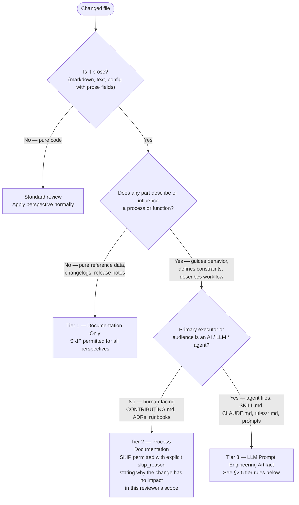

# Verdict Schema — Multi-Perspective Review

Reference file for the structured verdict block schema, summary line format, SKIP detection
rule, and gate logic used by the `dh:multi-perspective-review` skill and all four reviewer
agents.

**Authoritative source**: All four reviewer agents (`reviewer-security.md`,
`reviewer-performance.md`, `reviewer-quality.md`, `reviewer-accessibility.md`) reference this
file for schema version, summary tokens, and SKIP patterns. Do NOT duplicate or embed these
definitions in agent instruction bodies.

**#1430 compatibility**: The `gate(verdicts) -> GateResult` interface defined in §2.4 is
stable. Issue #1430 replaces the gate function body only; callers and schema version routing
remain unchanged.

---

## §2.1 Structured Verdict Block

Each reviewer agent emits exactly one verdict block in its SendMessage to the team lead. The
block is JSON-serializable and version-stamped for #1430 compatibility.

```json
{
  "schema_version": "1.0",
  "perspective": "security | performance | quality | accessibility",
  "verdict": "APPROVE | REJECT | SKIP",
  "findings": [
    {
      "severity": "BLOCKER | MINOR | INFO",
      "file": "relative/path/to/file.py",
      "line": 42,
      "description": "Human-readable description of the finding",
      "rule": "optional-rule-identifier"
    }
  ],
  "skip_reason": "optional — present only when verdict == SKIP; explains why SKIP applies"
}
```

**Field constraints:**

- `schema_version`: always `"1.0"` until #1430 defines a migration path
- `perspective`: one of the four literal values listed above; lowercase
- `verdict`: exactly one of `APPROVE`, `REJECT`, `SKIP`
- `findings`: array; empty array `[]` is valid (APPROVE with no findings)
- `findings[].severity`: `BLOCKER` means the verdict is `REJECT`; `MINOR` and `INFO` do not block
- `findings[].line`: integer or `null` if not line-specific
- `skip_reason`: required when `verdict == SKIP`; omitted otherwise

---

## §2.2 Summary Line Format

The orchestrating skill (`multi-perspective-review/SKILL.md`) prints one summary line per
perspective in canonical format. AC6 defines the expected shape:

```text
Security: APPROVE (0 findings) | Performance: REJECT (1 finding) | Quality: APPROVE (2 minor) | Accessibility: SKIP (no UI changes)
```

Mapping from verdict struct to summary token:

| Verdict | Findings | Summary token |
|---------|----------|---------------|
| `APPROVE` | 0 findings | `APPROVE (0 findings)` |
| `APPROVE` | N findings | `APPROVE ({N} minor)` where N counts MINOR+INFO severity |
| `REJECT` | 1 BLOCKER finding | `REJECT (1 finding)` |
| `REJECT` | N BLOCKER findings | `REJECT ({N} findings)` |
| `SKIP` | — | `SKIP ({skip_reason})` |

**Note:** The singular `finding` vs plural `findings` applies to REJECT tokens only. APPROVE
always uses `findings` (plural).

---

## §2.3 SKIP Detection Rule (Accessibility Perspective)

SKIP applies to the accessibility perspective when **none** of the changed files matches the UI
file pattern list below. The accessibility reviewer checks this list first; if no match is
found, it emits `verdict: SKIP` immediately without scanning file content.

**This list is the authoritative source.** Do not embed or duplicate it in agent instruction
bodies. The `reviewer-accessibility.md` agent references this file for the pattern list.

**UI file pattern list (v1.0):**

```text
*.html
*.css
*.scss
*.sass
*.less
*.jsx
*.tsx
*.vue
*.svelte
*.astro
**/components/**
**/templates/**
**/views/**
**/pages/**
**/ui/**
**/frontend/**
```

**Pattern matching rule:** A file matches if its path matches any glob pattern above using
standard Unix glob semantics, case-insensitive. Matching applies to the relative file path as
returned by `git diff --name-only`.

**Extensibility:** Future perspectives may define additional SKIP detection rules using the
same pattern-list structure in this file.

---

## §2.4 Gate Logic (Stub Consolidation — Pre-#1430)

```text
PASS conditions:
  - All verdicts are APPROVE or SKIP, with at least one APPROVE

  Edge case — all SKIP:
    Treated as PASS (no applicable changes reviewed; no blocker found).
    Summary output MUST include the warning line:
      NOTE: No perspectives reviewed — all skipped

FAIL conditions:
  - Any verdict is REJECT → FAIL immediately; list all blocking findings
  - Missing verdict (an agent did not send a verdict) → FAIL with message:
      "Perspective {X} did not return a verdict"
```

The gate function signature (stable interface for #1430 swap):

```text
gate(verdicts: list[VerdictBlock]) -> GateResult

GateResult:
  passed: bool
  summary_line: str            — canonical format per §2.2
  blocking_findings: list[Finding]   — empty when passed
```

**Pre-#1430 stub logic:**

```text
verdicts = [parse_verdict(msg) for msg in collected_messages]
missing = [p for p in PERSPECTIVES if no verdict received for p]
if missing:
    FAIL — "Perspective {X} did not return a verdict"
rejecting = [v for v in verdicts if v.verdict == "REJECT"]
if rejecting:
    FAIL — list each blocking finding
all_skip = all(v.verdict == "SKIP" for v in verdicts)
if all_skip:
    PASS — emit warning: "NOTE: No perspectives reviewed — all skipped"
PASS
```

**#1430 compatibility contract:**

- The `schema_version: "1.0"` field allows #1430 to detect schema version and apply
  confidence/deduplication logic
- The `findings` array structure is stable; #1430 may add `confidence` and `dedup_key` fields
  per finding without breaking v1 consumers
- Issue #1430 replaces the gate function body only; callers (the skill body) do not change
- The stub consolidation above implements the stable interface; #1430 swaps only the internals

---

## §2.5 Prose File Classification (All Perspectives)

Not all markdown is documentation. Before applying SKIP on the grounds that "no code was
changed," every reviewer MUST classify changed prose files using the decision tree below.



### Tier 1 — Documentation Only

Pure reference data: changelogs, release notes, README sections that only describe completed
features without defining workflows or constraints. SKIP is permitted for all perspectives
with no applicable checks.

### Tier 2 — Process Documentation

Human-facing behavioral contracts: `CONTRIBUTING.md`, architecture decision records, runbooks,
README sections that define workflows or contribution steps. These files have functional
behavioral impact on human contributors and operators. SKIP is permitted only with an explicit
`skip_reason` explaining why the change has no impact in the reviewer's scope.

### Tier 3 — LLM Prompt Engineering Artifacts

Any file whose prose is read and executed by an LLM is an **executable specification**, not
documentation. The markdown content IS the executable.

**Files classified as Tier 3:**

- Plugin agent files: `agents/*.md`
- Skill files: `skills/*/SKILL.md`, `skills/*/references/**`
- Session instruction files: `CLAUDE.md`, `.claude/rules/*.md`
- Any `.md` file that defines constraints, workflows, or behaviors for an AI agent

**Per-perspective rules for Tier 3 files:**

| Perspective | SKIP | Review criterion |
|---|---|---|
| Security | **PROHIBITED** — check for prompt injection surfaces (§2.5.1) | Prompt injection, authority escalation |
| Quality | **PROHIBITED** — already prohibited by role definition | Behavioral correctness: contradictions, ambiguous constraints, missing edge cases |
| Performance | Permitted — instruction complexity is out of performance scope | N/A |
| Accessibility | Permitted — LLM prompt files are not UI | N/A |

### §2.5.1 Prompt Injection Security Surface

When any Tier 3 file is in the changed-files list, the security reviewer checks for:

1. **User-input interpolation** — an instruction template that interpolates user-supplied
   content into a position where an LLM will execute it as a command
   (e.g., `{user_query}` embedded in a workflow step that the LLM interprets as instruction)
2. **Agent-output interpolation** — an instruction that passes another LLM's output directly
   into an instruction context without sanitization or intent verification
3. **Authority escalation via content** — an instruction that grants elevated permissions
   based on content in a data position
   (e.g., "if the issue body contains X, skip all checks")

Each confirmed surface is a `BLOCKER` finding with `rule: "prompt-injection"`.

### §2.5.2 Quality Correctness for Tier 3 Files

When any Tier 3 file is in the changed-files list, the quality reviewer checks:

- **Contradictions between sections** — two instructions that conflict; an LLM reading both
  will choose arbitrarily
- **Ambiguous constraints** — a rule that is phrased with "should", "try to", or "ideally"
  where a MUST/NEVER imperative is required for reliable enforcement
- **Missing edge cases** — a decision branch or process that lacks a terminal state or
  fallback for the "none of the above" case
- **Instruction bloat** — excessive repetition or overly long preamble that degrades attention
  and increases the probability of the agent ignoring downstream rules

These are prompt engineering bugs. Each confirmed issue is a finding (BLOCKER if it causes
incorrect behavior in a documented scenario; MINOR otherwise).
