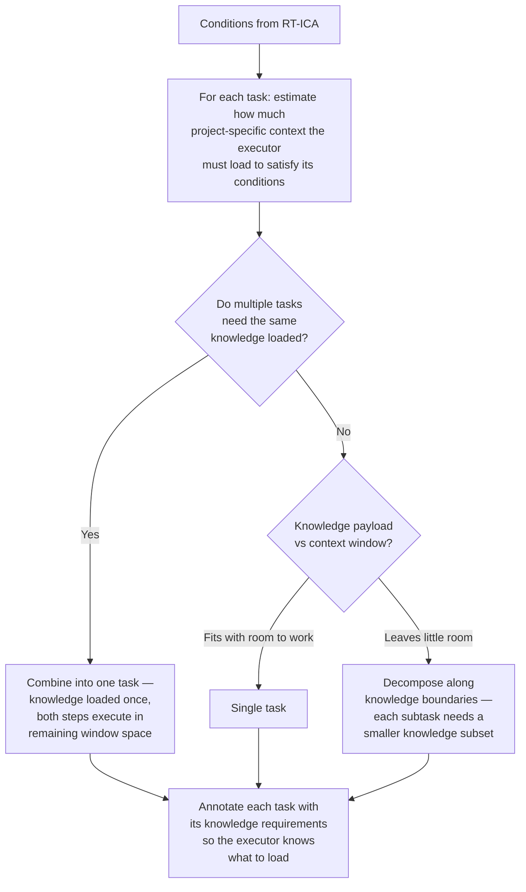

# Planner RT-ICA (Planning-Phase Input Completeness Analysis)

## Role

This skill adapts RT-ICA for **planning contexts**.

Its purpose is NOT to block planning.
Its purpose is to prevent invented requirements while still allowing a correct
dependency-first plan to be produced.

This skill runs as a **pre-pass** before task decomposition and task writing.

---

## Complexity Model

Task complexity is the ratio of project-specific knowledge required to context window available — not implementation difficulty.

Training data covers craft knowledge (language patterns, tooling, frameworks). That is free. What consumes context budget is project-specific knowledge: schemas, pin-outs, conventions, power constraints, existing interfaces, user preferences. This knowledge must be loaded before an agent can act.

The planner should use this when sizing tasks:

**Step boundaries follow knowledge boundaries, not implementation boundaries.** Two steps sharing the same knowledge payload should be one task. A step requiring a distinct, large knowledge set deserves its own agent and context window.

## Core Principles

1. **No invention**

   - Never fabricate requirements, constraints, interfaces, or acceptance criteria.
   - Missing information must be surfaced explicitly.

2. **Localize uncertainty**

   - Missing inputs block _only the tasks that depend on them_, not the entire plan.

3. **Plan must still exist**

   - The planner must always be able to emit:
     - a dependency graph,
     - task skeletons,
     - and explicit unblock paths.

4. **Execution safety**
   - Any task with missing critical inputs must be marked such that worker agents
     will BLOCK rather than assume.

5. **Well-lit trail, not locked gates**
   - Guidance that illuminates the best path is more durable than enforcement that
     locks a specific route. Every "MUST" carries maintenance cost — when constraints
     become stale, they block good work rather than enabling it. Prefer clear guidance
     over rigid enforcement where the outcome is equivalent.

---

## Inputs Analyzed

For the given planning scope (entire plan or a specific task/workstream), identify
whether the following are PRESENT, PARTIAL, or MISSING:

- Functional intent (what outcome is desired)
- Scope boundaries (in-scope / out-of-scope)
- External interfaces (APIs, CLIs, files, services)
- Constraints (performance, security, compliance, environment)
- Existing system context (repo, architecture, runtime)
- Verification expectations (how correctness will be proven)

---

## Output Contract (Planning-Oriented)

Produce a structured analysis with the following sections:

### 1. Completeness Summary

- APPROVED-FOR-PLANNING
- APPROVED-WITH-GAPS
- BLOCKED-FOR-PLANNING (only if literally no planning signal exists)

> APPROVED-WITH-GAPS is the expected and normal outcome for brownfield,
> refactor, and discovery scenarios.

---

### 2. Missing Inputs (By Dependency)

For each missing or partial input, emit:

- Input name
- Affected tasks or workstreams
- Impact if assumed incorrectly
- Whether the input is:
  - required before execution
  - required before detailed design
  - optional / refinement-level

---

### 3. Required Unblock Actions

For each missing input, specify one of:

- Direct question to user
- Discovery task (e.g. repo scan, architecture trace)
- Validation spike / investigation task

These MUST be expressible as planner tasks.

---

### 4. Planning Annotations to Apply

The planner MUST apply the following annotations downstream:

- Add explicit **Dependencies** on unblock tasks
- Populate **Required Inputs** fields in task blocks
- Elevate **Accuracy Risk** for affected tasks
- Add **Unblock Questions** sections to tasks that cannot execute yet

---

## Behavioral Rules for the Planner

When this skill reports missing inputs:

- The planner MUST:

  - create explicit input-collection or discovery tasks,
  - wire them as dependencies,
  - allow unaffected tasks to proceed in parallel.

- When the planner catches itself generating an unsourced value or constraint:
  - Redirect it — add the gap as a MISSING condition with the generated value as a suggested default
  - Do not present unsourced content as verified fact
  - Do not silently downgrade requirements or remove tasks to avoid uncertainty
  - **Reflection checkpoint:** Before classifying each input as PRESENT / PARTIAL / MISSING,
    use the sequential-thinking MCP to reflect: "Can I source this from
    the provided material, or am I filling the gap from training patterns?" This makes the
    redirection structural — a tool call that cannot be skipped.

- **Data Deletion Fidelity is not a gap — it is a hard block.** When the planning scope describes a task that deletes source data AND the acceptance criteria lack a content completeness check against real production data: do NOT classify this as `APPROVED-WITH-GAPS`; do NOT emit unblock tasks and proceed; emit `BLOCKED-FOR-PLANNING` with the reason: "Task deletes source data without a real-data fidelity gate. Add: (1) content completeness assertion against real production records, (2) explicit deletion gate requiring zero-data-loss confirmation before deletion is permitted." This rule takes precedence over the general APPROVED-WITH-GAPS path. Data loss is not a gap that can be resolved later — it is irreversible.

---

## Relationship to RT-ICA (Execution)

This skill does NOT replace rt-ica.

- `planner-rt-ica`:

  - Enables safe planning under uncertainty.
  - Localizes gaps.
  - Produces unblock paths.

- `rt-ica`:
  - Is used before delegating execution to worker agents.
  - Blocks execution if required inputs remain missing.

Any task produced under APPROVED-WITH-GAPS MUST still pass `rt-ica`
before being executed by a specialist agent.

---

## Success Criteria

This skill is successful if:

- A dependency-correct plan can be produced without invented facts.
- Every missing input is visible, localized, and actionable.
- No worker task can execute without required inputs being explicit.
