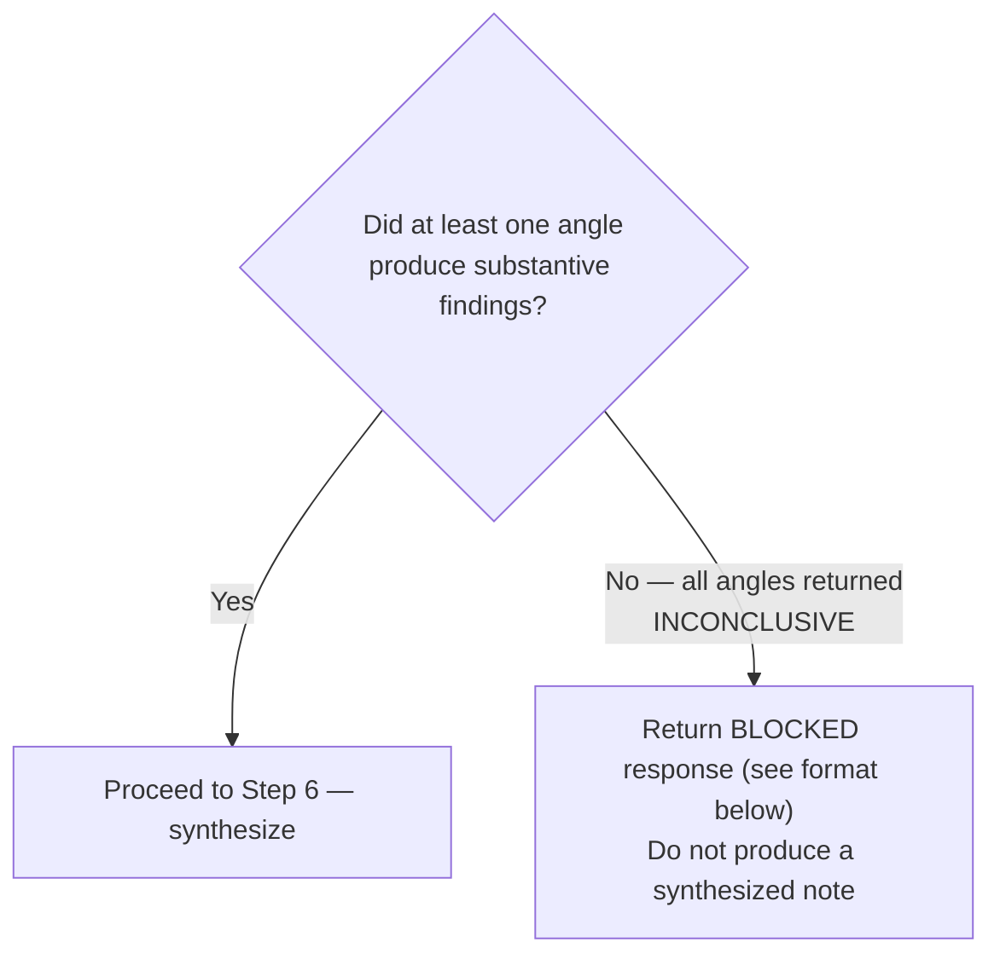

# Research Note

Synthesize multi-angle research outputs into a single Research section with signal weighting and conflict resolution. Return content to the calling orchestrator — the orchestrator writes to the backlog.

## Step 1 — Receive Angle Outputs

Accept the structured report text from each angle that ran:

- `api-state` — API surface, stability, deprecations
- `ecosystem-research` — compatibility, dependencies, community health
- `impact-measurement` — quantitative benchmarks, adoption, performance data
- `codebase-auditor` — behavioral contracts, coding conventions, workflow insertion points, agent data flow maps

Identify and isolate the Gaps section from each report — you will need it in Step 4.

## Step 2 — Cross-Angle Signal Detection

For each factual claim that appears in 2 or more independent angle reports, mark it `[CROSS-ANGLE]`.

A claim qualifies when:
- Two angles independently reached the same conclusion from different sources
- Neither angle cites the other's output as its source

**Correct:** mark `[CROSS-ANGLE]` only for genuinely independent corroboration. One angle quoting another angle's cited source is not independent corroboration — mark it only in the section of the angle that sourced it independently.

## Step 3 — Conflict Detection and Resolution

For each claim where two angles contradict each other, mark it `[CONFLICT]` and apply the resolution procedure:

1. One angle has a primary source citation, the other does not → the cited claim wins. State the resolution explicitly.
2. Both angles have citations and still contradict → mark `[UNRESOLVED]` and surface it.

Every contradiction must reach a stated resolution or an `[UNRESOLVED]` marker. Surface all conflicts in the Conflicts section of the output.

## Step 4 — Gap Aggregation

Collect the Gaps section from every angle report. Separate into two priority tiers:

- **Cross-angle gaps** — appear in 2 or more angle reports. Highest priority for follow-up.
- **Single-angle gaps** — appear in only one angle report.

Write "None identified." when a tier has no entries. Both tiers must appear in the output.
**Reason:** Omitting an empty tier signals to the orchestrator that the aggregation was not performed, not that there were no gaps.

## Step 5 — All-INCONCLUSIVE Gate

Before synthesizing, check: did all angles produce only Gaps with no substantive findings?



**BLOCKED response format:**

```text
BLOCKED — all research angles returned INCONCLUSIVE. No verifiable findings were produced.
Gaps: {aggregated gap list}
Escalate to human for manual research or alternative sources.
```

## Step 6 — Synthesize the Research Note

Produce the final Research section in this exact format. Apply `[CROSS-ANGLE]` and `[CONFLICT]` markers inline within each angle's section where the marked claims appear. Synthesize only what the angles produced — add no new claims.

```text
### Research — {technology/feature} — {date}

Research method: {N}-angle independent fan-out. [CROSS-ANGLE] marks findings confirmed by 2+ independent angles. [CONFLICT] marks contradictions between sources.

### API State
{content from api-state angle, with [CROSS-ANGLE] markers applied}

### Ecosystem and Compatibility
{content from ecosystem-research angle, with [CROSS-ANGLE] markers applied}

### Quantitative Impact
{content from impact-measurement angle, with [CROSS-ANGLE] markers applied}

### Codebase Audit
{content from codebase-auditor angle, with [CROSS-ANGLE] markers applied — omit section if codebase-auditor did not run}

### Cross-Angle Signals
| Finding | Angles | Confidence |
|---|---|---|
| {claim} | {angle-X + angle-Y} | High |

### Conflicts
[CONFLICT] {claim A — source} vs {claim B — source} — [RESOLVED: reason | UNRESOLVED]

### Gaps (cross-angle)
{Gaps that appeared in 2+ angle reports — highest priority for follow-up}

### Gaps (single-angle)
{Gaps from individual angle reports}
```
