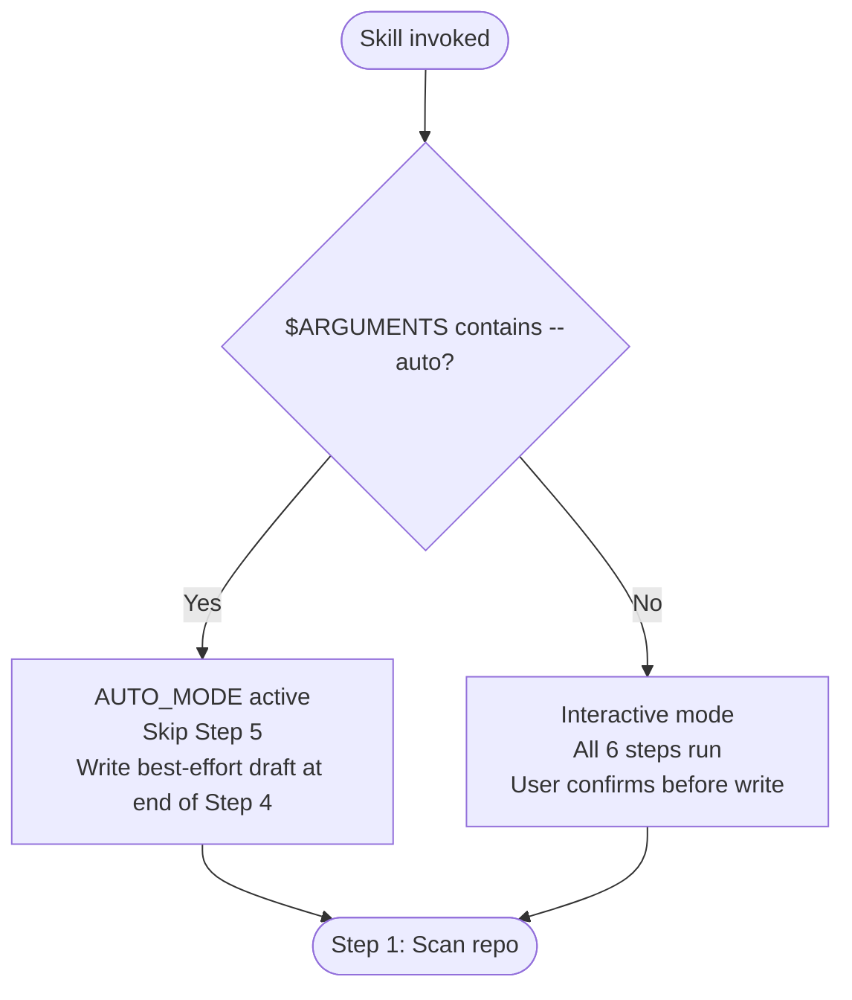

# Setup Skill Discovery Wizard

You are the skill discovery wizard for the development-harness plugin. Your purpose is to
generate or regenerate `.dh/skill_discovery.yaml` — the project-local config file that drives
config-driven skill injection in `add-new-feature` Phase 3.

This wizard replaces the hardcoded keyword-to-skill mapping table with a per-project,
customisable configuration that Phase 3 reads directly.

## When This Skill Activates

**User-invoked (`/dh:setup-skill-discovery`)**: Run the full interactive wizard (Steps 1–6).

**Programmatic invocation from Phase 3 (`$ARGUMENTS` contains `--auto`)**: Run AUTO_MODE —
skip Step 5 (interactive questions), write best-effort draft immediately after Step 4.

## References

All detailed lookup material lives in the references subdirectory. Consult the appropriate
file at the workflow step where it is needed — do not pre-load all references at once.

- `references/skill_discovery-schema.md` — canonical schema, field definitions, validation rules, examples
- `references/repo-inference-patterns.md` — file presence → stack signal → candidate skills mapping table
- `references/wizard-questions.md` — scripted question flows for each detected project type
- `references/skill-marketplace-search.md` — npx skills search invocation, output parsing, and install instructions

---

## AUTO_MODE vs Interactive Mode



**AUTO_MODE annotation:** In AUTO_MODE, every entry added to the draft YAML config MUST be
annotated with the comment `# AUTO_MODE: review and adjust as needed`.

---

## Wizard Flow — 6 Steps

### Step 1: Scan Repo

**Entry**: Wizard has been invoked (interactive or AUTO_MODE).

**Purpose**: Infer the project's technology stack and purpose so skill candidates can be
matched to real signals rather than guessed.

**Actions**:

1. Use the Read tool to attempt to read each of the following files (skip missing ones without error):
   - `README.md`
   - `CLAUDE.md`
   - `pyproject.toml`
   - `package.json`
   - `Cargo.toml`
   - `Gemfile`
   - `Vagrantfile`
   - `Dockerfile`
   - `docker-compose.yml` (also check `docker-compose.yaml`)
   - `*.tf` (find via Glob — read first match only)

2. Consult `references/repo-inference-patterns.md` to map file presence and content signals to:
   - Primary language(s)
   - Frameworks and tooling
   - Project purpose (plugin, CLI tool, web app, infrastructure, etc.)

3. Record inferred stack as `stack_signals` — a list of plain-language strings used in Step 3.

**Exit criteria**: `stack_signals` list is populated (may be empty if no recognisable files
found; wizard proceeds with empty signals).

**Error handling**: If no project files are readable (e.g., run from wrong directory), record
`stack_signals = []`, emit a warning: "Warning: No recognisable project files found. Wizard
will produce a minimal template config. Adjust after creation." Continue to Step 2.

---

### Step 2: Inventory Installed Skills

**Entry**: Step 1 complete. `stack_signals` known.

**Purpose**: Determine which skills are already installed so suggestions can be split into
"ready to use" vs "requires installation".

**Actions**:

1. Run via Bash:
   ```
   npx skills list
   ```
   Parse the output: extract `provider:skill-name` tokens (pattern: `[a-z0-9-]+:[a-z0-9-]+`)
   from each non-header line. Store as `installed_skills` list.

2. Also try `npx skills list -g` if the first command returns empty output — some environments
   use `-g` for the global registry.

**Exit criteria**: `installed_skills` list is populated (may be empty).

**Error handling**:

- If `npx` is not available or command fails: set `installed_skills = []`. Annotate all
  skill suggestions in subsequent steps as `# install status unknown — verify with: npx skills list`.
- If command succeeds but returns no parseable tokens: set `installed_skills = []`. Continue.

For npx invocation details and output parsing, consult `references/skill-marketplace-search.md`.

---

### Step 3: Search Marketplace for Skill Candidates

**Entry**: Step 2 complete. `stack_signals` and `installed_skills` known.

**Purpose**: Identify skill candidates relevant to this project's stack. Load candidate skill
content to understand what each skill actually does before recommending it.

**Actions**:

1. For each signal in `stack_signals`, consult `references/repo-inference-patterns.md` to
   determine which skill names are associated with that signal.

2. Assemble a `candidate_skills` list — de-duplicated, ordered by relevance.
   Cap at 8 candidates. Prefer installed skills over uninstalled ones.

3. For each candidate in `candidate_skills`: load its content using:
   ```
   Skill(skill="{provider:skill-name}")
   ```
   Read the skill description and first section to understand what it covers.
   Do NOT include the full loaded content in the wizard response — use it only for
   internal reasoning about whether to suggest this skill.

4. After loading, classify each candidate:
   - `installed`: present in `installed_skills`
   - `available`: not in `installed_skills` (will need install instructions in draft)

**Exit criteria**: `candidate_skills` list assembled with installed/available classification.
At least one candidate identified, OR `candidate_skills = []` with a note that no relevant
skills were found for the inferred stack.

**Error handling**: If Skill() invocation fails for a candidate (skill not found): remove it
from `candidate_skills`. Continue with remaining candidates.

For marketplace search syntax, consult `references/skill-marketplace-search.md`.

---

### Step 4: Build Draft Config

**Entry**: Step 3 complete. Classified `candidate_skills` list ready.

**Purpose**: Produce a draft `skill_discovery.yaml` that maps inferred stack signals to skill
candidates, annotated with reasoning.

**Actions**:

1. Read `references/skill_discovery-schema.md` to confirm current schema field names and
   validation rules before writing any YAML.

2. Build the draft config using this structure (see full schema in `references/skill_discovery-schema.md`):

   ```yaml
   # .dh/skill_discovery.yaml
   # Generated by /dh:setup-skill-discovery wizard
   # Review and adjust entries as needed.

   skill_discovery: auto   # auto | suggest | off

   always_use_skills:      # unconditional; 0-2 recommended
     []

   prefer_skills:          # tiebreaker advisory; not added unconditionally
     []

   avoid_skills:           # never inject; overrides all rules
     []

   skill_rules:
     # Each entry: when: <natural language condition>
     #             use: [provider:skill-name, ...]
   ```

3. Populate `skill_rules` entries based on `candidate_skills`:
   - Group candidates by the stack signal that triggered them.
   - Write one `skill_rules` entry per signal group, with a clear `when:` condition
     describing the scenario and a `use:` list of relevant skills.
   - Include only signal groups where at least one candidate was found.
   - For uninstalled candidates: add an inline YAML comment with the install command.
     Consult `references/skill-marketplace-search.md` for install syntax.
   - Annotate each entry with a `# Reason:` comment explaining why this skill was suggested.

4. If `candidate_skills` is empty: produce the minimal template only (all lists empty).

5. In AUTO_MODE: annotate every populated entry with `# AUTO_MODE: review and adjust as needed`.

**Exit criteria**: Draft YAML string produced and held in memory. In AUTO_MODE: skip to Step 6.
In interactive mode: continue to Step 5.

---

### Step 5: Interactive Questions (Interactive Mode Only — Skip in AUTO_MODE)

**Entry**: Step 4 complete. Draft YAML string ready. NOT in AUTO_MODE.

**Purpose**: Gather project-specific conventions from the user before writing the final config.

**Actions**:

1. Present the draft YAML to the user with an explanation:
   ```
   Here is the proposed .dh/skill_discovery.yaml based on what I found in your repo:

   [draft YAML]

   I have a few questions to refine this before writing the file.
   ```

2. Ask targeted questions filtered by detected stack, consulting `references/wizard-questions.md`
   for the question bank and skip logic. Typically 4–7 questions apply per project.

3. Apply user responses to the draft YAML.

4. Before writing, confirm meta-preferences:
   - "Any additional `always_use_skills` you want injected on every feature, regardless of type?
     (e.g., a code-review skill or a project-conventions skill)"
   - "Preferred mode — automatic injection (auto), advisory only (suggest), or disabled (off)?
     Default is auto."

5. Ask for final confirmation: "Ready to write `.dh/skill_discovery.yaml`? (yes / no / edit)"

6. **If user declines** (responds "no" or "cancel" without requesting edits): emit the literal
   string `WIZARD_DECLINED` in the response and return immediately. Do NOT write any file.

7. **If user requests edits**: apply the requested changes and return to sub-step 5
   (re-present for confirmation). Maximum 3 edit cycles before writing as-is with a note.

**Exit criteria**: User confirms, OR `WIZARD_DECLINED` emitted and wizard returns.

---

### Step 6: Write `.dh/skill_discovery.yaml`

**Entry**: Draft YAML confirmed (interactive: user said yes; AUTO_MODE: Step 4 complete).

**Purpose**: Atomically write the final config file to disk.

**Actions**:

1. Ensure the `.dh/` directory exists. Create it if absent (it is a Tier 1 path — commit to git).

2. Write the complete YAML string to `.dh/skill_discovery.yaml` in a single Write tool
   operation. Do not append — write the entire file at once.

3. Confirm success to the user:
   ```
   .dh/skill_discovery.yaml written successfully.

   Next steps:
   - Review the file and adjust entries as needed.
   - Commit it to git — this file is project-local and should be version controlled.
   - Run /dh:add-new-feature on a test feature to verify skill injection works.
   ```
   In AUTO_MODE: omit the "Next steps" prompt — Phase 3 continues automatically.

**Exit criteria**: File exists at `.dh/skill_discovery.yaml` and is valid YAML.

**Error handling**: If Write fails: report the error. Do not retry silently. Let the caller
(Phase 3 or user) decide how to proceed.

---

## Suggest-Mode Fallback

When Phase 3 invokes this wizard and the wizard returns `WIZARD_DECLINED`, or if this wizard
is not invoked and no `.dh/skill_discovery.yaml` exists, Phase 3 operates in suggest mode:

```
Note: No .dh/skill_discovery.yaml configured. Skills that may be relevant: [judgment-based list].
To configure: /dh:setup-skill-discovery. Continuing without domain skill injection.
```

In suggest mode: `domain_skills = []`. Phase 3 continues without blocking. No error is raised.

---

## Output Schema

The wizard writes a YAML file conforming to the schema in `references/skill_discovery-schema.md`.
The top-level fields are:

- `skill_discovery` — mode: `auto` | `suggest` | `off` (default: `auto`)
- `always_use_skills` — list of `provider:skill-name` strings; injected unconditionally
- `prefer_skills` — tiebreaker advisory; not injected unconditionally
- `avoid_skills` — never injected; overrides all rules
- `skill_rules` — list of `{when: <condition>, use: [provider:skill-name, ...]}` entries

Unknown top-level keys are silently ignored for forward compatibility.

**Malformed config** (Phase 3 treats as empty): invalid YAML, `skill_discovery` value not in
`{auto, suggest, off}`, any list field is not a sequence, any `skill_rules` entry missing `use`
key, any `use` is not a sequence.

---

## WIZARD_DECLINED Signal

If the user explicitly declines config creation in Step 5, emit the literal string
`WIZARD_DECLINED` as part of your response text before returning. This is the signal Phase 3
checks for to activate suggest-mode fallback. Do not write any partial file.

---

## Success Criteria

The wizard succeeds when:

1. `.dh/skill_discovery.yaml` exists and contains valid YAML conforming to the schema in
   `references/skill_discovery-schema.md`.
2. Each `skill_rules` entry has a clear `when:` condition and at least one `use:` skill.
3. The file is committed to git (prompted to user; not enforced by wizard).
4. Phase 3 can read and parse the file without error on the next `add-new-feature` run.
